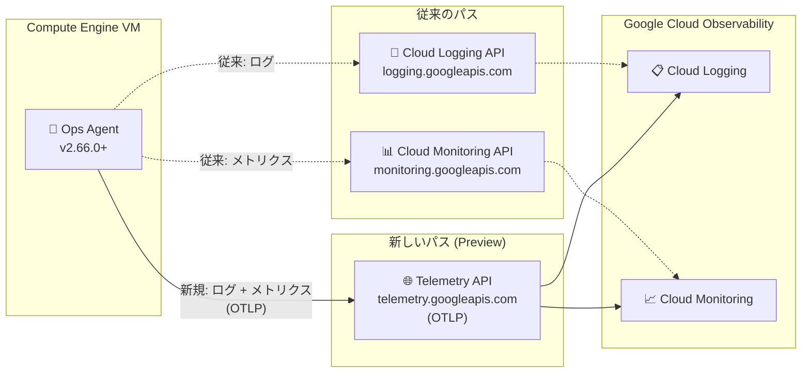

# Cloud Logging / Cloud Monitoring (Ops Agent): Telemetry API によるログ・メトリクスのエクスポート

**リリース日**: 2026-05-15

**サービス**: Cloud Logging / Cloud Monitoring (Ops Agent)

**機能**: Telemetry API (OpenTelemetry ベース) を使用したログ・メトリクスのエクスポート

**ステータス**: Preview

📊 [このアップデートのインフォグラフィックを見る](https://takech9203.github.io/google-cloud-news-summary/20260515-ops-agent-telemetry-api.html)

## 概要

Ops Agent バージョン 2.66.0 以降で、ログとメトリクスのエクスポートに OpenTelemetry ベースの Telemetry API (`telemetry.googleapis.com`) を使用できるようになった。これにより、従来の Cloud Logging API (`logging.googleapis.com`) および Cloud Monitoring API (`monitoring.googleapis.com`) に代わるオープンスタンダードベースのデータ送信パスが提供される。

Telemetry API は OpenTelemetry Line Protocol (OTLP) の実装であり、Google Cloud がサポートするオープンソースプロジェクトである OpenTelemetry のエコシステムとの一貫性を高める。Preview 期間中はオプトイン方式で、環境変数 `EXPERIMENTAL_FEATURES` を設定することで有効化できる。

このアップデートは、Google Cloud Observability のテレメトリデータ収集を OpenTelemetry 標準に統一する戦略的な一歩であり、Cloud Logging と Cloud Monitoring の両方に影響する横断的な機能強化である。

**アップデート前の課題**

- Ops Agent はログのエクスポートに Cloud Logging API (`logging.googleapis.com`)、メトリクスのエクスポートに Cloud Monitoring API (`monitoring.googleapis.com`) と、それぞれ異なるプロプライエタリ API を使用していた
- ログとメトリクスで別々の API エンドポイントを監視・管理する必要があった
- OpenTelemetry エコシステムとの整合性が低く、統一的なテレメトリパイプラインの構築が困難だった

**アップデート後の改善**

- ログとメトリクスの両方を単一の Telemetry API (`telemetry.googleapis.com`) 経由で送信可能になった
- OpenTelemetry Line Protocol (OTLP) 標準に準拠したデータ送信により、オープンスタンダードベースの統一パイプラインが実現する
- VPC Service Controls に対応しており、セキュリティ要件の厳しい環境でも利用可能

## アーキテクチャ図



Ops Agent v2.66.0 以降では、従来の個別 API (点線) に代えて、Telemetry API (実線) を介してログとメトリクスを統一的にエクスポートできる。

## サービスアップデートの詳細

### 主要機能

1. **OpenTelemetry ベースの統一エクスポート**
   - ログとメトリクスの両方を単一の Telemetry API エンドポイントに送信
   - OpenTelemetry Line Protocol (OTLP) に準拠
   - http/protobuf、http/json、gRPC の全プロトコルをサポート

2. **環境変数によるオプトイン制御**
   - `EXPERIMENTAL_FEATURES=otlp_exporter` を設定することで有効化
   - Preview 期間中は明示的なオプトインが必要
   - 既存の動作に影響を与えずに試用可能

3. **VPC Service Controls 対応**
   - `telemetry.googleapis.com` は VPC Service Controls のサポート対象サービス
   - Telemetry API に対する VPC SC 制限は他のサービスとは独立して適用される

## 技術仕様

### 要件と環境変数

| 項目 | 詳細 |
|------|------|
| 必要な Ops Agent バージョン | 2.66.0 以上 |
| 環境変数 | `EXPERIMENTAL_FEATURES=otlp_exporter` |
| API エンドポイント | `telemetry.googleapis.com` |
| 対応プロトコル | http/protobuf, http/json, gRPC |
| 対応テレメトリタイプ | ログ、メトリクス |
| ステータス | Preview (Pre-GA) |

### Telemetry API のクォータ

| 項目 | 詳細 |
|------|------|
| メトリクスのデフォルトクォータ | 60,000 リクエスト/分 |
| 最大バッチサイズ | 200 ポイント/リクエスト |
| 実効サンプルレート | 最大 200,000 サンプル/秒 |
| クォータ管理 | Cloud Logging API / Cloud Monitoring API とは別管理 |

## 設定方法

### 前提条件

1. Ops Agent バージョン 2.66.0 以上がインストールされていること
2. Google Cloud プロジェクトで Telemetry API が有効化されていること

### 手順

#### ステップ 1: Telemetry API の有効化

```bash
gcloud services enable telemetry.googleapis.com
```

プロジェクトで Telemetry API が未有効の場合に実行する。

#### ステップ 2: 環境変数の設定 (Linux)

```bash
for service in \
  google-cloud-ops-agent \
  google-cloud-ops-agent-fluent-bit \
  google-cloud-ops-agent-opentelemetry-collector \
; do
  sudo mkdir -p "/etc/systemd/system/${service}.service.d"
  echo -e '[Service]\nEnvironment="EXPERIMENTAL_FEATURES=otlp_exporter"' \
    | sudo tee "/etc/systemd/system/${service}.service.d/otlp_exporter.conf"
done
sudo systemctl daemon-reload
```

Ops Agent の全コンポーネント (メインサービス、Fluent Bit、OpenTelemetry Collector) に環境変数を設定する。

#### ステップ 3: 環境変数の設定 (Windows)

```powershell
setx EXPERIMENTAL_FEATURES "otlp_exporter" /M
```

管理者権限の PowerShell で実行する。

#### ステップ 4: Ops Agent の再起動

```bash
# Linux
sudo systemctl restart google-cloud-ops-agent

# 再起動の確認
sudo systemctl status "google-cloud-ops-agent*"
```

```powershell
# Windows
Restart-Service google-cloud-ops-agent -Force

# 再起動の確認
Get-Service google-cloud-ops-agent*
```

## メリット

### ビジネス面

- **標準化によるベンダーロックイン低減**: OpenTelemetry 標準に準拠することで、マルチクラウド環境でのテレメトリパイプラインの統一が容易になる
- **運用の簡素化**: ログとメトリクスの送信先 API を統一することで、監視対象のエンドポイントが削減される

### 技術面

- **OpenTelemetry エコシステムとの一貫性**: Ops Agent が OpenTelemetry Collector と同じプロトコルでデータを送信するため、テレメトリアーキテクチャ全体の一貫性が向上する
- **VPC Service Controls 対応**: セキュリティ要件の厳しい環境でも、VPC SC の境界内でテレメトリデータを安全に送信可能
- **独立したクォータ管理**: Telemetry API のクォータは Cloud Logging API / Cloud Monitoring API とは別に管理されるため、既存のクォータに影響しない

## デメリット・制約事項

### 制限事項

- Preview ステータスのため、本番環境での使用は「Pre-GA Offerings Terms」の条件に従う
- サポートが限定される可能性がある
- Telemetry API のクォータがデフォルト値で不十分な場合、別途クォータ調整が必要
- API 使用状況を監視するチャートやアラートポリシーがある場合、`telemetry.googleapis.com` エンドポイントを監視するよう更新が必要

### 考慮すべき点

- 既存の `monitoring.googleapis.com` や `logging.googleapis.com` を参照するダッシュボードやアラートポリシーの更新が必要になる可能性がある
- Preview から GA への移行時に設定方法が変更される可能性がある (現在は環境変数によるオプトイン)
- Telemetry API のメトリクスクォータはデフォルト 60,000 リクエスト/分であり、大規模環境ではクォータ増加リクエストが必要になる場合がある

## ユースケース

### ユースケース 1: OpenTelemetry 統一テレメトリパイプライン

**シナリオ**: アプリケーション側で OpenTelemetry SDK を使用してトレースとメトリクスを収集しており、インフラ側の Ops Agent も含めてテレメトリパイプラインを OpenTelemetry 標準に統一したい。

**効果**: アプリケーション側 (OpenTelemetry SDK/Collector) とインフラ側 (Ops Agent) の両方が同じ Telemetry API を使用することで、クォータ管理やネットワーク設定の一貫性が向上する。

### ユースケース 2: VPC Service Controls 環境でのテレメトリ管理

**シナリオ**: セキュリティ要件の厳しい環境で VPC Service Controls を使用しており、テレメトリデータの送信先も VPC SC の境界内に制限したい。

**効果**: Telemetry API は VPC Service Controls のサポート対象サービスであるため、`telemetry.googleapis.com` に対する制限を他のサービスとは独立して設定でき、きめ細かいセキュリティ制御が可能。

## 料金

Telemetry API 経由で送信されるメトリクスは「Prometheus Samples Ingested」SKU でカウントされる。ログについては Cloud Logging の既存の料金体系が適用される。

詳細は [Google Cloud Observability pricing](https://cloud.google.com/products/observability/pricing) を参照。

## 関連サービス・機能

- **Cloud Logging**: Ops Agent からのログエクスポート先。Telemetry API 経由でもデータは Cloud Logging に格納される
- **Cloud Monitoring**: Ops Agent からのメトリクスエクスポート先。Telemetry API 経由でもデータは Cloud Monitoring に格納される
- **Telemetry (OTLP) API**: OpenTelemetry Line Protocol の Google Cloud 実装。v1.traces、v1.metrics、v1.logs のエンドポイントを提供
- **OpenTelemetry Collector**: Ops Agent 外のテレメトリ収集に使用。同じ Telemetry API エンドポイントを利用可能
- **Google Cloud Managed Service for Prometheus**: メトリクスのサンプルベース課金モデルを共有

## 参考リンク

- 📊 [インフォグラフィック](https://takech9203.github.io/google-cloud-news-summary/20260515-ops-agent-telemetry-api.html)
- [公式リリースノート](https://docs.cloud.google.com/release-notes#May_15_2026)
- [Use the Telemetry API (Ops Agent ドキュメント)](https://docs.cloud.google.com/stackdriver/docs/solutions/agents/ops-agent/use-telemetry-api)
- [Telemetry (OTLP) API overview](https://docs.cloud.google.com/stackdriver/docs/reference/telemetry/overview)
- [OTLP metric ingestion overview](https://docs.cloud.google.com/stackdriver/docs/otlp-metrics/overview)
- [Ops Agent インストールガイド](https://docs.cloud.google.com/stackdriver/docs/solutions/agents/ops-agent/installation)
- [Google Cloud Observability pricing](https://cloud.google.com/products/observability/pricing)

## まとめ

Ops Agent v2.66.0 で導入された Telemetry API サポートは、Google Cloud の Observability スタックを OpenTelemetry 標準に統一する重要なマイルストーンである。Preview 段階ではあるが、テレメトリパイプラインの標準化を検討している組織は、非本番環境でのオプトイン検証を開始し、GA 昇格に備えることが推奨される。

---

**タグ**: #CloudLogging #CloudMonitoring #OpsAgent #OpenTelemetry #TelemetryAPI #OTLP #Observability #Preview
