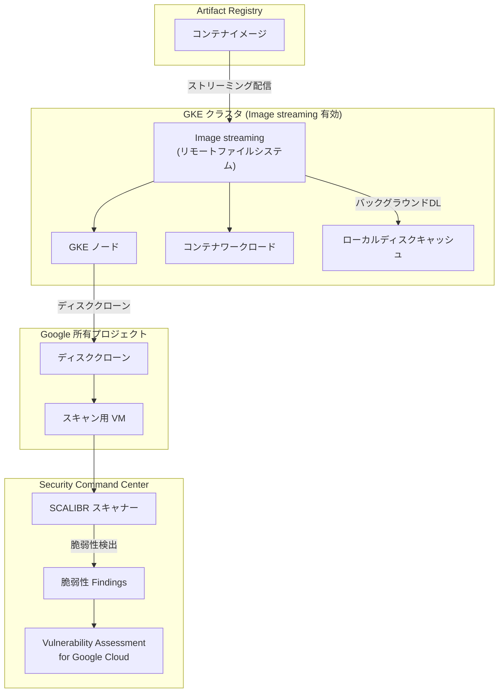

# Security Command Center: Vulnerability Assessment for Google Cloud が Image streaming 有効の GKE クラスタスキャンに対応

**リリース日**: 2026-05-15

**サービス**: Security Command Center

**機能**: Vulnerability Assessment for Google Cloud - Image streaming 対応 GKE クラスタスキャン

**ステータス**: Change

📊 [このアップデートのインフォグラフィックを見る](https://takech9203.github.io/google-cloud-news-summary/20260515-security-command-center-vulnerability-assessment-image-streaming.html)

## 概要

Security Command Center の Vulnerability Assessment for Google Cloud が、Image streaming を有効にした GKE クラスタのスキャンをサポートするようになりました。これにより、Image streaming を利用して高速なコンテナイメージプルを実現している GKE 環境でも、エージェントレスの脆弱性評価を実施できるようになります。

Vulnerability Assessment for Google Cloud は、VM インスタンスのディスクをクローンし、Google 所有のプロジェクト内で安全にマウント・スキャンする仕組みで動作します。Image streaming はコンテナイメージの取得方法を根本的に変更するため（リモートファイルシステムを使用）、従来のディスクベーススキャンとの互換性に課題がありましたが、今回のアップデートでこの制限が解消されました。

このアップデートは、GKE Standard および GKE Autopilot クラスタで Image streaming を活用しているすべてのユーザーに影響し、セキュリティ態勢の強化に貢献します。

**アップデート前の課題**

- Image streaming が有効な GKE クラスタでは、コンテナイメージがリモートファイルシステムから段階的にストリーミングされるため、従来のディスククローン方式による脆弱性スキャンが正常に動作しなかった
- Image streaming を利用するクラスタでは、脆弱性評価の対象外となり、セキュリティの可視性にギャップが生じていた
- Image streaming の高速起動メリットとセキュリティスキャンのカバレッジのどちらかを選択する必要があった

**アップデート後の改善**

- Image streaming が有効な GKE クラスタでも、Vulnerability Assessment for Google Cloud による脆弱性スキャンが実行可能になった
- GKE クラスタのノードおよびコンテナの両方で、ソフトウェア脆弱性を検出できるようになった
- Image streaming のパフォーマンスメリットを享受しながら、セキュリティスキャンのカバレッジを維持できるようになった

## アーキテクチャ図



Vulnerability Assessment for Google Cloud が Image streaming 有効の GKE クラスタのノードディスクをクローンし、SCALIBR を使用してスキャンを実行するフローを示しています。Image streaming によるリモートファイルシステム経由のイメージ配信と、脆弱性スキャンの両方が共存する構成です。

## サービスアップデートの詳細

### 主要機能

1. **Image streaming 対応の脆弱性スキャン**
   - Image streaming (GCFS: Google Container File System) が有効な GKE クラスタのノードおよびコンテナに対して、エージェントレスの脆弱性評価を実施
   - コンテナイメージがストリーミング方式で配信されている環境でも、ディスククローンベースのスキャンが正常に動作

2. **スキャン対象の拡大**
   - GKE Standard クラスタのノード
   - GKE Standard および GKE Autopilot クラスタで実行中のコンテナ
   - Image streaming 有効/無効に関わらず統一的なスキャンカバレッジを提供

3. **SCALIBR ベースのスキャンエンジン**
   - Google の OSS 脆弱性スキャナー SCALIBR を使用
   - VM インスタンスのディスクをクローンして安全にスキャン
   - クローンは同一リージョンの Google 所有プロジェクトに作成されるため、追加コスト不要

## 技術仕様

### スキャン頻度と Findings の仕様

| 項目 | Standard ティア | Premium / Enterprise ティア |
|------|----------------|---------------------------|
| スキャン頻度 | 週 1 回 | 約 12 時間ごと |
| 検出される重要度 | Critical のみ | Critical および High |
| Finding の有効期間 | 195 時間 | 25 時間 |
| Mandiant CVE 評価 | Critical のみ | Critical および High |

### Image streaming の動作仕様

| 項目 | 詳細 |
|------|------|
| 対応ノードイメージ | COS_CONTAINERD (GKE 1.30.1-gke.1329000+)、UBUNTU_CONTAINERD (GKE 1.35.0-gke.1403000+) |
| 対応レジストリ | Artifact Registry (標準/リモートリポジトリ)、Docker Hub パブリックレジストリ |
| 必要な API | Container File System API |
| Autopilot クラスタ | 自動的に Image streaming を使用 |

## 設定方法

### 前提条件

1. Security Command Center の Standard、Premium、または Enterprise ティアが有効であること
2. GKE クラスタで Image streaming が有効であること
3. Security Command Center サービスエージェントがプロジェクトの VM インスタンスを一覧表示し、ディスクをクローンする権限を持つこと

### 手順

#### ステップ 1: Vulnerability Assessment for Google Cloud の有効化

Security Command Center コンソールから Vulnerability Assessment for Google Cloud サービスを有効にします。Image streaming 対応のスキャンは追加設定なしで自動的に適用されます。

#### ステップ 2: GKE クラスタで Image streaming を有効化 (未設定の場合)

```bash
# 既存クラスタで Image streaming を有効化
gcloud container clusters update CLUSTER_NAME \
  --location=CONTROL_PLANE_LOCATION \
  --enable-image-streaming
```

#### ステップ 3: スキャン結果の確認

Security Command Center コンソールの Findings ページで、以下のカテゴリの脆弱性を確認できます:

- **OS vulnerability**: ノードの OS レベルの脆弱性
- **Software vulnerability**: ソフトウェアパッケージの脆弱性
- **Container Image Vulnerability**: コンテナイメージの脆弱性

## メリット

### ビジネス面

- **セキュリティカバレッジの統一**: Image streaming の利用有無に関わらず、全ての GKE クラスタで一貫した脆弱性評価が可能になり、セキュリティギャップを解消
- **運用効率の向上**: Image streaming による起動時間短縮のメリットを維持しながらセキュリティ要件を満たせるため、パフォーマンスとセキュリティのトレードオフが不要に

### 技術面

- **エージェントレス**: ワークロードへの影響なく脆弱性評価を実施。追加のソフトウェアインストールや設定変更が不要
- **コスト中立**: ディスククローンは Google 所有プロジェクトに作成されるため、顧客のプロジェクトに追加コストが発生しない
- **自動適用**: Image streaming 対応スキャンは既存の Vulnerability Assessment 設定に対して追加設定不要で自動的に適用

## デメリット・制約事項

### 制限事項

- CMEK (顧客管理暗号鍵) で暗号化されたディスクのスキャンでは、鍵がディスクと同一リージョンに存在する必要がある
- VPC Service Controls 境界内の CMEK ディスクはスキャン対象外
- CSEK (顧客提供暗号鍵) で暗号化されたディスクはスキャン非対応
- スキャン対象のディスクパーティションは VFAT、EXT2、EXT4 のみ
- GKE クラスタスキャン時、クラスタラベルは Findings に含まれない

### 考慮すべき点

- Image streaming 有効クラスタでは、イメージデータがバックグラウンドでローカルにキャッシュされるまでの間、スキャン結果が一部遅延する可能性がある
- 組織ポリシー制約がサービスエージェントのアクセスを妨げないよう構成を確認する必要がある

## ユースケース

### ユースケース 1: 大規模 GKE 環境のセキュリティ統合管理

**シナリオ**: 数十のマイクロサービスを GKE Autopilot で運用しており、大規模コンテナイメージの起動時間短縮のために Image streaming を活用している企業。これまで Image streaming 対応クラスタの脆弱性が可視化できず、セキュリティチームが手動スキャンツールを別途運用していた。

**効果**: Vulnerability Assessment for Google Cloud の自動スキャンにより、全クラスタの脆弱性を Security Command Center に統合。手動スキャンツールの運用負荷を削減し、CVE 検出から対応までの時間を大幅に短縮。

### ユースケース 2: CI/CD パイプラインでのセキュリティゲート強化

**シナリオ**: 開発チームが Image streaming を活用して高速なデプロイサイクルを実現しているが、デプロイ後のランタイム脆弱性検出が課題となっている。

**効果**: デプロイ後のコンテナに対する継続的な脆弱性スキャンが可能になり、Artifact Registry のビルド時スキャンと組み合わせて、ライフサイクル全体でのセキュリティカバレッジを実現。

## 料金

Vulnerability Assessment for Google Cloud は Security Command Center のティアに含まれる機能です。

| ティア | 利用可否 | 主な違い |
|--------|----------|----------|
| Standard | 利用可能 | 週 1 回スキャン、Critical のみ検出 |
| Premium | 利用可能 | 約 12 時間ごとスキャン、Critical + High 検出、攻撃パス分析 |
| Enterprise | 利用可能 | Premium と同等 + 追加のセキュリティ機能 |

## 関連サービス・機能

- **GKE Image streaming**: コンテナイメージのストリーミング配信により起動時間を短縮する GKE の機能。Container File System API を使用
- **Artifact Registry vulnerability assessment**: Artifact Registry に保存されたコンテナイメージの脆弱性をスキャンし、Security Command Center に統合
- **GKE Security Posture Dashboard**: GKE クラスタのセキュリティ態勢を可視化するダッシュボード。Security Command Center と連携して脆弱性情報を表示
- **SCALIBR (Software Composition Analysis LIBRary)**: Google が開発した OSS 脆弱性スキャナー。Vulnerability Assessment for Google Cloud のスキャンエンジンとして使用

## 参考リンク

- 📊 [インフォグラフィック](https://takech9203.github.io/google-cloud-news-summary/20260515-security-command-center-vulnerability-assessment-image-streaming.html)
- [公式リリースノート](https://docs.cloud.google.com/release-notes#May_15_2026)
- [Vulnerability Assessment for Google Cloud ドキュメント](https://docs.cloud.google.com/security-command-center/docs/vulnerability-assessment-google-cloud)
- [GKE Image streaming ドキュメント](https://docs.cloud.google.com/kubernetes-engine/docs/how-to/image-streaming)
- [Security Command Center 料金ページ](https://cloud.google.com/security-command-center/pricing)

## まとめ

今回のアップデートにより、Image streaming を有効にした GKE クラスタでも Vulnerability Assessment for Google Cloud による脆弱性スキャンが可能になりました。これは、パフォーマンス最適化とセキュリティのカバレッジを両立させる重要な改善であり、Image streaming を利用中の GKE ユーザーは追加設定なしで自動的にこの恩恵を受けられます。Security Command Center を活用している組織は、全ての GKE クラスタにおける統一的な脆弱性管理を実現できるようになりました。

---

**タグ**: #SecurityCommandCenter #VulnerabilityAssessment #GKE #ImageStreaming #ContainerSecurity #AgentlessScan #SCALIBR
