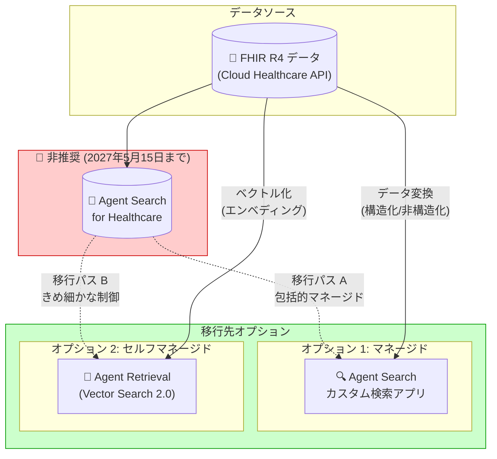

# Vertex AI Search: Agent Search for healthcare の廃止

**リリース日**: 2026-05-15

**サービス**: Vertex AI Search (Agent Search)

**機能**: Agent Search for healthcare

**ステータス**: Deprecated (非推奨)

📊 [このアップデートのインフォグラフィックを見る](https://takech9203.github.io/google-cloud-news-summary/20260515-vertex-ai-search-healthcare-deprecated.html)

## 概要

Google Cloud は、Agent Search for healthcare を非推奨 (Deprecated) としたことを発表した。このサービスは 2027 年 5 月 15 日をもって完全に利用不可となる。Agent Search for healthcare は、FHIR R4 形式の臨床データに対して自然言語検索や生成 AI による回答を提供するサービスであったが、今後は代替ソリューションへの移行が推奨される。

移行先として 2 つの選択肢が提示されている。包括的なマネージドソリューションを求める場合は、Agent Search のカスタム検索アプリを構築することが推奨される。一方、基盤となる検索メカニズムに対してきめ細かな制御が必要で、より顧客管理型のインテグレーションに対応できる場合は、Agent Retrieval (旧 Vector Search 2.0) の利用が推奨される。

この変更は、ヘルスケア分野で Agent Search を利用している組織に対して、1 年間の移行期間内に代替ソリューションへの移行計画を策定・実行することを求めるものである。

**アップデート前の状態**

- Agent Search for healthcare は FHIR R4 データに特化した検索機能を提供していた
- Cloud Healthcare API からデータをインポートし、キーワード検索、自然言語検索、生成 AI 回答を利用できた
- 患者 ID ベースの検索やデータストア全体の検索が可能であった

**アップデート後の変更**

- Agent Search for healthcare は非推奨となり、2027 年 5 月 15 日以降利用不可になる
- カスタム検索アプリ (Agent Search) または Agent Retrieval (Vector Search 2.0) への移行が必要
- 新規のヘルスケア検索アプリの構築は推奨されなくなった

## アーキテクチャ図

Agent Search for healthcare からの 2 つの移行パスを示す。オプション 1 はマネージドな検索ソリューション、オプション 2 はベクトル検索による低レベル制御を提供する。

## サービスアップデートの詳細

### 非推奨の背景

1. **対象サービス**
   - Agent Search for healthcare (旧 Vertex AI Search for Healthcare)
   - FHIR R4 データに対する検索・要約機能
   - 非推奨日: 2026 年 5 月 15 日、廃止日: 2027 年 5 月 15 日

2. **影響を受ける機能**
   - ヘルスケアデータストアの作成
   - ヘルスケア検索アプリの作成
   - FHIR R4 データのインポート (バッチ・ストリーミング)
   - キーワード検索、自然言語検索、生成 AI 回答

3. **既存の制約事項 (引き続き適用)**
   - 臨床目的 (直接的な診断・治療) での使用は禁止
   - 年齢層 0-18 歳および 85 歳以上へのデータ適用性は限定的
   - 生成 AI の出力は常にドラフトとして扱う必要がある

### 移行先オプション

#### オプション 1: Agent Search カスタム検索アプリ

| 項目 | 詳細 |
|------|------|
| 概要 | Google 品質の検索エンジンをカスタムデータに適用 |
| データソース | 構造化データ、非構造化データ (PDF, HTML, TXT)、ウェブサイト |
| 主要機能 | セマンティック検索、AI 回答生成、パーソナライゼーション |
| 管理レベル | フルマネージド |
| 適した用途 | 包括的な検索体験が必要な場合 |

#### オプション 2: Agent Retrieval (Vector Search 2.0)

| 項目 | 詳細 |
|------|------|
| 概要 | AI ネイティブなセルフチューニング検索エンジン |
| アーキテクチャ | Collection ベース (Data Object を格納) |
| 主要機能 | ベクトル類似性検索、ペイロードフィルタリング、自動エンベディング生成 |
| 管理レベル | 顧客管理型インテグレーション |
| 適した用途 | 検索メカニズムの細かな制御が必要な場合 |
| 対応リージョン | asia-east1, asia-northeast1, asia-southeast1, europe-north1, europe-west2, europe-west4, us-central1, us-east4, us-west1 |

## 移行ガイダンス

### 移行判断フロー

移行先の選択は以下の基準で判断する。

**Agent Search カスタム検索アプリを選ぶ場合:**
- マネージドなソリューションを望む
- Google 品質の検索ランキングを活用したい
- 自然言語理解、オートコンプリート、パーソナライゼーションが必要
- FHIR データを構造化データまたは非構造化データとして再構成可能

**Agent Retrieval (Vector Search 2.0) を選ぶ場合:**
- 検索アルゴリズムやランキングロジックを自分で制御したい
- カスタムエンベディングモデルを使用したい
- 既存のアプリケーションに検索機能を組み込みたい
- ベクトル検索の挙動を細かく調整する必要がある

### 移行スケジュールの推奨

| 時期 | アクション |
|------|----------|
| 2026 年 5-6 月 | 移行先の評価・選定、PoC 実施 |
| 2026 年 7-9 月 | データ変換・移行計画の策定、開発 |
| 2026 年 10-12 月 | 新環境でのテスト・検証 |
| 2027 年 1-3 月 | 本番移行・並行稼働 |
| 2027 年 4-5 月 | 旧環境の停止・クリーンアップ |

## デメリット・制約事項

### 移行に伴う課題

- FHIR R4 データの再構成が必要 (ヘルスケア専用のスキーマからカスタムスキーマへの変換)
- ヘルスケア固有の検索最適化 (患者 ID ベースの検索など) は手動で再実装が必要
- 日付フィルタリングなどのヘルスケア固有機能のカスタム実装が必要
- 移行期間は 1 年間 (2027 年 5 月 15 日まで) と限定的

### 考慮すべき点

- 臨床利用に関する規制要件は移行先でも引き続き遵守が必要
- Agent Search カスタム検索アプリではヘルスケア固有のデータ型 (FHIR R4) の直接サポートがない
- Vector Search 2.0 を使用する場合、エンベディング生成パイプラインの構築が追加で必要

## ユースケース

### ユースケース 1: 医療機関の患者記録検索システムの移行

**シナリオ**: 病院の情報システム部門が Agent Search for healthcare を使用して患者のカルテ情報を検索するシステムを運用している。

**移行方針**: Agent Search カスタム検索アプリへの移行が適切。FHIR R4 データを構造化データ形式に変換し、患者 ID をメタデータフィルターとして設定することで、同等の検索体験を実現できる。

**効果**: マネージドな環境で Google 品質の検索を維持しつつ、データの柔軟な拡張が可能になる。

### ユースケース 2: 医療 AI アプリケーションの検索基盤

**シナリオ**: ヘルスケアスタートアップが独自の臨床意思決定支援システムを構築しており、検索結果のランキングや関連性スコアを細かく制御したい。

**移行方針**: Agent Retrieval (Vector Search 2.0) への移行が適切。医療テキストに特化したカスタムエンベディングモデルを使用し、Collection に FHIR データを格納する。

**効果**: 検索メカニズムの完全な制御が可能になり、医療ドメイン固有の最適化を適用できる。

## 関連サービス・機能

- **Agent Search (カスタム検索アプリ)**: 移行先オプション 1。汎用的な検索エンジンプラットフォーム
- **Agent Retrieval (Vector Search 2.0)**: 移行先オプション 2。AI ネイティブなベクトル検索エンジン
- **Cloud Healthcare API**: FHIR R4 データの元データソース。引き続き利用可能
- **Vertex AI RAG Engine**: Vector Search 2.0 をバックエンドとして利用可能な RAG ソリューション

## 参考リンク

- 📊 [インフォグラフィック](https://takech9203.github.io/google-cloud-news-summary/20260515-vertex-ai-search-healthcare-deprecated.html)
- [公式リリースノート](https://docs.cloud.google.com/release-notes#May_15_2026)
- [Agent Search for healthcare ドキュメント](https://docs.cloud.google.com/generative-ai-app-builder/docs/healthcare-search-checklist)
- [Agent Search カスタム検索アプリ](https://docs.cloud.google.com/generative-ai-app-builder/docs/about-generic-search)
- [Agent Retrieval (Vector Search 2.0) 概要](https://docs.cloud.google.com/vertex-ai/docs/vector-search-2/overview)
- [Agent Search リリースノート](https://docs.cloud.google.com/generative-ai-app-builder/docs/release-notes)

## まとめ

Agent Search for healthcare の非推奨化は、ヘルスケア分野で同サービスを利用しているすべての組織に影響する重要な変更である。2027 年 5 月 15 日の廃止期限までに、Agent Search カスタム検索アプリまたは Agent Retrieval (Vector Search 2.0) のいずれかへの移行を完了する必要がある。移行先の選定は、マネージドレベルの要件と検索メカニズムに対する制御の必要性に基づいて判断することが推奨される。早期の評価開始と計画的な移行が重要である。

---

**タグ**: #VertexAI #AgentSearch #Healthcare #Deprecated #VectorSearch #Migration
