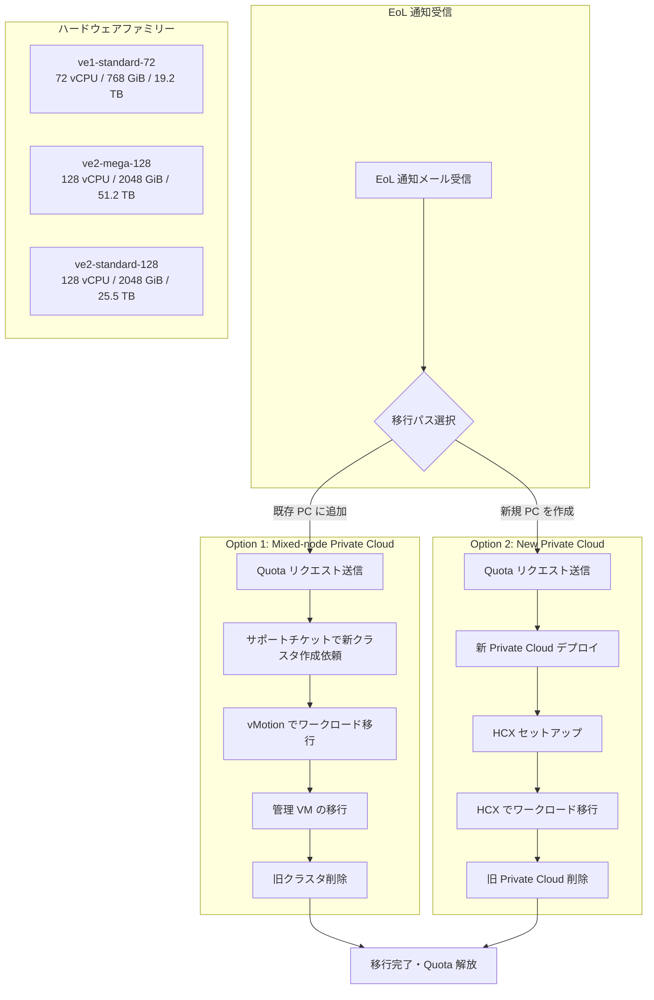

# Google Cloud VMware Engine: ve1 ハードウェア End-of-Life (EoL) 移行ガイド公開

**リリース日**: 2026-05-15

**サービス**: Google Cloud VMware Engine

**機能**: ve1 ハードウェア End-of-Life 移行ガイド

**ステータス**: Announcement

[このアップデートのインフォグラフィックを見る](https://takech9203.github.io/google-cloud-news-summary/20260515-vmware-engine-ve1-eol-migration.html)

## 概要

Google Cloud VMware Engine の第一世代 ve1 ベアメタルノードが物理インフラストラクチャの耐用年数に達しつつあるため、段階的に廃止されます。この廃止に伴い、ワークロードを新しいハードウェアに移行するための公式ドキュメントが公開されました。

移行対象のハードウェアはプレースメントグループ単位でリージョンごとにバッチ処理され、2026 年 Q1 から EoL 通知の送付が開始されています。最初のバッチの ve1 ハードウェアは 2027 年 Q1 までに End-of-Life に達します。対象となるユーザーには、タイムライン、リソース制限、移行手順を含む詳細な EoL 通知がメールで届きます。

移行先としては、同じ ve1 ファミリーの新しいハードウェア、または次世代の ve2 ファミリーのノードが提供されます。SLA カバレッジを維持するためには、EoL 日までに移行を完了する必要があります。

**アップデート前の課題**

- ve1 ハードウェアの廃止に関する公式な移行手順が公開されていなかった
- EoL 対象のユーザーが移行パスを自力で計画する必要があった
- CUD (Committed Use Discount) の取り扱いについて明確なガイダンスがなかった

**アップデート後の改善**

- 2 つの移行オプション (Mixed-node Private Cloud / New Private Cloud) が公式ドキュメントとして整備された
- EoL 通知に将来のキャパシティオファー (ve1 または ve2) が明記されるようになった
- CUD の調整方法 (変換・終了) に関する具体的なガイダンスが提供された
- 移行期間中のダブル課金を軽減するインセンティブが用意された

## アーキテクチャ図

上図は EoL 通知受信から移行完了までの 2 つの移行パスを示しています。Option 1 は既存の Private Cloud にクラスタを追加する方法、Option 2 は新規 Private Cloud を作成して HCX で移行する方法です。

## サービスアップデートの詳細

### 主要機能

1. **EoL 通知システム**
   - リージョン・ゾーン単位での対象ハードウェア通知
   - 現在の使用状況 (Private Cloud 名、プロジェクト番号、クラスタ名、ノードタイプ、ノード数) の一覧
   - 各クラスタの EoL 日 (サポート終了日) の明示
   - 将来のキャパシティオファー (ve1 または ve2) の提示

2. **Option 1: Mixed-node Private Cloud 移行**
   - 既存の Private Cloud に新しいハードウェアファミリーのクラスタを追加
   - vMotion / Storage vMotion によるクラスタ単位の段階的移行
   - 管理 VM の移行サポート (プライマリクラスタの場合)
   - クラスタ単位で 60 日間の移行ウィンドウ

3. **Option 2: New Private Cloud 移行**
   - 新規 Private Cloud をターゲットハードウェアでデプロイ
   - VMware HCX を使用したワークロード一括移行
   - バッチ単位でのメンテナンスウィンドウ計画が可能

4. **CUD (Committed Use Discount) 管理**
   - ve1 から ve1 への移行: 既存 CUD がそのまま有効
   - ve1 から ve2 への移行: CUD の終了または変換が必要
   - Convertible CUD は ve2 Portable-license CUD に変換可能
   - 移行期間中のダブル課金に対するインセンティブ提供

## 技術仕様

### ノードタイプ比較

| 項目 | ve1-standard-72 | ve2-mega-128 | ve2-standard-128 |
|------|-----------------|--------------|------------------|
| vCPU/ノード | 72 | 128 | 128 |
| メモリ/ノード | 768 GiB | 2048 GiB | 2048 GiB |
| ストレージ/ノード | 19.2 TB | 51.2 TB | 25.5 TB |
| ファミリー | ve1 | ve2 | ve2 |

### Storage-only ノードタイプ

| ノードタイプ | ストレージ/ノード |
|-------------|------------------|
| ve1-standard-so | 19.2 TB |
| ve2-mega-so | 51.2 TB |
| ve2-standard-so | 25.5 TB |
| ve2-small-so | 12.8 TB |

### 移行タイムライン

| マイルストーン | 時期 |
|---------------|------|
| EoL 通知送付開始 | 2026 年 Q1 |
| 最初のバッチの EoL 到達 | 2027 年 Q1 |
| 移行ウィンドウ (Quota 承認後) | 最大 60 日 |

## 設定方法

### 前提条件

1. EoL 通知メールを受信していること
2. 対象リージョンで新しいノードタイプの Quota が利用可能であること
3. Google Cloud コンソールへのアクセス権限があること

### 手順

#### ステップ 1: Quota リクエストの送信

Google Cloud コンソールから Quota リクエストを送信します。説明欄に以下を記載してください:

- "ve1 hardware end of life"
- "Retiring PC Name(s): [PC名]"
- "Retiring Cluster Name(s): [クラスタ名]"

#### ステップ 2: 移行パスの実行 (Option 1 の場合)

Quota 承認後、サポートチケットを作成して新クラスタのセットアップを依頼します。チケットには以下を含めてください:

- プロジェクト番号
- Private Cloud 名
- 新しいターゲットクラスタ名
- マシンファミリー (ve1 または ve2) とノードタイプ
- HCI ノード数
- Storage-only ノード数 (該当する場合)

#### ステップ 3: ワークロード移行

vSphere Client で VM を右クリックし、「Migrate」を選択します:

1. 「Change both compute resource and storage」を選択
2. 新しいクラスタとデスティネーションデータストアを選択
3. 移行を実行

#### ステップ 4: 旧クラスタの廃止

移行完了後、Google Cloud コンソール、REST API、または gcloud CLI で旧クラスタを削除し、Quota 解放リクエストを送信します。

## メリット

### ビジネス面

- **サービス継続性の確保**: 計画的な移行により、SLA カバレッジを維持しながらハードウェア更新が可能
- **コスト最適化**: ダブル課金インセンティブにより、移行期間中のコスト負担を軽減
- **CUD の柔軟な対応**: Convertible CUD の変換オプションにより、長期契約を有効活用可能

### 技術面

- **ハードウェア性能向上**: ve2 ノードは ve1 比で最大 1.8 倍の vCPU、2.7 倍のメモリ、2.7 倍のストレージを提供
- **段階的移行が可能**: Mixed-node Private Cloud により、クラスタ単位での段階的な移行が可能
- **FTT (Failure-to-Tolerate) の維持**: 3 ノード以上のクラスタでは最低 3 ノードが保証され、FTT=1 を維持

## デメリット・制約事項

### 制限事項

- Mixed-node Private Cloud のクラスタ作成はセルフサービスでは不可 (サポートチケットが必要)
- 移行ウィンドウは Quota 承認後最大 60 日間に限定
- 同一クラスタ内で異なる HCI ノードタイプの混在は不可
- HCX Fleet アプライアンスは vMotion をサポートしないため、再デプロイが必要

### 考慮すべき点

- Non-convertible CUD を持つユーザーは ve2 移行時に CUD の終了と再購入が必要
- データベースプラットフォームによっては vMotion に対応できない場合があり、ターゲットクラスタでの再構築が必要
- 移行期間中は旧環境と新環境の両方に課金が発生する

## ユースケース

### ユースケース 1: 大規模エンタープライズの段階的移行

**シナリオ**: 複数リージョンに ve1 クラスタを展開している大規模企業が、ビジネスへの影響を最小限に抑えながら移行する必要がある。

**効果**: Option 1 (Mixed-node Private Cloud) を選択することで、クラスタ単位での段階的移行が可能になり、サービス中断なしにハードウェアを更新できる。vMotion により VM 単位でのライブマイグレーションが実行可能。

### ユースケース 2: スモールスタートで ve2 へ全面移行

**シナリオ**: 単一リージョンに小規模な ve1 Private Cloud を持つ企業が、この機会に ve2 の高性能ハードウェアへ全面移行したい。

**効果**: Option 2 (New Private Cloud) を選択し、HCX を使用してワークロードを一括移行。ve2-mega-128 の大幅な性能向上 (128 vCPU / 2048 GiB RAM / 51.2 TB ストレージ) により、将来の拡張にも対応可能。

## 利用可能リージョン

ve1 から ve2 への移行は、Mixed-node Private Cloud をサポートするリージョンで利用可能です:

| リージョン | Mixed-node サポート |
|-----------|-------------------|
| asia-northeast1 (Tokyo) | ve1, ve2 |
| australia-southeast1 (Sydney) | ve1, ve2 (Mixed-node対応) |
| australia-southeast2 (Melbourne) | ve1, ve2 |
| europe-west2 (London) | ve1, ve2 (Mixed-node対応) |
| europe-west3 (Frankfurt) | ve1, ve2 (Mixed-node対応) |
| northamerica-northeast1 (Montreal) | ve1, ve2 (Mixed-node対応) |
| northamerica-northeast2 (Toronto) | ve1, ve2 |
| southamerica-east1 (Sao Paulo) | ve1, ve2 (Mixed-node対応) |
| us-central1 (Iowa) | ve1, ve2 (Mixed-node対応) |
| us-east4 (North Virginia) | ve1, ve2 (Mixed-node対応) |
| us-south1 (Dallas) | ve1, ve2 (Mixed-node対応) |
| us-west2 (Los Angeles) | ve1, ve2 |

## 関連サービス・機能

- **VMware HCX**: Private Cloud 間のワークロード移行に使用されるモビリティプラットフォーム
- **VMware vMotion**: クラスタ間でのライブ VM マイグレーション機能
- **Cloud Customer Care**: Mixed-node クラスタ作成やサポートチケット対応
- **Committed Use Discounts (CUD)**: 長期利用割引の管理・変換

## 参考リンク

- [インフォグラフィック](https://takech9203.github.io/google-cloud-news-summary/20260515-vmware-engine-ve1-eol-migration.html)
- [公式リリースノート](https://docs.cloud.google.com/release-notes#May_15_2026)
- [ve1 ハードウェア移行ガイド (公式ドキュメント)](https://docs.cloud.google.com/vmware-engine/docs/howto-migrate-ve1-hardware)
- [VMware Engine ノードタイプ](https://docs.cloud.google.com/vmware-engine/docs/concepts-node-types)
- [VMware Engine 料金](https://cloud.google.com/vmware-engine/pricing)

## まとめ

Google Cloud VMware Engine の ve1 ハードウェア EoL は、2026 年 Q1 から通知が開始され、2027 年 Q1 に最初のバッチが廃止となる計画的なハードウェアリフレッシュです。対象ユーザーは EoL 通知を確認し、早期にアカウントチームと連携して移行計画を策定することを推奨します。特に CUD を保有している場合は、移行先ハードウェアファミリーに応じた契約調整が必要となるため、早めの対応が重要です。

---

**タグ**: #GoogleCloud #VMwareEngine #ve1 #EndOfLife #Migration #HardwareRefresh #ve2 #vMotion #HCX #PrivateCloud
