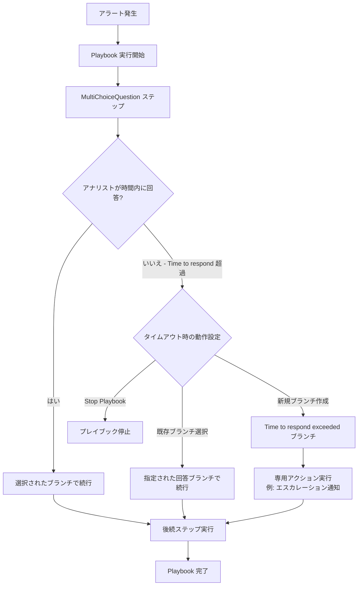

# Google SecOps SOAR: Release 6.3.84 全リージョン展開完了

**リリース日**: 2026-05-16

**サービス**: Google SecOps SOAR (Security Orchestration, Automation and Response)

**機能**: Release 6.3.84 全リージョン一般提供開始

**ステータス**: GA (General Availability)

[このアップデートのインフォグラフィックを見る](https://takech9203.github.io/google-cloud-news-summary/20260516-google-secops-soar-release-6-3-84.html)

## 概要

Google SecOps SOAR の Release 6.3.84 が全リージョンで利用可能になりました。本リリースは 2026年5月3日に第1フェーズのリージョン群に先行展開され、段階的ロールアウトプロセスを経て、5月16日に全リージョンへの展開が完了しました。

本リリースには内部バグ修正および顧客報告バグの修正に加え、Playbook の MultiChoiceQuestion ステップにおける「応答時間超過時 (Time to respond)」の動作オプション強化が含まれています。この機能強化により、セキュリティアナリストが応答時間内に回答しなかった場合のプレイブック実行フローをより柔軟に制御できるようになりました。

**アップデート前の課題**

- MultiChoiceQuestion ステップで応答時間を超過した場合、プレイブックの停止しか選択肢がなく、自動化フローが中断されていた
- 応答タイムアウト時に特定の分岐に自動的にルーティングする手段が限定的だった
- タイムアウトシナリオに対して専用のハンドリングロジックを構築することが困難だった

**アップデート後の改善**

- 応答時間超過時に「既存の回答ブランチを選択」して自動的に処理を継続できるようになった
- 「新しいブランチを作成」オプションにより、タイムアウト専用の処理フロー (例: マネージャーへのエスカレーションメール送信) を定義可能になった
- プレイブック実行の中断を最小限に抑え、セキュリティ対応の自動化をより堅牢にできるようになった

## アーキテクチャ図

MultiChoiceQuestion ステップにおける応答時間超過時の3つの動作オプションを示したフロー図です。セキュリティ運用チームはシナリオに応じて最適なタイムアウトハンドリングを選択できます。

## サービスアップデートの詳細

### 主要機能

1. **MultiChoiceQuestion の「Time to respond」オプション強化**
   - 応答時間超過時に3つの選択肢が利用可能: プレイブック停止、既存ブランチ選択、新規ブランチ作成
   - 「既存ブランチ選択」: 事前に定義された回答ブランチの中から1つを選択し、タイムアウト時に自動的にそのブランチのフローを実行
   - 「新規ブランチ作成」: プレイブックデザイナーに「Time to respond exceeded」ラベル付きの専用ブランチが追加され、タイムアウト固有のアクションを定義可能

2. **内部およびカスタマーバグ修正**
   - 本リリースには複数の内部バグ修正と顧客報告に基づくバグ修正が含まれる
   - 具体的な修正内容は非公開

### 段階的ロールアウト

本リリースは Google SecOps SOAR の標準的な段階的展開プロセスに従いました。

| フェーズ | 展開日 | 対象リージョン |
|----------|--------|----------------|
| 第1フェーズ | 2026-05-03 | Japan, India, Australia, Canada, Germany, Switzerland |
| 第2フェーズ (全リージョン) | 2026-05-16 | Singapore, Qatar, Saudi Arabia, Israel, UK, Italy, EU, US |

## 設定方法

### 前提条件

1. Google SecOps SOAR のアクティブなサブスクリプション
2. Playbook の編集権限を持つ SOC ロール

### 手順

#### ステップ 1: MultiChoiceQuestion フローの設定

1. Response > Playbooks ページで対象のプレイブックを開く
2. MultiChoiceQuestion フローをプレイブックステップにドラッグ
3. ダブルクリックしてサイドドロワーを開き、Parameters タブで質問と回答を設定

#### ステップ 2: Time to respond の設定

1. サイドドロワーの Settings タブをクリック
2. 「Time to respond」オプションを ON にトグル
3. 日・時間・分で適切な期間を指定
4. 「If Time to Respond exceeded」セクションで動作を選択:
   - **Stop Playbook**: プレイブック実行を停止
   - **Select existing branch**: 既存の回答ブランチから1つを選択
   - **Create new branch**: タイムアウト専用の新規ブランチを生成

## メリット

### ビジネス面

- **セキュリティ対応の継続性向上**: アナリストの応答遅延時でも自動化フローが中断せず、セキュリティインシデントへの対応が継続される
- **エスカレーションの自動化**: タイムアウト時に上位者への自動通知やケースの再割り当てなど、組織固有のエスカレーションポリシーを実装可能

### 技術面

- **プレイブック設計の柔軟性向上**: 最大20の分岐に加え、タイムアウト専用ブランチによりより複雑なセキュリティワークフローを表現可能
- **MTTD/MTTR の改善**: 人的対応の遅延がプレイブック全体の停止につながるリスクを排除し、平均検知時間・平均対応時間を短縮

## デメリット・制約事項

### 制限事項

- MultiChoiceQuestion のブランチ数は最大20まで (Release 6.3.82 で6から20に拡張済み)
- 「Time to respond exceeded」ブランチの動作はプレイブック設計時に事前定義が必要

### 考慮すべき点

- タイムアウト時のデフォルト動作を慎重に選択する必要がある (誤った自動選択はセキュリティリスクにつながる可能性)
- 既存プレイブックへの適用には、タイムアウトシナリオの影響を事前に評価することを推奨

## ユースケース

### ユースケース 1: マルウェア対応のエスカレーション自動化

**シナリオ**: マルウェア検知プレイブックで、感染端末の隔離承認を求める MultiChoiceQuestion ステップにおいて、担当アナリストが30分以内に応答しない場合に、自動的にセキュリティマネージャーにエスカレーション通知を送信し、同時に端末の一時隔離を実行する。

**効果**: 人的対応の遅延による感染拡大リスクを最小化し、SLA 遵守率を向上

### ユースケース 2: フィッシング対応のフォールバック処理

**シナリオ**: フィッシングメール報告の対応プレイブックで、メール削除の承認待ちがタイムアウトした場合に、既存の「隔離のみ」ブランチを自動選択し、完全削除ではなく安全な隔離処理を実行する。

**効果**: 対応の空白時間をなくしつつ、最小権限の原則に基づいた安全なフォールバック動作を保証

## 利用可能リージョン

Release 6.3.84 は 2026年5月16日時点で全リージョンに展開完了済みです。

**第1フェーズリージョン**: Japan, India, Australia, Canada, Germany, Switzerland

**第2フェーズリージョン**: Singapore, Qatar, Saudi Arabia, Israel, UK (London), Italy, EU (multi-region), US (multi-region)

## 関連サービス・機能

- **Google SecOps SIEM**: SOAR と統合されたセキュリティ情報・イベント管理プラットフォーム。アラートの検知から SOAR プレイブックのトリガーまでをシームレスに連携
- **Playbook フロー機能**: Condition フローや MultiChoiceQuestion フローを含むプレイブックの分岐ロジック基盤
- **Remote Agent**: SOAR のリモート環境でのコネクタ実行やジョブ実行を担うエージェント機能

## 参考リンク

- [インフォグラフィック](https://takech9203.github.io/google-cloud-news-summary/20260516-google-secops-soar-release-6-3-84.html)
- [公式リリースノート](https://docs.cloud.google.com/chronicle/docs/soar/release-notes)
- [ドキュメント: Use flows in playbooks](https://docs.cloud.google.com/chronicle/docs/soar/respond/working-with-playbooks/using-flows-in-playbooks#multi-choice)
- [段階的リリース計画](https://docs.cloud.google.com/chronicle/docs/soar/overview-and-introduction/soar-gradual-release)

## まとめ

Google SecOps SOAR Release 6.3.84 は、Playbook の MultiChoiceQuestion ステップにおけるタイムアウトハンドリングを大幅に強化し、セキュリティ運用の自動化をより堅牢にするアップデートです。セキュリティチームは既存のプレイブックを見直し、応答時間超過シナリオに対する適切なフォールバック動作を設定することで、インシデント対応の連続性と効率性を向上させることを推奨します。

---

**タグ**: #GoogleSecOps #SOAR #Playbook #SecurityAutomation #IncidentResponse #ReleaseNotes
