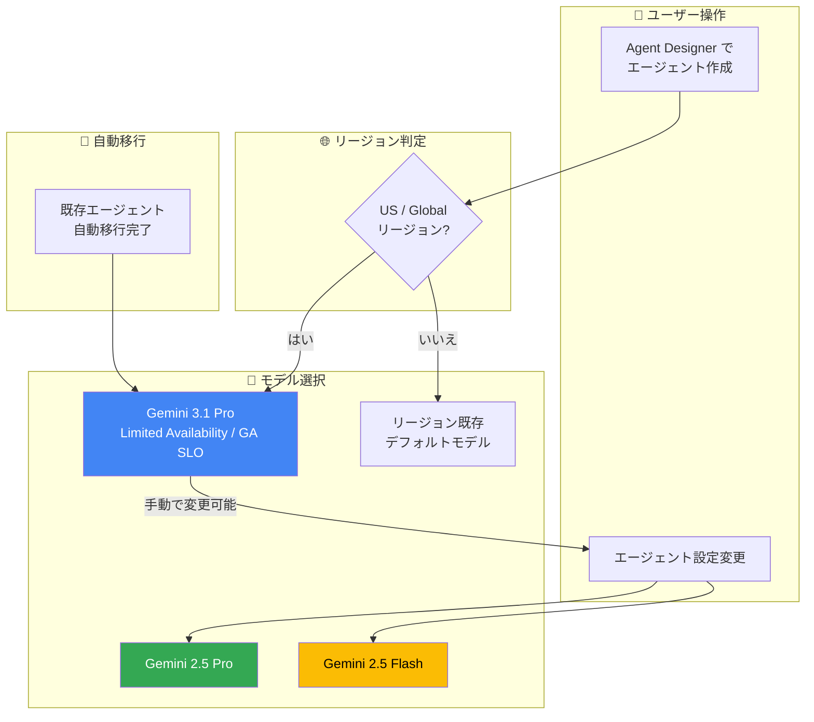

# Gemini Enterprise: Agent Designer のデフォルトモデルが Gemini 3.1 Pro に変更

**リリース日**: 2026-05-17

**サービス**: Gemini Enterprise

**機能**: Agent Designer デフォルトモデルの Gemini 3.1 Pro への移行

**ステータス**: Limited Availability (GA SLO 付き)

[このアップデートのインフォグラフィックを見る](https://takech9203.github.io/google-cloud-news-summary/20260517-gemini-enterprise-agent-designer-gemini-3-1-pro.html)

## 概要

Gemini Enterprise の Agent Designer において、US リージョンおよび Global リージョンで新規作成されるエージェントのデフォルトモデルが Gemini 3.1 Pro に変更された。これにより、Agent Designer で作成されるエージェントは、より高度な推論能力とエージェント機能を備えた最新モデルを自動的に活用できるようになる。

さらに、US および Global リージョンで既に Gemini 2.5 Pro または Gemini 2.5 Flash を使用していた既存のエージェントについても、パフォーマンス向上のために Gemini 3.1 Pro に自動移行が実施された。この Gemini 3.1 Pro は Limited Availability ステータスであるが、GA レベルの Service Level Objectives (SLO) が適用されるため、本番環境での利用に適した信頼性が担保されている。

ユーザーはエージェント設定から Gemini 2.5 Pro または Gemini 2.5 Flash に手動で戻すことも可能であり、柔軟な選択肢が維持されている。

**アップデート前の課題**

- Agent Designer で新規エージェント作成時のデフォルトモデルが Gemini 2.5 Pro/Flash であり、最新の推論能力やエージェント機能の恩恵を受けるには手動でモデルを変更する必要があった
- 既存エージェントは Gemini 2.5 世代のモデルで動作しており、ソフトウェアエンジニアリングやエージェントワークフローにおけるパフォーマンスが最適化されていなかった
- Gemini 3.1 Pro の改善されたトークン効率や思考能力を活用するには、ユーザーが能動的にモデルを切り替える必要があった

**アップデート後の改善**

- US/Global リージョンでの新規エージェントは自動的に Gemini 3.1 Pro で作成され、最新の推論・エージェント能力を即座に活用可能
- 既存エージェントも Gemini 3.1 Pro に自動移行され、手動操作なしでパフォーマンスが向上
- Limited Availability でありながら GA レベルの SLO が適用されるため、本番ワークロードでの利用に十分な信頼性を確保
- 必要に応じて Gemini 2.5 Pro/Flash に手動で戻す柔軟性も維持

## アーキテクチャ図



US/Global リージョンでは Gemini 3.1 Pro がデフォルトとなり、既存エージェントも自動移行される。ユーザーはエージェント設定から他のモデルに切り替え可能。

## サービスアップデートの詳細

### 主要機能

1. **新規エージェントのデフォルトモデル変更**
   - US および Global リージョンで Agent Designer から作成される新規エージェントのデフォルトモデルが Gemini 3.1 Pro に変更
   - 他のリージョン (Gemini 3.1 Pro が利用不可な地域) のデフォルト設定は変更なし

2. **既存エージェントの自動移行**
   - US/Global リージョンで Gemini 2.5 Pro または Gemini 2.5 Flash を使用していた既存エージェントが Gemini 3.1 Pro に自動移行
   - 移行の目的はパフォーマンス向上
   - ユーザーの操作なしで移行が完了

3. **手動ロールバック機能**
   - エージェント設定から Gemini 2.5 Pro または Gemini 2.5 Flash に手動で戻すことが可能
   - Agent Designer の Flow タブまたは Chat ペインからモデル変更を実行可能

4. **GA SLO 付き Limited Availability**
   - Gemini 3.1 Pro 自体は Limited Availability ステータス
   - ただし General Availability レベルの Service Level Objectives (SLO) が適用
   - 本番環境での信頼性が保証される

## 技術仕様

### Gemini 3.1 Pro vs Gemini 2.5 Pro 比較

| 項目 | Gemini 3.1 Pro | Gemini 2.5 Pro |
|------|----------------|----------------|
| 最大入力トークン | 1,048,576 | 1,048,576 |
| 最大出力トークン | 65,536 | 65,535 |
| PDF 対応 | あり (最大 3,000 ページ/ファイル) | なし (ドキュメント入力は対応) |
| Thinking レベル | LOW / MEDIUM / HIGH | LOW / HIGH |
| SWE/エージェント性能 | 大幅改善 | 標準 |
| トークン効率 | 改善 | 標準 |
| Flex PayGo | 対応 | 非対応 |
| Knowledge cutoff | 2025年1月 | 2025年1月 |

### Gemini 3.1 Pro の主要改善点

| 改善領域 | 詳細 |
|----------|------|
| SWE・エージェント能力 | ソフトウェアエンジニアリング動作の改善、金融・スプレッドシートなどのドメインでのエージェント改善 |
| トークン効率・思考 | 様々なユースケースでより効率的な思考処理 |
| 思考レベル | MEDIUM パラメータの追加により、コスト・性能・速度のトレードオフ最適化の選択肢が拡大 |
| カスタムツール対応 | `gemini-3.1-pro-preview-customtools` エンドポイントによるカスタムツール優先処理 |

## 設定方法

### 前提条件

1. Gemini Enterprise のライセンスを持つアカウント (Business / Standard / Plus のいずれか)
2. Agent Designer 機能トグルが有効化されたウェブアプリ
3. US または Global リージョンでの利用 (Gemini 3.1 Pro をデフォルトとして使用する場合)

### 手順

#### ステップ 1: 新規エージェントの作成 (デフォルトで Gemini 3.1 Pro)

1. Google Cloud コンソールから Gemini Enterprise > Apps ページに移動
2. アプリを選択し、ウェブアプリ URL を開く
3. ナビゲーションメニューで「+ Create agent」をクリック
4. プロンプトまたはフロービルダーでエージェントを作成 (US/Global リージョンでは自動的に Gemini 3.1 Pro が選択される)

#### ステップ 2: モデルの変更 (必要な場合)

1. ウェブアプリのナビゲーションメニューで「Agents」をクリック
2. 対象エージェントの「Actions」メニューから「Edit」を選択
3. Agent Designer キャンバスで Flow タブを開く
4. メインエージェントノードをクリック
5. 「Model」フィールドで Gemini 2.5 Pro または Gemini 2.5 Flash を選択
6. 「Update」をクリックして保存

#### ステップ 3: Chat ペインからのモデル変更 (代替方法)

Agent Designer の Chat ペインで以下のようなプロンプトを入力することでも変更可能:

```
Change the main agent's model to Gemini 2.5 Pro
```

## メリット

### ビジネス面

- **即時のパフォーマンス向上**: 既存エージェントのユーザーは操作なしでより高性能なモデルの恩恵を受けられる
- **運用負荷の軽減**: モデルアップグレードが自動で行われるため、管理者の手動作業が不要
- **本番利用可能な信頼性**: Limited Availability でありながら GA SLO が適用されるため、エンタープライズワークロードに適している

### 技術面

- **改善された推論能力**: 複雑な問題解決とマルチステップタスクの遂行能力が向上
- **トークン効率の改善**: 同じタスクをより少ないトークンで処理でき、コスト効率が向上する可能性
- **MEDIUM thinking レベル**: コスト・速度・品質のバランスを取る新しい選択肢が追加
- **エージェント機能の強化**: 金融やスプレッドシートなどの実務ドメインでのツール利用精度が向上

## デメリット・制約事項

### 制限事項

- Gemini 3.1 Pro が利用可能なリージョンは現時点で US と Global のみ (他リージョンは対象外)
- Limited Availability ステータスのため、全ユーザーに即時提供されるわけではない
- 既存エージェントの自動移行はオプトアウト不可 (移行後に手動で戻す必要あり)
- Gemini Live API は Gemini 3.1 Pro では非対応
- Content Credentials (C2PA) は非対応

### 考慮すべき点

- 自動移行により既存のプロンプトやワークフローの動作が変わる可能性がある (モデルの応答特性の違い)
- Gemini 3.1 Pro はコンパクトで直接的な回答を優先する設計のため、従来のモデルと比較して出力スタイルが異なる場合がある
- モデル変更後はエージェントの Preview タブで動作確認を行うことを推奨
- 料金体系が異なる場合があるため、移行前後でコストの確認が必要

## ユースケース

### ユースケース 1: 営業チーム向けフォローアップメールエージェント

**シナリオ**: 営業チームが CRM データを基にリード向けフォローアップメールを自動生成するエージェントを作成。Gemini 3.1 Pro の改善されたエージェント能力により、複数のデータソースからの情報統合とパーソナライズされたメール生成がより正確に実行される。

**効果**: Gemini 3.1 Pro のエージェント改善により、ツール呼び出しの精度向上と文脈理解の深化が期待でき、よりビジネスに即したメール生成が可能になる。

### ユースケース 2: 財務レポート分析マルチステップエージェント

**シナリオ**: 金融アナリストが複数のスプレッドシートやデータソースを横断して分析を行うマルチステップエージェントを構築。Gemini 3.1 Pro の金融・スプレッドシートドメインでの改善を活かし、複雑なデータ分析タスクを自動化する。

**効果**: Gemini 3.1 Pro の SWE・エージェント能力向上により、マルチステップの分析フローがより安定的に実行され、サブエージェント間の協調精度が向上。

### ユースケース 3: コードレビュー自動化エージェント

**シナリオ**: 開発チームがコードリポジトリに接続し、プルリクエストの自動レビューを行うエージェントを構築。Gemini 3.1 Pro の 1M トークンコンテキストウィンドウとソフトウェアエンジニアリング能力の改善を活用。

**効果**: コードベース全体を理解した上でのレビューコメント生成が改善され、より的確なフィードバックが可能。

## 料金

Gemini Enterprise の料金は、エディション (Business / Standard / Plus / Frontline) によって異なる。Agent Designer は全エディションで「no-code エージェントの作成と公開 (preview)」として利用可能。

Gemini 3.1 Pro のモデル利用自体は Gemini Enterprise ライセンスに含まれる。API 経由での直接利用の場合は以下の消費オプションが利用可能:

| 消費オプション | 概要 |
|---------------|------|
| Standard PayGo | 従量課金 |
| Priority PayGo | 優先処理付き従量課金 |
| Flex PayGo | 柔軟な従量課金 (3.1 Pro で新規対応) |
| Provisioned Throughput | 確保済みスループット |
| Batch prediction | バッチ推論 |

詳細な料金は [Gemini Enterprise Agent Platform 料金ページ](https://cloud.google.com/gemini-enterprise-agent-platform/generative-ai/pricing) を参照。

## 利用可能リージョン

| リージョン | Gemini 3.1 Pro デフォルト適用 | 備考 |
|-----------|------------------------------|------|
| US (us-central1 等) | はい | 新規・既存エージェントに適用 |
| Global | はい | 新規・既存エージェントに適用 |
| その他のリージョン | いいえ | 従来のデフォルト設定を維持 |

Gemini 3.1 Pro モデル自体は Global リージョンで利用可能。Agent Designer でのデフォルト適用は現時点で US と Global に限定されるが、他リージョンでも手動でモデルを選択することで利用可能な場合がある。

## 関連サービス・機能

- **Gemini Enterprise Agent Platform**: Agent Designer が動作する基盤プラットフォーム。モデルのホスティングと API 提供を担当
- **Vertex AI**: Gemini モデルの API 提供基盤。直接 API 経由で Gemini 3.1 Pro を利用する場合のエンドポイント
- **Google Workspace 連携**: Agent Designer からの Gmail、Google Drive、Google Calendar 等との接続
- **サードパーティ連携**: Jira、Salesforce 等のサードパーティツールとの接続によるエージェントのデータソース拡張
- **NotebookLM Enterprise**: Gemini Enterprise の別機能として、ノートブック形式での AI 活用を提供

## 参考リンク

- [インフォグラフィック](https://takech9203.github.io/google-cloud-news-summary/20260517-gemini-enterprise-agent-designer-gemini-3-1-pro.html)
- [公式リリースノート](https://cloud.google.com/release-notes#May_17_2026)
- [Agent Designer でエージェントを作成する](https://docs.cloud.google.com/gemini/enterprise/docs/agent-designer/create-agent)
- [Agent Designer でエージェントを編集する](https://docs.cloud.google.com/gemini/enterprise/docs/agent-designer/edit-agent)
- [Agent Designer 概要](https://docs.cloud.google.com/gemini/enterprise/docs/agent-designer)
- [Gemini 3.1 Pro モデル情報](https://docs.cloud.google.com/gemini-enterprise-agent-platform/models/gemini/3-1-pro)
- [Gemini Enterprise エディション比較](https://docs.cloud.google.com/gemini/enterprise/docs/editions)
- [料金ページ](https://cloud.google.com/gemini-enterprise-agent-platform/generative-ai/pricing)

## まとめ

今回のアップデートにより、Gemini Enterprise の Agent Designer で作成・運用されるエージェントが、追加の操作なしで最新かつ最高性能の Gemini 3.1 Pro モデルを活用できるようになった。既存エージェントの自動移行と GA レベルの SLO 適用は、エンタープライズユーザーにとって信頼性とパフォーマンスの両立を実現する重要な進歩である。US/Global リージョンのユーザーは、エージェントの動作確認を行い、必要に応じてモデル設定を調整することが推奨される。

---

**タグ**: #GeminiEnterprise #AgentDesigner #Gemini3.1Pro #LimitedAvailability #AI #エージェント #モデルアップグレード
