# Google SecOps SOAR: Release 6.3.85

**リリース日**: 2026-05-17

**サービス**: Google SecOps SOAR (Security Orchestration, Automation and Response)

**機能**: Release 6.3.85 - バグ修正リリース

**ステータス**: 第1フェーズリージョンへのロールアウト中

📊 [このアップデートのインフォグラフィックを見る](https://takech9203.github.io/google-cloud-news-summary/20260517-google-secops-soar-release-6-3-85.html)

## 概要

Google SecOps SOAR の Release 6.3.85 が、段階的ロールアウトの第1フェーズとして対象リージョンへの展開が開始された。本リリースは内部バグ修正およびカスタマー報告によるバグ修正を含むメンテナンスリリースである。

前日の 2026年5月16日に Release 6.3.84 が全リージョンで利用可能になったことを受け、次のリリースとして 6.3.85 の段階的展開が開始された。Google SecOps SOAR では、安定性を確保するために2段階のリージョンロールアウト方式を採用しており、まず第1フェーズのリージョンに展開した後、約1週間後に残りのリージョンへ展開される。

## アーキテクチャ図

```mermaid
flowchart LR
    subgraph Release["🚀 Release 6.3.85"]
        direction TB
        Build["🔧 ビルド & テスト"]
    end

    subgraph Phase1["📍 第1フェーズ (5月17日〜)"]
        direction TB
        JP["🇯🇵 Japan"]
        IN["🇮🇳 India"]
        AU["🇦🇺 Australia"]
        CA["🇨🇦 Canada"]
        DE["🇩🇪 Germany"]
        CH["🇨🇭 Switzerland"]
    end

    subgraph Phase2["📍 第2フェーズ (約1週間後)"]
        direction TB
        SG["🇸🇬 Singapore"]
        QA["🇶🇦 Qatar"]
        SA["🇸🇦 Saudi Arabia"]
        IL["🇮🇱 Israel"]
        UK["🇬🇧 UK (London)"]
        IT["🇮🇹 Italy"]
        EU["🇪🇺 EU (multi-region)"]
        US["🇺🇸 US (multi-region)"]
    end

    Build --> Phase1
    Phase1 -->|"検証期間 (~1週間)"| Phase2
```

Google SecOps SOAR のリリースは2段階のロールアウト方式で展開される。第1フェーズで問題が検出されなければ、約1週間後に第2フェーズのリージョンへ展開が進む。

## サービスアップデートの詳細

### リリース内容

1. **内部バグ修正**
   - Google 内部で検出された不具合の修正
   - プラットフォームの安定性向上

2. **カスタマーバグ修正**
   - カスタマーから報告された不具合の修正
   - 具体的な修正内容は公式リリースノートでは非公開

### 段階的ロールアウトの仕組み

| フェーズ | リージョン | 展開タイミング |
|----------|-----------|---------------|
| 第1フェーズ | Japan, India, Australia, Canada, Germany, Switzerland | 2026年5月17日 |
| 第2フェーズ | Singapore, Qatar, Saudi Arabia, Israel, UK, Italy, EU (multi-region), US (multi-region) | 約1週間後 (予定) |

### リリース履歴 (直近)

| バージョン | 第1フェーズ展開日 | 全リージョン展開日 | 主な内容 |
|-----------|------------------|-------------------|---------|
| 6.3.85 | 2026-05-17 | 未定 | バグ修正 |
| 6.3.84 | 2026-05-03 | 2026-05-16 | バグ修正 + MultiChoiceQuestion の「Time to respond」オプション強化 |
| 6.3.83 | 2026-04-12 | 2026-05-02 | バグ修正 |
| 6.3.82 | 2026-04-05 | 2026-04-11 | バグ修正 + Playbook 分岐数上限を6から20に拡大 |

## メリット

### 運用面

- **段階的ロールアウトによるリスク軽減**: 第1フェーズのリージョンで問題が発見された場合、第2フェーズへの展開前に対処が可能
- **継続的な品質改善**: 定期的なバグ修正リリースにより、プラットフォームの安定性が維持される

### 技術面

- **ダウンタイムの最小化**: 段階的展開により全リージョンが同時に影響を受けることを防止
- **カスタマーフィードバックの反映**: 報告された不具合が継続的に修正される

## 制約事項

- 第1フェーズのリージョンのみが現時点で本リリースを受け取る
- 第2フェーズのリージョン (US multi-region, EU multi-region 等) は約1週間後に展開予定
- 自分が所属するリージョンが不明な場合は、Google SecOps 担当者に確認が必要
- 公式メンテナンスウィンドウは日曜日の 11:00〜15:00 UTC

## 関連サービス・機能

- **Google SecOps SIEM**: SOAR と統合されたセキュリティ情報イベント管理プラットフォーム
- **Google SecOps Marketplace**: SOAR で利用可能なインテグレーションやコネクタを提供
- **Remote Agent**: オンプレミス環境との接続を提供するコンポーネント (SOAR リリースと連動してアップデートされる場合がある)

## 参考リンク

- 📊 [インフォグラフィック](https://takech9203.github.io/google-cloud-news-summary/20260517-google-secops-soar-release-6-3-85.html)
- [公式リリースノート](https://docs.cloud.google.com/release-notes#May_17_2026)
- [SOAR リリースノート](https://docs.cloud.google.com/chronicle/docs/soar/release-notes)
- [段階的リリース計画](https://docs.cloud.google.com/chronicle/docs/soar/overview-and-introduction/soar-gradual-release)
- [Google SecOps SOAR ステータスダッシュボード](https://status.cloud.google.com/security/)

## まとめ

Google SecOps SOAR Release 6.3.85 はバグ修正に焦点を当てたメンテナンスリリースであり、第1フェーズのリージョン (日本、インド、オーストラリア、カナダ、ドイツ、スイス) から展開が開始された。第2フェーズのリージョン (US、EU を含む) は約1週間後に展開予定である。SOAR を利用中のユーザーは、自組織のリージョンに応じてリリースの適用タイミングを把握しておくことが推奨される。

---

**タグ**: #google-secops #soar #bug-fix #release #gradual-rollout
