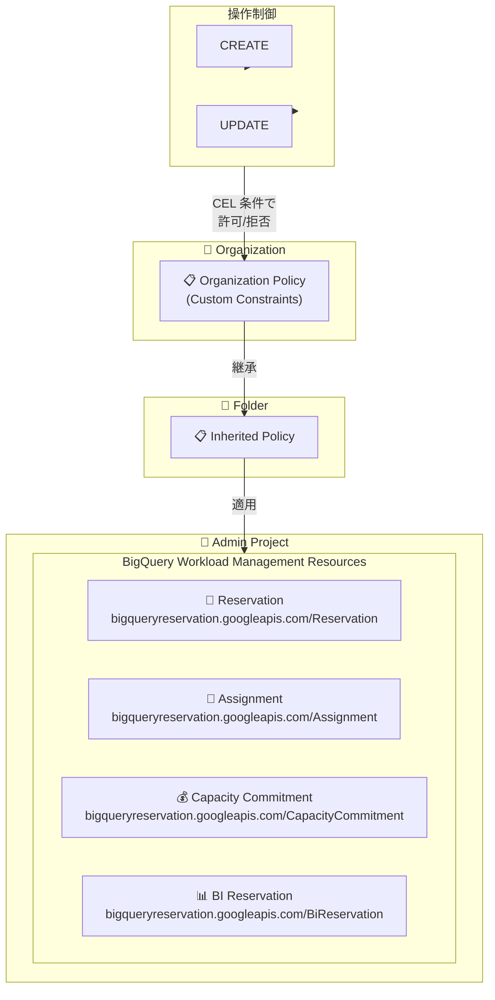

# BigQuery: カスタム組織ポリシーによるワークロード管理リソースの制御

**リリース日**: 2026-05-18

**サービス**: BigQuery

**機能**: カスタム組織ポリシーによるワークロード管理リソース (Reservations、Assignments、Capacity Commitments、BI Reservations) の制御

**ステータス**: Preview

📊 [このアップデートのインフォグラフィックを見る](https://takech9203.github.io/google-cloud-news-summary/20260518-bigquery-custom-org-policy-workload-management.html)

## 概要

BigQuery のワークロード管理リソースに対して、カスタム組織ポリシー (Custom Organization Policy) を使用して特定の操作を許可または拒否できるようになりました。対象リソースは、Reservations (予約)、Assignments (割り当て)、Capacity Commitments (容量コミットメント)、BI Reservations (BI 予約) です。

この機能により、組織のポリシー管理者は、BigQuery のスロット購入やリソース割り当てに対してきめ細かいガバナンスを適用できます。Organization Policy Service の CEL (Common Expression Language) 条件を使用して、リソースの作成や更新時に制約を適用することで、コスト管理やコンプライアンス要件への対応が可能になります。

対象ユーザーは、大規模組織で BigQuery の容量管理を集中制御したい組織管理者やクラウドアーキテクトです。特に、複数のプロジェクトやチームが BigQuery のリザベーションを使用する環境において、不適切なスロット購入や割り当て変更を防止するガバナンス機能として活用できます。

**アップデート前の課題**

- ワークロード管理リソース (Reservations、Assignments、Capacity Commitments、BI Reservations) に対する操作を組織レベルで一元的に制御する手段がなかった
- IAM 権限のみでは「どのような条件でリソースを作成・更新できるか」という細かい制約を表現できなかった
- 個々のプロジェクトで独自にスロットを購入したり、不適切な割り当て変更を行うことを防ぐのが困難だった
- BigQuery のカスタム組織ポリシーは Dataset、Table、Routine などには対応していたが、ワークロード管理リソースには未対応だった

**アップデート後の改善**

- `bigqueryreservation.googleapis.com/Reservation`、`Assignment`、`CapacityCommitment`、`BiReservation` に対してカスタム制約を定義可能になった
- CEL 条件を使用して、スロット数、エディション、リージョンなどの条件に基づくポリシーを作成できる
- 組織、フォルダ、プロジェクトの各レベルでポリシーを適用でき、階層的なガバナンスが実現できる
- ドライラン機能を使って、ポリシー適用前に影響範囲をテストできる

## アーキテクチャ図



組織ポリシーが階層的に継承され、BigQuery ワークロード管理リソースの作成・更新操作に対して CEL 条件に基づく許可/拒否が適用される構成を示しています。

## サービスアップデートの詳細

### 主要機能

1. **対象リソースタイプ**
   - `bigqueryreservation.googleapis.com/Reservation` - スロットプール (予約) の作成・更新を制御
   - `bigqueryreservation.googleapis.com/Assignment` - プロジェクト/フォルダ/組織のリザベーション割り当てを制御
   - `bigqueryreservation.googleapis.com/CapacityCommitment` - スロット容量コミットメント (年間・3年) の購入を制御
   - `bigqueryreservation.googleapis.com/BiReservation` - BI Engine 用予約容量の変更を制御

2. **CEL 条件によるきめ細かい制御**
   - リソースのフィールド値に基づいて条件を記述可能
   - 例: スロット数の上限設定、特定エディションの強制、リージョン制限
   - ALLOW (条件を満たす場合のみ許可) と DENY (条件を満たす場合は拒否) の両方をサポート

3. **階層的なポリシー継承**
   - 組織レベルで設定したポリシーがフォルダ・プロジェクトに自動継承
   - 下位レベルで親ポリシーをオーバーライド可能
   - タグベースの条件付きルールにも対応

## 技術仕様

### 対象リソースとメソッド

| リソースタイプ | 対応メソッド | 主要フィールド |
|------|------|------|
| `bigqueryreservation.googleapis.com/Reservation` | CREATE, UPDATE | slotCapacity, edition, autoscale |
| `bigqueryreservation.googleapis.com/Assignment` | CREATE, UPDATE | jobType, assignee |
| `bigqueryreservation.googleapis.com/CapacityCommitment` | CREATE, UPDATE | slotCount, plan, edition |
| `bigqueryreservation.googleapis.com/BiReservation` | UPDATE | size, preferredTables |

### カスタム制約の YAML 定義例

```yaml
name: organizations/ORGANIZATION_ID/customConstraints/custom.limitReservationSlots
resourceTypes:
  - bigqueryreservation.googleapis.com/Reservation
methodTypes:
  - CREATE
  - UPDATE
condition: "resource.slotCapacity > 1000"
actionType: DENY
displayName: Limit reservation slot capacity
description: >-
  Deny creating or updating reservations with more than 1000 slots.
  Contact the platform team for larger allocations.
```

### ポリシー YAML 定義例

```yaml
name: projects/PROJECT_ID/policies/custom.limitReservationSlots
spec:
  rules:
    - enforce: true
dryRunSpec:
  rules:
    - enforce: true
```

## 設定方法

### 前提条件

1. Google Cloud 組織が存在すること
2. Organization Policy Administrator (`roles/orgpolicy.policyAdmin`) IAM ロールが付与されていること
3. BigQuery Reservation API (`bigqueryreservation.googleapis.com`) が有効化されていること

### 手順

#### ステップ 1: カスタム制約の作成

```bash
# カスタム制約の YAML ファイルを作成
cat > constraint-limit-slots.yaml << 'EOF'
name: organizations/123456789/customConstraints/custom.limitReservationSlots
resourceTypes:
  - bigqueryreservation.googleapis.com/Reservation
methodTypes:
  - CREATE
  - UPDATE
condition: "resource.slotCapacity > 1000"
actionType: DENY
displayName: Limit reservation slot capacity
description: Deny reservations with more than 1000 slots.
EOF

# 制約を組織に適用
gcloud org-policies set-custom-constraint constraint-limit-slots.yaml
```

カスタム制約を組織に登録します。登録後、組織ポリシーの一覧に表示されるようになります。

#### ステップ 2: 組織ポリシーの作成と適用

```bash
# ポリシー YAML ファイルを作成
cat > policy-limit-slots.yaml << 'EOF'
name: projects/my-project/policies/custom.limitReservationSlots
spec:
  rules:
    - enforce: true
EOF

# ポリシーを適用
gcloud org-policies set-policy policy-limit-slots.yaml
```

ポリシーが有効になるまで最大 15 分かかる場合があります。

#### ステップ 3: ポリシーの検証

```bash
# 制約の確認
gcloud org-policies list-custom-constraints --organization=123456789

# ポリシーの確認
gcloud org-policies list --project=my-project

# ドライランモードでテスト
gcloud org-policies set-policy policy-limit-slots.yaml --update-mask=dryRunSpec
```

ドライランモードでは、実際にはブロックせずにポリシー違反をログに記録します。本番適用前のテストに活用できます。

## メリット

### ビジネス面

- **コスト管理の強化**: 不適切なスロット購入や過大な容量コミットメントを組織レベルで防止し、予期しないコスト増加を未然に防げる
- **ガバナンスの一元化**: 複数のチーム・プロジェクトにまたがる BigQuery 容量管理のルールを組織ポリシーとして集中管理できる
- **コンプライアンス対応**: 特定のリージョンでのみ容量を購入可能にするなど、データ主権要件への対応が容易になる

### 技術面

- **宣言的なポリシー管理**: YAML ベースの制約定義により、Infrastructure as Code としてバージョン管理可能
- **CEL による柔軟な条件記述**: スロット数、エディション、割り当てタイプなど、リソースの任意のフィールドに基づく条件を記述できる
- **ドライランによる安全な検証**: ポリシーの影響を事前にテストし、既存ワークロードへの影響を把握してから適用できる

## デメリット・制約事項

### 制限事項

- Preview ステータスのため、SLA の適用対象外であり、本番環境での利用には注意が必要
- リソースタイプあたりのカスタム制約は最大 20 個まで
- ポリシーの適用には最大 15 分のラグが発生する可能性がある
- CEL 条件は最大 1000 文字まで

### 考慮すべき点

- 既存のリザベーションがポリシーに違反している場合、UPDATE メソッドの制約を適用すると変更がブロックされる (違反を解消する変更を除く)
- 組織ポリシーの階層継承を理解し、意図しないブロックが発生しないよう設計が必要
- ドライランモードで十分にテストしてから本番適用することを推奨

## ユースケース

### ユースケース 1: スロット購入の上限制御

**シナリオ**: 大規模組織で、個々のチームが独自にスロットを大量購入してコストが膨らむことを防ぎたい。

**実装例**:
```yaml
name: organizations/123456789/customConstraints/custom.limitCommitmentSlots
resourceTypes:
  - bigqueryreservation.googleapis.com/CapacityCommitment
methodTypes:
  - CREATE
condition: "resource.slotCount > 500"
actionType: DENY
displayName: Limit capacity commitment size
description: >-
  Individual teams cannot purchase more than 500 slots.
  Contact the platform team for larger commitments.
```

**効果**: チームごとのスロット購入を 500 スロット以下に制限し、大規模な容量変更は必ずプラットフォームチームの承認を経る運用フローを強制できる。

### ユースケース 2: Enterprise Plus エディションの強制

**シナリオ**: 組織のセキュリティ要件として、すべてのリザベーションで Enterprise Plus エディションの使用を義務付けたい。

**実装例**:
```yaml
name: organizations/123456789/customConstraints/custom.enforceEnterprisePlus
resourceTypes:
  - bigqueryreservation.googleapis.com/Reservation
methodTypes:
  - CREATE
  - UPDATE
condition: "resource.edition != 'ENTERPRISE_PLUS'"
actionType: DENY
displayName: Enforce Enterprise Plus edition
description: All reservations must use Enterprise Plus edition.
```

**効果**: Enterprise Plus が提供する高度なセキュリティ機能 (CMK、VPC Service Controls 対応など) を組織全体で確実に利用できる。

### ユースケース 3: BI 予約容量の制限

**シナリオ**: BI Engine の予約容量が過剰に割り当てられることを防ぎ、コストを管理したい。

**実装例**:
```yaml
name: organizations/123456789/customConstraints/custom.limitBiReservation
resourceTypes:
  - bigqueryreservation.googleapis.com/BiReservation
methodTypes:
  - UPDATE
condition: "resource.size > 10737418240"
actionType: DENY
displayName: Limit BI reservation to 10GB
description: BI reservation cannot exceed 10GB (10737418240 bytes).
```

**効果**: BI Engine の予約容量を 10GB 以下に制限し、不要なメモリ確保によるコスト増を防止できる。

## 料金

カスタム組織ポリシー自体の利用に追加料金は発生しません。BigQuery のワークロード管理リソースの料金は、通常の BigQuery 容量ベース料金に従います。

### BigQuery スロット料金の参考

| エディション | コミットメントタイプ | 料金 (100 スロット/月、US リージョン) |
|--------|-----------------|------|
| Enterprise | 年間コミットメント | 約 $2,000/月 |
| Enterprise | Pay-As-You-Go (自動スケーリング) | 約 $4,000/月 |
| Enterprise Plus | 年間コミットメント | 約 $3,200/月 |
| Enterprise Plus | Pay-As-You-Go (自動スケーリング) | 約 $6,400/月 |

※ 料金は変動する可能性があります。最新の料金は公式料金ページをご確認ください。

## 利用可能リージョン

BigQuery のワークロード管理リソースが利用可能なすべてのリージョンおよびマルチリージョンで、カスタム組織ポリシーを使用できます。リザベーションはリージョナルリソースであるため、ポリシーもリージョン単位で適用されます。

## 関連サービス・機能

- **Organization Policy Service**: カスタム制約の基盤となるサービス。CEL 条件の記述やポリシー階層の管理を提供
- **BigQuery Reservations**: スロットプールの作成とワークロードへの容量割り当てを管理するサービス
- **BigQuery Capacity Commitments**: スロットの長期割引購入 (年間/3年) を管理
- **BigQuery BI Engine**: インメモリ分析エンジン。BI Reservation で容量を予約
- **Cloud Audit Logs**: ポリシー違反時のエラーログを記録。ガバナンスの監査証跡として活用
- **IAM (Identity and Access Management)**: Organization Policy Administrator ロールがポリシー管理に必要

## 参考リンク

- 📊 [インフォグラフィック](https://takech9203.github.io/google-cloud-news-summary/20260518-bigquery-custom-org-policy-workload-management.html)
- [公式リリースノート](https://cloud.google.com/release-notes#May_18_2026)
- [BigQuery カスタム組織ポリシー ドキュメント](https://cloud.google.com/bigquery/docs/custom-constraints)
- [BigQuery ワークロード管理](https://cloud.google.com/bigquery/docs/reservations-workload-management)
- [BigQuery Reservation API リファレンス](https://cloud.google.com/bigquery/docs/reference/reservations/rest)
- [カスタム制約対応サービス一覧](https://cloud.google.com/resource-manager/docs/organization-policy/custom-constraint-supported-services)
- [BigQuery 料金ページ](https://cloud.google.com/bigquery/pricing#capacity_compute_analysis_pricing)

## まとめ

BigQuery のワークロード管理リソースにカスタム組織ポリシーが対応したことで、大規模組織における BigQuery 容量管理のガバナンスが大幅に強化されました。スロット購入の上限制御、エディションの強制、割り当て変更の制限など、組織のコストやセキュリティ要件に合わせたきめ細かいポリシーを宣言的に定義できます。Preview ステータスのため本番環境では慎重な検証が推奨されますが、まずはドライランモードで既存環境への影響を確認し、GA 昇格に備えてポリシー設計を開始することをお勧めします。

---

**タグ**: #BigQuery #OrganizationPolicy #WorkloadManagement #Reservations #CapacityCommitments #Governance #CostManagement #Preview
