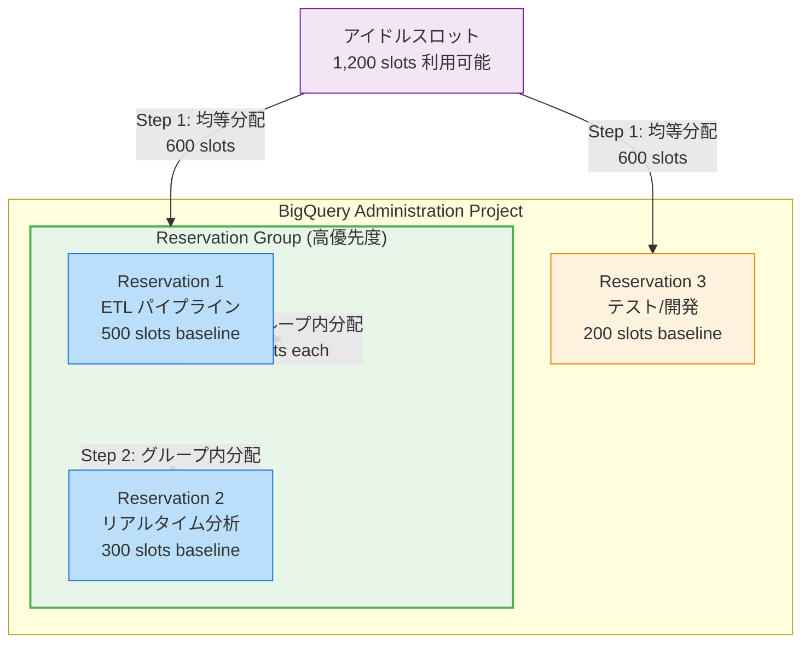

# BigQuery: Reservation Groups によるアイドルスロットの優先共有

**リリース日**: 2026-05-18

**サービス**: BigQuery

**機能**: Reservation Groups (リザベーショングループ) によるアイドルスロットの優先共有

**ステータス**: 一般提供開始 (GA)

📊 [このアップデートのインフォグラフィックを見る](https://takech9203.github.io/google-cloud-news-summary/20260518-bigquery-reservation-groups.html)

## 概要

BigQuery の Reservation Groups (リザベーショングループ) 機能が一般提供 (GA) となりました。この機能により、複数のリザベーションをグループ化し、グループ内でアイドルスロットを優先的に共有できるようになります。グループ内のリザベーションは、プロジェクト内の他のリザベーションにアイドルスロットを提供する前に、まずグループ内で相互にスロットを共有します。

これにより、関連するワークロード間でのスロット配分をより細かく制御でき、高優先度のワークロードに対して予測可能なリソース配分を実現できます。例えば、本番環境の ETL パイプラインとリアルタイム分析クエリを同じグループに配置することで、これらのワークロード間でアイドルスロットを優先的に共有し、テスト環境のワークロードよりも優先的にリソースを確保できます。

Reservation Groups は BigQuery の既存のリザベーションシステムを拡張するもので、データセットがテーブルを整理するのと同様に、リザベーションをグループ化して管理プロパティを制御できます。この機能を利用するには、事前に Reservation-based Fairness (リザベーションベースの公平性) を有効化する必要があります。

**アップデート前の課題**

- アイドルスロットはプロジェクト内の全リザベーションに均等に分配されており、ワークロードの優先度に基づいた制御ができなかった
- 関連する複数のリザベーション間でスロットを優先的に共有する仕組みがなく、重要なワークロードが十分なリソースを確保できない場合があった
- スロット配分の優先順位付けには、リザベーションの分割・統合やプロジェクト分離など、複雑な運用回避策が必要だった

**アップデート後の改善**

- リザベーションをグループ化することで、グループ内のアイドルスロット共有が優先され、高優先度ワークロードのリソース確保が容易になった
- グループ外のリザベーションよりも先にグループ内でスロットが共有されるため、関連ワークロード間のパフォーマンス安定性が向上した
- Console、bq CLI、Terraform、SQL DDL など複数の方法でリザベーショングループを作成・管理できるようになった

## アーキテクチャ図



アイドルスロットはまずリザベーショングループと未グループ化のリザベーションに均等分配され、その後グループ内で均等に再分配されます。これにより、グループ内のリザベーションは外部よりも多くのアイドルスロットにアクセスできます。

## サービスアップデートの詳細

### 主要機能

1. **リザベーショングループの作成と管理**
   - 複数のリザベーションを論理的にグループ化
   - グループ名は小文字英数字またはダッシュで構成 (最大 64 文字)
   - Console、bq CLI、Terraform、SQL DDL で作成可能

2. **優先的なアイドルスロット共有**
   - グループ内のリザベーションが他のリザベーションより先にアイドルスロットを共有
   - アイドルスロットはまずグループと未グループ化リザベーション間で均等に分配
   - その後、グループ内で均等に再分配

3. **Reservation-based Fairness との統合**
   - Reservation Groups の前提条件として Reservation-based Fairness の有効化が必要
   - Reservation Predictability や Managed Disaster Recovery との組み合わせも可能

## 技術仕様

### リザベーショングループの制約

| 項目 | 詳細 |
|------|------|
| 同一プロジェクト・リージョン | グループ内のリザベーションは同一プロジェクト・同一リージョンに属する必要あり |
| 最大スロット数 | グループ内リザベーションの合計は 30,000 スロット以下 (オートスケール上限含む) |
| エディション | グループ内のリザベーションは同一エディションである必要あり |
| Disaster Recovery | グループ内で DR 有効/無効を混在不可。有効の場合は同一リージョンペアが必要 |
| 前提条件 | Reservation-based Fairness の有効化が必須 |

### 必要な IAM 権限

| 権限 | 説明 |
|------|------|
| `bigquery.reservationEditor` | リザベーショングループの作成・更新に必要 |
| `bigquery.config.update` | Reservation-based Fairness の有効化に必要 |

## 設定方法

### 前提条件

1. BigQuery Enterprise または Enterprise Plus エディションの利用
2. Reservation-based Fairness の有効化
3. `bigquery.reservationEditor` ロールの付与

### 手順

#### ステップ 1: Reservation-based Fairness の有効化

```sql
ALTER PROJECT `your-project-id`
SET OPTIONS (
  `region-us.enable_reservation_based_fairness` = true
);
```

管理プロジェクトで Reservation-based Fairness を有効にします。`region-us` の部分はリザベーションのリージョンに合わせて変更してください。

#### ステップ 2: リザベーショングループの作成 (bq CLI)

```bash
bq mk \
  --project_id=ADMIN_PROJECT_ID \
  --location=LOCATION \
  --reservation_group \
  RESERVATION_GROUP_NAME
```

- `ADMIN_PROJECT_ID`: 管理プロジェクトの ID
- `LOCATION`: リザベーションのリージョン
- `RESERVATION_GROUP_NAME`: グループ名 (小文字英数字・ダッシュ、最大 64 文字)

#### ステップ 3: リザベーショングループの作成 (Terraform)

```hcl
resource "google_bigquery_reservation_group" "default" {
  name     = "my-reservation-group"
  location = "us-central1"
}
```

#### ステップ 4: リザベーションをグループに追加 (Console)

1. Google Cloud Console で BigQuery ページに移動
2. ナビゲーションメニューから「Capacity management」を選択
3. グループに追加するリザベーションのチェックボックスを選択
4. テーブルヘッダーの「Create reservation group」ボタンをクリック
5. グループ名を入力し、追加のリザベーションを選択
6. 「Create」をクリック

## メリット

### ビジネス面

- **コスト最適化**: 既存のスロット容量を効率的に活用し、追加購入なしで高優先度ワークロードのパフォーマンスを改善
- **SLA 遵守の容易化**: 重要なワークロードのリソース確保を制御できるため、ビジネスクリティカルなジョブの SLA 遵守が容易に
- **部門間リソース管理**: 関連する部門やチームのワークロードをグループ化し、組織構造に沿ったリソース配分を実現

### 技術面

- **パフォーマンス予測性の向上**: グループ内のアイドルスロット優先共有により、ワークロードのパフォーマンスがより予測可能に
- **運用シンプル化**: プロジェクト分離やリザベーション再設計の必要がなく、グループ化だけで優先度制御を実現
- **柔軟な構成管理**: Terraform・bq CLI・Console・SQL DDL など複数のツールで管理可能

## デメリット・制約事項

### 制限事項

- グループ内リザベーションの合計スロット数は 30,000 スロットを超えられない (オートスケール上限含む)
- グループ内のリザベーションは同一エディションである必要がある (Enterprise と Enterprise Plus の混在不可)
- Managed Disaster Recovery の有効/無効をグループ内で混在できない
- Reservation-based Fairness を事前に有効化する必要があり、既存のスロット配分動作が変更される可能性がある

### 考慮すべき点

- グループ化による優先配分は、グループ外のリザベーションのアイドルスロット取得量が減少する可能性がある
- 複雑なグループ構成は、スロット配分の予測を困難にする場合がある
- グループ内のリザベーション数が増えると、個々のリザベーションが取得できるアイドルスロット量が減少する

## ユースケース

### ユースケース 1: 本番 ETL とリアルタイム分析の優先リソース確保

**シナリオ**: データ基盤チームが本番 ETL パイプライン (500 slots) とリアルタイムダッシュボード分析 (300 slots) を運用しており、テスト環境 (200 slots) も同一プロジェクトで管理している。ETL と分析ジョブは相互に関連しており、テスト環境よりも優先的にリソースを確保したい。

**実装例**:
```bash
# リザベーショングループの作成
bq mk --project_id=bq-admin --location=us --reservation_group prod-analytics

# ETL リザベーションをグループに追加
bq update --project_id=bq-admin --location=us \
  --reservation --reservation_group=prod-analytics etl-pipeline

# 分析リザベーションをグループに追加
bq update --project_id=bq-admin --location=us \
  --reservation --reservation_group=prod-analytics realtime-analytics
```

**効果**: 1,200 スロットのアイドル容量がある場合、グループ化前は各リザベーションに 400 スロットずつ均等配分されていたが、グループ化後は prod-analytics グループに 600 スロット (ETL: 300、分析: 300)、テスト環境に 600 スロットが配分される。本番ワークロード合計で 600 スロットのアイドル容量を確保できる。

### ユースケース 2: マルチチーム環境でのリソース階層化

**シナリオ**: 大規模組織で複数のデータチーム (マーケティング分析、ファイナンス分析、ML パイプライン) が BigQuery を共有利用。マーケティングとファイナンスは月末レポート時にリソース需要が急増するため、同じグループに配置して相互にアイドルスロットを融通したい。

**効果**: マーケティングチームのジョブが少ない時間帯にファイナンスチームがアイドルスロットを優先的に取得でき、月末レポート処理の全体スループットが向上する。ML パイプラインは別グループまたは未グループ化で独立したリソース配分を維持できる。

## 料金

Reservation Groups 機能自体には追加料金は発生しません。既存の BigQuery Editions (Enterprise / Enterprise Plus) のスロットコミットメント料金が適用されます。

### 料金例

| プラン | 料金 (1 スロット/時間) |
|--------|----------------------|
| Enterprise Edition (Pay-as-you-go) | $0.06/slot/hour |
| Enterprise Edition (1 年コミットメント) | $0.04/slot/hour |
| Enterprise Edition (3 年コミットメント) | $0.032/slot/hour |
| Enterprise Plus Edition (Pay-as-you-go) | $0.10/slot/hour |
| Enterprise Plus Edition (1 年コミットメント) | $0.064/slot/hour |
| Enterprise Plus Edition (3 年コミットメント) | $0.051/slot/hour |

※ 最新の料金は [BigQuery 料金ページ](https://cloud.google.com/bigquery/pricing#capacity_compute_analysis_pricing) を参照してください。

## 利用可能リージョン

BigQuery Reservation Groups は、BigQuery Editions のリザベーションがサポートされているすべてのリージョンで利用可能です。具体的なリージョンの一覧は [BigQuery ロケーション](https://cloud.google.com/bigquery/docs/locations) のドキュメントを参照してください。

## 関連サービス・機能

- **BigQuery Reservation-based Fairness**: Reservation Groups の前提条件。プロジェクト内でのスロット配分の公平性を制御する基盤機能
- **BigQuery Reservation Predictability**: リザベーションの最大スロット消費量を制限する機能。Reservation Groups と組み合わせることで、より精密なリソース制御が可能
- **BigQuery Autoscaling**: 需要に応じたスロットの自動スケーリング。Reservation Groups 内のリザベーションでもオートスケールが利用可能
- **BigQuery Managed Disaster Recovery**: リザベーションの DR 構成。グループ内では DR 設定の統一が必要
- **BigQuery Editions**: Enterprise および Enterprise Plus エディションで利用可能な高度なワークロード管理機能群
- **Cloud Monitoring**: リザベーションのスロット使用率やジョブパフォーマンスの監視に使用

## 参考リンク

- 📊 [インフォグラフィック](https://takech9203.github.io/google-cloud-news-summary/20260518-bigquery-reservation-groups.html)
- [公式リリースノート](https://docs.cloud.google.com/release-notes#May_18_2026)
- [Reservation Groups ドキュメント](https://docs.cloud.google.com/bigquery/docs/reservations-workload-management#reservation_groups)
- [リザベーショングループの作成手順](https://docs.cloud.google.com/bigquery/docs/reservations-tasks#prioritize_idle_slots_with_reservation_groups)
- [BigQuery 料金ページ](https://cloud.google.com/bigquery/pricing#capacity_compute_analysis_pricing)
- [BigQuery ワークロード管理](https://docs.cloud.google.com/bigquery/docs/reservations-workload-management)

## まとめ

BigQuery Reservation Groups の GA リリースにより、アイドルスロットの共有に優先順位を設定できるようになりました。これは特に複数のワークロードが同一プロジェクト内で競合する環境において、高優先度のジョブに対するリソース確保を大幅に改善します。既存の BigQuery Editions を利用している組織は、追加コストなしでこの機能を活用し、ワークロード間のリソース配分を最適化することを推奨します。

---

**タグ**: #bigquery #reservations #slot-management #workload-management #idle-slots #capacity-planning
