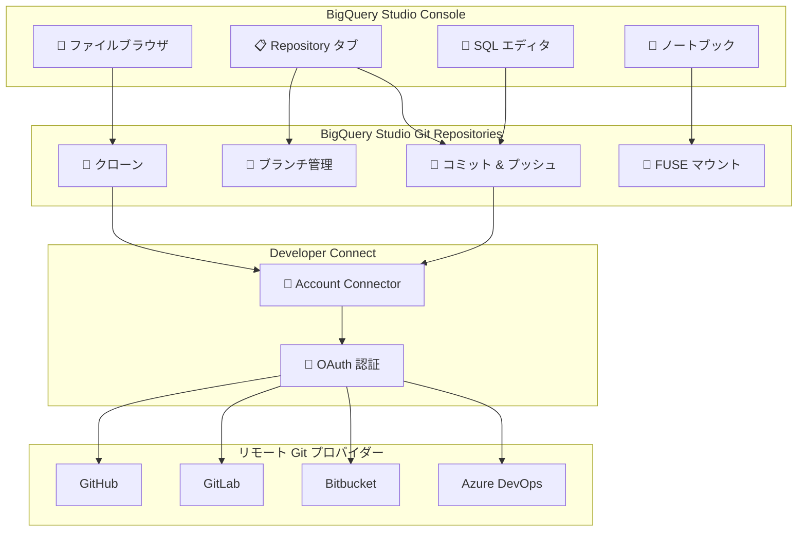

# BigQuery: Studio Git Repositories によるフォルダベースのバージョン管理

**リリース日**: 2026-05-18

**サービス**: BigQuery

**機能**: BigQuery Studio Git Repositories

**ステータス**: Preview

📊 [このアップデートのインフォグラフィックを見る](https://takech9203.github.io/google-cloud-news-summary/20260518-bigquery-studio-git-repositories.html)

## 概要

BigQuery Studio Git Repositories は、SQL スクリプトやノートブックをリモート Git リポジトリと直接統合して管理できる新機能である。従来の BigQuery リポジトリ (クラシック) と比較して、よりシンプルでフォルダベースのエクスペリエンスを提供し、BigQuery Studio のファイルブラウザ内から直接 Git 操作 (クローン、ブランチ管理、コミット、プッシュ) を実行できる。

この機能により、データアナリストやデータエンジニアは Google Cloud コンソールを離れることなく、コードアセットをローカルファイルやディレクトリのように操作しながら、リモート Git リポジトリとの接続を維持できる。Developer Connect API を活用し、GitHub、GitLab、Bitbucket、Azure DevOps Services などの主要な Git プロバイダーとの接続をサポートする。

BigQuery Studio Git Repositories は、従来のリポジトリ機能で必要だったワークスペースの個別管理を不要にし、複数のリポジトリを同時にクローンして作業できる点が大きな特徴である。

**アップデート前の課題**

- クラシックリポジトリでは各リポジトリ内にワークスペースを個別に作成・管理する必要があり、作業フローが煩雑だった
- SQL スクリプトやノートブックのバージョン管理には外部ツールとの切り替えが必要で、開発コンテキストの断絶が発生していた
- フォルダベースのファイル操作ができず、コードアセットの直感的な整理が困難だった
- ノートブックからリポジトリ内の他のファイルへ直接アクセスする手段が限られていた

**アップデート後の改善**

- BigQuery Studio のファイルブラウザ内で直接 Git リポジトリがフォルダとして表示され、標準的なファイル操作で管理可能になった
- ワークスペースの管理が不要になり、ブランチを直接切り替えて作業できるようになった
- ノートブックから Git リポジトリをマウントし、同一リポジトリ内の SQL スクリプトやファイルに直接アクセス・インポートできるようになった
- Developer Connect を活用した OAuth ベースの認証で、シームレスな Git プロバイダー接続が実現した

## アーキテクチャ図



BigQuery Studio のファイルブラウザとリモート Git プロバイダー間のデータフローを示す。Developer Connect が認証レイヤーとして機能し、各 Git プロバイダーとの安全な接続を仲介する。

## サービスアップデートの詳細

### 主要機能

1. **フォルダベースの Git 統合**
   - BigQuery Studio の左ペインにユーザールートフォルダ配下で Git リポジトリが直接表示される
   - 標準的なファイル/ディレクトリ操作 (作成、名前変更、移動、コピー、削除) をサポート
   - ドラッグ&ドロップのようなファイルブラウザ体験で Git リポジトリ内のアセットを管理

2. **ブランチ管理**
   - ローカルブランチとリモートトラッキングブランチの一覧表示
   - 既存ブランチを元に新しいブランチを作成 (Check out new branch)
   - ブランチ切り替え時にリポジトリの内容が自動更新
   - CURRENT / DEFAULT ラベルによる現在の状態の視覚的な確認

3. **コミットとプッシュ**
   - 変更ファイルの差分表示 (View diff) による行単位の比較
   - コミットメッセージ入力とコミット実行
   - リモートブランチへのプッシュによる同期
   - ファイルブラウザとの変更自動保存統合

4. **ノートブック FUSE マウント**
   - Git リポジトリをノートブックのランタイムにマウント
   - マウント後、リポジトリ内のファイルに対して標準的な Python import が可能
   - 作業ディレクトリが自動的にリポジトリ内の相対パスに更新
   - `FuseWidget()` による簡単なマウント操作

5. **Developer Connect 統合**
   - OAuth ベースのアカウントコネクタによるセキュアな認証
   - 既存コネクタの自動検出と再利用
   - HTTPS / SSH によるフォールバック接続もサポート

## 技術仕様

### サポートされる Git プロバイダー

| Git プロバイダー | 接続方法 |
|-----------------|---------|
| GitHub | SSH または HTTPS |
| GitLab | SSH または HTTPS |
| Bitbucket | SSH |
| Microsoft Azure DevOps Services | SSH |

### 必要な IAM ロール

| ロール | 用途 |
|-------|------|
| `roles/developerconnect.oauthUser` | BigQuery Studio Git Repositories の管理に必要 |

### 主要な制限事項

| 項目 | 制限値 |
|------|--------|
| ノートブックファイルサイズ上限 | 30 MB |
| マウント変更反映の最大遅延 | 60 秒 (CACHE_TTL_SECONDS で調整可能) |
| ファイルシステム操作クォータ | Dataform クォータに準拠 |
| リポジトリスコープ | ユーザールートフォルダ (プライベート用途) |

### 必要な権限

```
resourcemanager.projects.get
resourcemanager.projects.list
developerconnect.operations.list
developerconnect.operations.get
developerconnect.users.startOAuth
developerconnect.users.finishOAuth
developerconnect.users.fetchAccessToken
developerconnect.accountConnectors.get
developerconnect.accountConnectors.list
developerconnect.accountConnectors.fetchUserRepositories
```

## 設定方法

### 前提条件

1. Google Cloud プロジェクトで **Developer Connect API** を有効化
2. `roles/developerconnect.oauthUser` IAM ロールの付与
3. リモート Git リポジトリがパブリックインターネットからアクセス可能であること (ファイアウォール配下の場合は Dataform egress IP アドレス範囲を許可リストに追加)

### 手順

#### ステップ 1: Git リポジトリの作成

1. Google Cloud コンソールで BigQuery ページに移動
2. 左ペインの **Files** をクリックしてファイルブラウザを開く
3. ユーザールートノード横の **View actions > Create > Git repository** を選択
4. リモート Git リポジトリの URL を入力
5. Developer Connect アカウントコネクタを選択 (または新規作成)
6. **Connect** をクリック

#### ステップ 2: ブランチの作成と切り替え

1. 左ペインの **Repository** タブをクリック
2. **Branches** セクションを展開
3. 既存ブランチの **Open actions > Check out new branch** を選択
4. ソースブランチとブランチ名を指定して **Check out** をクリック

#### ステップ 3: ノートブックでの Git リポジトリマウント

```python
from google_dataform_fuse_widget import FuseWidget
FuseWidget()
```

マウント後、リポジトリ内のファイルに対して標準的なファイルアクセスと Python import が可能になる。

## メリット

### ビジネス面

- **開発生産性の向上**: Google Cloud コンソール内で完結するワークフローにより、ツール間の切り替えコストが削減される
- **コラボレーションの促進**: Git ベースのブランチ戦略により、チーム内でのコードレビューや並行開発が容易になる
- **ガバナンス強化**: バージョン履歴の追跡と変更監査が可能になり、コンプライアンス要件に対応できる

### 技術面

- **ワークスペース管理の簡素化**: 従来のクラシックリポジトリで必要だったワークスペースの作成・管理が不要
- **ノートブックとスクリプトの統合**: FUSE マウントにより、ノートブックから SQL スクリプトや Python モジュールを直接インポート可能
- **CI/CD パイプラインとの親和性**: リモート Git リポジトリとの同期により、既存の CI/CD ワークフロー (GitHub Actions、GitLab CI など) との統合が容易

## デメリット・制約事項

### 制限事項

- Preview 段階であり、限定的なサポートのみ提供される
- リポジトリはユーザールートフォルダに制限され、他のユーザーとの共有はサポートされていない (プライベート用途)
- Developer Connect アカウントコネクタの Git Proxy 使用は非サポート
- 大量のファイル、大きなファイルサイズ、多数のブランチ、深いコミット履歴を持つリポジトリはクローンがタイムアウトする可能性がある
- BigQuery リポジトリ内で作成したアセット (クエリ、ノートブック、パイプライン) は BigQuery リポジトリからの直接スケジュール実行ができない

### 考慮すべき点

- ファイルシステム操作は Dataform クォータを消費するため、頻繁な操作はクォータ上限に達する可能性がある
- マウント外での変更反映には最大 60 秒の遅延があり、CACHE_TTL_SECONDS の短縮はクォータ消費を増加させる
- ファイアウォール配下のリモートリポジトリへの接続には追加のネットワーク設定が必要
- 組織ポリシー `dataform.restrictGitRemotes` による Git リモートの制限がある場合、事前にリモートリポジトリを許可リストに追加する必要がある

## ユースケース

### ユースケース 1: データ分析チームの SQL スクリプト管理

**シナリオ**: データ分析チームが複数メンバーで BigQuery の SQL スクリプトを開発しており、変更履歴の管理とコードレビューのプロセスが必要。

**実装例**:
```
1. チーム共通の GitHub リポジトリを作成
2. 各メンバーが BigQuery Studio から Git リポジトリをクローン
3. 機能ブランチを作成して SQL スクリプトを開発
4. 変更をコミット・プッシュし、GitHub 上でプルリクエストを作成
5. レビュー後にメインブランチへマージ
```

**効果**: SQL スクリプトの変更履歴が Git で追跡され、コードレビューによる品質向上とチーム間の知識共有が実現する。

### ユースケース 2: ノートブックによるデータサイエンスワークフロー

**シナリオ**: データサイエンティストが BigQuery ノートブックでモデル開発を行い、前処理用の SQL スクリプトや共通ユーティリティを再利用したい。

**実装例**:
```python
# ノートブックで Git リポジトリをマウント
from google_dataform_fuse_widget import FuseWidget
FuseWidget()

# 同一リポジトリ内の共通モジュールをインポート
from utils.preprocessing import clean_data
from queries.feature_engineering import build_features
```

**効果**: ノートブックと SQL スクリプトが同一リポジトリで管理され、コードの再利用性が向上する。バージョン管理により実験の再現性も確保される。

### ユースケース 3: CI/CD パイプラインとの統合

**シナリオ**: データエンジニアリングチームが BigQuery の SQL パイプラインを GitOps で管理し、テスト自動化とデプロイを実現したい。

**効果**: BigQuery Studio で開発した SQL スクリプトがリモートリポジトリに同期されるため、GitHub Actions や GitLab CI でのテスト実行、本番環境へのデプロイ自動化が可能になる。

## 料金

BigQuery Studio Git Repositories の作成、更新、削除自体には課金されない。ただし、以下の点に注意が必要:

- ファイルシステム操作は **Dataform クォータ** を消費する
- ノートブックの実行には通常の **Colab Enterprise / BigQuery** の料金が適用される
- BigQuery のクエリ実行には通常の **BigQuery 料金** (オンデマンドまたは定額) が適用される

詳細は [BigQuery 料金ページ](https://cloud.google.com/bigquery/pricing) を参照。

## 利用可能リージョン

すべての [BigQuery Studio ロケーション](https://docs.cloud.google.com/bigquery/docs/locations#bqstudio-loc) で利用可能。

## 関連サービス・機能

- **Developer Connect**: Git プロバイダーとの OAuth 認証を管理するサービス。BigQuery Studio Git Repositories のリモート接続に使用される
- **Dataform**: BigQuery のデータパイプライン管理サービス。BigQuery リポジトリのバックエンドインフラとクォータを共有する
- **Colab Enterprise**: BigQuery ノートブックの実行環境。Git リポジトリの FUSE マウントにより統合される
- **Secret Manager**: HTTPS 接続でのパーソナルアクセストークン管理に使用される
- **Cloud IAM**: Developer Connect OAuth User ロールによるアクセス制御

## 参考リンク

- 📊 [インフォグラフィック](https://takech9203.github.io/google-cloud-news-summary/20260518-bigquery-studio-git-repositories.html)
- [公式リリースノート](https://cloud.google.com/release-notes#May_18_2026)
- [BigQuery Studio Git Repositories ドキュメント](https://docs.cloud.google.com/bigquery/docs/git-repositories)
- [リポジトリ概要](https://docs.cloud.google.com/bigquery/docs/repository-intro)
- [クラシックリポジトリの作成と管理](https://docs.cloud.google.com/bigquery/docs/repositories)
- [Dataform クォータ](https://docs.cloud.google.com/dataform/docs/quotas)
- [BigQuery 料金ページ](https://cloud.google.com/bigquery/pricing)
- [Developer Connect ドキュメント](https://docs.cloud.google.com/developer-connect/docs/configure-connectors)

## まとめ

BigQuery Studio Git Repositories は、データチームが Google Cloud コンソール内で SQL スクリプトとノートブックのバージョン管理を完結できる重要なアップデートである。従来のクラシックリポジトリと比較してワークスペース管理が不要になり、フォルダベースの直感的な操作と Git ブランチの直接操作が可能になった。Preview 段階ではあるが、データ分析チームの開発生産性向上と CI/CD パイプラインとの統合を目指す組織にとって、早期評価を開始する価値がある機能である。

---

**タグ**: #BigQuery #BigQueryStudio #Git #VersionControl #DataAnalytics #Preview #DeveloperConnect #Notebooks #SQL
