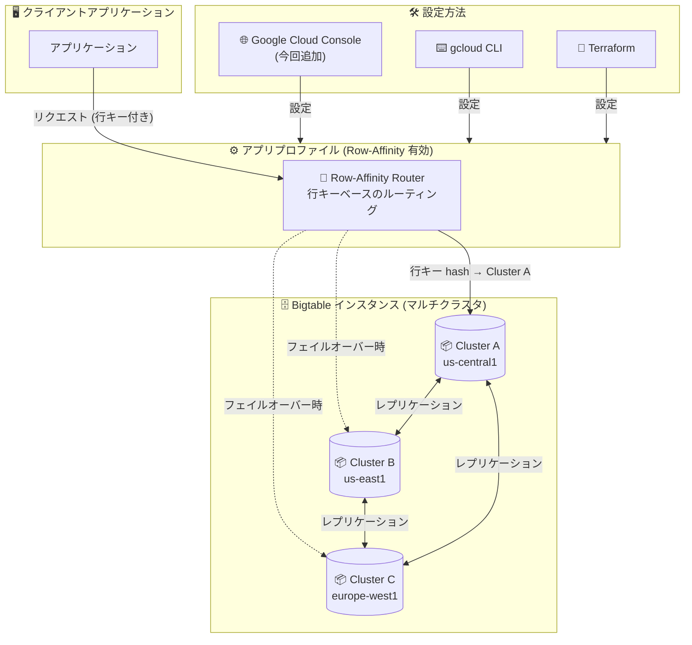

# Cloud Bigtable: Row-Affinity ルーティングの Google Cloud コンソール対応

**リリース日**: 2026-05-18

**サービス**: Cloud Bigtable

**機能**: Row-Affinity ルーティングの Google Cloud コンソールでの設定

**ステータス**: GA (一般提供)

📊 [このアップデートのインフォグラフィックを見る](https://takech9203.github.io/google-cloud-news-summary/20260518-bigtable-row-affinity-routing-console.html)

## 概要

Cloud Bigtable の標準アプリプロファイルにおいて、Row-Affinity ルーティング (スティッキールーティング) を Google Cloud コンソールから直接有効化できるようになりました。これまでは gcloud CLI、Java クライアントライブラリ、または Terraform でのみ設定可能だった機能が、GUI ベースのコンソールからも利用可能になったことで、操作性とアクセシビリティが大幅に向上します。

Row-Affinity ルーティングは、マルチクラスタルーティングを使用する環境において、単一行の読み取り・書き込みリクエストをリクエストの行キーに基づいて特定のクラスタに自動的にルーティングする機能です。これにより、Read-Your-Writes 一貫性の達成率を高めることができます。

このアップデートは、Bigtable のレプリケーション機能を活用しつつ一貫性を重視するユースケースにおいて、インフラチームだけでなくアプリケーション開発者も容易にルーティング設定を管理できるようにするものです。

**アップデート前の課題**

- Row-Affinity ルーティングの有効化は gcloud CLI、Java クライアントライブラリ、Terraform でのみ可能であり、コンソール UI からは設定できなかった
- CLI に不慣れなチームメンバーやアプリケーション開発者が、ルーティング設定を変更するためにインフラ担当者に依頼する必要があった
- コンソールのドキュメントに「Use the gcloud CLI instead.」と明記されており、GUI での操作が制限されていた

**アップデート後の改善**

- Google Cloud コンソールの UI から直接 Row-Affinity ルーティングを有効化できるようになった
- CLI の知識がなくても、視覚的なインターフェースでルーティングポリシーを設定可能
- アプリプロファイルの作成・更新フローにおいて、一貫した GUI 体験が提供される

## アーキテクチャ図



Row-Affinity ルーティングは、行キーに基づいて特定のクラスタにリクエストを固定的にルーティングすることで、マルチクラスタ環境でも高い Read-Your-Writes 一貫性を実現します。今回のアップデートにより、Google Cloud コンソールからもこの設定が可能になりました。

## サービスアップデートの詳細

### 主要機能

1. **コンソールでの Row-Affinity ルーティング有効化**
   - 標準アプリプロファイルの作成時に Row-Affinity ルーティングを選択可能
   - 既存のアプリプロファイルの更新時にも Row-Affinity ルーティングを有効化可能
   - マルチクラスタルーティングポリシーとの組み合わせで使用

2. **Row-Affinity ルーティングの動作**
   - 単一行の読み取り・書き込みリクエストを行キーに基づいて特定クラスタにルーティング
   - 行キーとクラスタのマッピングは Bigtable が自動的に決定 (手動設定不可)
   - フェイルオーバー時は次のクラスタに自動切り替え

3. **サポート対象オペレーション**
   - `ReadRows` (1 つのキーを指定)
   - `MutateRow`
   - `MutateRows` (1 つのキーを指定)
   - `BulkMutateRow` (1 つのキーを指定)

## 技術仕様

### ルーティングポリシーの比較

| ルーティングポリシー | 一貫性モデル | フェイルオーバー | 単一行トランザクション | ユースケース |
|---------------------|-------------|----------------|---------------------|-------------|
| Single-Cluster | Read-Your-Writes / Strong | 手動 | 対応 | 一貫性重視 |
| Multi-Cluster (Any) | Eventual | 自動 | 非対応 | 高可用性重視 |
| Multi-Cluster + Row-Affinity | 高い Read-Your-Writes 達成率 | 自動 | 非対応 | 一貫性 + 高可用性 |
| Cluster Group | Eventual | 自動 (グループ内) | 非対応 | ワークロード分離 |

### Row-Affinity ルーティングの制限事項

| 項目 | 詳細 |
|------|------|
| 対象リクエスト | 単一行の読み取り・書き込みのみ |
| SQL クエリ | 非対応 (ExecuteQuery では Row-Affinity は適用されない) |
| 行範囲指定 | ReadRows で行範囲を指定する方法は非対応 |
| 複数行更新 | BulkMutateRow で同一行に複数更新を指定する方法は非対応 |
| 一貫性保証 | 完全な保証ではない (フェイルオーバー時に一貫性が崩れる可能性あり) |

### 一貫性が崩れるケース

- **クラスタの追加・削除**: 行キーの割り当てが変更される可能性がある
- **フェイルオーバー発生時**: 障害クラスタへのリクエストが別クラスタに転送される
- **ネットワーク障害**: クラスタ間の通信に問題が発生した場合

## 設定方法

### 前提条件

1. マルチクラスタ構成の Bigtable インスタンスが作成済みであること
2. 適切な IAM 権限 (`bigtable.appProfiles.create` または `bigtable.appProfiles.update`) を持つこと

### 手順

#### ステップ 1: Google Cloud コンソールでアプリプロファイルを作成

1. Google Cloud コンソールで Bigtable インスタンスの一覧を開く
2. 対象のインスタンスをクリック
3. 左ペインで「Application profiles」をクリック
4. 「Create application profile」をクリック
5. 「Standard」を選択して「Next」をクリック
6. アプリプロファイル ID と説明を入力
7. 「Cluster routing」で「Multi-cluster」を選択
8. Row-Affinity ルーティングを有効化
9. 「Create」をクリック

#### ステップ 2: gcloud CLI での同等操作 (参考)

```bash
gcloud bigtable app-profiles create my-row-affinity-profile \
  --instance=my-instance \
  --route-any \
  --row-affinity \
  --description="Row-affinity routing enabled profile"
```

#### ステップ 3: クラスタグループとの併用 (推奨)

```bash
# クラスタグループを指定して Row-Affinity を有効化
# クラスタの追加・削除による行キー割り当て変更を防止
gcloud bigtable app-profiles create my-row-affinity-profile \
  --instance=my-instance \
  --route-any \
  --restrict-to=cluster-1,cluster-2 \
  --row-affinity \
  --description="Row-affinity with cluster group"
```

## メリット

### ビジネス面

- **運用の民主化**: CLI に不慣れなチームメンバーでもルーティング設定を管理でき、インフラチームへの依頼を削減
- **設定ミスの低減**: GUI の視覚的なインターフェースにより、設定内容を確認しながら操作可能
- **迅速なプロトタイピング**: 新しいアプリプロファイルの作成・テストを素早く実行可能

### 技術面

- **高い Read-Your-Writes 一貫性**: マルチクラスタ構成でも自動フェイルオーバーを維持しつつ一貫性を向上
- **自動ルーティング**: 行キーに基づく自動的なクラスタ選択により、アプリケーション側のロジック不要
- **高可用性との両立**: Single-Cluster ルーティングと異なり、クラスタ障害時の自動フェイルオーバーを維持

## デメリット・制約事項

### 制限事項

- Row-Affinity は単一行オペレーションのみに適用され、複数行スキャンや SQL クエリには効果がない
- Read-Your-Writes 一貫性は「高い達成率」であり、完全な保証ではない
- 行キーとクラスタのマッピングを手動で制御することはできない

### 考慮すべき点

- クラスタの追加・削除時に行キーの再割り当てが発生するため、`--restrict-to` フラグによるクラスタグループの使用を推奨
- マルチ行トランザクション (ReadModifyWrite、CheckAndMutate) は Row-Affinity ルーティングでは使用不可
- フェイルオーバー発生後は一時的に一貫性が低下する可能性がある

## ユースケース

### ユースケース 1: リアルタイムユーザーセッション管理

**シナリオ**: EC サイトのユーザーセッションデータを Bigtable に格納し、ユーザーの操作 (カートへの追加、閲覧履歴) を即座に反映する必要がある。マルチリージョンで高可用性も求められる。

**実装例**:
```bash
# ユーザー ID を行キーとしたテーブルに対して
# Row-Affinity ルーティングを有効化したアプリプロファイルを使用
gcloud bigtable app-profiles create session-profile \
  --instance=ecommerce-instance \
  --route-any \
  --row-affinity \
  --restrict-to=cluster-asia,cluster-us \
  --description="User session data with read-your-writes"
```

**効果**: 同一ユーザーのリクエストが同じクラスタにルーティングされるため、カートへの追加直後にカート内容を読み取る際の一貫性が高まる。クラスタ障害時は自動フェイルオーバーにより可用性も維持。

### ユースケース 2: IoT デバイスのテレメトリデータ収集

**シナリオ**: 大量の IoT デバイスからのセンサーデータを Bigtable に書き込み、デバイスごとの最新状態を即座に読み取りたい。デバイス ID を行キーとして使用。

**効果**: デバイス ID ベースでルーティングが固定されるため、書き込み直後のデータ読み取りで最新値が返される確率が高くなる。グローバルに分散したデバイスに対して、マルチリージョンの高可用性を維持しながら一貫性のあるデータアクセスを提供。

## 料金

Row-Affinity ルーティング自体に追加料金は発生しません。Bigtable の標準的なノード・ストレージ・ネットワーク料金が適用されます。

### 料金例 (Enterprise エディション、us-central1)

| リソース | 料金 |
|---------|------|
| ノード | $0.65/ノード/時間 |
| SSD ストレージ | $0.17/GB/月 |
| HDD ストレージ | $0.026/GB/月 |
| ネットワーク Egress | 標準のネットワーク料金 |

※ 1 年間の CUD (確約利用割引) で 20%、3 年間で 40% の割引が適用可能。

## 利用可能リージョン

Row-Affinity ルーティングは、Bigtable が利用可能なすべてのリージョンで使用できます。マルチクラスタ構成のインスタンスが前提となるため、2 つ以上のクラスタが必要です。

## 関連サービス・機能

- **Cloud Bigtable レプリケーション**: Row-Affinity はマルチクラスタレプリケーション環境で動作する機能
- **Cloud Monitoring**: アプリプロファイルごとのリクエスト分散やフェイルオーバーイベントの監視に活用
- **Cloud Bigtable Cluster Group**: Row-Affinity と組み合わせることで、クラスタ変更時の行キー再割り当てを防止
- **Cloud Bigtable Failover**: Row-Affinity ルーティング時のフェイルオーバー動作と密接に関連

## 参考リンク

- 📊 [インフォグラフィック](https://takech9203.github.io/google-cloud-news-summary/20260518-bigtable-row-affinity-routing-console.html)
- [公式リリースノート](https://cloud.google.com/release-notes#May_18_2026)
- [アプリプロファイルの設定ドキュメント](https://cloud.google.com/bigtable/docs/configuring-app-profiles)
- [ルーティングオプション](https://cloud.google.com/bigtable/docs/routing)
- [レプリケーション概要](https://cloud.google.com/bigtable/docs/replication-overview)
- [料金ページ](https://cloud.google.com/bigtable/pricing)

## まとめ

Cloud Bigtable の Row-Affinity ルーティングが Google Cloud コンソールから設定可能になったことで、マルチクラスタ環境における Read-Your-Writes 一貫性の設定が大幅に容易になりました。CLI に依存せず GUI で完結できるため、チーム全体でのルーティング管理の敷居が下がります。マルチクラスタ構成で高可用性と一貫性の両立を目指すワークロードでは、クラスタグループ (`--restrict-to`) との併用を検討し、Row-Affinity ルーティングの導入を推奨します。

---

**タグ**: #CloudBigtable #RowAffinity #ルーティング #マルチクラスタ #ReadYourWrites #一貫性 #アプリプロファイル #GoogleCloudConsole
