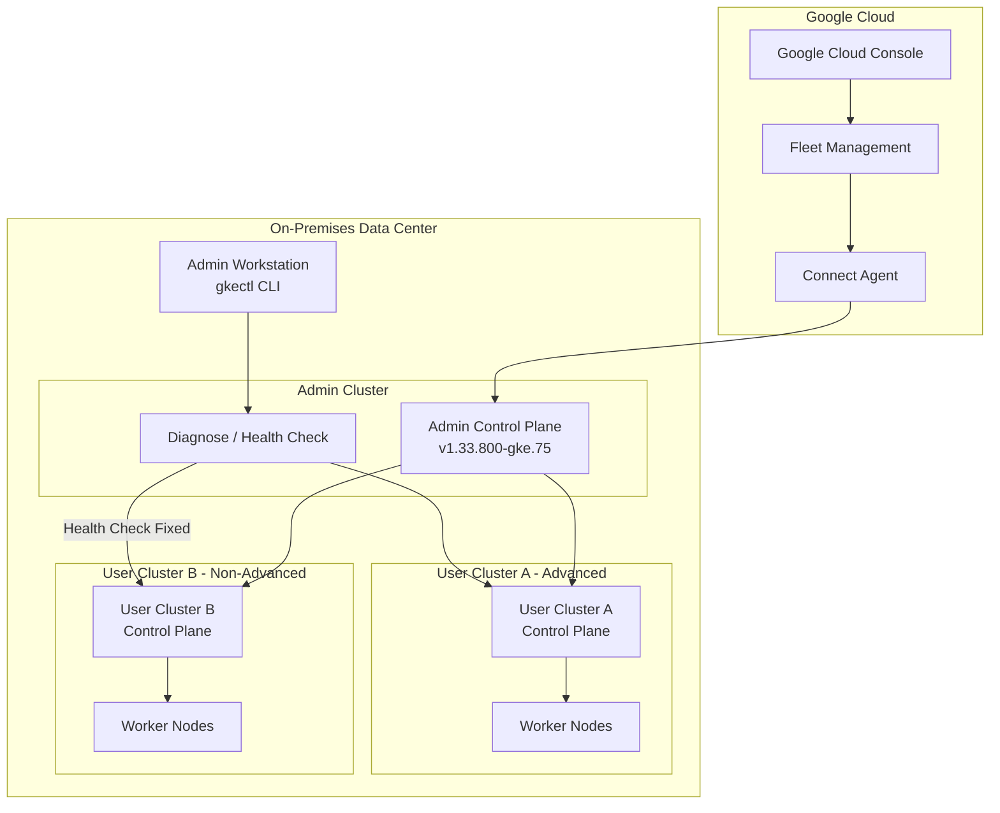

# Google Distributed Cloud (software only): バージョン 1.33.800-gke.75 リリース

**リリース日**: 2026-05-18

**サービス**: Google Distributed Cloud (software only) for VMware / bare metal

**機能**: バージョン 1.33.800-gke.75 リリース

**ステータス**: ダウンロード可能

📊 [このアップデートのインフォグラフィックを見る](https://takech9203.github.io/google-cloud-news-summary/20260518-google-distributed-cloud-1-33-800.html)

## 概要

Google Distributed Cloud (software only) for VMware 1.33.800-gke.75 および for bare metal 1.33.800-gke.75 がダウンロード可能になりました。本リリースは Kubernetes v1.33.11-gke.100 上で動作し、セキュリティ脆弱性の修正と VMware 環境における重要なバグ修正が含まれています。

Google Distributed Cloud (software only) は、Google Cloud のインフラストラクチャとサービスをオンプレミスのデータセンターに拡張するソフトウェア製品です。VMware vSphere 環境またはベアメタル上で動作し、GKE (Google Kubernetes Engine) をベースとした Kubernetes クラスタの作成・管理・アップグレードが可能です。管理者は Google Cloud の機能を活用しながら、オンプレミスでコンテナ化されたアプリケーションを大規模にデプロイ・運用できます。

今回のパッチリリースでは、特に VMware 環境において Advanced Admin Cluster が管理する非 Advanced ユーザークラスタでのヘルスチェックおよび診断情報収集の問題と、バンドルされた Ingress が無効な場合の preflight チェックエラーが修正されています。

**アップデート前の課題**

- Advanced Admin Cluster が管理する非 Advanced ユーザークラスタに対して、管理者がクラスタヘルスチェック (`gkectl diagnose cluster`) や診断情報の収集 (`gkectl diagnose snapshot`) を実行できなかった
- バンドル Ingress を無効にし `loadBalancer.vips.ingressVIP` を空白にした構成で、`gkectl check-config` が preflight チェック中に失敗していた
- 既知のセキュリティ脆弱性が存在していた

**アップデート後の改善**

- Advanced Admin Cluster が管理する非 Advanced ユーザークラスタでもヘルスチェックと診断情報収集が正常に動作するようになった
- バンドル Ingress を無効にした構成での preflight チェックが正しく通過するようになった
- Vulnerability fixes に記載されたセキュリティ脆弱性が修正された

## アーキテクチャ図



Google Distributed Cloud のデプロイメントモデルを示しています。Admin Cluster がユーザークラスタのライフサイクルを管理し、今回の修正により Advanced Admin Cluster から非 Advanced ユーザークラスタへのヘルスチェック・診断が正常に機能するようになりました。

## サービスアップデートの詳細

### 主要機能

1. **セキュリティ脆弱性の修正**
   - Vulnerability fixes に記載された複数の脆弱性が修正された
   - VMware 版・bare metal 版の両方に適用

2. **クラスタヘルスチェック・診断情報収集の修正 (VMware)**
   - Advanced Admin Cluster が管理する非 Advanced ユーザークラスタに対して、`gkectl diagnose cluster` および `gkectl diagnose snapshot` が正常に動作するようになった
   - バージョン 1.31 では Advanced クラスタでの `gkectl diagnose` コマンドはサポートされていなかったが、1.32 以降でサポートが追加されている
   - 今回の修正で、混在環境 (Advanced Admin + 非 Advanced User) での運用がさらに安定化

3. **preflight チェックの修正 (VMware)**
   - バンドル Ingress が無効で `loadBalancer.vips.ingressVIP` が空白の構成において、`gkectl check-config` が正常に通過するようになった
   - Ingress を別途管理する環境 (外部 Ingress Controller 使用時など) での構成検証が適切に動作するようになった

## 技術仕様

### バージョン情報

| 項目 | 詳細 |
|------|------|
| GDC バージョン | 1.33.800-gke.75 |
| Kubernetes バージョン | v1.33.11-gke.100 |
| 対応プラットフォーム | VMware vSphere / bare metal |
| リリースタイプ | パッチリリース (セキュリティ修正 + バグ修正) |

### gkectl 診断コマンド

```bash
# Admin クラスタのヘルスチェック
gkectl diagnose cluster --kubeconfig=ADMIN_CLUSTER_KUBECONFIG

# User クラスタのヘルスチェック (今回修正された操作)
gkectl diagnose cluster --kubeconfig=ADMIN_CLUSTER_KUBECONFIG \
  --cluster-name=USER_CLUSTER_NAME

# 診断スナップショットの取得
gkectl diagnose snapshot --kubeconfig=ADMIN_CLUSTER_KUBECONFIG \
  --cluster-name=USER_CLUSTER_NAME
```

### preflight チェック

```bash
# 構成ファイルの事前検証 (今回修正された操作)
gkectl check-config --config USER_CLUSTER_CONFIG
```

## 設定方法

### 前提条件

1. 既存の Google Distributed Cloud 1.33.x 環境が稼働していること
2. Admin Workstation に gkectl CLI がインストールされていること
3. 適切な権限を持つ kubeconfig ファイルが利用可能であること

### 手順

#### ステップ 1: リリースバンドルのダウンロード

```bash
# VMware 版のダウンロード
gsutil cp gs://gke-on-prem-release/gke-onprem-bundle-1.33.800-gke.75-full.tgz /path/to/bundle/

# bare metal 版のダウンロード
bmctl version --bundle-version 1.33.800-gke.75
```

#### ステップ 2: アップグレードの実行 (VMware)

```bash
# Admin クラスタのアップグレード
gkectl upgrade admin --kubeconfig ADMIN_CLUSTER_KUBECONFIG \
  --config ADMIN_CLUSTER_CONFIG

# User クラスタのアップグレード
gkectl upgrade cluster --kubeconfig ADMIN_CLUSTER_KUBECONFIG \
  --config USER_CLUSTER_CONFIG
```

#### ステップ 3: アップグレードの実行 (bare metal)

```bash
# クラスタのアップグレード
bmctl upgrade cluster --kubeconfig ADMIN_CLUSTER_KUBECONFIG \
  --cluster-name CLUSTER_NAME
```

#### ステップ 4: アップグレードの検証

```bash
# クラスタの状態確認
kubectl get nodes --kubeconfig ADMIN_CLUSTER_KUBECONFIG

# ヘルスチェックの実行
gkectl diagnose cluster --kubeconfig ADMIN_CLUSTER_KUBECONFIG
```

## メリット

### ビジネス面

- **運用効率の向上**: ヘルスチェック・診断コマンドが正常に動作することで、クラスタの状態監視とトラブルシューティングが迅速化
- **ダウンタイムリスクの低減**: セキュリティ脆弱性の修正により、オンプレミス環境のセキュリティポスチャが強化される
- **構成の柔軟性**: バンドル Ingress を無効にした構成が適切にサポートされることで、独自の Ingress 戦略を持つ組織にも対応

### 技術面

- **混在環境での安定性**: Advanced Admin Cluster と非 Advanced User Cluster の混在環境における管理操作の信頼性が向上
- **CI/CD パイプラインの安定化**: `gkectl check-config` が正しく動作するため、Infrastructure as Code による構成検証が安定
- **Kubernetes v1.33.11 対応**: 最新の Kubernetes パッチバージョンによるセキュリティと安定性の恩恵

## デメリット・制約事項

### 制限事項

- リリース後、GKE On-Prem API クライアント (Google Cloud Console、gcloud CLI、Terraform) で利用可能になるまで約 7〜14 日かかる
- サードパーティストレージベンダーを使用している場合、GDC Ready ストレージパートナードキュメントで本リリースの認定状況を確認する必要がある
- バージョン 1.33 以降、新規作成されるクラスタはすべて Advanced Cluster として作成される

### 考慮すべき点

- アップグレード前に既存のワークロードのバックアップを推奨
- クラスタヘルスチェックを実行し、現在のクラスタが正常であることを確認してからアップグレードを開始すること
- 本リリースは 1.33 系列のパッチリリースであるため、メジャーバージョンのアップグレードは別途計画が必要

## ユースケース

### ユースケース 1: Advanced/非 Advanced 混在環境での運用監視

**シナリオ**: 大規模なオンプレミス環境で、段階的に Advanced Cluster への移行を進めている組織。Advanced Admin Cluster で複数の非 Advanced User Cluster を管理しており、定期的なヘルスチェックを自動化している。

**実装例**:
```bash
# 全ユーザークラスタのヘルスチェックスクリプト
for cluster in $(kubectl get clusters --kubeconfig=admin-kubeconfig -o jsonpath='{.items[*].metadata.name}'); do
  echo "Checking cluster: $cluster"
  gkectl diagnose cluster --kubeconfig=admin-kubeconfig --cluster-name=$cluster
done
```

**効果**: 本バージョンへのアップグレードにより、混在環境でもすべてのクラスタに対して一貫した監視が可能になる。

### ユースケース 2: カスタム Ingress 構成の検証自動化

**シナリオ**: Istio や NGINX Ingress Controller を使用するため、バンドル Ingress を無効にした構成を採用している組織。CI/CD パイプラインで構成変更時に `gkectl check-config` による事前検証を実施している。

**効果**: preflight チェックが正常に動作するため、構成変更のデプロイ前検証が自動化され、人的ミスによるデプロイ失敗を防止できる。

## 料金

Google Distributed Cloud (software only) は vCPU 単位で課金されます。課金を有効にするには、Google Cloud プロジェクトで Anthos API を有効化する必要があります。

詳細な料金情報については、[GKE pricing](https://cloud.google.com/kubernetes-engine/pricing) を参照してください。

## 利用可能リージョン

Google Distributed Cloud (software only) はオンプレミスソフトウェアであり、リージョンの制約なく任意のデータセンターにデプロイ可能です。ただし、GKE On-Prem API の管理リージョン (Fleet 登録先) として `us-west1` やその他のサポートされるリージョンを指定する必要があります。

## 関連サービス・機能

- **Google Kubernetes Engine (GKE)**: Google Distributed Cloud のベースとなるマネージド Kubernetes サービス
- **Fleet Management**: 複数クラスタの統合管理とガバナンスを提供
- **Connect Agent**: オンプレミスクラスタと Google Cloud 間の接続を管理
- **Cloud Monitoring / Cloud Logging**: クラスタとワークロードのオブザーバビリティ
- **Config Management**: GitOps ベースのポリシーとコンフィグの管理
- **Binary Authorization**: コンテナイメージのデプロイポリシーの適用

## 参考リンク

- 📊 [インフォグラフィック](https://takech9203.github.io/google-cloud-news-summary/20260518-google-distributed-cloud-1-33-800.html)
- [公式リリースノート](https://docs.cloud.google.com/release-notes#May_18_2026)
- [Google Distributed Cloud for VMware ドキュメント](https://docs.cloud.google.com/kubernetes-engine/distributed-cloud/vmware/docs/overview)
- [Google Distributed Cloud for bare metal ドキュメント](https://docs.cloud.google.com/kubernetes-engine/distributed-cloud/bare-metal/docs/concepts/about-bare-metal)
- [アップグレード手順 (VMware)](https://cloud.google.com/anthos/clusters/docs/on-prem/latest/how-to/upgrading)
- [アップグレード手順 (bare metal)](https://docs.cloud.google.com/kubernetes-engine/distributed-cloud/bare-metal/docs/how-to/upgrade)
- [クラスタ診断 (gkectl diagnose)](https://docs.cloud.google.com/kubernetes-engine/distributed-cloud/vmware/docs/troubleshooting/diagnose)
- [GKE pricing](https://cloud.google.com/kubernetes-engine/pricing)

## まとめ

Google Distributed Cloud (software only) 1.33.800-gke.75 は、セキュリティ脆弱性の修正と VMware 環境における重要な運用上のバグ修正を含むパッチリリースです。特に Advanced Admin Cluster と非 Advanced User Cluster の混在環境を運用している組織や、カスタム Ingress 構成を採用している組織にとって、運用の安定性と信頼性が向上する重要なアップデートです。セキュリティパッチが含まれているため、早期のアップグレードを推奨します。

---

**タグ**: #google-distributed-cloud #vmware #bare-metal #kubernetes #on-premises #gkectl #security-fix #patch-release
