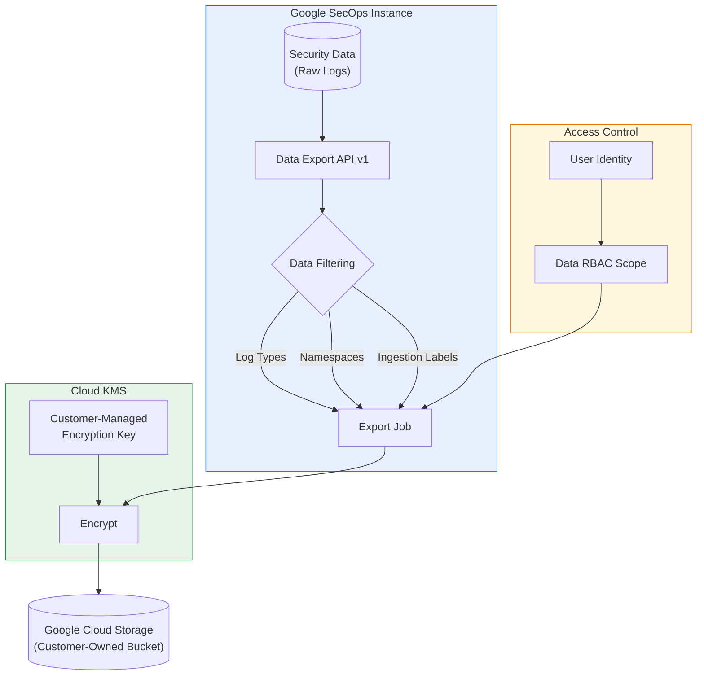

# Google SecOps: Enhanced Data Export API GA

**リリース日**: 2026-05-18

**サービス**: Google SecOps (Google Security Operations)

**機能**: Enhanced Data Export API の一般提供 (GA) およびセキュリティ改善

**ステータス**: Generally Available (GA)

📊 [このアップデートのインフォグラフィックを見る](https://takech9203.github.io/google-cloud-news-summary/20260518-google-secops-enhanced-data-export-api.html)

## 概要

Google SecOps の Enhanced Data Export API が一般提供 (GA) となり、セキュリティデータの一括エクスポートに関する大幅な機能強化とセキュリティ改善が導入されました。この API は、Google Security Operations から顧客が管理する Google Cloud Storage バケットへのセキュリティデータの一括エクスポートを実現し、従来のレガシー Data Export API と比較してより安全でスケーラブルなデータアーカイブ体験を提供します。

今回の GA リリースでは、ゼロトラストセキュリティモデルに基づく顧客管理暗号鍵 (CMEK) の完全統合、データ RBAC スコープの継承によるアイデンティティ認識型エクスポート、そしてネームスペースやインジェストラベルを使用した高度なデータフィルタリングが新たに追加されました。これにより、SOX、HIPAA、GDPR などの厳格なコンプライアンス要件に対応した長期データ保持と、履歴フォレンジック分析のための安全なデータエクスポートが可能になります。

なお、レガシー Data Export API は 2026 年 6 月 18 日にサンセット (廃止) が予定されており、既存ユーザーは新しい v1 エンドポイントへの移行が必要です。`fetchavailablelogtypes`、`updateDataExport` エンドポイント、および `logType` フィールドも同日に廃止されます。

**アップデート前の課題**

- レガシー API (v1alpha) ではデータフィルタリングがログタイプのみに限定されており、ネームスペースやインジェストラベルによるスコープ設定ができなかった
- エクスポートデータの暗号化が Google 管理の鍵に依存しており、顧客側での暗号鍵管理ができなかった
- データ RBAC スコープがエクスポートジョブに適用されず、権限を持たないデータの抽出リスクがあった
- レガシー API はスケーラビリティに限界があり、最大 10 TB/ジョブの制限があった
- `logType` フィールドの非標準的な命名規則が API の一貫性を損なっていた

**アップデート後の改善**

- ネームスペースとインジェストラベルを使用した高度なデータフィルタリングにより、エクスポートスコープをきめ細かく制御可能
- Cloud KMS との完全統合により、顧客管理暗号鍵 (CMEK) ですべてのエクスポートデータを暗号化
- データ RBAC スコープがエクスポートジョブに継承され、未認可のデータ抽出を防止
- 最大 100 TB/ジョブまでスケールアップし、エンタープライズ規模のデータエクスポートに対応
- 安定版 v1 エンドポイントへの移行により、API の信頼性と長期サポートが保証

## アーキテクチャ図



Google SecOps のセキュリティデータが Data Export API v1 を通じて、データ RBAC スコープの検証と Cloud KMS による顧客管理鍵での暗号化を経て、顧客所有の GCS バケットにエクスポートされるフローを示しています。

## サービスアップデートの詳細

### 主要機能

1. **高度なデータフィルタリング**
   - ログタイプに加え、ネームスペースとインジェストラベルでエクスポートジョブのスコープを設定可能
   - `includeLogTypes` フィールドによる複数ログタイプの指定 (旧 `logType` フィールドを置き換え)
   - 時間範囲 (`startTime`/`endTime`) との組み合わせによる精密なデータ抽出

2. **ゼロトラストセキュリティ (顧客管理暗号鍵)**
   - Cloud KMS との完全統合により、エクスポートされたすべてのデータを顧客管理鍵で暗号化
   - 暗号鍵のライフサイクル管理、ローテーション、アクセスポリシーを顧客が完全制御
   - Enterprise Plus パッケージで利用可能な CMEK 機能との連携

3. **アイデンティティ認識型エクスポート (データ RBAC)**
   - エクスポートジョブがジョブ作成ユーザーのデータ RBAC スコープを継承
   - スコープ外のデータへの未認可アクセスを API レベルで防止
   - グローバルアクセス権限を持つユーザーのみがスコープ制限なしでエクスポート可能

4. **レガシー API の廃止 (サンセット: 2026年6月18日)**
   - レガシー Data Export API の廃止
   - `fetchavailablelogtypes` エンドポイントの廃止
   - `updateDataExport` エンドポイントの廃止
   - `logType` フィールドの `includeLogTypes` への置き換え

## 技術仕様

### API エンドポイント

| 項目 | 詳細 |
|------|------|
| ベース URL | `https://chronicle.{region}.rep.googleapis.com/v1/{parent}/dataExports` |
| 認証方式 | OAuth 2.0 / Application Default Credentials |
| API バージョン | v1 (v1alpha から移行) |
| 最大エクスポートサイズ | 100 TB / ジョブ |
| 同時実行ジョブ数 | 最大 3 ジョブ / テナント |
| ジョブ完了時間 | 最大 18 時間 |
| エクスポート形式 | 非圧縮テキスト (CSV) |
| 対象データ | Raw Logs のみ (UDM、イベント、検出は対象外) |

### 主要 API メソッド

| メソッド | HTTP メソッド | 説明 |
|----------|-------------|------|
| FetchServiceAccountForDataExport | GET | SecOps インスタンスのサービスアカウントを取得 |
| CreateDataExport | POST | 新しいエクスポートジョブを作成 |
| GetDataExport | GET | 特定ジョブのステータス・詳細を取得 |
| ListDataExport | GET | エクスポートジョブの一覧取得 (フィルタ対応) |
| UpdateDataExport | PATCH | IN_QUEUE ステータスのジョブを更新 |
| CancelDataExport | POST | IN_QUEUE ステータスのジョブをキャンセル |

### リクエスト例 (CreateDataExport)

```json
{
  "startTime": "2026-05-01T00:00:00Z",
  "endTime": "2026-05-02T00:00:00Z",
  "gcsBucket": "projects/my-project/buckets/secops-export-bucket",
  "includeLogTypes": [
    "projects/my-project/locations/us/instances/my-instance/logTypes/GCP_DNS",
    "projects/my-project/locations/us/instances/my-instance/logTypes/GCP_FIREWALL"
  ]
}
```

### ジョブステータス

| ステータス | 説明 |
|-----------|------|
| IN_QUEUE | ジョブが受理され、リソース待ち |
| PROCESSING | ジョブが実行中 |
| FINISHED_SUCCESS | ジョブが正常完了 |
| FINISHED_FAILURE | リトライ後も失敗 |
| CANCELLED | ユーザーによりキャンセル |

## 設定方法

### 前提条件

1. Google SecOps インスタンスが Enhanced Data Export API を有効にしていること
2. IAM ロール `Chronicle API Admin` (フルアクセス) または `Chronicle API Viewer` (読み取り専用) が付与されていること
3. エクスポート先 GCS バケットが SecOps テナントと同一リージョンに作成されていること
4. GCS バケットが非公開 (パブリックアクセス禁止) に設定されていること
5. (CMEK 使用時) Cloud KMS に暗号鍵が作成され、適切な権限が設定されていること

### 手順

#### ステップ 1: サービスアカウントの取得

```bash
curl -X GET \
  -H "Authorization: Bearer $(gcloud auth print-access-token)" \
  "https://chronicle.us.rep.googleapis.com/v1/projects/MY_PROJECT/locations/us/instances/MY_INSTANCE/dataExports:fetchServiceAccountForDataExport"
```

レスポンスからサービスアカウントのメールアドレスを取得します。

#### ステップ 2: GCS バケットへの権限付与

```bash
# サービスアカウントに Storage Object Admin ロールを付与
gcloud storage buckets add-iam-policy-binding gs://my-export-bucket \
  --member="serviceAccount:service-1234@gcp-sa-chronicle.iam.gserviceaccount.com" \
  --role="roles/storage.objectAdmin"

# サービスアカウントに Legacy Bucket Reader ロールを付与
gcloud storage buckets add-iam-policy-binding gs://my-export-bucket \
  --member="serviceAccount:service-1234@gcp-sa-chronicle.iam.gserviceaccount.com" \
  --role="roles/storage.legacyBucketReader"
```

#### ステップ 3: v1 エンドポイントへの移行

```bash
# 重要: API 設定を v1alpha から v1 に更新
# 旧エンドポイント (廃止予定):
# https://chronicle.{region}.rep.googleapis.com/v1alpha/{parent}/dataExports

# 新エンドポイント (GA):
# https://chronicle.{region}.rep.googleapis.com/v1/{parent}/dataExports
```

既存のクライアントコードで `v1alpha` を `v1` に置き換え、`logType` フィールドを `includeLogTypes` に変更してください。

#### ステップ 4: エクスポートジョブの作成

```bash
curl -X POST \
  -H "Authorization: Bearer $(gcloud auth print-access-token)" \
  -H "Content-Type: application/json" \
  -d '{
    "startTime": "2026-05-01T00:00:00Z",
    "endTime": "2026-05-02T00:00:00Z",
    "gcsBucket": "projects/my-project/buckets/secops-export-bucket",
    "includeLogTypes": [
      "projects/my-project/locations/us/instances/my-instance/logTypes/GCP_DNS"
    ]
  }' \
  "https://chronicle.us.rep.googleapis.com/v1/projects/my-project/locations/us/instances/my-instance/dataExports"
```

## メリット

### ビジネス面

- **コンプライアンス対応の強化**: SOX、HIPAA、GDPR などの規制要件に対応した安全なデータアーカイブが可能
- **データ主権の確保**: 顧客管理暗号鍵により、エクスポートデータの暗号化を完全に制御
- **監査対応の簡素化**: すべてのエクスポートジョブが不変の監査証跡に記録され、コンプライアンス監査に即座に対応可能
- **運用コストの削減**: 自動リトライ機構とジョブ管理により、手動での再実行やエラー対応の工数を削減

### 技術面

- **スケーラビリティの大幅向上**: レガシー API の 10 TB 制限から 100 TB/ジョブに拡大
- **きめ細かいアクセス制御**: データ RBAC スコープの継承により、最小権限の原則を API レベルで実装
- **高度なフィルタリング**: ネームスペースとインジェストラベルによる精密なエクスポートスコープ設定
- **信頼性**: 自動リトライ (指数バックオフ) による一時的エラーからの自動回復
- **構造化された出力**: 日付・時間でパーティションされたディレクトリ構造により、後続分析が容易

## デメリット・制約事項

### 制限事項

- エクスポート対象は Raw Logs のみ (UDM ログ、UDM イベント、検出データはエクスポート不可)
- 同時実行ジョブ数は最大 3 ジョブ / テナントに制限
- GCS バケットは SecOps テナントと同一リージョンに配置する必要がある
- データは非圧縮テキストとしてエクスポートされるため、大量データではストレージコストに注意
- ビルトインのスケジューラ機能がないため、定期エクスポートには独自の自動化が必要
- CMEK は Enterprise Plus パッケージでのみ利用可能
- 既存のレガシー API ジョブには新しい API からアクセスできない

### 考慮すべき点

- **移行期限**: レガシー API のサンセットは 2026 年 6 月 18 日。約 1 か月の移行猶予があるが、早期移行を推奨
- **破壊的変更**: `logType` から `includeLogTypes` へのフィールド名変更はクライアントコードの修正が必要
- **ジョブ完了時間**: 大容量ジョブは最大 18 時間かかる場合があり、リアルタイム性が求められるワークフローには不向き
- **Standard Storage クラスのみ**: エクスポート先バケットは Standard ストレージクラスのみ対応

## ユースケース

### ユースケース 1: コンプライアンス対応の長期データ保持

**シナリオ**: 金融機関が SOX 準拠のため、セキュリティログを 7 年間保持する必要がある。Google SecOps のデフォルト保持期間を超えるデータを、顧客管理鍵で暗号化した GCS バケットに定期的にエクスポートする。

**実装例**:
```bash
# 日次バッチエクスポート (Cloud Scheduler + Cloud Functions で自動化)
curl -X POST \
  -H "Authorization: Bearer $(gcloud auth print-access-token)" \
  -H "Content-Type: application/json" \
  -d '{
    "startTime": "2026-05-17T00:00:00Z",
    "endTime": "2026-05-18T00:00:00Z",
    "gcsBucket": "projects/finance-corp/buckets/compliance-archive"
  }' \
  "https://chronicle.us.rep.googleapis.com/v1/projects/finance-corp/locations/us/instances/my-instance/dataExports"
```

**効果**: CMEK による暗号化とデータ RBAC により、コンプライアンス監査要件を満たしながら長期保持を実現

### ユースケース 2: マルチテナント MSSP のデータ分離エクスポート

**シナリオ**: マネージドセキュリティサービスプロバイダ (MSSP) が複数顧客のセキュリティデータを管理しており、顧客ごとにデータを分離してエクスポートする必要がある。

**効果**: データ RBAC スコープの継承により、各顧客担当者は自分のスコープ内のデータのみをエクスポート可能。ネームスペースとインジェストラベルによるフィルタリングで、特定顧客のデータのみを正確に抽出

### ユースケース 3: インシデントレスポンスのフォレンジック分析

**シナリオ**: セキュリティインシデント発生時に、特定の時間範囲とログタイプに限定したデータを迅速に抽出し、専用の分析環境で詳細調査を行う。

**効果**: 高度なフィルタリング機能により、必要なデータのみを効率的にエクスポートし、フォレンジック分析の迅速化とストレージコストの最適化を実現

## 料金

Google SecOps の料金はインジェスト量に基づくサブスクリプションモデルです。Data Export API 自体の追加料金は公式ドキュメントでは明示されていませんが、以下のコスト要素を考慮する必要があります。

| コスト要素 | 詳細 |
|-----------|------|
| Google SecOps サブスクリプション | Standard / Enterprise / Enterprise Plus パッケージに基づく |
| CMEK (Cloud KMS) | 鍵管理と暗号化/復号操作に対する Cloud KMS 料金 |
| GCS ストレージ | エクスポート先バケットのストレージ料金 (Standard クラス) |
| ネットワーク (Egress) | リージョン間転送が発生する場合のネットワーク料金 |

- CMEK 機能は Enterprise Plus パッケージでのみ利用可能
- 詳細な料金情報については、[Google SecOps の料金ページ](https://cloud.google.com/security/products/security-operations)を参照

## 利用可能リージョン

Data Export API は Google SecOps がサポートするすべてのリージョンで利用可能です。ただし、エクスポート先の GCS バケットは SecOps テナントと同一リージョンに作成する必要があります。

対応リージョンの詳細は [SecOps Services Locations Page](https://cloud.google.com/terms/secops/data-residency) を参照してください。

## 関連サービス・機能

- **Google Cloud Storage**: エクスポートデータの保存先。Standard ストレージクラスのみ対応
- **Cloud KMS (Key Management Service)**: 顧客管理暗号鍵 (CMEK) による暗号化に使用
- **Cloud IAM**: API アクセス権限の管理 (Chronicle API Admin / Viewer ロール)
- **データ RBAC**: エクスポートジョブのデータスコープ制御に使用
- **BigQuery Export**: UDM データのエクスポートには BigQuery Export を使用 (Data Export API は Raw Logs のみ対応)
- **Cloud Scheduler / Cloud Functions**: 定期エクスポートの自動化に活用可能
- **VPC Service Controls**: データ流出防止のためのセキュリティ境界設定

## 参考リンク

- 📊 [インフォグラフィック](https://takech9203.github.io/google-cloud-news-summary/20260518-google-secops-enhanced-data-export-api.html)
- [公式リリースノート](https://docs.cloud.google.com/release-notes#May_18_2026)
- [Data Export API (Enhanced) リファレンス](https://docs.cloud.google.com/chronicle/docs/reference/data-export-api-enhanced)
- [Export raw logs to self-managed GCS bucket](https://docs.cloud.google.com/chronicle/docs/reports/export-rawLogs-to-self-managed-gcs-bucket)
- [CMEK for Google SecOps](https://docs.cloud.google.com/chronicle/docs/secops/cmek_for_secops)
- [Data RBAC 概要](https://docs.cloud.google.com/chronicle/docs/administration/datarbac-overview)
- [Google SecOps パッケージ比較](https://docs.cloud.google.com/chronicle/docs/secops/secops-packages)

## まとめ

Google SecOps の Enhanced Data Export API が GA となり、ゼロトラストセキュリティ (CMEK)、データ RBAC 継承、高度なフィルタリングという 3 つの柱でセキュリティデータエクスポートが大幅に強化されました。レガシー API は 2026 年 6 月 18 日に廃止されるため、既存ユーザーは速やかに v1 エンドポイントへの移行を計画する必要があります。コンプライアンス要件の厳しい組織にとって、この GA リリースはセキュリティデータの長期保持と主権管理の両立を実現する重要なマイルストーンです。

---

**タグ**: #google-secops #data-export #security #kms #rbac #api #compliance #ga
