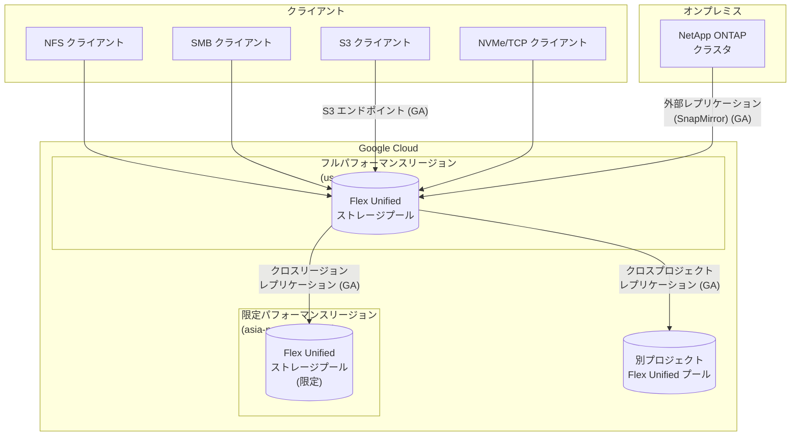

# NetApp Volumes: Flex Unified リージョン拡大・レプリケーション GA・ONTAP-mode 機能強化

**リリース日**: 2026-05-18

**サービス**: Google Cloud NetApp Volumes

**機能**: Flex Unified サービスレベルの新リージョン展開、レプリケーション GA、ONTAP-mode S3/クローン/特権レベル GA

**ステータス**: GA (一般提供) / Preview (一部機能)

[このアップデートのインフォグラフィックを見る](https://takech9203.github.io/google-cloud-news-summary/20260518-netapp-volumes-flex-unified-expansion.html)

## 概要

Google Cloud NetApp Volumes の Flex Unified サービスレベルに関する複数の重要なアップデートが発表されました。新リージョンへの展開 (限定パフォーマンスおよびフルパフォーマンス)、レプリケーション機能の GA 昇格、ONTAP-mode の高度な機能追加を含む包括的な機能強化です。

Flex Unified サービスレベルは 2026 年 4 月に GA となった汎用ストレージティアですが、今回のアップデートにより利用可能なリージョンが大幅に拡大しました。東京、ロンドン、パリ、ロサンゼルス、ソルトレイクシティの 5 リージョンで限定パフォーマンスとして利用可能になったほか、ダラス (us-south1) ではフルパフォーマンスで利用可能になりました。また、レプリケーション機能 (外部・リージョン内・クロスリージョン・クロスプロジェクト) がすべてのサポートプロトコルで GA となり、ONTAP-mode では S3 エンドポイント、Thick Clone Splitting、高度な特権レベルが GA として追加されました。

このアップデートは、グローバルに展開するエンタープライズ環境で NetApp Volumes を活用するすべてのユーザーに影響し、特にアジア太平洋・欧州地域での災害復旧 (DR) やデータレプリケーション戦略を構築する組織にとって重要です。

**アップデート前の課題**

- Flex Unified サービスレベルが利用できるリージョンが限られていたため、東京やロンドンなど主要リージョンではフル機能を利用できなかった
- レプリケーション機能 (外部・クロスリージョン・クロスプロジェクト) が GA ではなく、本番環境での DR 構成に SLA 保証がなかった
- ONTAP-mode で S3 プロトコルを使用したオブジェクトアクセスができなかった
- Thick Clone の分割操作や高度な特権レベルでの管理が GA として利用できなかった
- バックアップ機能が ONTAP-mode では利用できなかった

**アップデート後の改善**

- 東京、ロンドン、パリ、ロサンゼルス、ソルトレイクシティで Flex Unified が限定パフォーマンスとして利用可能になった
- ダラス (us-south1) でフルパフォーマンスの Flex Unified が利用可能になった
- レプリケーション機能が GA となり、SLA 付きで全プロトコル (NFS/SMB/NVMe/TCP) の DR 構成が可能になった
- ONTAP-mode で NFS/SMB ボリュームに対する S3 エンドポイントが GA として利用可能になり、マルチプロトコルアクセスが実現した
- Thick Clone Splitting と高度/診断特権レベルが GA となり、本番環境での高度な ONTAP 管理操作が可能になった
- ONTAP-mode のバックアップ機能がプレビューとして利用開始された

## アーキテクチャ図



Flex Unified サービスレベルのリージョン展開とレプリケーション構成を示す図。フルパフォーマンスリージョンと限定パフォーマンスリージョン間でのクロスリージョンレプリケーションが GA となり、オンプレミス ONTAP からの外部レプリケーション (SnapMirror) も GA として利用可能になりました。

## サービスアップデートの詳細

### 主要機能

1. **新リージョン展開 (限定パフォーマンス)**
   - asia-northeast1 (東京)、europe-west2 (ロンドン)、europe-west9 (パリ)、us-west2 (ロサンゼルス)、us-west3 (ソルトレイクシティ) で利用可能
   - 限定パフォーマンスリージョンではカスタムパフォーマンスプロビジョニング (スループット/IOPS の独立指定) が利用できない
   - 容量ベースのデフォルトパフォーマンス (最大 16 KiBps/GiB) で動作

2. **新リージョン展開 (フルパフォーマンス)**
   - us-south1 (ダラス) でフルパフォーマンスの Flex Unified が利用可能
   - カスタムパフォーマンスプロビジョニング対応 (最大 5 GiBps スループット、160,000 IOPS)

3. **レプリケーション機能 GA**
   - 外部レプリケーション (SnapMirror): オンプレミス ONTAP と NetApp Volumes 間
   - リージョン内レプリケーション: 同一リージョン内の異なるゾーン間
   - クロスリージョンレプリケーション: 異なるリージョン間 (同一リージョングループ内)
   - クロスプロジェクトレプリケーション: 異なる GCP プロジェクト間
   - すべてのサポートプロトコル (NFS/SMB/NVMe/TCP) で利用可能

4. **ONTAP-mode 機能強化 (GA)**
   - S3 エンドポイント: NFS/SMB ボリュームに対する S3 プロトコルでのオブジェクトアクセス
   - Thick Clone Splitting: クローンボリュームを独立したボリュームに分割
   - 高度/診断特権レベル: ONTAP CLI での advanced/diagnostic モード利用

5. **ONTAP-mode バックアップ機能 (Preview)**
   - ONTAP-mode プールでのバックアップ機能がプレビューとして利用開始

## 技術仕様

### Flex Unified サービスレベルの性能仕様

| 項目 | フルパフォーマンスリージョン | 限定パフォーマンスリージョン |
|------|---------------------------|---------------------------|
| 容量 (プール) | 1 - 425 TiB | 1 - 425 TiB |
| 最大スループット | 5 GiBps (カスタムプロビジョニング) | 16 KiBps/GiB (デフォルト) |
| 最大 IOPS | 160,000 | 容量ベース |
| 大容量ボリューム | 最大 22 GiBps / 750,000 IOPS | - |
| パフォーマンス指定 | スループット/IOPS 独立指定 | 容量ベースのみ |

### レプリケーション仕様

| 項目 | 詳細 |
|------|------|
| レプリケーションスケジュール | 10 分、1 時間、日次 (ONTAP-mode ではカスタム可) |
| 宛先アクセス (レプリケーション中) | 読み取り専用 |
| 宛先アクセス (停止時) | 読み書き可能 |
| レプリケーション方向切替 | 対応 |
| スナップショット同期 | 対応 |
| クロスプロジェクトレプリケーション | 要リクエスト (API/gcloud/Terraform で作成) |

### ONTAP-mode S3 マルチプロトコルサポート

| 項目 | 詳細 |
|------|------|
| 対象ボリュームプロトコル | NFS、SMB |
| S3 アクセスプロトコル | S3 互換 API |
| ステータス | GA (一般提供) |
| ユースケース | 既存 NFS/SMB ボリュームへのオブジェクトストレージ互換アクセス |

## 設定方法

### 前提条件

1. Google Cloud プロジェクトと課金アカウントが有効
2. NetApp Volumes API が有効化されている
3. VPC ネットワークと Private Service Access が構成済み
4. 対象リージョンで十分なクォータが確保されている

### 手順

#### ステップ 1: 限定パフォーマンスリージョンでのストレージプール作成

```bash
# asia-northeast1 (東京) での Flex Unified プール作成
gcloud netapp storage-pools create my-pool \
    --location=asia-northeast1-b \
    --service-level=FLEX \
    --capacity=2048 \
    --network=projects/my-project/global/networks/my-vpc \
    --project=my-project
```

限定パフォーマンスリージョンではカスタムパフォーマンス指定 (throughput/iops パラメータ) は使用できません。

#### ステップ 2: クロスリージョンレプリケーションの構成

```bash
# ソースボリュームにレプリケーションを作成
gcloud netapp volumes replications create my-replication \
    --volume=my-source-volume \
    --location=us-central1 \
    --destination-volume-parameters=storage-pool=projects/my-project/locations/asia-northeast1-b/storagePools/my-pool \
    --replication-schedule=HOURLY \
    --project=my-project
```

#### ステップ 3: ONTAP-mode での S3 エンドポイント構成

ONTAP-mode プールでは ONTAP CLI を使用して S3 エンドポイントを構成します。

```bash
# ONTAP CLI に接続後
vserver object-store-server create -vserver my-svm -object-store-server my-s3-server -is-http-enabled true
```

詳細な構成手順は公式ドキュメントの「ONTAP-mode S3 multiprotocol support」を参照してください。

## メリット

### ビジネス面

- **グローバル展開の加速**: 東京、ロンドン、パリなど主要ビジネスリージョンで Flex Unified が利用可能になり、データローカリティ要件を満たしやすくなった
- **DR/BCP 戦略の強化**: レプリケーション機能の GA により、SLA 付きの災害復旧構成を本番環境で構築可能
- **運用コスト削減**: クロスプロジェクトレプリケーションにより、組織内の異なるチーム間でのデータ共有・保護が効率化

### 技術面

- **マルチプロトコルアクセス**: S3 エンドポイントにより、NFS/SMB ボリュームに対してオブジェクトストレージ互換の API アクセスが可能
- **高度な ONTAP 管理**: advanced/diagnostic 特権レベルの GA により、詳細なトラブルシューティングや高度な設定変更が本番環境で実施可能
- **柔軟なクローン管理**: Thick Clone Splitting により、クローンボリュームを完全に独立したボリュームとして分離し、ソースボリュームへの依存を排除

## デメリット・制約事項

### 制限事項

- 限定パフォーマンスリージョンではカスタムパフォーマンスプロビジョニング (スループット/IOPS の独立指定) が利用不可
- クロスプロジェクトレプリケーションは要リクエスト (営業チームへの連絡が必要)
- Flex Unified のレプリケーションは同一リージョングループ内のみサポート
- ONTAP-mode のバックアップ機能はまだプレビュー段階であり、SLA 保証がない
- レプリケーションはカスケードやファンイン/ファンアウトトポロジーに非対応

### 考慮すべき点

- 限定パフォーマンスリージョンのパフォーマンス上限 (16 KiBps/GiB) がワークロード要件を満たすか事前検証が必要
- レプリケーションの転送量に応じたネットワーク料金が別途発生
- ONTAP-mode の S3 エンドポイントは ONTAP の知識が前提となるため、運用チームのスキルセットを確認

## ユースケース

### ユースケース 1: アジア太平洋地域での DR 構成

**シナリオ**: 日本 (asia-northeast1) に本番環境を持つ企業が、災害復旧のために別リージョンへのレプリケーションを構成する。

**実装例**:
```bash
# us-central1 のソースボリュームを asia-northeast1 へレプリケート
gcloud netapp volumes replications create dr-replication \
    --volume=production-volume \
    --location=us-central1 \
    --destination-volume-parameters=storage-pool=projects/my-project/locations/asia-northeast1-b/storagePools/tokyo-pool \
    --replication-schedule=EVERY_10_MINUTES \
    --project=my-project
```

**効果**: RPO 10 分以内の DR 構成を GA レベルの SLA で運用可能。東京リージョンでの限定パフォーマンスモードにより、DR サイトのコストを抑制しつつデータ保護を実現。

### ユースケース 2: ハイブリッドクラウドでの S3 マルチプロトコルアクセス

**シナリオ**: オンプレミスの ONTAP 環境から Google Cloud へ移行中の企業が、既存の NFS ワークロードを維持しながら、新しいアプリケーションからは S3 互換 API でアクセスしたい。

**効果**: ONTAP-mode の S3 エンドポイントにより、ボリュームのデータを変更せずに NFS と S3 の両方からアクセス可能。レガシーアプリケーションとモダンアプリケーションの共存が実現。

### ユースケース 3: マルチプロジェクト間でのデータ共有

**シナリオ**: 開発チームと本番チームが異なる GCP プロジェクトを使用しており、本番データのレプリカを開発環境で参照したい。

**効果**: クロスプロジェクトレプリケーション (GA) により、プロジェクト間でのデータ同期が SLA 付きで実現。開発環境では読み取り専用のレプリカにアクセスし、本番データを安全に参照可能。

## 料金

NetApp Volumes Flex Unified の料金は、リージョンとプロビジョニングモードにより異なります。

### 料金例 (us-central1 リージョン)

| 項目 | オンデマンド料金 (USD) | 1 年 CUD | 3 年 CUD |
|------|----------------------|----------|----------|
| カスタムプロビジョニング - 容量 | $0.000144/GiB/時間 | $0.000122/GiB/時間 | $0.000115/GiB/時間 |
| カスタムプロビジョニング - スループット | $0.002192/MiBps/時間 | $0.001863/MiBps/時間 | $0.001753/MiBps/時間 |
| カスタムプロビジョニング - IOPS | $0.000023/IOPS/時間 | $0.000020/IOPS/時間 | $0.000019/IOPS/時間 |
| 限定パフォーマンスリージョン - 容量 | $0.000274/GiB/時間 | $0.000233/GiB/時間 | $0.000219/GiB/時間 |

### レプリケーション料金

| レプリケーション頻度 | 転送料金 (USD/GiB) |
|---------------------|-------------------|
| 日次 | $0.11 |
| 1 時間ごと | $0.12 |
| 10 分ごと | $0.14 |

### バックアップ料金

| 項目 | 料金 (USD) |
|------|-----------|
| バックアップ使用量 | $0.032/GiB/月 (ソースボリューム容量) |
| バックアップストレージ | $0.000062/GiB/時間 |

**注意**: CUD は最低 $11.38/時間 (約 $100,000/年) のコミット料金が必要です。1 年契約で 15%、3 年契約で 20% の割引が適用されます。

## 利用可能リージョン

### Flex Unified フルパフォーマンスリージョン (カスタムプロビジョニング対応)

| リージョン | 都市 |
|-----------|------|
| asia-northeast2 | 大阪 |
| asia-south1 | ムンバイ |
| asia-southeast1 | シンガポール |
| australia-southeast1 | シドニー |
| europe-west1 | ベルギー |
| europe-west3 | フランクフルト |
| europe-west4 | オランダ |
| me-central2 | ダンマーム |
| me-west1 | テルアビブ |
| southamerica-east1 | サンパウロ |
| us-central1 | アイオワ |
| us-east1 | サウスカロライナ |
| us-east4 | バージニア北部 |
| **us-south1** | **ダラス (新規)** |
| us-west1 | オレゴン |
| us-west4 | ラスベガス |

### Flex Unified 限定パフォーマンスリージョン (新規追加)

| リージョン | 都市 | ステータス |
|-----------|------|-----------|
| **asia-northeast1** | **東京** | **新規** |
| **europe-west2** | **ロンドン** | **新規** |
| **europe-west9** | **パリ** | **新規** |
| **us-west2** | **ロサンゼルス** | **新規** |
| **us-west3** | **ソルトレイクシティ** | **新規** |

## 関連サービス・機能

- **Cloud Monitoring / Cloud Logging**: NetApp Volumes のメトリクスとログの監視・分析に使用
- **Private Service Access**: VPC からNetApp Volumes へのプライベートネットワーク接続
- **Network Connectivity Center**: Producer VPC スポークを使用した追加ネットワーク接続 (GA)
- **Cloud KMS (CMEK)**: 顧客管理暗号化キーによるストレージプールとバックアップの暗号化
- **Shared VPC**: 共有 VPC 環境での NetApp Volumes 利用
- **オンプレミス NetApp ONTAP**: SnapMirror による外部レプリケーションでハイブリッド環境を構成

## 参考リンク

- [インフォグラフィック](https://takech9203.github.io/google-cloud-news-summary/20260518-netapp-volumes-flex-unified-expansion.html)
- [公式リリースノート](https://cloud.google.com/release-notes#May_18_2026)
- [NetApp Volumes サービスレベル](https://cloud.google.com/netapp/volumes/docs/discover/service-levels)
- [NetApp Volumes 概要](https://cloud.google.com/netapp/volumes/docs/discover/overview)
- [ボリュームレプリケーションについて](https://cloud.google.com/netapp/volumes/docs/protect-data/about-volume-replication)
- [ONTAP-mode 概要](https://cloud.google.com/netapp/volumes/docs/ontap/overview)
- [料金ページ](https://cloud.google.com/netapp/volumes/pricing)
- [サポートリージョン](https://cloud.google.com/netapp/volumes/docs/discover/service-levels#supported_regions)

## まとめ

今回の NetApp Volumes Flex Unified アップデートは、リージョン拡大・レプリケーション GA・ONTAP-mode 機能強化の 3 軸で構成されており、エンタープライズ環境でのグローバルデータ管理能力を大幅に向上させます。特に東京リージョンでの限定パフォーマンス提供開始により、日本を拠点とする企業の DR/BCP 要件に対応しやすくなりました。レプリケーション機能の GA とS3 マルチプロトコルサポートを組み合わせることで、ハイブリッドクラウド環境でのデータ保護とモダンアプリケーションからのアクセスの両立が実現可能です。

---

**タグ**: #NetAppVolumes #FlexUnified #Replication #ONTAP #S3 #DisasterRecovery #RegionExpansion #StoragePool #GA
