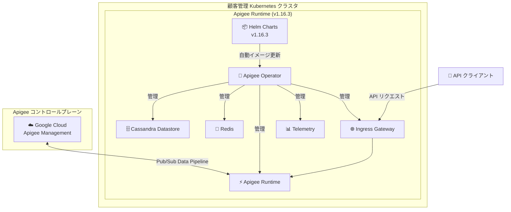

# Apigee hybrid: v1.16.3 パッチリリース

**リリース日**: 2026-05-19

**サービス**: Apigee hybrid

**機能**: v1.16.3 パッチリリース

**ステータス**: Patch Release

📊 [このアップデートのインフォグラフィックを見る](https://takech9203.github.io/google-cloud-news-summary/20260519-apigee-hybrid-v1-16-3.html)

## 概要

2026 年 5 月 19 日、Google Cloud は Apigee hybrid ソフトウェアの最新パッチバージョン v1.16.3 をリリースした。これは v1.16.x シリーズの 3 番目のパッチリリースであり、v1.16.2（2026 年 5 月 13 日リリース）に続くメンテナンスアップデートである。

本リリースはパッチリリースであるため、コンテナイメージは Apigee hybrid の Helm チャートに統合されている。Helm チャート経由でパッチにアップグレードすると、イメージが自動的に更新されるため、通常は手動でのイメージ変更は不要である。

Apigee hybrid は、Google Cloud の API 管理プラットフォームである Apigee のランタイムを、顧客が管理する Kubernetes クラスタ上で実行するハイブリッドデプロイメントモデルを提供するサービスである。企業がデータ主権要件やレイテンシ要件に対応しながら、エンタープライズグレードの API 管理機能を利用できる。

**アップデート前の課題**

- v1.16.2 で修正されなかった潜在的なバグやセキュリティ脆弱性が存在していた可能性がある
- パッチ適用前のバージョンでは最新のセキュリティ修正が反映されていない状態であった

**アップデート後の改善**

- 最新のバグ修正およびセキュリティ修正が適用され、システムの安定性が向上
- Helm チャートによる自動イメージ更新により、運用者の手動作業なしでパッチ適用が可能

## アーキテクチャ図



Apigee hybrid v1.16.3 のアーキテクチャを示す。Helm チャートによるアップグレードで Apigee Operator を含む全コンポーネントのコンテナイメージが自動更新される。

## サービスアップデートの詳細

### 主要機能

1. **パッチリリースによる自動イメージ更新**
   - コンテナイメージが Helm チャートに統合されているため、`helm upgrade` コマンドで自動的に最新イメージに更新される
   - 手動でのイメージ変更は通常不要
   - dry-run オプションで事前検証が可能

2. **v1.16.x シリーズの継続的改善**
   - v1.16.0 で導入された Seccomp プロファイルサポート、UDCA の Pub/Sub ベースパイプラインへの移行、apigee-guardrails サービスアカウントなどの基盤機能がパッチ適用により安定化
   - cert-manager 1.18 および 1.19 のサポートが引き続き維持

## 設定方法

### 前提条件

1. Apigee hybrid v1.15.x 以上がインストール済みであること（v1.14 以前からの場合は先に v1.15 へアップグレードが必要）
2. Helm v3.17.0 以上
3. kubectl（使用する Kubernetes プラットフォームバージョンに適合するバージョン）
4. cert-manager v1.16.0 以上（v1.18/1.19 を使用する場合は rotationPolicy の設定に注意）

### 手順

#### ステップ 1: Helm チャートのアップグレード（Apigee Operator）

```bash
# dry-run で事前検証
helm upgrade operator apigee-operator/ \
  --install \
  --namespace APIGEE_NAMESPACE \
  --atomic \
  -f overrides.yaml \
  --dry-run=server

# アップグレード実行
helm upgrade operator apigee-operator/ \
  --install \
  --namespace APIGEE_NAMESPACE \
  --atomic \
  -f overrides.yaml
```

#### ステップ 2: 各コンポーネントの順次アップグレード

```bash
# Datastore
helm upgrade datastore apigee-datastore/ \
  --install --namespace APIGEE_NAMESPACE --atomic -f overrides.yaml

# Telemetry
helm upgrade telemetry apigee-telemetry/ \
  --install --namespace APIGEE_NAMESPACE --atomic -f overrides.yaml

# Redis
helm upgrade redis apigee-redis/ \
  --install --namespace APIGEE_NAMESPACE --atomic -f overrides.yaml

# Ingress Manager
helm upgrade ingress-manager apigee-ingress-manager/ \
  --install --namespace APIGEE_NAMESPACE --atomic -f overrides.yaml

# Organization
helm upgrade $ORG_NAME apigee-org/ \
  --install --namespace APIGEE_NAMESPACE --atomic -f overrides.yaml
```

#### ステップ 3: アップグレードの検証

```bash
# Operator の確認
kubectl -n APIGEE_NAMESPACE get deploy apigee-controller-manager

# Datastore の確認
kubectl -n APIGEE_NAMESPACE get apigeedatastore default

# Organization の確認
kubectl -n APIGEE_NAMESPACE get apigeeorg
```

## メリット

### ビジネス面

- **運用負荷の低減**: Helm チャート経由の自動イメージ更新により、パッチ適用の運用コストが最小化される
- **セキュリティコンプライアンスの維持**: 定期的なパッチ適用によりセキュリティ基準への準拠を継続できる

### 技術面

- **ローリングアップデート**: Kubernetes のローリングリスタートにより、ダウンタイムを最小限に抑えたアップグレードが可能
- **一貫性のあるバージョン管理**: Helm チャートにイメージバージョンが統合されているため、全コンポーネントの整合性が保証される

## デメリット・制約事項

### 制限事項

- アップグレード時にすべての Apigee デプロイメントがローリングリスタートを受けるため、本番環境では複数クラスタ構成でのトラフィック制御が推奨される
- Cassandra のバックアップとリストアは、混合バージョン間（例: v1.15 のバックアップを v1.16 にリストア）では動作しない
- v1.14 以前から直接 v1.16.3 へのアップグレードは不可（先に v1.15 へのアップグレードが必要）

### 考慮すべき点

- 本番環境では最低 2 クラスタ構成で、トラフィックを 1 クラスタに集約してからもう一方をアップグレードすることが推奨される
- cert-manager 1.18 以上にアップグレードする場合は、事前に apigee-ca 証明書の rotationPolicy を "Never" に設定する必要がある

## 対応プラットフォーム

Apigee hybrid v1.16 がサポートする主要プラットフォーム:

| プラットフォーム | サポートバージョン |
|---|---|
| GKE on Google Cloud | 1.31.x, 1.32.x, 1.33.x |
| GKE on AWS | 1.31.x, 1.32.x, 1.33.x |
| GKE on Azure | 1.31.x, 1.32.x, 1.33.x |
| EKS | 1.31.x, 1.32.x, 1.33.x, 1.34.x, 1.35.x |
| AKS | 1.31.x, 1.32.x, 1.33.x, 1.34.x, 1.35.x |
| OpenShift | 4.16, 4.18, 4.19, 4.20 |
| RKE | 1.31.x, 1.32.x, 1.33.x |

## 関連サービス・機能

- **Apigee (クラウドネイティブ版)**: フルマネージドの API 管理プラットフォーム。hybrid はそのランタイムをオンプレミスや他のクラウドで実行する選択肢
- **Google Cloud Pub/Sub**: v1.16 以降、アナリティクスおよびトレースデータの送信に使用されるデータパイプライン基盤
- **cert-manager**: TLS 証明書の自動管理に使用される Kubernetes アドオン
- **Cloud Monitoring / Cloud Logging**: Apigee hybrid のテレメトリデータの監視・ログ管理
- **Model Armor**: v1.15.1 以降でサポートされた LLM/GenAI ワークロード向けのセキュリティポリシー

## 参考リンク

- 📊 [インフォグラフィック](https://takech9203.github.io/google-cloud-news-summary/20260519-apigee-hybrid-v1-16-3.html)
- [公式リリースノート](https://docs.cloud.google.com/release-notes#May_19_2026)
- [Apigee hybrid リリースノート](https://docs.cloud.google.com/apigee/docs/hybrid/release-notes)
- [Apigee hybrid v1.16.3 へのアップグレード手順](https://docs.cloud.google.com/apigee/docs/hybrid/v1.16/upgrade)
- [新規インストール: The big picture](https://docs.cloud.google.com/apigee/docs/hybrid/v1.16/big-picture)
- [サポートされるプラットフォームとバージョン](https://docs.cloud.google.com/apigee/docs/hybrid/supported-platforms)
- [Apigee release process (コンテナイメージについて)](https://docs.cloud.google.com/apigee/docs/release/apigee-release-process#apigee-hybrid-container-images)
- [料金ページ](https://cloud.google.com/apigee/pricing)

## まとめ

Apigee hybrid v1.16.3 は v1.16.x シリーズのパッチリリースであり、Helm チャート経由で簡潔にアップグレードが可能である。本番環境で Apigee hybrid を運用している場合は、セキュリティおよび安定性の観点から早期のパッチ適用を推奨する。アップグレード時は複数クラスタ構成でのトラフィック制御により、ダウンタイムを最小限に抑えることができる。

---

**タグ**: #Apigee #APIManagement #Hybrid #Kubernetes #Helm #PatchRelease #Security
