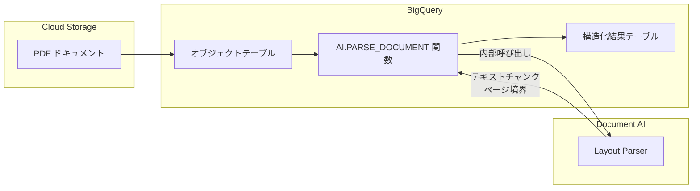

# BigQuery: AI.PARSE_DOCUMENT 関数によるドキュメントパース

**リリース日**: 2026-05-19

**サービス**: BigQuery

**機能**: AI.PARSE_DOCUMENT 関数

**ステータス**: Preview

[このアップデートのインフォグラフィックを見る](https://takech9203.github.io/google-cloud-news-summary/20260519-bigquery-ai-parse-document.html)

## 概要

BigQuery に新しい `AI.PARSE_DOCUMENT` 関数が Preview として追加された。この関数を使用することで、PDF などのドキュメントを BigQuery SQL から直接パースし、テキストチャンクやページ境界を含む構造化情報を抽出できる。内部的には Document AI の Layout Parser を活用しており、ドキュメントの階層構造を保持したまま情報を取得できる。

この機能は、BigQuery の AI 関数ファミリーの一部として提供され、BigQuery に格納された非構造化データ（PDF ドキュメント）をSQLのみで構造化データに変換するワークフローを大幅に簡素化する。これまで別途 Document AI のプロセッサを作成し、リモートモデルを登録する必要があった処理が、単一の関数呼び出しで完結する。

対象ユーザーは、大量のPDFドキュメントを BigQuery で分析する必要があるデータアナリスト、RAG（Retrieval-Augmented Generation）パイプラインを構築するML エンジニア、およびドキュメント管理の自動化を進めるエンタープライズユーザーである。

**アップデート前の課題**

- BigQuery から PDF ドキュメントをパースするには、Document AI でプロセッサを作成し、BigQuery にリモートモデルとして登録し、`ML.PROCESS_DOCUMENT` 関数を呼び出す必要があった（複数ステップの事前準備が必要）
- Document AI プロセッサの作成・管理は BigQuery ワークフローとは別に行う必要があり、設定が煩雑だった
- ドキュメントの構造化抽出を SQL だけで完結させることが困難で、外部パイプラインへの依存が発生していた

**アップデート後の改善**

- `AI.PARSE_DOCUMENT` 関数を使うことで、Document AI Layout Parser によるドキュメントパースが SQL 関数一つで実行可能になった
- テキストチャンクとページ境界を含む構造化情報が直接抽出できるようになった
- Document AI プロセッサの事前登録が不要になり、BigQuery 内で完結するドキュメント処理ワークフローが実現した

## アーキテクチャ図



BigQuery の `AI.PARSE_DOCUMENT` 関数が Document AI Layout Parser を内部的に呼び出し、Cloud Storage 上の PDF ドキュメントから構造化情報を抽出するデータフローを示している。

## サービスアップデートの詳細

### 主要機能

1. **ドキュメントパース**
   - PDF などのドキュメントファイルを入力として受け取り、構造化情報を返却する
   - Document AI Layout Parser による高精度なドキュメント構造解析を活用

2. **テキストチャンク抽出**
   - ドキュメント内のテキストを意味的に関連するチャンクに分割して抽出
   - チャンクサイズの設定によりRAGパイプラインに最適化可能

3. **ページ境界情報**
   - 各チャンクがどのページに属するかのメタデータを付与
   - ページ単位でのフィルタリングや参照が可能

## 技術仕様

### Document AI Layout Parser の対応ファイル形式

| ファイル形式 | MIME Type | 検出可能な要素 |
|------|------|------|
| PDF | application/pdf | 図、段落、テーブル、タイトル、見出し、ヘッダー、フッター |
| HTML | text/html | 段落、テーブル、リスト、タイトル、見出し、ヘッダー、フッター |
| DOCX | application/vnd.openxmlformats-officedocument.wordprocessingml.document | 段落、テーブル、リスト、タイトル、見出し |
| PPTX | application/vnd.openxmlformats-officedocument.presentationml.presentation | 段落、テーブル、リスト、タイトル、見出し |

### 関連する既存関数との比較

| 項目 | AI.PARSE_DOCUMENT (新) | ML.PROCESS_DOCUMENT (既存) |
|------|------|------|
| 事前設定 | 関数呼び出しのみ | プロセッサ作成 + リモートモデル登録が必要 |
| 用途 | ドキュメントパース（Layout Parser） | 汎用ドキュメント処理（各種プロセッサ対応） |
| ステータス | Preview | GA |

## 設定方法

### 前提条件

1. BigQuery が有効なプロジェクト
2. ドキュメントファイルが格納された Cloud Storage バケット
3. Cloud Storage バケットへのアクセス権を持つ BigQuery コネクション

### 手順

#### ステップ 1: オブジェクトテーブルの作成

```sql
-- Cloud Storage 上の PDF ファイルへのオブジェクトテーブルを作成
CREATE OR REPLACE EXTERNAL TABLE `my_dataset.documents`
WITH CONNECTION `my_project.us.my_connection`
OPTIONS (
  object_metadata = 'SIMPLE',
  uris = ['gs://my_bucket/documents/*']
);
```

Cloud Storage に格納された PDF ファイルを BigQuery からアクセスできるようにオブジェクトテーブルを作成する。

#### ステップ 2: AI.PARSE_DOCUMENT 関数の実行

```sql
-- AI.PARSE_DOCUMENT を使用してドキュメントをパース
SELECT
  uri,
  AI.PARSE_DOCUMENT(document_content)
FROM `my_dataset.documents`
WHERE content_type = 'application/pdf';
```

`AI.PARSE_DOCUMENT` 関数を呼び出すことで、Document AI Layout Parser が PDF の構造を解析し、テキストチャンクとページ境界情報を返却する。

## メリット

### ビジネス面

- **ドキュメント分析の民主化**: SQL を書けるアナリストであれば、MLエンジニアリングの知識なしにドキュメントから構造化データを抽出できる
- **パイプライン構築コストの削減**: Document AI の設定・管理が不要になり、BigQuery だけでドキュメント処理が完結する

### 技術面

- **シンプルな API**: 単一の関数呼び出しでドキュメントパースが完了し、事前のプロセッサ登録やモデル作成が不要
- **RAG パイプラインとの親和性**: テキストチャンクとページ境界情報が直接取得でき、`AI.GENERATE_EMBEDDING` との組み合わせでベクトル検索パイプラインを構築しやすい
- **構造保持**: Document AI Layout Parser により、見出し・段落・テーブルなどの階層構造を維持したチャンクが生成される

## デメリット・制約事項

### 制限事項

- 現在 Preview ステータスのため、本番ワークロードでの使用は推奨されない
- Document AI Layout Parser の処理上限（1,000,000 ページ/月）が適用される可能性がある
- 対応言語は Document AI Layout Parser の制約に依存（多くのプロセッサは英語のみ対応）

### 考慮すべき点

- Preview 機能のため、GA までに仕様変更が発生する可能性がある
- 大量ドキュメント処理時の Document AI API のレート制限（120 RPM/プロセッサタイプ、600 RPM/プロジェクト）に注意が必要

## ユースケース

### ユースケース 1: PDF ドキュメントからの RAG パイプライン構築

**シナリオ**: 企業内の技術ドキュメント（PDF形式）をナレッジベースとして活用し、社内 Q&A チャットボットを構築したい。

**実装例**:
```sql
-- Step 1: PDF をパースしてチャンク化
CREATE OR REPLACE TABLE my_dataset.parsed_docs AS
SELECT uri, AI.PARSE_DOCUMENT(document_content) AS parsed
FROM my_dataset.documents
WHERE content_type = 'application/pdf';

-- Step 2: エンベディング生成
CREATE OR REPLACE TABLE my_dataset.doc_embeddings AS
SELECT *
FROM AI.GENERATE_EMBEDDING(
  TABLE my_dataset.parsed_docs
);

-- Step 3: ベクトル検索で関連チャンクを取得し、回答生成
SELECT AI.GENERATE(
  CONCAT('以下のコンテキストに基づいて質問に回答してください: ', context, ' 質問: ', @question)
).result
FROM VECTOR_SEARCH(TABLE my_dataset.doc_embeddings, @query_embedding);
```

**効果**: Document AI の個別設定なしに、SQL のみで PDF ドキュメントベースの RAG パイプラインを構築できる。

### ユースケース 2: 契約書・報告書の構造化データ抽出

**シナリオ**: 大量の契約書 PDF から、契約日・契約金額・契約当事者などの情報を抽出して BigQuery テーブルに格納したい。

**効果**: `AI.PARSE_DOCUMENT` でドキュメントを構造化した後、`AI.GENERATE` と組み合わせることで、特定のフィールド抽出を一貫したSQLワークフローで実現できる。

## 料金

AI.PARSE_DOCUMENT は内部的に Document AI Layout Parser を使用するため、以下の料金が発生する。

| 項目 | 料金 |
|------|------|
| Document AI Layout Parser | $10 / 1,000 ページ |
| BigQuery ML データ処理 | BigQuery ML の標準料金 |

詳細は [Document AI 料金ページ](https://cloud.google.com/document-ai/pricing) および [BigQuery 料金ページ](https://cloud.google.com/bigquery/pricing#bigquery-ml-pricing) を参照。

## 利用可能リージョン

Document AI Layout Parser は EU および US マルチリージョンで全プロセッサが利用可能。一部のプロセッサは特定の単一リージョンでも利用可能。詳細は [Document AI リージョンサポート](https://cloud.google.com/document-ai/docs/regions) を参照。

## 関連サービス・機能

- **Document AI Layout Parser**: AI.PARSE_DOCUMENT が内部的に使用するドキュメント解析エンジン。Gemini の生成 AI 機能と専用 OCR モデルを組み合わせて高精度な構造解析を実現
- **ML.PROCESS_DOCUMENT**: 既存の Document AI 連携関数。事前にプロセッサの登録が必要だが、カスタムエクストラクタやフォームパーサーなど多様なプロセッサに対応
- **AI.GENERATE_EMBEDDING**: パースしたテキストチャンクからエンベディングを生成し、ベクトル検索を実現
- **AI.GENERATE / AI.GENERATE_TEXT**: パース結果に対して自然言語処理（要約、分類、質問応答）を実行
- **Cloud Storage オブジェクトテーブル**: PDF ファイルを BigQuery からアクセスするためのインターフェース

## 参考リンク

- [インフォグラフィック](https://takech9203.github.io/google-cloud-news-summary/20260519-bigquery-ai-parse-document.html)
- [公式リリースノート](https://docs.cloud.google.com/release-notes#May_19_2026)
- [BigQuery ドキュメント処理関数の選択ガイド](https://docs.cloud.google.com/bigquery/docs/choose-document-processing-function)
- [Document AI Layout Parser ドキュメント](https://docs.cloud.google.com/document-ai/docs/layout-parse-chunk)
- [BigQuery ML と Document AI の統合](https://docs.cloud.google.com/document-ai/docs/big-query-integration)
- [BigQuery で PDF を使った RAG パイプライン構築](https://docs.cloud.google.com/bigquery/docs/rag-pipeline-pdf)
- [Document AI 料金](https://cloud.google.com/document-ai/pricing)
- [BigQuery 料金](https://cloud.google.com/bigquery/pricing)

## まとめ

BigQuery の `AI.PARSE_DOCUMENT` 関数は、PDF などのドキュメントから構造化情報を抽出するプロセスを大幅に簡素化する重要なアップデートである。従来の `ML.PROCESS_DOCUMENT` と比較して事前設定が不要になり、SQL だけでドキュメントパースから RAG パイプライン構築まで一貫したワークフローを実現できる。現在 Preview のため本番利用には注意が必要だが、GA に向けて早期に検証を開始し、ドキュメント分析ワークフローの刷新を検討することを推奨する。

---

**タグ**: #BigQuery #DocumentAI #AI関数 #ドキュメントパース #RAG #Preview #非構造化データ
