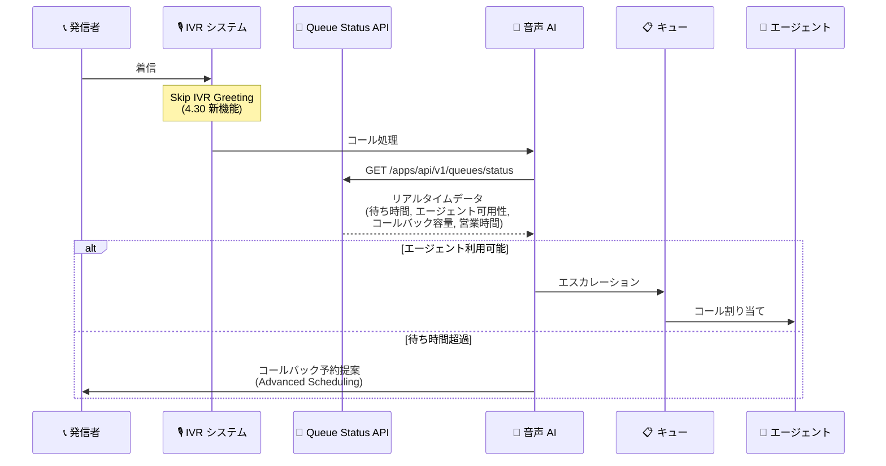

# Google Cloud Contact Center as a Service (CCaaS): バージョン 4.30 リリース

**リリース日**: 2026-05-19

**サービス**: Google Cloud Contact Center as a Service (CCaaS)

**機能**: CCaaS 4.30 - IVR グリーティングスキップ、キューステータスエンドポイント、高度なコールスケジューリングのデフォルト有効化

**ステータス**: GA (一般提供)

📊 [このアップデートのインフォグラフィックを見る](https://takech9203.github.io/google-cloud-news-summary/20260519-ccaas-4-30.html)

## 概要

Google Cloud CCaaS 4.30 がリリースされた。このバージョンでは、IVR グリーティングメッセージのスキップオプション、ヘッドレス Web SDK における高度なコールスケジューリングのデフォルト有効化、リアルタイムのキューステータスエンドポイントの新設、および HubSpot 連携でのコール転送機能の追加が含まれる。

特に注目すべきは、新しいキューステータスエンドポイント (`GET /apps/api/v1/queues/status`) であり、音声 AI システムがリアルタイムでキューの状態を把握し、ライブエージェントへのエスカレーションやスケジュールコールバックの提案を動的に判断できるようになる。これにより、コンタクトセンターの自動化と顧客体験の向上が大幅に進む。

**アップデート前の課題**

- IVR グリーティングメッセージは常に再生され、単一キュー構成でも通話接続までに不要な待ち時間が発生していた
- ヘッドレス Web SDK で高度なコールスケジューリングを利用するには、明示的に `useAdvancedCallScheduling` パラメータを `true` に設定する必要があった
- キューの詳細なリアルタイムステータス (推定待ち時間、エージェント可用性、コールバックスロット容量、営業時間、祝日) を一括で取得する API エンドポイントが存在しなかった
- HubSpot 連携でのコール転送時に追加機能が限定的だった

**アップデート後の改善**

- IVR グリーティングメッセージをスキップするオプションが追加され、発信者をより迅速にキューへ接続できるようになった
- ヘッドレス Web SDK で高度なコールスケジューリングがデフォルトで有効になり、追加設定なしで高度な機能を利用可能になった
- 新しいキューステータスエンドポイントにより、音声 AI システムがリアルタイムデータに基づく動的なルーティング判断を実行できるようになった
- HubSpot 連携でのコール転送機能が拡張された

## アーキテクチャ図



新しいキューステータスエンドポイントを活用した音声 AI のルーティング判断フロー。IVR グリーティングスキップによる迅速な接続と、リアルタイムデータに基づく動的なエスカレーション/コールバック判断を示している。

## サービスアップデートの詳細

### 主要機能

1. **IVR グリーティングメッセージのスキップ**
   - Settings > Languages & Messages > IVR-specific Messages セクションに新しい「Skip IVR Greeting」オプションが追加された
   - IVR グリーティングは通話開始時にキューメニューの読み上げ前に再生されるメッセージ (例: "Thank you for calling us.") であり、このメッセージを省略することで発信者をより迅速にキューへルーティングできる
   - 単一キュー構成のコールフローや、迅速な接続を優先するユースケースで特に有効

2. **ヘッドレス Web SDK: 高度なコールスケジューリングのデフォルト有効化**
   - `useAdvancedCallScheduling` パラメータがデフォルトで `true` に設定された
   - これにより、明示的な設定なしで以下の高度な機能が利用可能:
     - 設定可能な日数先までのタイムスロット表示
     - タイムスロット容量の設定 (割り当てエージェントの 50% または静的最大値)
     - エンドユーザーによる既存スケジュールコールの再スケジュール/キャンセル
   - `getTimeSlots` メソッドのオプションベース署名と連携して動作する

3. **キューステータスエンドポイント**
   - 新エンドポイント: `GET /apps/api/v1/queues/status`
   - リーフキュー (最下層キュー) のリアルタイムデータを提供:
     - 推定待ち時間 (EWT)
     - エージェント可用性
     - コールバックスロット容量
     - 営業時間
     - 祝日情報
   - 音声 AI システムがライブエージェントへのエスカレーションまたはスケジュールコールバックの提案を動的に判断するためのデータソースとして設計されている

4. **HubSpot 連携でのコール転送機能の追加**
   - HubSpot CRM 連携においてコール転送時の追加機能が提供された
   - 5 月 12 日のプレリリースで予告されていた HubSpot 関連機能 (エージェントステータス継承、チケットオーナーの自動更新、エージェント同期) の正式リリースに関連する機能

## 技術仕様

### キューステータスエンドポイント

| 項目 | 詳細 |
|------|------|
| メソッド | GET |
| エンドポイント | `/apps/api/v1/queues/status` |
| 対象 | リーフキュー (最下層キュー) |
| レスポンスデータ | 推定待ち時間、エージェント可用性、コールバックスロット容量、営業時間、祝日 |
| 主なユースケース | 音声 AI によるルーティング判断 |

### ヘッドレス Web SDK - getTimeSlots インターフェース

```typescript
interface GetTimeSlotsRequest {
  lang?: string;
  rescheduleCallId?: number;      // リスケジュール対象の既存コール ID
  useAdvancedCallScheduling?: boolean; // 4.30 よりデフォルト true
}
```

### IVR グリーティングスキップ設定場所

| 項目 | 詳細 |
|------|------|
| 設定パス | Settings > Languages & Messages > IVR-specific Messages |
| オプション名 | Skip IVR Greeting |
| 影響範囲 | グローバル (全 IVR コール) |

## 設定方法

### IVR グリーティングメッセージのスキップ

#### ステップ 1: 設定画面へ移動

CCAI Platform ポータルで Settings > Languages & Messages へ移動する。Settings メニューが表示されない場合は、メニューアイコンをクリックする。

#### ステップ 2: IVR-specific Messages セクションで設定

IVR-specific Messages セクションで「Skip IVR Greeting」オプションを有効にする。

### キューステータスエンドポイントの利用

#### ステップ 1: API リクエストの送信

```bash
# キューステータスの取得
curl -X GET "https://YOUR_CCAAS_HOST/apps/api/v1/queues/status" \
  -H "Authorization: Bearer YOUR_TOKEN" \
  -H "Content-Type: application/json"
```

#### ステップ 2: レスポンスの活用

レスポンスに含まれるリアルタイムデータ (推定待ち時間、エージェント可用性、コールバックスロット容量) を基に、音声 AI のルーティングロジックを実装する。

## メリット

### ビジネス面

- **顧客体験の向上**: IVR グリーティングスキップにより、発信者が迅速にエージェントまたは適切なルーティングに接続される
- **コールバック率の最適化**: キューステータスのリアルタイムデータにより、最適なタイミングでコールバックを提案できる
- **AI 自動化の推進**: 音声 AI が動的にルーティング判断を行うことで、オペレーターの負荷を軽減し、効率的なリソース配分が可能になる

### 技術面

- **開発の簡素化**: ヘッドレス Web SDK で高度なコールスケジューリングがデフォルト有効になり、明示的な設定が不要に
- **統合 API の充実**: 新しいキューステータスエンドポイントにより、外部システムとの連携がより容易に
- **リアルタイム意思決定**: 音声 AI システムがキューの状態を即時に把握し、最適な判断を下すためのデータアクセスが提供される

## デメリット・制約事項

### 制限事項

- キューステータスエンドポイントはリーフキュー (最下層キュー) のみが対象であり、親キュー (ブランチキュー) のステータスは含まれない
- IVR グリーティングスキップはグローバル設定であり、特定のキューのみにスキップを適用する場合はキューレベルの設定と組み合わせる必要がある

### 考慮すべき点

- `useAdvancedCallScheduling` のデフォルト値変更により、既存のヘッドレス SDK 実装で意図しない動作変更が発生する可能性がある。明示的に `false` を設定していない場合は動作確認が推奨される
- IVR グリーティングをスキップする場合、発信者に対する最初のコンテキスト情報 (会社名など) が失われるため、他の手段で補完する必要があるか検討すること

## ユースケース

### ユースケース 1: 音声 AI によるインテリジェントルーティング

**シナリオ**: 音声 AI (Dialogflow CX など) が着信コールを処理し、キューの状態に応じてエスカレーションまたはコールバック提案を動的に判断する。

**実装例**:
```python
import requests

# キューステータスを取得
response = requests.get(
    f"https://{CCAAS_HOST}/apps/api/v1/queues/status",
    headers={"Authorization": f"Bearer {token}"}
)
queue_data = response.json()

# ルーティング判断
if queue_data["available_agents"] > 0 and queue_data["ewt"] < 120:
    # エージェントへエスカレーション
    escalate_to_agent(call_id)
elif queue_data["callback_slot_capacity"] > 0:
    # コールバック予約を提案
    offer_callback(call_id, queue_data["available_slots"])
else:
    # キュー待機
    hold_in_queue(call_id)
```

**効果**: 発信者の待ち時間を最小化し、コールバック予約率を向上させることで顧客満足度が改善される。

### ユースケース 2: シンプルなコールフローの高速化

**シナリオ**: 単一キュー構成 (例: テクニカルサポート専用番号) で IVR グリーティングをスキップし、発信者を最速でキューへ接続する。

**効果**: 通話開始から接続までの時間を数秒短縮し、顧客の離脱率を低減する。

## 関連サービス・機能

- **Dialogflow CX (Conversational Agents)**: 音声 AI / バーチャルエージェントとして CCaaS と統合し、キューステータスエンドポイントのデータを活用したインテリジェントルーティングを実装できる
- **Agent Assist**: エージェント支援機能として、転送時のコンテキスト引き継ぎやセグメント要約を提供する
- **Customer Experience Insights**: コンタクトセンターのインタラクションデータを分析し、キューのパフォーマンス最適化に活用される
- **HubSpot CRM**: コール転送時のチケットオーナー自動更新やエージェントステータス同期により、シームレスな CRM 連携を実現する

## 参考リンク

- 📊 [インフォグラフィック](https://takech9203.github.io/google-cloud-news-summary/20260519-ccaas-4-30.html)
- [公式リリースノート](https://docs.cloud.google.com/release-notes#May_19_2026)
- [CCaaS ドキュメント](https://cloud.google.com/contact-center/ccai-platform/docs)
- [IVR メッセージ設定](https://docs.cloud.google.com/contact-center/ccai-platform/docs/customizing_languages_recordings_messages)
- [ヘッドレス Web SDK API](https://docs.cloud.google.com/contact-center/ccai-platform/docs/headless-web-api)
- [コールスケジューリング設定](https://docs.cloud.google.com/contact-center/ccai-platform/docs/call-settings#scheduled-calls)
- [待ち時間 API](https://docs.cloud.google.com/contact-center/ccai-platform/docs/apps-api-wait-time)
- [コール転送](https://docs.cloud.google.com/contact-center/ccai-platform/docs/call-adapter-transfer)

## まとめ

Google Cloud CCaaS 4.30 は、音声 AI システムとの連携を強化する重要なリリースである。特にキューステータスエンドポイントの新設は、AI 駆動のコンタクトセンター自動化を推進するための基盤となる。コンタクトセンターの管理者は、IVR グリーティングスキップによる通話フローの最適化を検討し、開発者はヘッドレス SDK の `useAdvancedCallScheduling` デフォルト値変更による影響を確認することを推奨する。

---

**タグ**: #GoogleCloud #CCaaS #ContactCenter #IVR #VoiceAI #SDK #API #HubSpot #CallScheduling #QueueManagement
