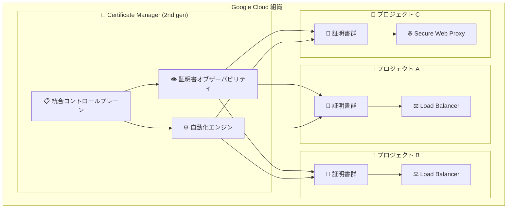

# Certificate Manager: 第 2 世代 (2nd gen) が Preview で利用可能に

**リリース日**: 2026-05-19

**サービス**: Certificate Manager

**機能**: Certificate Manager (2nd gen) - 統合コントロールプレーン

**ステータス**: Preview

📊 [このアップデートのインフォグラフィックを見る](https://takech9203.github.io/google-cloud-news-summary/20260519-certificate-manager-2nd-gen.html)

## 概要

Certificate Manager (2nd gen) が Preview として利用可能になった。第 2 世代の Certificate Manager は、組織全体の証明書を観察、管理、自動化するための統合コントロールプレーンを提供する。これにより、複数プロジェクトにまたがる TLS 証明書のライフサイクル管理が一元化される。

従来の Certificate Manager (第 1 世代) はプロジェクト単位での証明書管理が基本であり、組織全体の証明書の可視性や統合的な管理には限界があった。第 2 世代では、組織レベルでの統一的な証明書管理が可能になり、大規模環境での運用効率が大幅に向上する。

**アップデート前の課題**

- 証明書管理がプロジェクト単位で分散しており、組織全体の証明書状態を一元的に把握することが困難だった
- 複数プロジェクトにまたがる証明書の有効期限監視や更新作業を個別に管理する必要があった
- 組織横断的な証明書ポリシーの適用や自動化の仕組みが限定的だった

**アップデート後の改善**

- 統合コントロールプレーンにより、組織全体の証明書を単一のインターフェースから観察・管理できるようになった
- 証明書の自動化機能が強化され、組織レベルでの一貫した証明書ライフサイクル管理が可能になった
- 複数プロジェクトにわたる証明書の可視性が向上し、有効期限切れリスクの早期検知が容易になった

## アーキテクチャ図

Certificate Manager (2nd gen) は統合コントロールプレーンを通じて、組織内の複数プロジェクトにまたがる証明書を一元的に管理し、オブザーバビリティと自動化を提供する。

## サービスアップデートの詳細

### 主要機能

1. **統合コントロールプレーン (Unified Control Plane)**
   - 組織全体の証明書を単一の管理画面から操作可能
   - プロジェクトをまたいだ証明書の一覧表示と状態確認
   - 組織レベルでの証明書ポリシー管理

2. **証明書オブザーバビリティ (Observe)**
   - 組織内のすべての証明書のステータスをリアルタイムで可視化
   - 有効期限切れが近い証明書の検知とアラート
   - 証明書の使用状況やデプロイ先の把握

3. **証明書自動化 (Automate)**
   - 証明書の発行・更新・ローテーションの自動化
   - 組織全体での一貫した証明書ライフサイクル管理
   - Google マネージド証明書の自動プロビジョニング

## 技術仕様

### Certificate Manager 第 1 世代との比較

| 項目 | 第 1 世代 | 第 2 世代 (Preview) |
|------|-----------|---------------------|
| 管理スコープ | プロジェクト単位 | 組織全体 |
| 証明書の可視性 | プロジェクト内のみ | 組織横断 |
| コントロールプレーン | プロジェクトレベル | 統合 (組織レベル) |
| ステータス | GA | Preview |

### サポートされる証明書タイプ (第 1 世代の機能に基づく)

| 証明書タイプ | 説明 |
|-------------|------|
| Google マネージド証明書 | Google Cloud が自動的に取得・管理する証明書 |
| セルフマネージド証明書 | ユーザーが独自に取得・アップロードする証明書 |
| パブリック証明書 | Public CA または Let's Encrypt から発行 |
| プライベート証明書 | Certificate Authority Service (CA Service) から発行 |

## メリット

### ビジネス面

- **運用コスト削減**: 組織全体の証明書管理を一元化することで、管理工数が削減される
- **コンプライアンス強化**: 組織全体での証明書状態の可視化により、セキュリティ監査対応が容易になる
- **ダウンタイムリスク低減**: 有効期限切れ証明書の早期検知により、サービス中断リスクを最小化できる

### 技術面

- **統合管理**: 複数プロジェクトにまたがる証明書を単一のインターフェースで操作可能
- **自動化の向上**: 証明書ライフサイクルの自動化範囲が組織全体に拡大
- **オブザーバビリティ**: 組織レベルでの証明書モニタリングとアラートが実現

## デメリット・制約事項

### 制限事項

- 現時点では Preview ステータスのため、本番環境での利用には SLA が適用されない
- Preview 期間中は機能や API に変更が入る可能性がある

### 考慮すべき点

- 第 1 世代から第 2 世代への移行パスや互換性については、GA 時点での公式ガイダンスを確認する必要がある
- 組織レベルの権限設定が必要となるため、IAM ポリシーの設計を事前に検討すべき

## ユースケース

### ユースケース 1: 大規模マルチプロジェクト環境での証明書一元管理

**シナリオ**: 数十のプロジェクトにまたがるマイクロサービスアーキテクチャを運用しており、各プロジェクトで独立して証明書を管理している。証明書の有効期限切れによるサービス中断が発生するリスクがある。

**効果**: Certificate Manager (2nd gen) の統合コントロールプレーンにより、すべてのプロジェクトの証明書状態を一元的に監視し、有効期限切れ前に自動更新を適用できる。

### ユースケース 2: セキュリティチームによる組織全体の証明書監査

**シナリオ**: セキュリティチームが定期的に組織全体の TLS 証明書のコンプライアンス状態を確認する必要がある。従来はプロジェクトごとに個別確認が必要だった。

**効果**: 組織レベルでの証明書オブザーバビリティにより、すべての証明書の状態、有効期限、デプロイ先を一覧で確認でき、監査作業が効率化される。

## 関連サービス・機能

- **Certificate Authority Service (CA Service)**: プライベート証明書の発行に使用される認証局サービス。Certificate Manager と連携してプライベート Google マネージド証明書を発行する
- **Cloud Load Balancing**: Certificate Manager で管理する証明書の主要なデプロイ先。Application Load Balancer および proxy Network Load Balancer をサポート
- **Secure Web Proxy**: リージョナル証明書のデプロイ先として Certificate Manager と連携
- **Media CDN**: グローバル証明書のデプロイ先として Certificate Manager と連携
- **Cloud Monitoring**: 証明書の有効期限監視やアラートポリシーの設定に使用
- **Cloud Logging**: 証明書の作成・更新・有効期限に関するログの記録と監査

## 参考リンク

- 📊 [インフォグラフィック](https://takech9203.github.io/google-cloud-news-summary/20260519-certificate-manager-2nd-gen.html)
- [公式リリースノート](https://docs.cloud.google.com/release-notes#May_19_2026)
- [Certificate Manager ドキュメント](https://docs.cloud.google.com/certificate-manager/docs/overview)
- [Certificate Manager ベストプラクティス](https://docs.cloud.google.com/certificate-manager/docs/certificate-manager-best-practices)
- [Certificate Manager コアコンポーネント](https://docs.cloud.google.com/certificate-manager/docs/core-components)

## まとめ

Certificate Manager (2nd gen) は、組織全体の証明書管理を統合コントロールプレーンで実現する次世代ソリューションである。Preview 段階ではあるが、大規模な Google Cloud 環境を運用する組織にとって、証明書管理の可視性と自動化を大幅に向上させる重要なアップデートだ。GA に向けて、組織レベルでの証明書管理戦略の見直しと、第 2 世代への移行計画の検討を推奨する。

---

**タグ**: #CertificateManager #Security #TLS #Preview #証明書管理 #組織管理 #自動化
