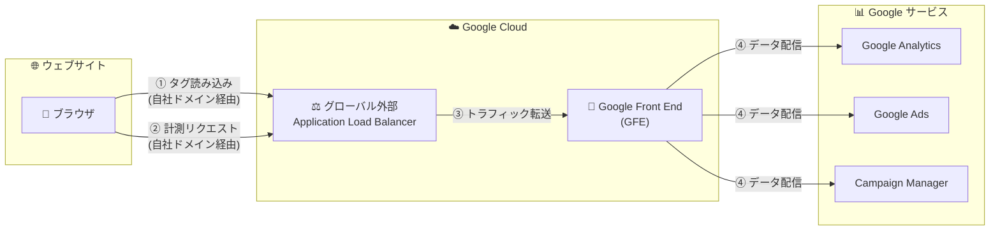

# Cloud Load Balancing: Google tag gateway for advertisers

**リリース日**: 2026-05-19

**サービス**: Cloud Load Balancing

**機能**: Google tag gateway for advertisers

**ステータス**: Feature

📊 [このアップデートのインフォグラフィックを見る](https://takech9203.github.io/google-cloud-news-summary/20260519-cloud-load-balancing-google-tag-gateway.html)

## 概要

Google tag gateway for advertisers が Cloud Load Balancing と統合され、ウェブサイトオーナーが Google Cloud を通じて Google タグをホストおよびデプロイできるようになった。グローバル外部アプリケーション ロードバランサを使用して、ウェブサイトの計測トラフィックを自社ドメイン経由でルーティングすることで、計測データの精度が向上する。

この機能により、広告キャンペーンの最適化に必要な信頼性の高いデータを取得できるようになる。従来の Google タグ設定では、ウェブページが Google ドメインからタグをリクエストし、タグが発火するとサードパーティドメインを経由して計測リクエストが送信されていた。Google tag gateway for advertisers を利用すると、タグはファーストパーティドメインから読み込まれ、計測リクエストもファーストパーティドメインを経由して送信されるため、ブラウザのサードパーティ Cookie 制限やトラッキング防止機能の影響を受けにくくなる。

**アップデート前の課題**

- Google タグは Google ドメイン (googletagmanager.com 等) から読み込まれるため、サードパーティリクエストとして扱われていた
- ブラウザのプライバシー機能やアドブロッカーにより、計測リクエストがブロックされる可能性があった
- サードパーティ Cookie の制限強化により、コンバージョン計測の精度が低下する傾向にあった
- 計測データの欠損により、広告キャンペーンの最適化精度が十分でなかった

**アップデート後の改善**

- グローバル外部アプリケーション ロードバランサを活用し、計測トラフィックを自社ドメイン経由でルーティング可能になった
- ファーストパーティコンテキストでのタグ配信により、ブラウザの制限による計測データの欠損が軽減された
- コンバージョン計測の精度が向上し、広告キャンペーンの最適化がより効果的に行えるようになった
- Google Cloud のインフラを活用した高可用性・高パフォーマンスな計測基盤を構築できるようになった

## アーキテクチャ図

グローバル外部アプリケーション ロードバランサが自社ドメインでリクエストを受け付け、Google のサービスに転送する構成。これによりブラウザから見るとすべてのリクエストがファーストパーティドメインへの通信となる。

## サービスアップデートの詳細

### 主要機能

1. **ファーストパーティドメインでのタグ配信**
   - Google タグ (gtag.js / GTM コンテナ) を自社ドメインから配信
   - サードパーティリクエストとして扱われないため、ブラウザの制限を回避
   - 広告ブロッカーによるブロックリスクの軽減

2. **計測トラフィックのドメインルーティング**
   - タグ発火時の計測リクエストを自社ドメイン経由でルーティング
   - ファーストパーティ Cookie としてデータを保持可能
   - コンバージョンデータの精度向上

3. **Google Cloud インフラの活用**
   - グローバル外部アプリケーション ロードバランサによる高可用性
   - Google Front End (GFE) を活用したグローバル分散
   - Premium Tier ネットワークによる低レイテンシ

## 技術仕様

### 対応ロードバランサ

| 項目 | 詳細 |
|------|------|
| ロードバランサタイプ | グローバル外部アプリケーション ロードバランサ |
| レイヤー | Layer 7 (HTTP/HTTPS) |
| ネットワークティア | Premium Tier |
| IP アドレス | グローバル Anycast 外部 IP |
| SSL/TLS 終端 | サポート |

### 前提条件

| 項目 | 詳細 |
|------|------|
| Google タグ | gtag.js または Tag Manager コンテナが設置済みであること |
| ロードバランサ | 外部エンドポイントへリクエスト転送可能な CDN またはロードバランサ |
| ドメイン | ウェブサイトと同一ドメインまたはサブドメインの DNS 設定 |

### 対応する Google 広告・計測プロダクト

- Google Ads (コンバージョントラッキング、リマーケティング)
- Google Analytics
- Campaign Manager 360
- Display & Video 360
- Search Ads 360

## メリット

### ビジネス面

- **コンバージョン計測精度の向上**: ファーストパーティコンテキストにより、従来計測できなかったコンバージョンを回復し、広告 ROI の可視性が改善
- **広告キャンペーン最適化の強化**: より正確なデータに基づく入札最適化やオーディエンスターゲティングが可能
- **将来のプライバシー規制への対応**: サードパーティ Cookie 廃止後も計測を継続できる耐久性の高いタグ構成

### 技術面

- **Google Cloud ネイティブ統合**: 既存の Cloud Load Balancing インフラを活用でき、追加の専用サーバー不要
- **グローバル分散**: Google のエッジネットワークを活用し、世界中のユーザーに低レイテンシで対応
- **自動スケーリング**: トラフィック増加時もプレウォーミング不要で自動的にスケール
- **プライバシーバイデフォルト**: ファーストパーティインフラでのデータ処理により、データガバナンスを強化

## デメリット・制約事項

### 制限事項

- グローバル外部アプリケーション ロードバランサの利用が必要 (Regional やPassthrough タイプは非対応)
- Premium Tier ネットワークが必要 (Standard Tier では利用不可)
- ウェブサイトのドメイン DNS 設定の変更が必要

### 考慮すべき点

- ロードバランサの追加料金が発生する (データ処理料金、転送ルール料金)
- 既存のロードバランサ構成がある場合、URL マップの設計変更が必要になる可能性がある
- 計測トラフィックが自社の Cloud プロジェクトを経由するため、トラフィック量に応じたコスト管理が重要

## ユースケース

### ユースケース 1: EC サイトのコンバージョン計測改善

**シナリオ**: 大規模 EC サイトで、ブラウザのプライバシー機能強化により Google Ads のコンバージョン計測が 15-20% 欠損しており、広告入札の最適化に支障が出ている。

**効果**: Google tag gateway for advertisers をグローバル外部アプリケーション ロードバランサで構築することで、計測リクエストがファーストパーティドメインから送信され、コンバージョンデータの欠損を回復。広告 ROAS の可視性が改善し、入札最適化の精度が向上。

### ユースケース 2: グローバル展開企業の統合計測基盤

**シナリオ**: 複数国にウェブサイトを展開する企業が、各国のプライバシー規制に対応しつつ、統一的な広告効果測定基盤を構築したい。

**効果**: Google Cloud のグローバルロードバランサを活用することで、単一の IP アドレスで全世界のユーザーからの計測トラフィックを処理。各国のユーザーに最も近い GFE で接続を終端し、低レイテンシで計測データを収集。Consent Mode との併用でリージョン別のプライバシー要件にも対応可能。

## 料金

Google tag gateway for advertisers 自体の追加料金は公式ドキュメントでは明記されていないが、グローバル外部アプリケーション ロードバランサの標準料金が適用される。

主な料金要素:
- 転送ルール料金 (時間あたり)
- インバウンドデータ処理料金 (GB あたり、リージョンにより異なる)
- Premium Tier ネットワーク Egress 料金

詳細は [Cloud Load Balancing の料金ページ](https://cloud.google.com/load-balancing/pricing) を参照。

## 関連サービス・機能

- **Google Tag Manager**: サーバーサイドタギングと組み合わせることで、さらに耐久性の高いタグ構成を実現
- **Cloud CDN**: ロードバランサと組み合わせてタグスクリプトのキャッシュ配信が可能
- **Google Cloud Armor**: ロードバランサの前段で不正なトラフィックをフィルタリング
- **Cloud Logging**: ロードバランサのリクエストログで計測トラフィックの監視・分析が可能
- **Consent Mode**: リージョン別のプライバシー設定と併用し、規制遵守と計測精度を両立

## 参考リンク

- 📊 [インフォグラフィック](https://takech9203.github.io/google-cloud-news-summary/20260519-cloud-load-balancing-google-tag-gateway.html)
- [公式リリースノート](https://docs.cloud.google.com/release-notes#May_19_2026)
- [Google tag gateway for advertisers ドキュメント](https://developers.google.com/tag-platform/tag-manager/gateway)
- [Google tag gateway セットアップガイド](https://developers.google.com/tag-platform/tag-manager/gateway/setup-guide)
- [Cloud Load Balancing ドキュメント](https://cloud.google.com/load-balancing/docs/https)
- [Cloud Load Balancing 料金](https://cloud.google.com/load-balancing/pricing)

## まとめ

Google tag gateway for advertisers の Cloud Load Balancing 統合は、サードパーティ Cookie 制限が進む中で広告計測の精度を維持・向上させる重要なアップデートである。グローバル外部アプリケーション ロードバランサを活用することで、Google Cloud のグローバルインフラ上にファーストパーティ計測基盤を構築でき、コンバージョンデータの回復と広告最適化の改善が期待できる。Google Ads や Google Analytics を活用している広告主は、計測精度向上のために導入を検討すべきである。

---

**タグ**: #CloudLoadBalancing #GoogleTagGateway #Advertising #FirstPartyData #ConversionTracking #ApplicationLoadBalancer
