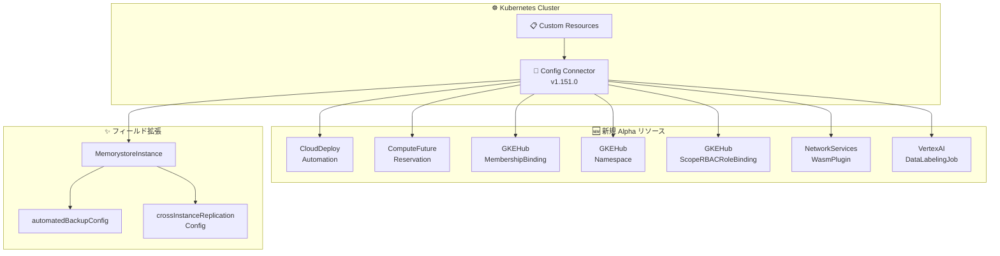

# Config Connector: バージョン 1.151.0 リリース

**リリース日**: 2026-05-19

**サービス**: Config Connector

**機能**: v1.151.0 - 新規 Alpha リソース追加とフィールド拡張

**ステータス**: Alpha / Feature

📊 [このアップデートのインフォグラフィックを見る](https://takech9203.github.io/google-cloud-news-summary/20260519-config-connector-v1-151-0.html)

## 概要

Config Connector バージョン 1.151.0 がリリースされた。本バージョンでは、Direct Reconciler を使用する 7 つの新規 Alpha リソースが追加され、Cloud Deploy、Compute Engine、GKE Hub、Network Services、Vertex AI など幅広いサービスの Kubernetes ネイティブ管理が可能になった。

さらに、MemorystoreInstance リソースに自動バックアップ設定 (automatedBackupConfig) とクロスインスタンスレプリケーション設定 (crossInstanceReplicationConfig) を含む複数の新フィールドが追加され、Memorystore のデータ保護と高可用性構成を Kubernetes マニフェストから宣言的に管理できるようになった。

Config Connector は Kubernetes の Custom Resource Definition (CRD) を通じて Google Cloud リソースを管理するオープンソースのアドオンであり、GitOps ワークフローやインフラストラクチャのコード化 (IaC) を実践するチームにとって重要なツールである。

**アップデート前の課題**

- Cloud Deploy Automation、Compute Future Reservation、GKE Hub の MembershipBinding/Namespace/ScopeRBACRoleBinding、Network Services WasmPlugin、Vertex AI DataLabelingJob を Config Connector で管理できなかった
- Memorystore インスタンスの自動バックアップやクロスインスタンスレプリケーションを Kubernetes マニフェストから宣言的に設定できなかった
- これらのリソースを管理するには、gcloud CLI、Terraform、またはコンソールなど別のツールを併用する必要があった

**アップデート後の改善**

- 7 つの新規 Alpha リソースにより、CI/CD パイプライン自動化、キャパシティプランニング、フリート管理、サービスメッシュ拡張、データラベリングを Kubernetes から一元管理可能に
- MemorystoreInstance の新フィールドにより、バックアップポリシーとレプリケーション構成を Kubernetes マニフェストで宣言的に定義可能に
- Direct Reconciler の採用により、従来の Terraform ベースの Reconciler と比較して信頼性とパフォーマンスが向上

## アーキテクチャ図



Config Connector v1.151.0 が Kubernetes CRD を通じて新規 Alpha リソースと拡張フィールドを Google Cloud API に同期する構成を示す。

## サービスアップデートの詳細

### 主要機能

1. **新規 Alpha リソース (Direct Reconciler)**

   以下の 7 リソースが新たに Alpha サポートされた。Direct Reconciler を使用するため、`alpha.cnrm.cloud.google.com/reconciler: direct` アノテーションを付与して利用する。

   - **CloudDeployAutomation**: Cloud Deploy のデリバリーパイプラインにおけるリリースの自動プロモーションやロールアウトの自動進行を管理
   - **ComputeFutureReservation**: Compute Engine の将来のキャパシティ予約を管理し、ピーク時のリソース確保を計画的に実施
   - **GKEHubMembershipBinding**: GKE フリートのメンバーシップとスコープのバインディングを管理
   - **GKEHubNamespace**: GKE フリートのスコープ内ネームスペースを管理
   - **GKEHubScopeRBACRoleBinding**: GKE フリートのスコープレベル RBAC ロールバインディングを管理
   - **NetworkServicesWasmPlugin**: Service Extensions の Wasm プラグインを管理し、ロードバランサーのデータパスにカスタムロジックを注入
   - **VertexAIDataLabelingJob**: Vertex AI のデータラベリングジョブを管理し、ML モデルの学習データ準備を自動化

2. **MemorystoreInstance 新規フィールド**

   - `spec.automatedBackupConfig`: 自動バックアップの有効化/無効化、保持期間 (1〜365 日)、スケジュール設定
   - `spec.crossInstanceReplicationConfig`: クロスインスタンスレプリケーションのロール設定 (none/primary/secondary)
   - `spec.maintenanceVersion`: メンテナンスバージョンの指定
   - `status.observedState.availableMaintenanceVersions`: 利用可能なメンテナンスバージョンの確認
   - `status.observedState.crossInstanceReplicationConfig`: 実際のレプリケーション構成状態の観測

## 技術仕様

### 新規 Alpha リソース一覧

| リソース名 | 対応サービス | 主な用途 |
|-----------|------------|---------|
| CloudDeployAutomation | Cloud Deploy | リリース自動プロモーション、ロールアウト自動進行 |
| ComputeFutureReservation | Compute Engine | 将来のキャパシティ予約 |
| GKEHubMembershipBinding | GKE Hub (Fleet) | メンバーシップとスコープのバインディング |
| GKEHubNamespace | GKE Hub (Fleet) | フリートスコープ内ネームスペース管理 |
| GKEHubScopeRBACRoleBinding | GKE Hub (Fleet) | スコープレベル RBAC 管理 |
| NetworkServicesWasmPlugin | Service Extensions | Wasm ベースのプラグイン管理 |
| VertexAIDataLabelingJob | Vertex AI | データラベリングジョブ管理 |

### MemorystoreInstance 新規フィールド

| フィールド | 種別 | 説明 |
|-----------|------|------|
| `spec.automatedBackupConfig` | spec | 自動バックアップ設定 (モード、保持期間、スケジュール) |
| `spec.crossInstanceReplicationConfig` | spec | レプリケーションロール (none/primary/secondary) |
| `spec.maintenanceVersion` | spec | 適用するメンテナンスバージョン |
| `status.observedState.availableMaintenanceVersions` | status | 利用可能なメンテナンスバージョン一覧 |
| `status.observedState.crossInstanceReplicationConfig` | status | 現在のレプリケーション構成状態 |

### Direct Reconciler のオプトイン方法

```yaml
apiVersion: memorystore.cnrm.cloud.google.com/v1alpha1
kind: MemorystoreInstance
metadata:
  name: my-memorystore-instance
  annotations:
    alpha.cnrm.cloud.google.com/reconciler: direct
spec:
  automatedBackupConfig:
    mode: enabled
    retention: "2592000s"  # 30 days
  crossInstanceReplicationConfig:
    role: primary
```

## 設定方法

### 前提条件

1. Config Connector v1.151.0 がインストールされていること
2. 対応する Google Cloud API が有効化されていること
3. Config Connector のサービスアカウントに適切な IAM ロールが付与されていること

### 手順

#### ステップ 1: Config Connector のアップグレード

```bash
# GKE アドオンを使用している場合は自動更新
# Operator を使用している場合は手動アップグレード
kubectl apply -f https://raw.githubusercontent.com/GoogleCloudPlatform/k8s-config-connector/v1.151.0/operator-system/configconnector-operator.yaml
```

#### ステップ 2: 新規 Alpha リソースの使用

```yaml
# CloudDeployAutomation の例
apiVersion: clouddeploy.cnrm.cloud.google.com/v1alpha1
kind: CloudDeployAutomation
metadata:
  name: my-automation
  annotations:
    alpha.cnrm.cloud.google.com/reconciler: direct
spec:
  # リソース固有の設定
```

Alpha リソースを使用するには `alpha.cnrm.cloud.google.com/reconciler: direct` アノテーションを必ず付与する。

## メリット

### ビジネス面

- **運用統一化**: Kubernetes マニフェストで Google Cloud リソースを一元管理でき、ツールの分散による運用コストを削減
- **GitOps 対応強化**: 新たに 7 リソースが GitOps ワークフローに組み込み可能になり、変更の追跡とレビューが容易に
- **マルチサービス連携の自動化**: Cloud Deploy の自動化やフリート管理を Kubernetes から制御し、デプロイフローを簡素化

### 技術面

- **Direct Reconciler の信頼性**: 従来の Terraform ベースコントローラーと比較して、API との直接通信による正確な状態同期を実現
- **宣言的なデータ保護**: MemorystoreInstance の自動バックアップとレプリケーションを宣言的に定義し、ドリフト検出と自動修復が可能
- **Eventual Consistency**: Kubernetes のリコンシリエーションループにより、Google Cloud リソースの状態が自動的に desired state に収束

## デメリット・制約事項

### 制限事項

- 新規 Alpha リソースは Alpha ステータスであり、API やフィールドが将来変更される可能性がある
- Direct Reconciler の使用にはアノテーションの明示的な付与が必要
- Alpha リソースは本番環境での使用は推奨されない

### 考慮すべき点

- Alpha から Beta/GA への昇格時に CRD スキーマの変更が発生する可能性があるため、マイグレーション計画が必要
- Config Connector のバージョンアップに伴い CRD の更新が必要な場合がある
- Direct Reconciler はリソースごとにオプトインが必要であり、既存リソースへの適用には注意が必要

## ユースケース

### ユースケース 1: GitOps によるデプロイパイプライン全体の管理

**シナリオ**: Cloud Deploy のデリバリーパイプラインと自動化ルール (自動プロモーション、自動ロールアウト進行) を、アプリケーションのマニフェストと同じ Git リポジトリで管理したい。

**実装例**:
```yaml
apiVersion: clouddeploy.cnrm.cloud.google.com/v1alpha1
kind: CloudDeployAutomation
metadata:
  name: promote-to-staging
  annotations:
    alpha.cnrm.cloud.google.com/reconciler: direct
spec:
  deliveryPipelineRef:
    name: my-pipeline
  serviceAccount: "deploy-sa@project.iam.gserviceaccount.com"
  selector:
    targets:
      - id: dev
  rules:
    - promoteReleaseRule:
        id: "promote-release"
        wait: "60s"
        destinationTargetId: "@next"
```

**効果**: デプロイの自動化ルールがコードとして管理され、変更履歴の追跡、コードレビュー、ロールバックが容易になる。

### ユースケース 2: Memorystore の災害復旧構成の自動化

**シナリオ**: Memorystore インスタンスのクロスリージョンレプリケーションと自動バックアップを Kubernetes マニフェストで定義し、災害復旧要件を宣言的に管理したい。

**効果**: バックアップポリシーとレプリケーション構成がコードとして管理され、ドリフト検出による自動修復と、災害復旧要件の監査が容易になる。

## 料金

Config Connector 自体は無料のオープンソースツールである。GKE クラスター上で動作し、管理対象の Google Cloud リソースに対して通常の料金が発生する。

- [Config Connector の料金について](https://cloud.google.com/config-connector/docs/overview)
- 管理対象リソースの料金は各サービスの料金ページを参照

## 関連サービス・機能

- **Cloud Deploy**: デリバリーパイプラインの自動化を Config Connector で宣言的に管理
- **Compute Engine (Future Reservations)**: キャパシティプランニングにおける将来の予約をコードで管理
- **GKE Hub (Fleet Management)**: マルチクラスターのフリート管理 (メンバーシップバインディング、ネームスペース、RBAC) を統合管理
- **Service Extensions (Network Services)**: ロードバランサーの Wasm プラグインを Kubernetes から管理
- **Vertex AI**: データラベリングジョブの作成と管理を自動化
- **Memorystore**: 自動バックアップとクロスインスタンスレプリケーションの宣言的管理

## 参考リンク

- 📊 [インフォグラフィック](https://takech9203.github.io/google-cloud-news-summary/20260519-config-connector-v1-151-0.html)
- [公式リリースノート](https://docs.cloud.google.com/release-notes#May_19_2026)
- [Config Connector ドキュメント](https://docs.cloud.google.com/config-connector/docs/overview)
- [Config Connector リソース一覧](https://docs.cloud.google.com/config-connector/docs/reference/overview)
- [Config Connector GitHub リポジトリ](https://github.com/GoogleCloudPlatform/k8s-config-connector)
- [Direct Reconciler 開発ガイド](https://github.com/GoogleCloudPlatform/k8s-config-connector/tree/master/docs/develop-resources)

## まとめ

Config Connector v1.151.0 は、Cloud Deploy Automation、Compute Future Reservation、GKE Hub フリート管理リソース、Network Services WasmPlugin、Vertex AI DataLabelingJob の 7 つの新規 Alpha リソースを追加し、Kubernetes からの Google Cloud 管理範囲を大幅に拡張した。また、MemorystoreInstance の自動バックアップとクロスインスタンスレプリケーション設定のサポートにより、データ保護構成の宣言的管理が可能になった。GitOps やインフラストラクチャのコード化を推進するチームは、これらの新リソースの Alpha 段階からの評価を検討すべきである。

---

**タグ**: #ConfigConnector #Kubernetes #IaC #GitOps #CloudDeploy #ComputeEngine #GKEHub #Fleet #NetworkServices #WasmPlugin #VertexAI #Memorystore #DirectReconciler #Alpha
