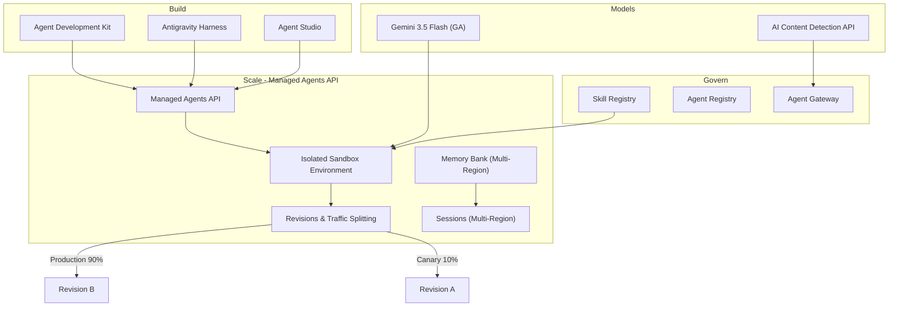

# Gemini Enterprise Agent Platform: Managed Agents API / Gemini 3.5 Flash GA / Skill Registry / AI Content Detection API

**リリース日**: 2026-05-19

**サービス**: Gemini Enterprise Agent Platform

**機能**: Managed Agents API、Gemini 3.5 Flash GA、Agent Revisions & Traffic Splitting、Skill Registry、AI Content Detection API、Memory Bank マルチリージョン対応

**ステータス**: GA (Gemini 3.5 Flash) / Preview (Managed Agents API、Skill Registry、AI Content Detection API) / Change (Memory Bank マルチリージョン)

:bar_chart: [このアップデートのインフォグラフィックを見る](https://takech9203.github.io/google-cloud-news-summary/20260519-gemini-enterprise-agent-platform-managed-agents-api.html)

## 概要

Gemini Enterprise Agent Platform に複数の重要なアップデートが同時に発表された。最も注目すべきは、Gemini 3.5 Flash モデルの一般提供開始 (GA) と、Managed Agents API のパブリックプレビュー公開である。Managed Agents API により、Antigravity ハーネスを含む構成ベースで構築した自律型エージェントを、フルマネージドかつ隔離されたサンドボックス環境で実行・スケールできるようになった。

加えて、エージェントのリビジョン管理とトラフィック分割がパブリックプレビューとなり、カナリアデプロイや新バージョンの安全なテストが可能になった。Skill Registry (Preview) によりエージェントスキルの管理と発見が一元化され、AI Content Detection API (Preview) も利用可能となった。さらに、Memory Bank と Sessions のマルチリージョンデプロイメント対応も追加された。

これらのアップデートは、エンタープライズグレードの AI エージェントを本番環境で構築・運用するチーム全般に影響する。特に、エージェントのライフサイクル管理、安全なデプロイメント戦略、スキルの再利用性向上に焦点が当てられている。

**アップデート前の課題**

- エージェントのデプロイ後にバージョン管理が困難で、新旧バージョンの切り替えにリスクが伴っていた
- エージェントスキルが個別のプロジェクトに散在し、組織全体での発見・再利用が難しかった
- Antigravity ハーネスで構築したエージェントをマネージド環境で直接実行するための API が不足していた
- Memory Bank と Sessions は単一リージョンでの運用に限定されていた

**アップデート後の改善**

- Managed Agents API により、Antigravity ハーネスを含む自律型エージェントをフルマネージドサンドボックスで実行可能に
- イミュータブルなリビジョンを作成し、トラフィック分割によるカナリアデプロイが実現
- Skill Registry でスキルをパッケージとして一元管理し、組織全体で低レイテンシに発見・利用可能に
- Memory Bank と Sessions がマルチリージョン (us, eu) およびグローバルエンドポイントに対応

## アーキテクチャ図



Gemini Enterprise Agent Platform のアーキテクチャ全体像。Build 層で構築されたエージェントが Managed Agents API を通じてサンドボックス環境にデプロイされ、リビジョン管理とトラフィック分割により安全な運用が実現される。

## サービスアップデートの詳細

### 主要機能

1. **Gemini 3.5 Flash 一般提供開始 (GA)**
   - Gemini モデルファミリーの最新 Flash モデルが GA に昇格
   - 高速推論と低レイテンシを特徴とし、エージェントのリアルタイム処理に最適化
   - Standard PayGo、Priority PayGo、Provisioned Throughput、Batch Prediction に対応

2. **Managed Agents API (Preview)**
   - 自律型エージェントの構築とスケーリングを可能にする新しい API
   - Antigravity ハーネスによる構成ベースのエージェント構築をサポート
   - フルマネージドかつ隔離されたサンドボックス環境で実行
   - ツールとスキルを装備したエージェントに専用 API 経由でアクセス可能

3. **Agent Revisions & Traffic Splitting (Preview)**
   - デプロイ済みエージェントのイミュータブルなリビジョン (スナップショット) を作成可能
   - 複数のアクティブなリビジョン間でトラフィックをパーセンテージベースで分割
   - 「常に最新リビジョンへ」モードも選択可能
   - カナリアデプロイや A/B テストによる安全なバージョン移行を実現
   - v1beta1 API を通じて利用可能

4. **Skill Registry (Preview)**
   - セキュアでプライベートな低レイテンシのスキルリポジトリ
   - スキルを自己完結型パッケージ (手順、コード、ドキュメント含む) として保存
   - エージェントの能力を拡張するためのスキル発見・管理機能を提供
   - Agent Registry と連携し組織全体でのスキル共有が可能

5. **AI Content Detection API (Preview)**
   - AI が生成したコンテンツを検出するための専用 API
   - コンテンツの信頼性検証やポリシー適用に活用可能

6. **Memory Bank & Sessions マルチリージョン対応 (Change)**
   - マルチリージョンエンドポイント (`us`, `eu`) に対応
   - グローバルエンドポイント (`global`) にも対応
   - データレジデンシー要件を満たしつつグローバルなエージェント展開が可能

## 技術仕様

### Revisions & Traffic Splitting

| 項目 | 詳細 |
|------|------|
| API バージョン | v1beta1 |
| トラフィック分割モード | Manual (パーセンテージ指定) / Always Latest (最新リビジョンへ自動ルーティング) |
| リビジョン状態 | Active (クエリ可能) / Deprecated (クエリ不可) |
| パーセンテージ指定 | 整数値、合計 100% |
| 特定リビジョンへの直接アクセス | リビジョンリソースパスを指定してトラフィック分割をバイパス可能 |

### バージョン管理対象フィールド (Versioned Fields)

| カテゴリ | フィールド |
|---------|-----------|
| PackageSpec | pickleObjectGcsUri, dependencyFilesGcsUri, requirementsGcsUri, pythonVersion |
| DeploymentSpec | env[], secretEnv[], firstPartyImageOverride, agentServerMode, minInstances, maxInstances, resourceLimits, containerConcurrency |
| その他 | classMethods[], agentFramework, SourceCodeSpec, identityType, agentCard[] |

### Memory Bank マルチリージョン対応

| エンドポイントタイプ | ロケーション設定 |
|-------------------|-----------------|
| グローバル | `global` |
| マルチリージョン (米国) | `us` |
| マルチリージョン (EU) | `eu` |

## 設定方法

### 前提条件

1. Google Cloud プロジェクトと課金の有効化
2. Agent Platform API の有効化
3. Agent Platform SDK (Python) の最新版インストール

### 手順

#### ステップ 1: トラフィック分割の設定 (Python SDK)

```python
import vertexai
from google.genai import types as genai_types

http_options = genai_types.HttpOptions(
    api_version="v1beta1",
)

client = vertexai.Client(
    project="PROJECT_ID",
    location="LOCATION",
    http_options=http_options,
)

client.agent_engines.update(
    name="projects/PROJECT_ID/locations/LOCATION/reasoningEngines/RESOURCE_ID",
    config={
        "traffic_config": {
            "trafficSplitManual": {
                "targets": [
                    {
                        "runtimeRevisionName": "projects/PROJECT_ID/locations/LOCATION/reasoningEngines/RESOURCE_ID/runtimeRevisions/REVISION_ID_1",
                        "percent": 90,
                    },
                    {
                        "runtimeRevisionName": "projects/PROJECT_ID/locations/LOCATION/reasoningEngines/RESOURCE_ID/runtimeRevisions/REVISION_ID_2",
                        "percent": 10,
                    },
                ]
            }
        }
    },
)
```

#### ステップ 2: リビジョン一覧の確認

```python
revisions = client.agent_engines.runtimes.revisions.list(
    name="projects/PROJECT_ID/locations/LOCATION/reasoningEngines/RESOURCE_ID"
)

for revision in revisions:
    print(revision)
```

#### ステップ 3: Memory Bank のマルチリージョン設定

```python
# グローバルエンドポイントの場合
client = vertexai.Client(
    project="PROJECT_ID",
    location="global",
    http_options=http_options,
)

# EU マルチリージョンの場合
client = vertexai.Client(
    project="PROJECT_ID",
    location="eu",
    http_options=http_options,
)
```

## メリット

### ビジネス面

- **リスク低減されたデプロイ**: トラフィック分割によるカナリアデプロイで、新バージョンの問題を本番トラフィックの一部で早期検出できる
- **グローバル展開の容易化**: Memory Bank のマルチリージョン対応により、データレジデンシー要件を満たしながらグローバルなエージェントサービスを提供可能
- **スキルの再利用による開発効率向上**: Skill Registry により既存スキルの発見・再利用が促進され、重複開発を削減

### 技術面

- **フルマネージドサンドボックス**: エージェントの実行環境をセキュアに隔離し、インフラ管理を不要に
- **イミュータブルなリビジョン**: バージョン管理の確実性が向上し、ロールバックが容易に
- **Antigravity ハーネス統合**: 構成ベースのエージェント定義からマネージド環境へのシームレスなデプロイ

## デメリット・制約事項

### 制限事項

- Managed Agents API、Skill Registry、AI Content Detection API は Preview 段階であり、本番ワークロードへの利用は限定的サポート
- Revisions & Traffic Splitting は v1beta1 API 経由でのみ利用可能
- 古いリビジョンを放置するとリソースクォータを消費するため、不要なリビジョンの削除が必要
- Memory Bank はすべてのリージョンでサポートされているわけではない (Jakarta、Melbourne、Toronto など一部非対応)

### 考慮すべき点

- Preview 機能は Pre-GA Offerings Terms が適用され、SLA の対象外
- トラフィック分割のパーセンテージは整数のみ指定可能 (細かい比率設定に制約)
- リビジョンの Deprecated 状態への移行後はクエリ不可となるため、依存関係の確認が必要

## ユースケース

### ユースケース 1: カナリアデプロイによる新エージェントバージョンのリリース

**シナリオ**: カスタマーサポートエージェントの新バージョンをリリースする際、全トラフィックを一度に切り替えるのではなく、段階的にロールアウトしたい。

**実装例**:
```python
# Phase 1: 新リビジョンに 5% のトラフィックを流す
config = {
    "traffic_config": {
        "trafficSplitManual": {
            "targets": [
                {"runtimeRevisionName": "...revisions/v1", "percent": 95},
                {"runtimeRevisionName": "...revisions/v2", "percent": 5},
            ]
        }
    }
}

# Phase 2: 問題なければ段階的に増加 (25% -> 50% -> 100%)
```

**効果**: 新バージョンに問題がある場合、影響範囲を最小限に抑えつつ迅速にロールバック可能

### ユースケース 2: Skill Registry を活用したマルチエージェントシステム

**シナリオ**: 組織内で複数のチームがエージェントを開発しており、共通スキル (例: ドキュメント検索、データベースクエリ) の再利用を促進したい。

**効果**: スキルの重複開発を防ぎ、品質の高いスキルを組織全体で共有することで、エージェント開発速度と品質が向上

### ユースケース 3: GDPR 対応のためのマルチリージョン Memory Bank

**シナリオ**: EU ユーザーの個人データを EU 内に保持する必要があるが、エージェントサービスはグローバルに提供したい。

**効果**: Memory Bank の EU マルチリージョンエンドポイントを使用することで、データレジデンシー要件を満たしつつ低レイテンシでのメモリアクセスを実現

## 料金

料金の詳細は公式料金ページを参照。Gemini 3.5 Flash は Standard PayGo、Priority PayGo、Provisioned Throughput、Flex PayGo、Batch Prediction の各消費オプションに対応している。

- [Gemini Enterprise Agent Platform 料金ページ](https://cloud.google.com/gemini-enterprise-agent-platform/generative-ai/pricing)

## 利用可能リージョン

Agent Runtime、Sessions、Memory Bank は以下のリージョンで利用可能:

- **米国**: us-east1, us-east4, us-west1, us-central1
- **ヨーロッパ**: europe-west1, europe-west2, europe-west3, europe-west4, europe-west6, europe-west8, europe-southwest1
- **アジア太平洋**: asia-east1, asia-east2, asia-northeast1 (東京), asia-northeast3, asia-south1, asia-southeast1, asia-southeast2
- **その他**: australia-southeast2, me-west1, northamerica-northeast1, northamerica-northeast2, southamerica-east1
- **マルチリージョン/グローバル**: us, eu, global

## 関連サービス・機能

- **Agent Development Kit (ADK)**: エージェント構築のためのコードファーストフレームワーク。Managed Agents API と連携してデプロイ
- **Agent Registry**: エージェント、MCP サーバー、ツールの一元カタログ。Skill Registry と補完的に機能
- **Agent Gateway**: エージェントのトラフィックルーティング、セキュリティ、モニタリングの集中管理
- **Antigravity**: Google の統合開発環境。ハーネスで構築したエージェントを Managed Agents API でデプロイ可能
- **Model Armor**: エージェントの入出力に対するコンテンツセーフティフィルタリング

## 参考リンク

- :bar_chart: [インフォグラフィック](https://takech9203.github.io/google-cloud-news-summary/20260519-gemini-enterprise-agent-platform-managed-agents-api.html)
- [公式リリースノート](https://docs.cloud.google.com/release-notes#May_19_2026)
- [Agent Platform 概要ドキュメント](https://docs.cloud.google.com/gemini-enterprise-agent-platform/overview)
- [Manage Revisions and Traffic](https://docs.cloud.google.com/gemini-enterprise-agent-platform/scale/runtime/manage-revisions-and-traffic)
- [Memory Bank ドキュメント](https://docs.cloud.google.com/gemini-enterprise-agent-platform/scale/memory-bank)
- [Agent Registry 概要](https://docs.cloud.google.com/agent-registry/overview)
- [Agent Runtime ドキュメント](https://docs.cloud.google.com/gemini-enterprise-agent-platform/build/runtime)
- [利用可能リージョン](https://docs.cloud.google.com/gemini-enterprise-agent-platform/resources/agent-locations)
- [料金ページ](https://cloud.google.com/gemini-enterprise-agent-platform/generative-ai/pricing)

## まとめ

今回のアップデートは、Gemini Enterprise Agent Platform のエージェント運用能力を大幅に強化するものである。Managed Agents API とリビジョン管理・トラフィック分割の組み合わせにより、本番環境でのエージェントのライフサイクル管理がエンタープライズレベルに到達した。特に、カナリアデプロイパターンの導入を検討しているチームは、早期に Preview 機能を評価し、本番運用のデプロイ戦略に組み込むことを推奨する。

---

**タグ**: #GeminiEnterprise #AgentPlatform #ManagedAgents #Gemini35Flash #TrafficSplitting #SkillRegistry #AIContentDetection #MemoryBank #MultiRegion #Preview #GA
