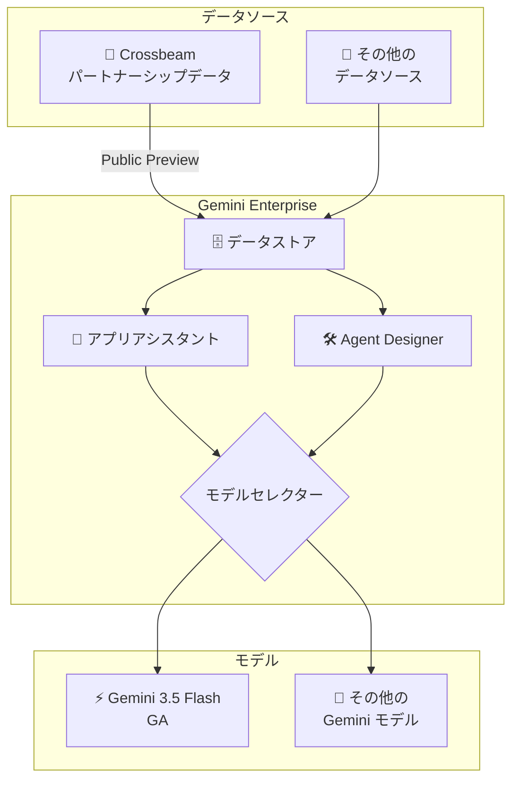

# Gemini Enterprise: Crossbeam データストア対応 & Gemini 3.5 Flash GA

**リリース日**: 2026-05-19

**サービス**: Gemini Enterprise

**機能**: Crossbeam データストア接続 (Preview) / Gemini 3.5 Flash モデル (GA)

**ステータス**: Public Preview / GA

📊 [このアップデートのインフォグラフィックを見る](https://takech9203.github.io/google-cloud-news-summary/20260519-gemini-enterprise-crossbeam-gemini-3-5-flash.html)

## 概要

Gemini Enterprise に 2 つの重要なアップデートが同時にリリースされた。第一に、サードパーティデータソースとして Crossbeam データストアへの接続が Public Preview として利用可能になった。第二に、Gemini 3.5 Flash モデルが GA (一般提供) となり、Global、US、EU リージョンで Gemini Enterprise のアプリアシスタントおよび Agent Designer から選択可能になった。

Crossbeam は企業間のパートナーシップデータを管理するプラットフォームであり、この統合により Gemini Enterprise ユーザーは Crossbeam 内のデータに対して自然言語での検索やグラウンディングが可能になる。一方、Gemini 3.5 Flash の GA 化は、Gemini Enterprise ユーザーが最新の高速モデルを本番ワークロードで活用できることを意味し、従来のモデルセレクターに含まれていた Gemini 2.5 Flash はドロップダウンから削除された。

これらのアップデートは、Gemini Enterprise を利用するエンタープライズユーザーおよびエージェント開発者を主要な対象としている。

**アップデート前の課題**

- Crossbeam のパートナーシップデータを Gemini Enterprise で活用するには、データを別の形式でエクスポートし手動で取り込む必要があった
- Gemini Enterprise のモデルセレクターでは Gemini 2.5 Flash が最新の Flash モデルとして提供されていた
- Agent Designer でエージェントを構築する際に利用可能な Flash モデルは前世代に限定されていた

**アップデート後の改善**

- Crossbeam データストアをネイティブに接続し、パートナーシップデータを直接 Gemini Enterprise の検索・グラウンディングに活用可能になった
- Gemini 3.5 Flash が GA モデルとして利用可能になり、最新の推論性能と高速レスポンスを本番環境で活用できる
- Agent Designer でも Gemini 3.5 Flash を選択してエージェントを構築可能になった

## アーキテクチャ図

Crossbeam データストアが Gemini Enterprise に接続され、アプリアシスタントおよび Agent Designer のモデルセレクターから Gemini 3.5 Flash (GA) を選択してデータを活用する構成を示している。

## サービスアップデートの詳細

### 主要機能

1. **Crossbeam データストア接続 (Public Preview)**
   - Crossbeam のパートナーシップデータを Gemini Enterprise のデータストアとして接続可能
   - サードパーティデータコネクターとして提供され、Google Cloud コンソールから接続設定を実行
   - 接続後はパーミッション対応のエンタープライズ検索やグラウンディングが利用可能
   - データフェデレーションまたはインジェスション (インデックス化) のいずれかの接続方式を選択可能

2. **Gemini 3.5 Flash GA 提供**
   - Global、US、EU リージョンで一般提供開始
   - Gemini Enterprise アプリアシスタントのモデルセレクタードロップダウンから選択可能
   - Agent Designer でエージェント構築時のモデルとして選択可能
   - 現行の GA Flash モデルとして Gemini 2.5 Flash を置き換え (Gemini 2.5 Flash はドロップダウンから削除)

3. **モデルセレクターの更新**
   - Gemini 3.5 Flash が最新の GA Flash モデルとしてデフォルト選択肢に追加
   - Gemini 2.5 Flash はモデルセレクタードロップダウンから削除
   - ユーザーは追加設定なしで新モデルを利用開始可能

## 技術仕様

### Crossbeam データストア

| 項目 | 詳細 |
|------|------|
| ステータス | Public Preview |
| 接続方式 | サードパーティデータコネクター |
| 設定方法 | Google Cloud コンソール |
| データ同期 | フルシンクおよびインクリメンタルシンク対応 |

### Gemini 3.5 Flash

| 項目 | 詳細 |
|------|------|
| ステータス | GA (一般提供) |
| 利用可能リージョン | Global、US、EU |
| 利用可能コンテキスト | アプリアシスタント、Agent Designer |
| 置き換え対象 | Gemini 2.5 Flash (ドロップダウンから削除) |

## 設定方法

### 前提条件

1. Gemini Enterprise のサブスクリプション (Standard、Plus、または Business エディション) を保有していること
2. Gemini Enterprise Admin ロールが付与されていること
3. Crossbeam 接続の場合: Crossbeam アカウントおよび適切な認証情報を保有していること

### 手順

#### ステップ 1: Crossbeam データストアの接続

1. Google Cloud コンソールで Gemini Enterprise ページに移動
2. ナビゲーションメニューから「Data Stores」をクリック
3. 「Create Data Store」をクリック
4. データソース選択ページで「Crossbeam」を検索して選択
5. 認証情報を入力し、同期するエンティティを選択
6. リージョンを選択し、データストア名を入力して「Create」をクリック

#### ステップ 2: Gemini 3.5 Flash の利用

1. Gemini Enterprise ウェブアプリを開く
2. アプリアシスタントまたは Agent Designer でモデルセレクタードロップダウンをクリック
3. 「Gemini 3.5 Flash」を選択

## メリット

### ビジネス面

- **パートナーデータの即座の活用**: Crossbeam のパートナーシップデータを Gemini Enterprise の AI 検索・分析に直接活用でき、パートナー連携戦略の意思決定を高速化
- **最新モデルによる生産性向上**: Gemini 3.5 Flash の高速レスポンスにより、エンタープライズユーザーの日常的な AI アシスタント利用体験が向上

### 技術面

- **ネイティブ統合**: Crossbeam データを手動エクスポート・変換なしに直接利用可能
- **エージェント性能の向上**: Agent Designer で Gemini 3.5 Flash を利用することで、エージェントの推論品質と応答速度が改善

## デメリット・制約事項

### 制限事項

- Crossbeam データストアは Public Preview であり、SLA の対象外
- Gemini 2.5 Flash がモデルセレクターから削除されるため、既存のワークフローで明示的に Gemini 2.5 Flash を選択していた場合は影響を受ける可能性がある
- Crossbeam コネクターの詳細な制限事項 (対応エンティティタイプ、同期頻度など) は個別ドキュメントを参照する必要がある

### 考慮すべき点

- Preview から GA への移行時にデータストアの再作成が必要になる可能性がある
- Gemini 3.5 Flash は前世代と出力が異なる場合があるため、既存プロンプトの再検証を推奨

## ユースケース

### ユースケース 1: パートナーシップデータを活用した営業支援

**シナリオ**: 営業担当者が Crossbeam のパートナーオーバーラップデータを Gemini Enterprise で検索し、共同提案の機会を自然言語で発見する。

**効果**: パートナーデータへのアクセスが Gemini Enterprise 内で完結し、別ツールへの切り替えが不要になるため、営業活動の効率が向上する。

### ユースケース 2: Agent Designer で高速レスポンスエージェントを構築

**シナリオ**: 社内ヘルプデスク用のカスタムエージェントを Agent Designer で構築する際に、Gemini 3.5 Flash を選択して高速かつコスト効率の良い応答を実現する。

**効果**: 社内問い合わせ対応の自動化において、応答速度と推論精度のバランスが最適化される。

## 利用可能リージョン

- **Gemini 3.5 Flash**: Global、US (米国マルチリージョン)、EU (欧州マルチリージョン)
- **Crossbeam データストア**: Gemini Enterprise のデータストアとして利用可能なリージョン (Global、US、EU)

## 関連サービス・機能

- **Gemini Enterprise Agent Designer**: Gemini 3.5 Flash をモデルとして選択しカスタムエージェントを構築するノーコード・ローコードプラットフォーム
- **Gemini Enterprise データコネクター**: Crossbeam を含むサードパーティデータソースとの統合フレームワーク
- **Gemini Enterprise Agent Platform (Vertex AI)**: より高度な API ベースのエージェント構築プラットフォーム

## 参考リンク

- 📊 [インフォグラフィック](https://takech9203.github.io/google-cloud-news-summary/20260519-gemini-enterprise-crossbeam-gemini-3-5-flash.html)
- [公式リリースノート](https://docs.cloud.google.com/release-notes#May_19_2026)
- [Gemini Enterprise データコネクター](https://docs.cloud.google.com/gemini/enterprise/docs/connectors/connect-third-party-data-source)
- [Agent Designer 概要](https://docs.cloud.google.com/gemini/enterprise/docs/agent-designer)
- [Gemini Enterprise エディション比較](https://docs.cloud.google.com/gemini/enterprise/docs/editions)

## まとめ

今回のアップデートにより、Gemini Enterprise のデータ接続エコシステムが Crossbeam の追加で拡張されるとともに、最新の Gemini 3.5 Flash モデルが本番利用可能になった。Crossbeam を利用している組織はパートナーデータの AI 活用を検討すべきであり、全ユーザーはモデルセレクターで Gemini 3.5 Flash を試用し、既存ワークフローへの適用を評価することを推奨する。

---

**タグ**: #GeminiEnterprise #Crossbeam #Gemini35Flash #DataConnector #AgentDesigner #GA #Preview
