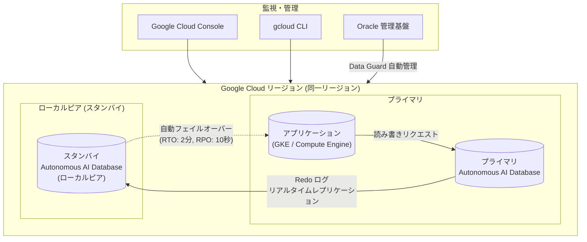

# Oracle Database@Google Cloud: ローカルピアデータベース向け Autonomous Data Guard

**リリース日**: 2026-05-19

**サービス**: Oracle Database@Google Cloud

**機能**: Autonomous Data Guard for local peer databases

**ステータス**: Generally Available (GA)

📊 [このアップデートのインフォグラフィックを見る](https://takech9203.github.io/google-cloud-news-summary/20260519-oracle-database-google-cloud-autonomous-data-guard.html)

## 概要

Oracle Database@Google Cloud において、ローカルピアデータベースに対する Autonomous Data Guard の有効化が一般提供（GA）となりました。この機能により、同一リージョン内でのデータベースの高可用性と災害復旧が自動化され、プロダクション環境におけるダウンタイムの最小化とデータ保護の強化が実現します。

Autonomous Data Guard は、プライマリデータベースの変更をスタンバイデータベースにリアルタイムで Redo ログレプリケーションにより同期し、障害発生時には自動フェイルオーバーを実行します。ローカルピアデータベースは Autonomous AI Database の作成時に自動的に生成され、デフォルトではバックアップベースの災害復旧タイプが設定されています。今回の GA により、このローカルピアの災害復旧タイプを Autonomous Data Guard に変更することで、RTO を 2 分、RPO を 10 秒という高い可用性目標を達成できるようになります。

この機能は、Oracle が管理する Data Guard テクノロジーを基盤としており、災害復旧のセットアップ、管理、監視に関する複雑なプロセスを自動化します。Application Continuity と組み合わせることで、エンドユーザーやアプリケーションに対してフェイルオーバーを透過的に実行することも可能です。

**アップデート前の課題**

- ローカルピアデータベースの災害復旧はデフォルトでバックアップベースのみであり、RTO が「1 時間 + 5TB あたり 1 時間」と長時間であった
- バックアップベースの復旧ではプロダクション環境に必要なダウンタイム要件を満たせない場合があった
- 同一リージョン内での高速フェイルオーバーを実現するには、手動での Data Guard 構成が必要であった

**アップデート後の改善**

- ローカルピアデータベースに Autonomous Data Guard を有効化することで、RTO 2 分・RPO 10 秒のローカル災害復旧が実現可能になった
- Google Cloud コンソールまたは gcloud CLI から簡単に災害復旧タイプを変更でき、手動構成が不要になった
- 自動フェイルオーバーによりプライマリデータベースの障害時に運用者の介入なしでスタンバイへ切り替わるようになった
- Application Continuity との統合によりフェイルオーバー時のアプリケーション影響が最小化された

## アーキテクチャ図



Autonomous Data Guard は同一リージョン内でプライマリデータベースからローカルピア（スタンバイ）に対してリアルタイムの Redo ログレプリケーションを実行し、障害時には自動フェイルオーバーによりスタンバイがプライマリの役割を引き継ぎます。

## サービスアップデートの詳細

### 主要機能

1. **ローカルピアの災害復旧タイプ管理**
   - Autonomous AI Database 作成時に自動生成されるローカルピアの災害復旧タイプを、バックアップベースから Autonomous Data Guard に変更可能
   - Google Cloud コンソールおよび gcloud CLI の両方から設定変更が可能

2. **自動フェイルオーバー**
   - プライマリデータベースが利用不可になった場合、Autonomous Data Guard が自動的にフェイルオーバーを実行
   - データ損失制限（Automatic Failover Data Loss Limit）を 0〜3600 秒の範囲で設定可能
   - デフォルト値は 0 秒（データ損失なしの場合のみ自動フェイルオーバー）

3. **Application Continuity 統合**
   - Autonomous Data Guard と Application Continuity の組み合わせにより、フェイルオーバーやスイッチオーバー時のアプリケーション影響を最小化
   - CONNECT_TIMEOUT、RETRY_DELAY、RETRY_COUNT、TRANSPORT_CONNECT_TIMEOUT パラメータによる接続文字列のカスタマイズが可能

4. **計画的スイッチオーバー**
   - メンテナンス作業のための計画的なプライマリ・スタンバイ間のロール切り替えをサポート
   - Google Cloud コンソールまたは API から実行可能

## 技術仕様

### 災害復旧タイプ比較

| 項目 | バックアップベース DR | Autonomous Data Guard |
|------|------|------|
| RTO | 1 時間 + 5TB あたり 1 時間 | 2 分 |
| RPO | 10 秒 | 10 秒 |
| 追加コスト | 自動バックアップ以外なし | スタンバイデータベースのリソースコスト |
| 推奨用途 | 非本番環境 | 本番環境 |
| レプリケーション方式 | バックアップからの復元 | リアルタイム Redo ログレプリケーション |
| フェイルオーバー | 手動 | 自動（設定可能） |

### 自動フェイルオーバーのパラメータ

| パラメータ | 説明 | 範囲 |
|------|------|------|
| Automatic failover data loss limit | 許容されるデータ損失の最大時間 | 0〜3600 秒 |
| デフォルト値 | データ損失なしの場合のみ自動フェイルオーバー | 0 秒 |

### 対応ワークロードタイプ

| ワークロードタイプ | Autonomous Data Guard 対応 |
|------|------|
| Lakehouse | 対応 |
| Transaction Processing | 対応 |
| JSON | 非対応 |
| APEX | 非対応 |

## 設定方法

### 前提条件

1. Autonomous AI Database インスタンスが作成済みであること
2. ワークロードタイプが Lakehouse または Transaction Processing であること
3. `roles/autonomousDatabaseAdmin` IAM ロールを持っていること

### 手順

#### ステップ 1: Google Cloud コンソールでの設定

1. Google Cloud コンソールの Autonomous AI Database Service ページに移動
2. 対象のデータベース名をクリック
3. Autonomous AI Database 詳細ページで「Disaster recovery」タブを選択
4. Autonomous Data Guard を有効にするピアデータベースの「View actions」をクリック
5. 「Update disaster recovery」をクリック
6. 災害復旧タイプとして「Autonomous Data Guard」を選択
7. 自動フェイルオーバーのデータ損失制限（秒）を指定（0〜3600 秒）
8. 「Save」をクリック

#### ステップ 2: gcloud CLI での設定

```bash
gcloud oracle-database autonomous-databases update DATABASE_ID \
  --project=PROJECT_ID \
  --location=REGION \
  --properties-local-data-guard-enabled \
  --properties-local-adg-auto-failover-max-data-loss-limit-duration=MAX_DATA_LOSS_LIMIT
```

各パラメータの説明:
- `DATABASE_ID`: プライマリデータベースの ID
- `PROJECT_ID`: Google Cloud プロジェクトの ID
- `REGION`: データベースのリージョン
- `MAX_DATA_LOSS_LIMIT`: 自動フェイルオーバー時の最大データ損失許容時間（秒）

#### ステップ 3: Application Continuity の接続文字列設定

```text
localdr1 = (description =
  (retry_count=50)
  (connect_timeout=90)
  (retry_delay=3)
  (transport_connect_timeout=3)
  (address =
    (protocol=tcps)
    (port=1521)
    (host=localdr1.adb.uk-london-1.oraclecloud.com)
  )
  (connect_data=
    (service_name=g24da7e94756f60_localdr1_tp.adb.oraclecloud.com)
  )
  (security=
    (ssl_server_dn_match=no)
  )
)
```

接続文字列の RETRY_COUNT、CONNECT_TIMEOUT、RETRY_DELAY、TRANSPORT_CONNECT_TIMEOUT パラメータを調整することで、フェイルオーバー時のアプリケーション動作をカスタマイズできます。

## メリット

### ビジネス面

- **ダウンタイムの大幅削減**: RTO 2 分により、プロダクション環境でのサービス中断を最小限に抑え、SLA の遵守が容易に
- **データ保護の強化**: RPO 10 秒のリアルタイムレプリケーションにより、障害時のデータ損失リスクを極小化
- **運用コストの削減**: Oracle が管理する自動化された災害復旧により、専門的な DBA スキルの必要性が軽減
- **ビジネス継続性の確保**: 自動フェイルオーバーにより、夜間や休日の障害にも迅速に対応可能

### 技術面

- **自動化されたフェイルオーバー**: 手動介入不要の自動フェイルオーバーにより、人的エラーのリスクを排除
- **Application Continuity 対応**: アプリケーション層での透過的なフェイルオーバー処理が可能
- **シンプルな設定**: Google Cloud コンソールまたは gcloud CLI の数ステップで有効化可能
- **リアルタイム監視**: Google Cloud の監視ツールでレプリケーション状態やピアラグを追跡可能

## デメリット・制約事項

### 制限事項

- JSON および APEX ワークロードタイプでは Autonomous Data Guard を有効化できない
- Oracle Active Data Guard（スタンバイデータベースへの読み取りアクセス）はサポートされない
- スタンバイデータベースにはデータベースクライアントからアクセスできない
- スタンバイデータベースはプライマリと同じリソース構成（ワークロードタイプ、ECPU 数、プロビジョニングストレージ）で作成される

### 考慮すべき点

- Autonomous Data Guard を有効にするとスタンバイデータベースのリソースコストが追加で発生する
- 自動フェイルオーバーのデータ損失制限を 0 に設定した場合、データ損失が発生する可能性のある障害では自動フェイルオーバーが実行されない（手動フェイルオーバーが必要）
- フェイルオーバー後のフェイルバック手順も事前にテストしておくことが推奨される
- Application Continuity の有効化には接続文字列の適切な設定が必要

## ユースケース

### ユースケース 1: ミッションクリティカルな基幹業務システム

**シナリオ**: 金融機関のトランザクション処理システムにおいて、データベースの障害によるサービス停止が許容できない環境で、ローカル Autonomous Data Guard を有効化して高可用性を確保する。

**実装例**:
```bash
# 本番データベースに Autonomous Data Guard を有効化（データ損失 0 秒）
gcloud oracle-database autonomous-databases update finance-prod-db \
  --project=finance-project \
  --location=us-east4 \
  --properties-local-data-guard-enabled \
  --properties-local-adg-auto-failover-max-data-loss-limit-duration=0s
```

**効果**: データベース障害時に 2 分以内でスタンバイに自動切り替えが行われ、データ損失なしでサービスを継続可能。

### ユースケース 2: E コマースプラットフォーム

**シナリオ**: 大規模な E コマースサイトのバックエンドデータベースで、セール期間中の高トラフィック時にもデータベースの可用性を保証したい場合。Application Continuity と組み合わせてエンドユーザーへの影響を最小化する。

**効果**: フェイルオーバー時もセッションが透過的に維持され、ユーザーはトランザクションを継続でき、カート情報や注文処理の喪失を防止。

### ユースケース 3: 計画メンテナンスのダウンタイム最小化

**シナリオ**: 定期的なデータベースパッチ適用やメンテナンス作業時に、スイッチオーバー機能を使ってダウンタイムをゼロに近づける。

**効果**: 計画的スイッチオーバーによりメンテナンスウィンドウを大幅に短縮し、業務時間外のメンテナンス制約を緩和。

## 料金

Oracle Database@Google Cloud の料金は Oracle Cloud Infrastructure (OCI) の使用量に基づいて計算され、Google Cloud の請求書に統合されて請求されます。

### 料金体系

| 項目 | 説明 |
|--------|-----------------|
| バックアップベース DR | 自動バックアップ以外の追加コストなし |
| Autonomous Data Guard | スタンバイデータベースのリソース（ECPU、ストレージ）が追加で課金 |
| 課金モデル | Pay-As-You-Go（従量課金）またはプライベートオファー（カスタム価格） |

スタンバイデータベースはプライマリと同じリソース構成で作成されるため、Autonomous Data Guard を有効にすると実質的にデータベースリソースコストが約 2 倍になります。詳細な料金については [Oracle Database@Google Cloud pricing](https://www.oracle.com/cloud/google/oracle-database-at-google-cloud/pricing/) を参照してください。

## 利用可能リージョン

Autonomous AI Database Service（Autonomous Data Guard のローカルピアを含む）は以下のリージョンで利用可能です:

| 地域 | リージョン名 | 説明 |
|------|------|------|
| アジア太平洋 | asia-northeast1 | 東京、日本 |
| アジア太平洋 | asia-northeast2 | 大阪、日本 |
| アジア太平洋 | australia-southeast1 | シドニー、オーストラリア |
| アジア太平洋 | australia-southeast2 | メルボルン、オーストラリア |
| アジア太平洋 | asia-south1 | ムンバイ、インド |
| アジア太平洋 | asia-south2 | デリー、インド |
| 北米 | northamerica-northeast1 | モントリオール、カナダ |
| 北米 | northamerica-northeast2 | トロント、カナダ |
| 北米 | us-central1 | アイオワ |
| 北米 | us-east4 | 北バージニア |
| 北米 | us-west3 | ソルトレイクシティ |
| 南米 | southamerica-east1 | サンパウロ、ブラジル |
| ヨーロッパ | europe-west2 | ロンドン、イギリス |
| ヨーロッパ | europe-west3 | フランクフルト、ドイツ |
| ヨーロッパ | europe-west8 | ミラノ、イタリア |

## 関連サービス・機能

- **クロスリージョン Autonomous Data Guard**: 異なるリージョン間でのスタンバイデータベース構成。リージョン全体の障害からの保護を提供
- **Oracle Application Continuity**: フェイルオーバーおよびスイッチオーバー時にアプリケーションセッションを透過的に維持する機能
- **Cloud Monitoring**: Autonomous Data Guard のヘルスステータスやピアラグを監視するためのメトリクス
- **Database Center**: Oracle Database@Google Cloud のインベントリ、メトリクス、アラートの一元管理
- **Cloud Key Management Service (CMEK)**: Autonomous AI Database のデータ暗号化キーの管理

## 参考リンク

- 📊 [インフォグラフィック](https://takech9203.github.io/google-cloud-news-summary/20260519-oracle-database-google-cloud-autonomous-data-guard.html)
- [公式リリースノート](https://docs.cloud.google.com/release-notes#May_19_2026)
- [ローカルピアの災害復旧タイプ管理ドキュメント](https://docs.cloud.google.com/oracle/database/docs/manage-dr-type)
- [クロスリージョン DR ドキュメント](https://docs.cloud.google.com/oracle/database/docs/cross-region-dr-with-data-guard)
- [ピアデータベースの作成](https://docs.cloud.google.com/oracle/database/docs/create-peer-database)
- [スイッチオーバーの実行](https://docs.cloud.google.com/oracle/database/docs/perform-switchover)
- [料金ページ](https://www.oracle.com/cloud/google/oracle-database-at-google-cloud/pricing/)
- [リージョンとゾーン](https://docs.cloud.google.com/oracle/database/docs/regions-and-zones)

## まとめ

Oracle Database@Google Cloud のローカルピアデータベース向け Autonomous Data Guard の GA リリースにより、同一リージョン内での高可用性データベース構成が大幅に簡素化されました。RTO 2 分・RPO 10 秒という高い可用性目標を Google Cloud コンソールの数クリックまたは gcloud コマンド一つで実現できるため、プロダクション環境の Oracle データベースワークロードにおける災害復旧戦略の選択肢が広がります。本番環境で Oracle Autonomous AI Database を運用している場合は、バックアップベース DR から Autonomous Data Guard への移行を検討することを推奨します。

---

**タグ**: #oracle-database #autonomous-data-guard #disaster-recovery #high-availability #local-peer-database #autonomous-ai-database
