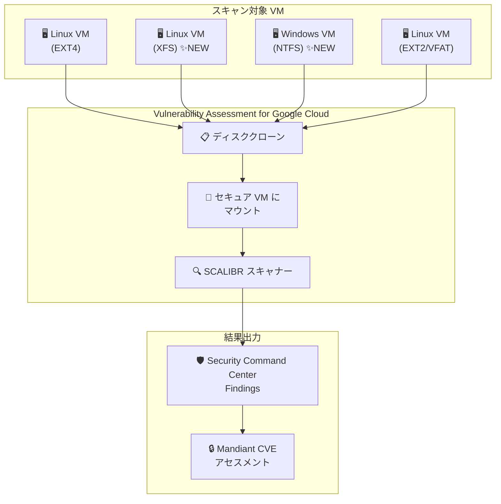

# Security Command Center: Vulnerability Assessment for Google Cloud が XFS および NTFS ディスクパーティションのスキャンに対応

**リリース日**: 2026-05-19

**サービス**: Security Command Center

**機能**: Vulnerability Assessment for Google Cloud - XFS/NTFS パーティションスキャン対応

**ステータス**: Change (機能拡張)

📊 [このアップデートのインフォグラフィックを見る](https://takech9203.github.io/google-cloud-news-summary/20260519-security-command-center-xfs-ntfs-scanning.html)

## 概要

Security Command Center の Vulnerability Assessment for Google Cloud が、XFS および NTFS ディスクパーティションタイプのスキャンに対応した。これにより、これらのファイルシステムを使用する Compute Engine VM インスタンスや GKE ノードに対しても、エージェントレスの脆弱性スキャンが実行可能になった。

Vulnerability Assessment for Google Cloud は、VM インスタンスのディスクをクローンし、Google 所有のプロジェクト内にある安全な VM インスタンスにマウントして SCALIBR スキャナーで脆弱性を検出するサービスである。今回のアップデートにより、サポートされるディスクパーティションタイプは VFAT、EXT2、EXT4、XFS、NTFS の 5 種類となった。

このアップデートは、Linux 環境で広く使用される XFS ファイルシステムや、Windows ワークロードで標準的な NTFS ファイルシステムを利用するユーザーにとって重要な改善であり、脆弱性スキャンのカバレッジが大幅に拡大する。

**アップデート前の課題**

- XFS パーティションを使用する VM インスタンスは脆弱性スキャンの対象外であり、脆弱性を検出できなかった
- NTFS パーティションを使用する Windows VM インスタンスはエージェントレススキャンの対象外だった
- サポートされるパーティションタイプが VFAT と EXT2/EXT4 に限定されており、特に大規模データを扱う Linux ワークロード (XFS がデフォルトの RHEL/CentOS 系) や Windows ワークロードのセキュリティ可視性に課題があった

**アップデート後の改善**

- XFS パーティションを使用する VM インスタンス (RHEL、CentOS、Rocky Linux、Amazon Linux など) が脆弱性スキャン対象に追加された
- NTFS パーティションを使用する Windows VM インスタンスがエージェントレススキャン対象に追加された
- サポートパーティションタイプが VFAT、EXT2、EXT4、XFS、NTFS の 5 種類に拡大し、より広範なワークロードのセキュリティ可視性が向上した

## アーキテクチャ図

Vulnerability Assessment for Google Cloud は対象 VM のディスクをクローンし、Google 所有プロジェクト内のセキュアな VM にマウントして SCALIBR でスキャンする。今回 XFS と NTFS が対応パーティションに追加された。

## サービスアップデートの詳細

### 主要機能

1. **XFS パーティションスキャン対応**
   - Linux 環境で広く使用される XFS ファイルシステムのスキャンが可能に
   - RHEL 7 以降、CentOS 7 以降、Rocky Linux などでデフォルトファイルシステムとして採用されている XFS に対応
   - 大容量ディスクやハイパフォーマンスワークロードで利用されるケースをカバー

2. **NTFS パーティションスキャン対応**
   - Windows Server ワークロードの標準ファイルシステムである NTFS のスキャンが可能に
   - Compute Engine 上の Windows VM インスタンスのエージェントレス脆弱性検出を実現

3. **エージェントレススキャン方式の維持**
   - 従来と同様、エージェントのインストール不要でスキャンを実行
   - ディスククローンによる非侵入型スキャンのため、本番ワークロードへの影響なし

## 技術仕様

### サポートされるディスクパーティションタイプ

| パーティションタイプ | 主な用途 | 対応状況 |
|------|------|------|
| VFAT | EFI システムパーティション、小容量ストレージ | 既存対応 |
| EXT2 | レガシー Linux ブートパーティション | 既存対応 |
| EXT4 | Ubuntu/Debian 系 Linux のデフォルト | 既存対応 |
| XFS | RHEL/CentOS 系 Linux のデフォルト | **今回追加** |
| NTFS | Windows のデフォルト | **今回追加** |

### スキャン仕様

| 項目 | 詳細 |
|------|------|
| スキャン方式 | エージェントレス (ディスククローン + SCALIBR) |
| スキャン頻度 | 約 12 時間ごと (ティアにより異なる) |
| クローン先 | Google 所有プロジェクト (追加コストなし) |
| クローンリージョン | ソース VM と同一リージョン |
| スキャナー | SCALIBR (google/osv-scalibr) |

### 対象リソース

| リソースタイプ | サービスティア |
|------|------|
| Compute Engine VM インスタンス | Standard, Premium, Enterprise |
| GKE Standard クラスタノード | Standard, Premium, Enterprise |
| GKE Standard/Autopilot コンテナ | Standard, Premium, Enterprise |

### 制限事項

- CMEK で暗号化されたディスクのスキャンには、サービスエージェントへの Cloud KMS CryptoKey Encrypter/Decrypter ロール付与が必要
- VPC Service Controls 境界内の CMEK 暗号化ディスクはスキャン不可
- CSEK (顧客提供暗号鍵) で暗号化されたディスクはスキャン不可
- GKE クラスタスキャン時に Finding にクラスタラベルは含まれない

## メリット

### ビジネス面

- **セキュリティカバレッジの拡大**: エンタープライズ環境で広く使用される XFS (RHEL 系) および NTFS (Windows) のワークロードが脆弱性スキャン対象になり、組織全体のセキュリティ可視性が向上
- **コンプライアンス対応の強化**: Windows サーバーを含むマルチ OS 環境でのエージェントレス脆弱性管理が可能に

### 技術面

- **運用負荷ゼロ**: エージェントレス方式のためインストールや設定変更不要で、XFS/NTFS パーティションのスキャンが自動的に有効化
- **本番影響なし**: ディスククローンによる非侵入型スキャンのため、パフォーマンスへの影響がない
- **統一的な脆弱性管理**: ファイルシステムの違いを意識せず、Security Command Center で統合的に脆弱性を管理可能

## ユースケース

### ユースケース 1: RHEL/CentOS ベースのエンタープライズワークロード

**シナリオ**: RHEL や Rocky Linux を使用する企業のアプリケーションサーバーで、XFS がデフォルトファイルシステムとして使用されている環境。これまではエージェントベースのスキャンに依存していた。

**効果**: エージェントレスで自動的にソフトウェア脆弱性を検出し、Mandiant CVE アセスメントと組み合わせてリスクの優先順位付けが可能になる。

### ユースケース 2: Windows Server ワークロードの脆弱性管理

**シナリオ**: Compute Engine 上で Windows Server を運用している環境で、Active Directory、SQL Server、IIS などのワークロードを実行。NTFS パーティション上のソフトウェア脆弱性を検出したい。

**効果**: Windows VM に対してもエージェントレスで脆弱性スキャンが行われ、Linux VM と同様に Security Command Center で統合的に管理できるようになる。

### ユースケース 3: マルチ OS 環境の統合セキュリティ管理

**シナリオ**: Linux (Ubuntu/EXT4 + RHEL/XFS) と Windows (NTFS) が混在する環境で、すべての VM の脆弱性を一元管理したい。

**効果**: ファイルシステムの種類に関わらず、すべての VM が自動的にスキャン対象となり、Security Command Center のダッシュボードで横断的にリスクを把握できる。

## 料金

Vulnerability Assessment for Google Cloud は Security Command Center の各ティアで利用可能:

| ティア | 料金 | 脆弱性スキャン機能 |
|--------|------|-------------------|
| Standard | 無料 | 限定的な機能セット |
| Premium | 有料 (従量課金またはサブスクリプション) | フル機能 + Mandiant CVE アセスメント |
| Enterprise | 有料 (サブスクリプション) | フル機能 + マルチクラウド対応 |

詳細な料金については [Security Command Center の料金ページ](https://cloud.google.com/security-command-center/pricing) を参照。

## 関連サービス・機能

- **Compute Engine**: スキャン対象の VM インスタンスを提供する基盤サービス
- **Google Kubernetes Engine (GKE)**: Standard/Autopilot クラスタのノードおよびコンテナがスキャン対象
- **SCALIBR (OSV-SCALIBR)**: Google が開発したオープンソースの脆弱性スキャナー
- **Cloud KMS**: CMEK 暗号化ディスクのスキャンに必要な鍵管理サービス
- **VM Manager**: 別のアプローチで OS レベルの脆弱性レポートを提供するサービス (VM Manager は CVE レポートに特化)
- **VPC Service Controls**: セキュリティ境界設定。CMEK ディスクに対してスキャンの制限あり

## 参考リンク

- 📊 [インフォグラフィック](https://takech9203.github.io/google-cloud-news-summary/20260519-security-command-center-xfs-ntfs-scanning.html)
- [公式リリースノート](https://docs.cloud.google.com/release-notes#May_19_2026)
- [Vulnerability Assessment for Google Cloud ドキュメント](https://docs.cloud.google.com/security-command-center/docs/vulnerability-assessment-google-cloud)
- [Security Command Center サービスティア](https://docs.cloud.google.com/security-command-center/docs/service-tiers)
- [Security Command Center 料金](https://cloud.google.com/security-command-center/pricing)
- [SCALIBR (GitHub)](https://github.com/google/osv-scalibr)

## まとめ

今回のアップデートにより、Security Command Center の Vulnerability Assessment for Google Cloud が XFS および NTFS ディスクパーティションのスキャンに対応した。これにより、RHEL/CentOS 系 Linux や Windows Server を含む幅広いワークロードのエージェントレス脆弱性スキャンが可能になり、マルチ OS 環境のセキュリティ可視性が大幅に向上した。特別な設定変更は不要で、対象パーティションを持つ VM は自動的にスキャン対象に含まれる。

---

**タグ**: #SecurityCommandCenter #VulnerabilityAssessment #XFS #NTFS #エージェントレススキャン #セキュリティ #ComputeEngine #GKE
