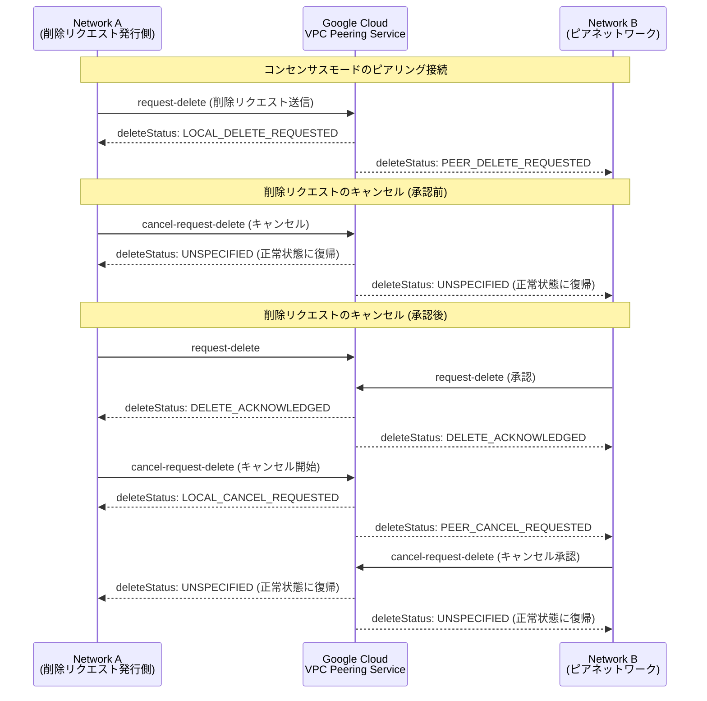

# Virtual Private Cloud: VPC Network Peering 削除リクエストのキャンセル機能

**リリース日**: 2026-05-19

**サービス**: Virtual Private Cloud (VPC)

**機能**: VPC Network Peering 削除リクエストのキャンセル

**ステータス**: Preview

[このアップデートのインフォグラフィックを見る](https://takech9203.github.io/google-cloud-news-summary/20260519-vpc-network-peering-cancel-deletion.html)

## 概要

VPC Network Peering のコンセンサスモードにおいて、保留中の削除リクエストをキャンセルできる機能が Preview として利用可能になりました。これにより、誤って送信した削除リクエストや、ビジネス要件の変更により不要になった削除リクエストを取り消すことができます。

コンセンサスモードは、ピアリング接続の意図しない一方的な変更や削除を防ぐための仕組みであり、両方のネットワーク管理者の合意が必要です。従来、削除リクエストが一度送信されると取り消しができなかったため、誤操作時のリカバリが困難でした。今回の機能追加により、運用上の安全性が大幅に向上します。

**アップデート前の課題**

- コンセンサスモードのピアリング接続で削除リクエストを送信すると、キャンセルする手段がなかった
- 誤って削除リクエストを送信した場合、ピアネットワーク側が承認するとピアリング接続が削除されてしまうリスクがあった
- 削除リクエストの誤送信をリカバリするには、削除後にピアリング接続を再作成する必要があり、ダウンタイムが発生する可能性があった

**アップデート後の改善**

- 保留中の削除リクエストを `cancel-request-delete` コマンドでキャンセル可能になった
- ピアネットワークが承認する前であればローカルネットワークのみでキャンセルでき、承認後でもどちらのネットワークからでもキャンセルを開始できる
- ピアリング接続の誤削除を防ぎ、サービスの継続性を確保できるようになった

## アーキテクチャ図



削除リクエストのキャンセルフローを示す図。承認前はローカルネットワークのみでキャンセル可能、承認後は両ネットワークからのキャンセル操作が必要です。

## サービスアップデートの詳細

### 主要機能

1. **承認前の削除リクエストキャンセル**
   - 削除リクエストを送信したネットワーク (ローカルネットワーク) のみでキャンセル可能
   - ピアネットワークの操作は不要
   - キャンセル後、`deleteStatus` は `UNSPECIFIED` に復帰

2. **承認後の削除リクエストキャンセル**
   - ピアネットワークが削除リクエストを承認 (`DELETE_ACKNOWLEDGED`) した後でもキャンセル可能
   - どちらのネットワークからでもキャンセルを開始できる
   - キャンセルを開始したネットワークは `LOCAL_CANCEL_REQUESTED`、ピア側は `PEER_CANCEL_REQUESTED` ステータスになる
   - 完全にキャンセルするにはピア側でも `cancel-request-delete` を実行する必要がある

3. **コンセンサスモード専用**
   - この機能はコンセンサスモードのピアリング接続にのみ適用される
   - インディペンデントモード (デフォルト) では、一方的に削除が可能なためこの機能は不要

## 技術仕様

### 削除ステータスの遷移

| ステータス | 説明 |
|------|------|
| `UNSPECIFIED` | 削除リクエストなし (通常状態) |
| `LOCAL_DELETE_REQUESTED` | ローカルネットワークが削除をリクエスト済み |
| `PEER_DELETE_REQUESTED` | ピアネットワークが削除をリクエスト済み |
| `DELETE_ACKNOWLEDGED` | 両方のネットワークが削除をリクエスト (承認済み) |
| `LOCAL_CANCEL_REQUESTED` | ローカルネットワークがキャンセルをリクエスト済み |
| `PEER_CANCEL_REQUESTED` | ピアネットワークがキャンセルをリクエスト済み |

### 必要な IAM 権限

| 権限 | 説明 |
|------|------|
| `compute.networks.removePeering` | ピアリング接続の削除・キャンセル操作に必要 |

推奨ロール: `roles/compute.networkAdmin` (Compute Network Admin)

## 設定方法

### 前提条件

1. コンセンサスモードで構成された VPC Network Peering 接続が存在すること
2. 保留中の削除リクエストが存在すること
3. `compute.networks.removePeering` 権限を持つ IAM ロールが付与されていること

### 手順

#### ステップ 1: 削除リクエストのキャンセル (承認前)

```bash
# 削除リクエストを送信したネットワークからキャンセル
gcloud beta compute networks peerings cancel-request-delete PEERING_NAME \
    --network=NETWORK
```

- `PEERING_NAME`: ピアリング構成の名前
- `NETWORK`: 現在のプロジェクト内のネットワーク名

#### ステップ 2: 削除リクエストのキャンセル (承認後)

```bash
# どちらかのネットワークからキャンセルを開始
gcloud beta compute networks peerings cancel-request-delete PEERING_NAME \
    --network=NETWORK

# ステータス確認
gcloud compute networks describe NETWORK
# 出力: deleteStatus が LOCAL_CANCEL_REQUESTED / PEER_CANCEL_REQUESTED

# ピア側でもキャンセルを実行
gcloud beta compute networks peerings cancel-request-delete PEER_PEERING_NAME \
    --network=PEER_NETWORK
```

#### Google Cloud Console での操作

1. Google Cloud Console で VPC Network Peering ページに移動
2. キャンセルしたいピアリング接続をクリック
3. Peering connection details ページで「Cancel delete request」をクリック
4. 確認ダイアログで「Confirm」をクリック

## メリット

### ビジネス面

- **サービス継続性の確保**: 誤操作によるピアリング接続の削除を防止し、サービス中断リスクを低減
- **運用コストの削減**: 削除後の再作成作業が不要になり、インシデント対応時間を短縮

### 技術面

- **安全な変更管理**: コンセンサスモードと組み合わせることで、ピアリング接続のライフサイクル管理がより安全に
- **ダウンタイムの回避**: ピアリング接続の再作成に伴うルーティング中断を防止
- **段階的な合意プロセス**: 承認前後で異なるキャンセルフローを提供し、運用状況に応じた柔軟な対応が可能

## デメリット・制約事項

### 制限事項

- Preview ステータスのため、本番ワークロードでの使用は Pre-GA Offerings Terms の制約を受ける
- コンセンサスモードのピアリング接続にのみ適用 (インディペンデントモードには非対応)
- 承認後のキャンセルには両方のネットワークからの操作が必要
- `gcloud beta` コマンドでの操作が必要 (GA 版コマンドは今後提供予定)

### 考慮すべき点

- キャンセル操作中に更新リクエストは拒否される (削除リクエストが進行中の場合と同様)
- コンセンサスモードからインディペンデントモードへの変更はサポートされていないため、モード選択は慎重に行う必要がある

## ユースケース

### ユースケース 1: 誤操作による削除リクエストの取り消し

**シナリオ**: マルチチーム環境で、ネットワーク管理者が本番環境のピアリング接続に対して誤って削除リクエストを送信してしまった。ピアネットワーク側の管理者が承認する前に気付いた。

**実装例**:
```bash
# 誤って送信した削除リクエストをキャンセル
gcloud beta compute networks peerings cancel-request-delete prod-peering \
    --network=prod-network

# ステータスが正常に戻ったことを確認
gcloud compute networks describe prod-network
```

**効果**: ピアリング接続の削除を未然に防止し、サービスの継続性を確保。

### ユースケース 2: 移行計画の変更によるキャンセル

**シナリオ**: ネットワーク統合プロジェクトの一環として既存のピアリング接続の削除を計画し、両方のネットワーク管理者が削除リクエストを承認済み (`DELETE_ACKNOWLEDGED`)。しかし、移行スケジュールの変更により、ピアリング接続をもうしばらく維持する必要が出てきた。

**実装例**:
```bash
# 一方のネットワークからキャンセルを開始
gcloud beta compute networks peerings cancel-request-delete migration-peering \
    --network=network-a

# ピアネットワーク側でもキャンセルを実行
gcloud beta compute networks peerings cancel-request-delete migration-peering \
    --network=network-b
```

**効果**: 移行計画の変更に柔軟に対応し、既存のピアリング接続を維持しながらスケジュールを再調整可能。

## 料金

VPC Network Peering は通常の[ネットワーク料金](https://cloud.google.com/vpc/network-pricing)が適用されます。ピアリング接続自体の作成・維持・削除には追加料金はかかりません。今回の削除リクエストキャンセル機能についても追加料金は発生しません。

## 関連サービス・機能

- **VPC Network Peering コンセンサスモード**: 今回の機能の前提となるモード。両方のネットワーク管理者の合意が必要な安全なピアリング管理方式
- **Shared VPC**: 組織内でのネットワークリソース共有の代替手段。プロジェクト間での VPC 共有が可能
- **Cloud Interconnect / Cloud VPN**: オンプレミスネットワークとの接続手段。ピアリングと組み合わせたトランジットネットワーク構成で利用
- **GKE (Google Kubernetes Engine)**: VPC ピアリングを使用するクラスタのネットワーク分離。ピアリング削除によりクラスタが修復状態に入るため、本機能の恩恵が大きい
- **Private Services Access**: マネージドサービスとの VPC ピアリング。削除すると新しいプライベート接続を作成できなくなるため、誤削除防止が重要

## 参考リンク

- [このアップデートのインフォグラフィック](https://takech9203.github.io/google-cloud-news-summary/20260519-vpc-network-peering-cancel-deletion.html)
- [公式リリースノート](https://docs.cloud.google.com/release-notes#May_19_2026)
- [VPC Network Peering の設定と管理](https://docs.cloud.google.com/vpc/docs/using-vpc-peering)
- [ピアリング接続について](https://docs.cloud.google.com/vpc/docs/about-peering-connections)
- [VPC Network Peering 概要](https://docs.cloud.google.com/vpc/docs/vpc-peering)
- [gcloud compute networks peerings cancel-request-delete リファレンス](https://docs.cloud.google.com/sdk/gcloud/reference/beta/compute/networks/peerings/cancel-request-delete)

## まとめ

VPC Network Peering のコンセンサスモードにおける削除リクエストのキャンセル機能は、ネットワーク管理の安全性を大幅に向上させる重要なアップデートです。特に GKE や Private Services Access など、ピアリング接続の削除がサービス中断に直結する環境では、誤操作からのリカバリ手段として積極的に活用することを推奨します。現在 Preview のため、GA 昇格を待ってから本番環境への適用を検討してください。

---

**タグ**: #VPC #NetworkPeering #ConsensusMode #Preview #ネットワーク #セキュリティ
