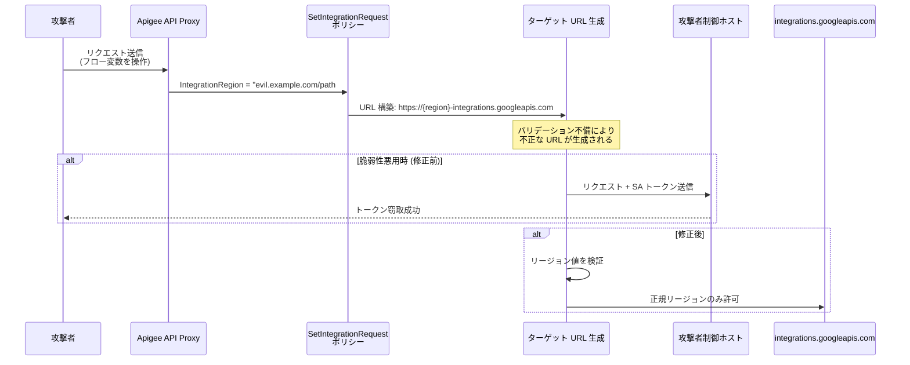

# Apigee X: SetIntegrationRequest ポリシーにおける SSRF 脆弱性 (CVE-2026-2264)

**リリース日**: 2026-05-20

**サービス**: Apigee X

**機能**: SetIntegrationRequest ポリシー IntegrationRegion パラメータのバリデーション不備

**ステータス**: セキュリティ速報 (GCP-2026-034)

📊 [このアップデートのインフォグラフィックを見る](https://takech9203.github.io/google-cloud-news-summary/20260520-apigee-x-security-cve-2026-2264.html)

## 概要

2026 年 5 月 20 日、Google Cloud は Apigee X に関するセキュリティ速報 GCP-2026-034 を公開した。SetIntegrationRequest ポリシーの `<IntegrationRegion>` パラメータにおいて入力バリデーションが不足しており、Server-Side Request Forgery (SSRF) およびサービスアカウントトークンの窃取が可能となる脆弱性 (CVE-2026-2264) が発見された。

この脆弱性は、攻撃者が `<IntegrationRegion>` 要素の `ref` 属性で参照されるフロー変数を制御できる場合に発生する。Apigee は IntegrationRegion の値を使用して `https://<IntegrationRegion>-integrations.googleapis.com` 形式のターゲット URL を動的に生成するが、この値に対する適切なバリデーションが行われていなかった。その結果、攻撃者が制御するホストに対して、API プロキシに関連付けられたサービスアカウントのトークンを含むリクエストが送信される可能性があった。

**アップデート前の課題**

- `<IntegrationRegion>` パラメータに対してリージョン名の妥当性検証が行われていなかった
- フロー変数経由で動的に設定される IntegrationRegion の値が、任意の文字列を受け入れていた
- IntegrationEndpoint / IntegrationCallout は認証トークンを「自動的に」リクエストに付与する設計のため、不正なターゲットに対してもトークンが送信されていた

**アップデート後の改善**

- IntegrationRegion パラメータに対して適切なバリデーションが追加され、不正なリージョン値が拒否されるようになった
- フロー変数から解決されるリージョン値が Application Integration のサポートリージョンリストに照合されるようになった
- SSRF を介したサービスアカウントトークンの窃取リスクが排除された

## アーキテクチャ図



この図は CVE-2026-2264 の攻撃フローを示す。攻撃者がフロー変数を操作して IntegrationRegion に不正な値を注入し、サービスアカウントトークンを窃取する流れと、修正後にバリデーションで防御される流れを表している。

## サービスアップデートの詳細

### 主要機能

1. **脆弱性の詳細 (CVE-2026-2264)**
   - SetIntegrationRequest ポリシーの `<IntegrationRegion>` 要素は `ref` 属性を通じてフロー変数から動的にリージョン値を取得可能
   - Apigee は取得した値を `integration.region` フロー変数に格納し、`https://<region>-integrations.googleapis.com` 形式のターゲット URL を `integration.target.url` フロー変数に生成する
   - リージョン値に対する許可リスト検証が不足していたため、攻撃者が制御する任意の値が URL に組み込まれていた

2. **攻撃条件**
   - 攻撃者が IntegrationRegion の `ref` で参照されるフロー変数を制御できること
   - 例: リクエストヘッダー、クエリパラメータ、フォームパラメータなどからフロー変数に値がセットされるケース
   - API プロキシがサービスアカウント付きでデプロイされていること (IntegrationEndpoint/IntegrationCallout の前提条件)

3. **影響範囲**
   - サービスアカウントトークンの窃取による権限昇格
   - 窃取されたトークンを使用した Google Cloud リソースへの不正アクセス
   - SSRF を利用した内部ネットワークの探索

## 技術仕様

### 脆弱な構成例

```xml
<!-- 脆弱な SetIntegrationRequest ポリシー -->
<SetIntegrationRequest name="Set-Integration-Request">
  <DisplayName>Set Integration Request</DisplayName>
  <ProjectId>my-project</ProjectId>
  <IntegrationName>my-integration</IntegrationName>
  <!-- ref で参照されるフロー変数が外部入力から制御可能な場合に脆弱 -->
  <IntegrationRegion ref="request.header.x-region">asia-east1</IntegrationRegion>
  <ApiTrigger>my-api-trigger</ApiTrigger>
</SetIntegrationRequest>
```

### 影響を受ける仕組み

| 項目 | 詳細 |
|------|------|
| 脆弱性タイプ | Server-Side Request Forgery (SSRF) |
| CVE ID | CVE-2026-2264 |
| セキュリティ速報 | GCP-2026-034 |
| 影響を受けるポリシー | SetIntegrationRequest |
| 影響を受けるパラメータ | `<IntegrationRegion>` (ref 属性使用時) |
| トークン付与メカニズム | IntegrationEndpoint / IntegrationCallout が自動的にサービスアカウントトークンをリクエストに付与 |

### 認証トークンの自動付与

Apigee の IntegrationEndpoint および IntegrationCallout は、明示的な `<Authentication>` 要素を持たない。代わりに、Apigee が「内部的に」認証トークンをリクエストに自動付与する設計となっている。この仕組みが SSRF と組み合わさることで、攻撃者制御のホストにサービスアカウントトークンが送信される。

## 緩和策

### 即時対応

1. **フロー変数の入力元を確認する**: `<IntegrationRegion ref="...">` で参照されるフロー変数が、外部入力 (リクエストヘッダー、クエリパラメータなど) から直接セットされていないか確認する
2. **静的なリージョン値を使用する**: 可能であれば `ref` 属性を使用せず、リージョン値を静的に定義する
3. **条件付きフローでバリデーションを追加する**: フロー変数に対してリージョン値の許可リストチェックを行う Condition を追加する

### 推奨される防御策

```xml
<!-- 安全な構成例: 静的リージョン値 -->
<SetIntegrationRequest name="Set-Integration-Request">
  <IntegrationRegion>asia-northeast1</IntegrationRegion>
  <!-- ... -->
</SetIntegrationRequest>
```

```xml
<!-- フロー変数使用時は事前にバリデーションを実施 -->
<Step>
  <Condition>NOT (request.header.x-region = "asia-east1" OR
    request.header.x-region = "asia-northeast1" OR
    request.header.x-region = "us-central1")</Condition>
  <Name>RaiseFault-InvalidRegion</Name>
</Step>
```

## デメリット・制約事項

### 考慮すべき点

- 動的にリージョンを設定する正当なユースケースがある場合、静的リージョン値への変更は機能制限となる
- フロー変数のバリデーションは新しいリージョンが追加されるたびに許可リストの更新が必要
- サービスアカウントに付与する IAM ロールを最小権限の原則に従って設定し、万が一トークンが漏洩した場合の影響を最小化すべき

## 関連サービス・機能

- **Application Integration**: SetIntegrationRequest ポリシーが呼び出す統合プラットフォーム。IntegrationRegion は Application Integration のサポートリージョンに対応する
- **IntegrationCallout ポリシー**: SetIntegrationRequest で作成されたリクエストオブジェクトを使用して統合を実行するポリシー
- **IntegrationEndpoint**: API プロキシのターゲットエンドポイントとして統合を実行する構成要素
- **Cloud IAM**: サービスアカウントの権限管理。最小権限の原則に基づくロール付与が重要
- **VPC Service Controls**: サービスアカウントが侵害された場合のデータ流出を防止する境界

## 参考リンク

- 📊 [インフォグラフィック](https://takech9203.github.io/google-cloud-news-summary/20260520-apigee-x-security-cve-2026-2264.html)
- [公式リリースノート](https://docs.cloud.google.com/release-notes#May_20_2026)
- [Apigee セキュリティ速報](https://docs.cloud.google.com/apigee/docs/security-bulletins/security-bulletins)
- [SetIntegrationRequest ポリシー リファレンス](https://docs.cloud.google.com/apigee/docs/api-platform/reference/policies/set-integration-request-policy)
- [IntegrationCallout ポリシー リファレンス](https://docs.cloud.google.com/apigee/docs/api-platform/reference/policies/integration-callout-policy)
- [サービスアカウントのベストプラクティス](https://docs.cloud.google.com/iam/docs/best-practices-service-accounts)

## まとめ

CVE-2026-2264 は Apigee X の SetIntegrationRequest ポリシーにおける IntegrationRegion パラメータのバリデーション不備に起因する SSRF 脆弱性であり、サービスアカウントトークンの窃取による権限昇格のリスクがあった。Apigee X を利用しているユーザーは、セキュリティ速報 GCP-2026-034 に記載されたパッチの適用状況を確認し、動的にフロー変数から IntegrationRegion を設定している API プロキシについて、入力バリデーションの追加または静的リージョン値への変更を検討すべきである。

---

**タグ**: #Apigee #Security #SSRF #CVE-2026-2264 #GCP-2026-034 #SetIntegrationRequest #ServiceAccount
