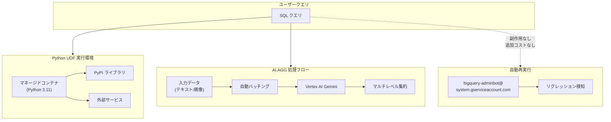

# BigQuery: Python UDFs GA / AI.AGG 関数プレビュー / クエリ再実行機能

**リリース日**: 2026-05-20

**サービス**: BigQuery

**機能**: Python UDFs の一般提供開始、AI.AGG 関数プレビュー、クエリ再実行によるリグレッション検知

**ステータス**: GA (Python UDFs) / Preview (AI.AGG) / Announcement (クエリ再実行)

[このアップデートのインフォグラフィックを見る](https://takech9203.github.io/google-cloud-news-summary/20260520-bigquery-python-udfs-ga-ai-agg.html)

## 概要

2026年5月20日、BigQuery に関する3つの重要なアップデートが発表されました。Python UDFs（ユーザー定義関数）が一般提供（GA）となり、本番環境での利用が正式にサポートされます。また、自然言語の指示に基づいて非構造化データを意味的に集約する AI.AGG 関数がプレビューとして利用可能になりました。さらに、BigQuery がクエリを再実行してパフォーマンスや正確性のリグレッションを事前検知する仕組みが発表されました。

Python UDFs の GA は、データエンジニアやデータサイエンティストにとって大きな進歩です。Python の豊富なエコシステム（PyPI ライブラリ）を SQL クエリ内で直接活用でき、外部サービスとの連携も Cloud リソース接続を通じて可能になります。AI.AGG 関数は BigQuery の生成 AI 機能群（マネージド AI 関数）の一つとして、大規模な非構造化データの集約分析を SQL だけで実現します。

これらのアップデートは、BigQuery をデータウェアハウスからインテリジェントなデータプラットフォームへと進化させる取り組みの一環です。従来 Python スクリプトや外部ツールで行っていた処理を BigQuery 内で完結させることで、データパイプラインの簡素化とコスト削減に貢献します。

**アップデート前の課題**

- SQL と JavaScript UDF のみが利用可能で、Python の豊富なライブラリエコシステムを BigQuery 内で直接活用できなかった
- 非構造化データの集約分析には、AI.GENERATE 関数で手動バッチング処理ロジックを記述する必要があった
- クエリのパフォーマンスリグレッションはユーザーが手動で検知・報告する必要があった

**アップデート後の改善**

- Python UDFs により PyPI ライブラリの利用や外部サービスへのアクセスが SQL クエリ内で可能になった
- AI.AGG 関数がマルチレベル集約を自動実行し、Gemini コンテキストウィンドウを超えるデータの分析が可能になった
- BigQuery が自動的にクエリを再実行してリグレッションを検知し、サービス品質を維持するようになった

## アーキテクチャ図



BigQuery の3つのアップデートの関係を示した図です。ユーザーの SQL クエリから Python UDF の実行環境や AI.AGG の処理フローが呼び出され、バックグラウンドではクエリ再実行によるリグレッション検知が行われます。

## サービスアップデートの詳細

### 主要機能

1. **Python UDFs（一般提供）**
   - Python でスカラー関数を実装し、SQL クエリ内で使用可能
   - PyPI からサードパーティライブラリをインストールして利用可能
   - Cloud リソース接続を使用して外部サービスにアクセス可能
   - ベクトル化 UDF（Pandas / Apache Arrow）によるバッチ処理でパフォーマンス向上
   - BigQuery DataFrames との統合により、Python コードから直接 UDF を作成・利用可能

2. **AI.AGG 関数（プレビュー）**
   - 自然言語の指示に基づいて非構造化データを意味的に集約
   - テキストデータと画像データの両方に対応
   - 自動マルチレベル集約により、Gemini コンテキストウィンドウを超えるデータも処理可能
   - GROUP BY と組み合わせてグループごとの集約結果を取得可能
   - Vertex AI Gemini モデルを使用

3. **クエリ再実行によるリグレッション検知（アナウンス）**
   - BigQuery がクエリ（命令）を再実行してパフォーマンス・正確性・機能のリグレッションを事前検知
   - 再実行は副作用なしで実行され、追加のコストやリソース消費は発生しない
   - データアクセスログに `bigquery-adminbot@system.gserviceaccount.com` が記録される場合がある

## 技術仕様

### Python UDFs

| 項目 | 詳細 |
|------|------|
| ランタイム | Python 3.11（唯一のサポートバージョン） |
| 最大 CPU | 4 vCPU |
| 最大メモリ | 16 GiB |
| コンテナ同時リクエスト数 | 最大 1000 |
| デフォルト CPU | 1.0 vCPU |
| デフォルトメモリ | 512 MiB |
| デフォルト同時リクエスト数 | 80 |
| 非サポートデータ型 | JSON, RANGE, INTERVAL, GEOGRAPHY |

### AI.AGG 関数

| 項目 | 詳細 |
|------|------|
| 入力データ型 | STRING, STRUCT（STRING, ObjectRefRuntime, 配列） |
| 出力 | STRING（グループあたり最大 10,000 トークン） |
| 推奨最大行数 | 2,000万行/クエリ |
| 推奨最大グループ数 | 1,000 グループ |
| 使用モデル | Vertex AI Gemini（Thinking budget 不要のモデル） |
| 接続 | Cloud リソース接続またはエンドユーザー認証情報 |

### Python UDF の作成例

```sql
CREATE FUNCTION `project.dataset`.sentiment_analysis(text STRING)
RETURNS STRING
LANGUAGE python
OPTIONS (
  runtime_version = 'python-3.11',
  entry_point = 'analyze',
  packages = ['textblob']
)
AS r"""
from textblob import TextBlob

def analyze(text):
    if not text:
        return 'neutral'
    blob = TextBlob(text)
    if blob.sentiment.polarity > 0.1:
        return 'positive'
    elif blob.sentiment.polarity < -0.1:
        return 'negative'
    return 'neutral'
""";
```

### AI.AGG 関数の使用例

```sql
SELECT
  AI.AGG(
    review_text,
    'この製品レビューの全体的な感情を要約し、主要なポジティブ・ネガティブな点を列挙してください'
  ) AS sentiment_summary
FROM `project.dataset.product_reviews`
WHERE product_id = 'ABC123';
```

## 設定方法

### 前提条件

1. BigQuery が有効化された Google Cloud プロジェクト
2. 適切な IAM ロール（BigQuery Data Editor, BigQuery Job User）
3. Python UDF で外部接続を使う場合: BigQuery Connection Admin ロール
4. AI.AGG を使う場合: Cloud リソース接続と Vertex AI API の有効化

### 手順

#### ステップ 1: Python UDF の作成

```sql
-- シンプルな Python UDF の作成
CREATE OR REPLACE FUNCTION `my_project.my_dataset`.calculate_bmi(
  weight_kg FLOAT64,
  height_m FLOAT64
)
RETURNS FLOAT64
LANGUAGE python
OPTIONS (
  runtime_version = 'python-3.11',
  entry_point = 'calculate_bmi'
)
AS r"""
def calculate_bmi(weight_kg, height_m):
    if not weight_kg or not height_m or height_m == 0:
        return None
    return weight_kg / (height_m ** 2)
""";
```

Python UDF を作成すると、BigQuery がコンテナイメージをビルドします。初回ビルドには時間がかかる場合があります。

#### ステップ 2: PyPI ライブラリを使用する Python UDF の作成

```sql
CREATE OR REPLACE FUNCTION `my_project.my_dataset`.parse_xml(
  xml_string STRING,
  xpath STRING
)
RETURNS STRING
LANGUAGE python
OPTIONS (
  runtime_version = 'python-3.11',
  entry_point = 'parse_xml',
  packages = ['lxml']
)
AS r"""
from lxml import etree

def parse_xml(xml_string, xpath):
    if not xml_string:
        return None
    tree = etree.fromstring(xml_string.encode())
    results = tree.xpath(xpath)
    if results:
        return str(results[0]) if not isinstance(results[0], str) else results[0]
    return None
""";
```

#### ステップ 3: AI.AGG 関数の使用

```sql
-- Cloud リソース接続の作成（初回のみ）
-- Console または bq コマンドラインで作成

-- AI.AGG を使用したレビュー集約分析
SELECT
  product_category,
  AI.AGG(
    review_text,
    'これらのレビューから主要なテーマと顧客の感情を3点にまとめてください',
    connection_id => 'us.my_connection',
    endpoint => 'gemini-2.5-flash'
  ) AS review_summary
FROM `my_project.my_dataset.reviews`
GROUP BY product_category;
```

## メリット

### ビジネス面

- **データパイプラインの簡素化**: Python 処理を BigQuery 内で完結させることで、外部の ETL/ELT ツールやスクリプトの管理が不要になる
- **AI 分析の民主化**: SQL を書ける分析者が自然言語で大規模データの集約分析を実行可能
- **サービス品質の自動維持**: クエリ再実行によるリグレッション検知で、ユーザーが問題に気づく前に品質問題を特定

### 技術面

- **Python エコシステムの活用**: NumPy、Pandas、scikit-learn など豊富なライブラリを SQL 内で利用可能
- **スケーラブルな AI 集約**: AI.AGG の自動バッチング・マルチレベル集約により、コンテキストウィンドウの制限を超えたデータ処理が可能
- **ベクトル化 UDF**: Pandas DataFrame や Apache Arrow RecordBatch を使用したバッチ処理で高パフォーマンスを実現

## デメリット・制約事項

### 制限事項

- Python UDF のランタイムは Python 3.11 のみ対応
- Python UDF は一時的な UDF（Temporary UDF）として作成できない
- Python UDF の結果はキャッシュされない（非決定的と見なされるため）
- Python UDF はマテリアライズドビューでは使用できない
- AI.AGG 関数で 10 枚以上の画像を含む入力行はスキップされる可能性がある
- AI.AGG は Thinking budget を必要とする Gemini モデルでは使用不可

### 考慮すべき点

- Python UDF のコンテナビルドにはコストが発生し、ビルド時間に比例する
- AI.AGG はバッチングと集約を行うため、ソースデータよりも多くのトークンが Gemini に送信される
- クエリ再実行により、監査ログに `bigquery-adminbot@system.gserviceaccount.com` のエントリが表示されるが、これは正常な動作
- Python UDF で CMEK（顧客管理暗号鍵）によるコード暗号化は非サポート

## ユースケース

### ユースケース 1: 自然言語処理パイプラインの内製化

**シナリオ**: EC サイトの商品レビューに対して感情分析とエンティティ抽出を行いたいが、外部の NLP サービスへのデータ転送を避けたい。

**実装例**:
```sql
-- Python UDF で感情スコアを算出
CREATE FUNCTION `project.dataset`.get_sentiment(text STRING)
RETURNS FLOAT64
LANGUAGE python
OPTIONS (runtime_version='python-3.11', entry_point='get_sentiment', packages=['textblob'])
AS r"""
from textblob import TextBlob
def get_sentiment(text):
    if not text:
        return 0.0
    return TextBlob(text).sentiment.polarity
""";

-- レビューの感情分析を実行
SELECT
  product_id,
  review_text,
  `project.dataset`.get_sentiment(review_text) AS sentiment_score
FROM `project.dataset.reviews`;
```

**効果**: データが BigQuery 外に出ることなく NLP 処理を実行でき、セキュリティとコンプライアンスの要件を満たしつつ分析が可能。

### ユースケース 2: AI.AGG による大規模ログ分析

**シナリオ**: 数百万行のアプリケーションログから、障害の根本原因やユーザー行動パターンを自然言語で要約したい。

**実装例**:
```sql
SELECT
  error_category,
  AI.AGG(
    log_message,
    'これらのエラーログから根本原因を特定し、発生パターンと推奨される対策を要約してください'
  ) AS root_cause_analysis
FROM `project.dataset.application_logs`
WHERE severity = 'ERROR'
  AND timestamp > TIMESTAMP_SUB(CURRENT_TIMESTAMP(), INTERVAL 24 HOUR)
GROUP BY error_category;
```

**効果**: 手動でログを読み込む代わりに、AI が自動的にパターンを検出し根本原因を要約。オンコールエンジニアの初動対応を大幅に効率化。

### ユースケース 3: 外部 API 連携による DataOps 自動化

**シナリオ**: BigQuery のデータ品質チェック結果に基づいて、外部の Slack や PagerDuty に通知を送信したい。

**実装例**:
```sql
-- 外部サービス連携用の Python UDF
CREATE FUNCTION `project.dataset`.notify_slack(
  channel STRING,
  message STRING
)
RETURNS STRING
LANGUAGE python
OPTIONS (
  runtime_version='python-3.11',
  entry_point='notify',
  packages=['requests'],
  connection='us.slack_connection'
)
AS r"""
import requests
import json

def notify(channel, message):
    webhook_url = "https://hooks.slack.com/services/..."
    payload = {"channel": channel, "text": message}
    response = requests.post(webhook_url, json=payload)
    return f"status: {response.status_code}"
""";
```

**効果**: データパイプラインの異常検知からアラート通知までを BigQuery 内で完結させ、外部オーケストレーターへの依存を削減。

## 料金

### Python UDFs

Python UDF の料金は BigQuery Services SKU で課金され、以下の要素で構成されます。

| 課金項目 | 説明 |
|----------|------|
| コンテナイメージビルド | UDF 作成・更新時のビルド時間に比例 |
| UDF 実行コスト | 呼び出し時のコンピュート・メモリ消費に比例 |
| ネットワークエグレス | 外部/インターネットへの通信が発生した場合（Premium Tier） |

コスト確認方法:
- ビルドコスト: 課金レポートで `goog-bq-feature-type: MANAGED_ROUTINE_BUILD` でフィルタ
- 実行コスト: 課金レポートで `goog-bq-feature-type: MANAGED_ROUTINE_EXECUTION` でフィルタ
- クエリ単位: `INFORMATION_SCHEMA.JOBS` の `external_service_costs` カラムを参照

### AI.AGG 関数

AI.AGG 関数は Vertex AI Gemini モデルへのリクエストを発行するため、Vertex AI の推論コストが発生します。

| 課金項目 | 説明 |
|----------|------|
| BigQuery コンピュート | 通常のクエリ処理コスト（オンデマンドまたはリザベーション） |
| Vertex AI 推論 | Gemini モデルへの入出力トークン数に基づく課金 |

注意: AI.AGG はバッチングと集約のため、実際に Gemini に送信されるトークン数はソースデータのトークン数より多くなります。

### クエリ再実行

追加のコストやリソース消費は発生しません。

## 利用可能リージョン

- **Python UDFs**: BigQuery が利用可能な全リージョンで GA
- **AI.AGG 関数**: Vertex AI Gemini モデルがサポートされているリージョンおよび US/EU マルチリージョンで利用可能

## 関連サービス・機能

- **Vertex AI Gemini**: AI.AGG 関数のバックエンドモデルとして使用
- **BigQuery ML**: 機械学習モデルのトレーニングと推論を BigQuery 内で実行
- **Cloud リソース接続**: Python UDF から外部サービスへのアクセス、AI.AGG から Vertex AI への接続に使用
- **BigQuery DataFrames**: Python コードから Python UDF を作成・利用するためのフレームワーク
- **AI.GENERATE / AI.GENERATE_TEXT**: 行ごとの生成 AI 推論を行う汎用関数（AI.AGG は集約に特化）
- **AI.CLASSIFY / AI.IF**: その他のマネージド AI 関数

## 参考リンク

- [インフォグラフィック](https://takech9203.github.io/google-cloud-news-summary/20260520-bigquery-python-udfs-ga-ai-agg.html)
- [公式リリースノート](https://cloud.google.com/release-notes#May_20_2026)
- [Python UDFs ドキュメント](https://docs.cloud.google.com/bigquery/docs/user-defined-functions-python)
- [AI.AGG 関数リファレンス](https://docs.cloud.google.com/bigquery/docs/reference/standard-sql/bigqueryml-syntax-ai-agg)
- [BigQuery 生成 AI 概要](https://docs.cloud.google.com/bigquery/docs/generative-ai-overview)
- [BigQuery 料金](https://cloud.google.com/bigquery/pricing)
- [Vertex AI 料金](https://docs.cloud.google.com/vertex-ai/generative-ai/pricing)

## まとめ

今回の BigQuery アップデートは、データ処理の柔軟性（Python UDFs GA）、AI 分析の簡便性（AI.AGG プレビュー）、サービス信頼性（クエリ再実行）の3軸で大きな前進をもたらします。特に Python UDFs の GA により、データエンジニアは既存の Python コードやライブラリを BigQuery に移行でき、パイプラインの簡素化とメンテナンスコストの削減が期待できます。まずは既存の外部 Python スクリプトで行っている処理を Python UDF に移行することを検討し、AI.AGG についてはプレビュー段階であることを考慮しつつ、レビュー分析やログ集約などのユースケースで試用することを推奨します。

---

**タグ**: #BigQuery #PythonUDF #AI #GenerativeAI #MachineLearning #GA #Preview #DataEngineering #VertexAI
