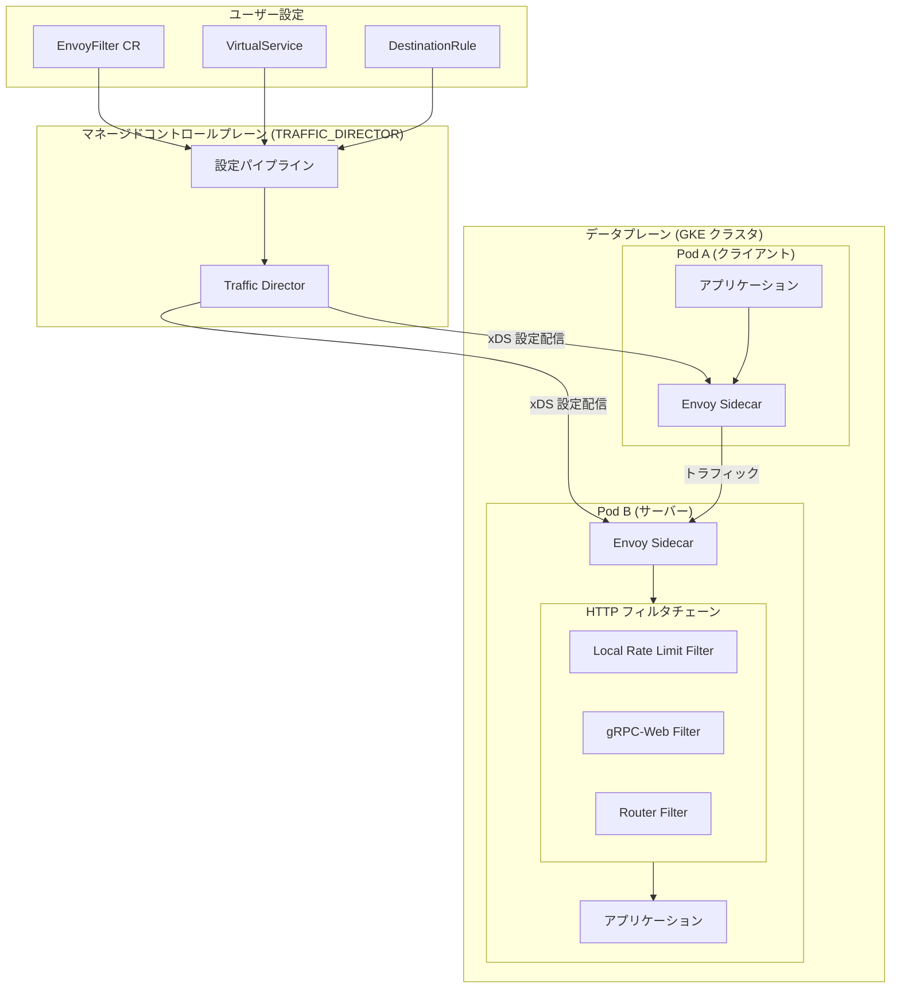

# Cloud Service Mesh: EnvoyFilter API の限定サポート (Stable チャネル)

**リリース日**: 2026-05-20

**サービス**: Cloud Service Mesh

**機能**: TRAFFIC_DIRECTOR 実装における EnvoyFilter API の限定サポート

**ステータス**: Stable チャネルで利用可能

📊 [このアップデートのインフォグラフィックを見る](https://takech9203.github.io/google-cloud-news-summary/20260520-cloud-service-mesh-envoyfilter-api.html)

## 概要

Google Cloud は、Managed Cloud Service Mesh の TRAFFIC_DIRECTOR 実装において、Stable チャネルで EnvoyFilter API の限定的なサポートを開始しました。これにより、標準の Istio API では実現できないデータプレーンの拡張機能を、マネージドサービスメッシュ環境で安全に利用できるようになります。

EnvoyFilter API は、Envoy プロキシが生成する設定を直接カスタマイズするための高度な API です。今回のアップデートにより、ローカルレートリミットや gRPC-Web フィルタなど、特定のユースケースに対応するための HTTP フィルタチェーンの拡張が Stable チャネルでサポートされます。

このアップデートは、サービスメッシュの高度なトラフィック制御を必要とするプラットフォームエンジニアやSREチームを主な対象としています。特に、マイクロサービスアーキテクチャにおけるきめ細かなレートリミットやプロトコル変換を実現したいユーザーに価値を提供します。

**アップデート前の課題**

- 標準の Istio API (VirtualService, DestinationRule 等) では、HTTP フィルタチェーンのカスタマイズができなかった
- ローカルレートリミットなどの Envoy ネイティブ機能を Managed Cloud Service Mesh で利用するには、セルフマネージド (in-cluster) のコントロールプレーンが必要だった
- Rapid/Regular チャネルでのみ利用可能だった EnvoyFilter API が、本番環境向けの Stable チャネルでは使えなかった

**アップデート後の改善**

- Stable チャネルの TRAFFIC_DIRECTOR 実装で EnvoyFilter API が利用可能になり、本番環境での高度なデータプレーン拡張が実現
- マネージドコントロールプレーンの恩恵 (自動アップグレード、高可用性) を受けながら、Envoy フィルタのカスタマイズが可能に
- Google がサポートする拡張機能のリストが明確に定義され、安全に利用できる範囲が把握しやすくなった

## アーキテクチャ図



EnvoyFilter CR をクラスタに適用すると、マネージドコントロールプレーン (Traffic Director) が設定を検証・伝播し、対象ワークロードの Envoy サイドカーの HTTP フィルタチェーンにカスタムフィルタが挿入されます。

## サービスアップデートの詳細

### 主要機能

1. **EnvoyFilter API による HTTP フィルタチェーンのカスタマイズ**
   - `configPatches[].applyTo` で `HTTP_FILTER` を指定し、HTTP フィルタチェーンにカスタムフィルタを挿入可能
   - `INSERT_FIRST` および `INSERT_BEFORE` (router フィルタの前) オペレーションをサポート
   - `workloadSelector` で対象ワークロードを限定可能

2. **ローカルレートリミット (Local Rate Limit) のサポート**
   - `envoy.extensions.filters.http.local_ratelimit.v3.LocalRateLimit` エクステンションが利用可能
   - トークンバケットアルゴリズムによる柔軟なレート制御
   - ダウンストリーム接続単位のレートリミット設定が可能
   - `X-RateLimit` レスポンスヘッダーの付与オプション

3. **gRPC-Web フィルタのサポート**
   - `envoy.extensions.filters.http.grpc_web.v3.GrpcWeb` エクステンションが利用可能
   - ブラウザベースの gRPC クライアントとバックエンド gRPC サービス間の通信を仲介

## 技術仕様

### サポートされる API フィールド

| 項目 | サポート状況 |
|------|------|
| `configPatches[].applyTo` | `HTTP_FILTER` のみサポート |
| `configPatches[].patch.operation` | `INSERT_FIRST`, `INSERT_BEFORE` (router フィルタ使用時) |
| `configPatches[].match.listener.filter.name` | `envoy.filters.network.http_connection_manager` のみ |
| `configPatches[].match.listener.filter.subFilter.name` | `envoy.filters.http.router` のみ |
| `targetRefs` | 非サポート |
| `configPatches[].patch.filterClass` | 非サポート |
| `configPatches[].match.proxy` | 非サポート |
| `configPatches[].match.routeConfiguration` | 非サポート |
| `configPatches[].match.cluster` | 非サポート |

### サポートされるエクステンション

| エクステンション | 用途 |
|------|------|
| `type.googleapis.com/envoy.extensions.filters.http.local_ratelimit.v3.LocalRateLimit` | ローカルレートリミット |
| `type.googleapis.com/envoy.extensions.filters.http.grpc_web.v3.GrpcWeb` | gRPC-Web プロトコル変換 |

### Local Rate Limit のサポートフィールド (Stable チャネル)

| フィールド | 説明 |
|------|------|
| `stat_prefix` | 統計情報のプレフィックス |
| `status` | レート制限時のレスポンスステータスコード |
| `token_bucket` | トークンバケットの設定 (max_tokens, tokens_per_fill, fill_interval) |
| `filter_enabled` | フィルタの有効化率 (段階的ロールアウト用) |
| `filter_enforced` | フィルタの強制率 |
| `response_headers_to_add` | レートリミット時に追加するレスポンスヘッダー |
| `request_headers_to_add_when_not_enforced` | 非強制時に追加するリクエストヘッダー |
| `local_rate_limit_per_downstream_connection` | 接続単位のレートリミット有効化 |
| `enable_x_ratelimit_headers` | X-RateLimit ヘッダーの有効化 |

## 設定方法

### 前提条件

1. Cloud Service Mesh が TRAFFIC_DIRECTOR 実装のマネージドコントロールプレーンで Stable チャネルにプロビジョニングされていること
2. GKE クラスタに Envoy サイドカーインジェクションが有効化された名前空間が存在すること
3. 対象ワークロードがデプロイされていること

### 手順

#### ステップ 1: 名前空間のサイドカーインジェクション有効化

```bash
kubectl label namespace TARGET_NAMESPACE \
  istio.io/rev- istio-injection=enabled --overwrite
```

対象の名前空間でサイドカーの自動インジェクションを有効にします。

#### ステップ 2: EnvoyFilter リソースの作成 (ローカルレートリミットの例)

```yaml
apiVersion: networking.istio.io/v1alpha3
kind: EnvoyFilter
metadata:
  name: frontend-local-ratelimit
  namespace: my-namespace
spec:
  workloadSelector:
    labels:
      app: frontend
  configPatches:
  - applyTo: HTTP_FILTER
    match:
      context: SIDECAR_INBOUND
      listener:
        filterChain:
          filter:
            name: "envoy.filters.network.http_connection_manager"
            subFilter:
              name: "envoy.filters.http.router"
    patch:
      operation: INSERT_BEFORE
      value:
        name: envoy.filters.http.local_ratelimit
        typed_config:
          "@type": type.googleapis.com/udpa.type.v1.TypedStruct
          type_url: type.googleapis.com/envoy.extensions.filters.http.local_ratelimit.v3.LocalRateLimit
          value:
            stat_prefix: http_local_rate_limiter
            token_bucket:
              max_tokens: 100
              tokens_per_fill: 100
              fill_interval: 60s
            filter_enabled:
              runtime_key: local_rate_limit_enabled
              default_value:
                numerator: 100
                denominator: HUNDRED
            filter_enforced:
              runtime_key: local_rate_limit_enforced
              default_value:
                numerator: 100
                denominator: HUNDRED
```

#### ステップ 3: 設定の適用と検証

```bash
# EnvoyFilter の適用
kubectl apply -f envoyfilter.yaml

# ステータスの確認
kubectl get envoyfilter -n my-namespace frontend-local-ratelimit -o yaml
```

ステータスの `conditions` で `Accepted` が `True` であることを確認します。

#### ステップ 4: 設定の伝播確認

```bash
# Envoy 設定ダンプで伝播を確認
gcloud beta container fleet mesh debug proxy-config POD_NAME.NAMESPACE \
  --type=listener \
  --membership=MEMBERSHIP_ID \
  --location=MEMBERSHIP_LOCATION \
  --project=PROJECT_ID \
  --output=yaml | grep local_ratelimit -C 5
```

## メリット

### ビジネス面

- **本番環境での高度なトラフィック制御**: Stable チャネルのサポートにより、SLA が求められる本番ワークロードでもローカルレートリミット等を安心して利用可能
- **運用コストの削減**: マネージドコントロールプレーンのメリット (自動アップグレード、パッチ適用) を維持しながら高度な拡張が可能

### 技術面

- **きめ細かなレートリミット**: ワークロード単位、接続単位でのローカルレートリミットにより、外部レートリミットサービスなしで効果的な過負荷保護を実現
- **データプレーンの柔軟性**: 標準 Istio API の制約を超えた Envoy ネイティブ機能の活用が可能
- **段階的ロールアウト**: `filter_enabled` / `filter_enforced` の設定により、レートリミットの段階的な有効化が可能

## デメリット・制約事項

### 制限事項

- サポートされるオペレーションは `INSERT_FIRST` と `INSERT_BEFORE` (router フィルタ) のみで、`ADD`, `REMOVE`, `REPLACE` 等は利用不可
- `applyTo` は `HTTP_FILTER` のみサポートされ、`CLUSTER`, `ROUTE_CONFIGURATION`, `NETWORK_FILTER` 等は非対応
- `targetRefs` は非サポートのため、Gateway API ベースのターゲティングは不可
- サポートされるエクステンションは限定的 (Local Rate Limit, gRPC-Web のみ)
- Google のサポート範囲は設定のワークロードへの伝播までであり、エクステンション固有の API の正確性はサポート対象外

### 考慮すべき点

- EnvoyFilter は内部実装の詳細に依存するため、不正な設定はメッシュ全体を不安定にする可能性がある
- 他の Istio API で実現可能な場合は、EnvoyFilter ではなく標準 API の使用が推奨される
- Envoy バージョンのアップグレード時に設定の互換性が保証されない場合がある

## ユースケース

### ユースケース 1: マイクロサービスのローカルレートリミット

**シナリオ**: EC サイトのフロントエンドサービスが急激なトラフィックスパイクに対して自己防衛する必要がある。外部のレートリミットサービスをデプロイせずに、各 Pod レベルで簡易的なレート制御を実現したい。

**実装例**:
```yaml
apiVersion: networking.istio.io/v1alpha3
kind: EnvoyFilter
metadata:
  name: frontend-ratelimit
  namespace: ecommerce
spec:
  workloadSelector:
    labels:
      app: frontend
  configPatches:
  - applyTo: HTTP_FILTER
    match:
      context: SIDECAR_INBOUND
      listener:
        filterChain:
          filter:
            name: "envoy.filters.network.http_connection_manager"
            subFilter:
              name: "envoy.filters.http.router"
    patch:
      operation: INSERT_BEFORE
      value:
        name: envoy.filters.http.local_ratelimit
        typed_config:
          "@type": type.googleapis.com/udpa.type.v1.TypedStruct
          type_url: type.googleapis.com/envoy.extensions.filters.http.local_ratelimit.v3.LocalRateLimit
          value:
            stat_prefix: frontend_rate_limiter
            token_bucket:
              max_tokens: 1000
              tokens_per_fill: 1000
              fill_interval: 60s
            filter_enabled:
              runtime_key: local_rate_limit_enabled
              default_value:
                numerator: 100
                denominator: HUNDRED
            filter_enforced:
              runtime_key: local_rate_limit_enforced
              default_value:
                numerator: 100
                denominator: HUNDRED
            enable_x_ratelimit_headers: DRAFT_VERSION_03
```

**効果**: 外部レートリミットサービスへの追加のネットワークホップなしで、各 Pod が毎分 1000 リクエストを超えるトラフィックを 429 で拒否。レスポンスヘッダーで残りトークン数がクライアントに通知される。

### ユースケース 2: gRPC-Web によるブラウザ-バックエンド通信

**シナリオ**: ブラウザから直接 gRPC バックエンドサービスに通信する SPA (Single Page Application) を構築している。gRPC-Web プロトコルをサーバーサイドで処理するフィルタをサービスメッシュレベルで適用したい。

**実装例**:
```yaml
apiVersion: networking.istio.io/v1alpha3
kind: EnvoyFilter
metadata:
  name: grpc-web-filter
  namespace: api-services
spec:
  workloadSelector:
    labels:
      app: grpc-backend
  configPatches:
  - applyTo: HTTP_FILTER
    match:
      context: SIDECAR_INBOUND
      listener:
        filterChain:
          filter:
            name: "envoy.filters.network.http_connection_manager"
            subFilter:
              name: "envoy.filters.http.router"
    patch:
      operation: INSERT_BEFORE
      value:
        name: envoy.filters.http.grpc_web
        typed_config:
          "@type": type.googleapis.com/udpa.type.v1.TypedStruct
          type_url: type.googleapis.com/envoy.extensions.filters.http.grpc_web.v3.GrpcWeb
          value: {}
```

**効果**: ブラウザからの gRPC-Web リクエストがサイドカーレベルで標準 gRPC に変換され、バックエンドサービスはネイティブ gRPC として処理可能。

## 料金

Cloud Service Mesh はスタンドアロンの Google Cloud サービスとして利用可能です。EnvoyFilter API の使用に追加料金は発生しません。Cloud Service Mesh の標準料金に含まれます。

詳細は [Cloud Service Mesh の料金ページ](https://cloud.google.com/service-mesh/pricing) を参照してください。

## 関連サービス・機能

- **Cloud Service Mesh マネージドコントロールプレーン**: EnvoyFilter 設定を検証し、データプレーンに安全に伝播する基盤
- **GKE (Google Kubernetes Engine)**: Cloud Service Mesh のデータプレーンが稼働するコンテナオーケストレーション基盤
- **Envoy Proxy**: Cloud Service Mesh のデータプレーンを構成するサイドカープロキシ。EnvoyFilter で設定をカスタマイズ
- **Istio API**: Cloud Service Mesh の設定に使用される標準 API。EnvoyFilter は他の Istio API で不足する機能を補完

## 参考リンク

- 📊 [インフォグラフィック](https://takech9203.github.io/google-cloud-news-summary/20260520-cloud-service-mesh-envoyfilter-api.html)
- [公式リリースノート](https://cloud.google.com/release-notes#May_20_2026)
- [Data plane extensibility with EnvoyFilter ドキュメント](https://cloud.google.com/service-mesh/docs/data-plane-extensibility)
- [Resolving data plane extensibility issues](https://cloud.google.com/service-mesh/docs/troubleshooting/troubleshoot-data-plane-extensibility)
- [Cloud Service Mesh 料金ページ](https://cloud.google.com/service-mesh/pricing)
- [Managed Control Plane Overview](https://cloud.google.com/service-mesh/docs/managed-control-plane-overview)
- [Supported features (managed control plane)](https://cloud.google.com/service-mesh/docs/supported-features-managed)

## まとめ

今回のアップデートにより、Cloud Service Mesh の Stable チャネル (TRAFFIC_DIRECTOR 実装) で EnvoyFilter API が限定的にサポートされ、本番環境でのデータプレーン拡張が実現しました。特にローカルレートリミットは、外部サービスなしでワークロード単位の過負荷保護を実現する実用的な機能です。利用を検討する際は、サポート対象のフィールドとエクステンションの制限を確認し、標準 Istio API で代替可能な場合はそちらを優先することを推奨します。

---

**タグ**: #CloudServiceMesh #EnvoyFilter #TrafficDirector #RateLimiting #ServiceMesh #DataPlane #GKE #Envoy #Istio
