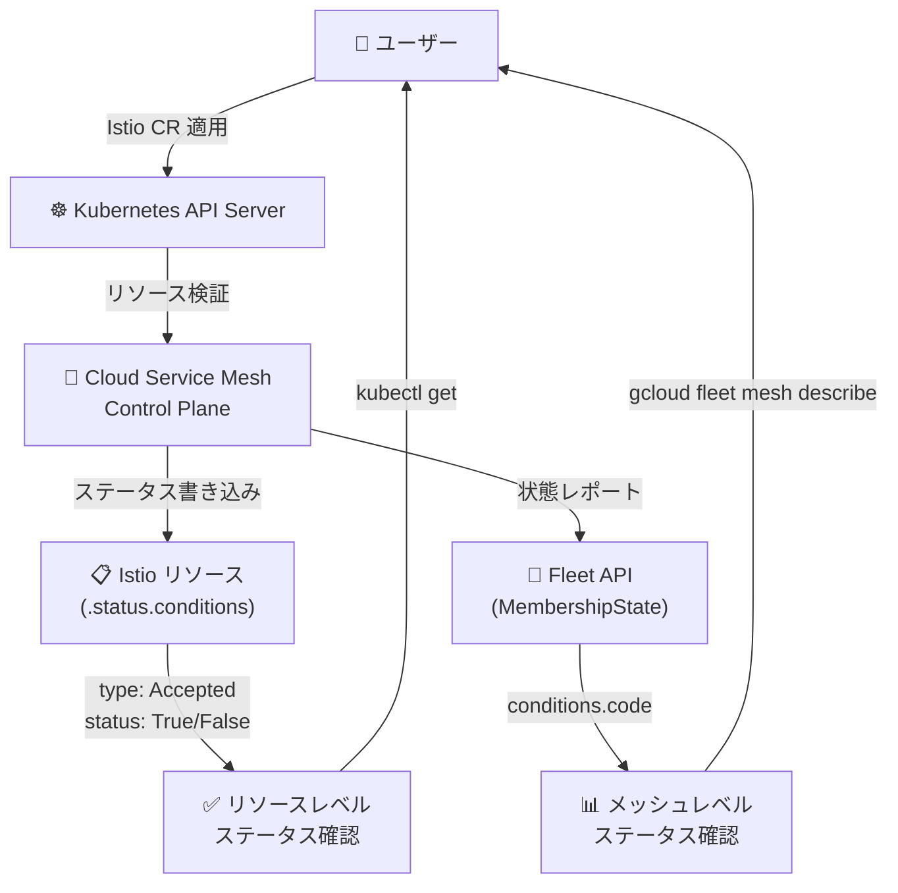

# Cloud Service Mesh: Istio API ステータスコードレポート機能

**リリース日**: 2026-05-20

**サービス**: Cloud Service Mesh

**機能**: Istio API の受理/拒否ステータスコードレポート

**ステータス**: Announcement

📊 [このアップデートのインフォグラフィックを見る](https://takech9203.github.io/google-cloud-news-summary/20260520-cloud-service-mesh-istio-api-status-codes.html)

## 概要

Cloud Service Mesh に、Istio API が受理 (Accepted) されたか拒否 (Rejected) されたかを示すステータスコードを報告する機能が追加された。これにより、ユーザーは個々のリソースおよびメッシュ全体の状態 (MembershipState) でステータスコードを確認できるようになる。

この機能は、サービスメッシュの構成管理における可観測性を大幅に向上させるものである。Istio カスタムリソース (VirtualService、DestinationRule、Gateway など) を適用した際に、その設定が正しく受理されたのか、あるいはバリデーションエラーにより拒否されたのかを即座に把握できるようになる。

**アップデート前の課題**

- Istio API の設定が正しく適用されたかどうかを確認する手段が限られていた
- 設定エラーが発生した場合、問題の特定にメッシュ全体の状態確認やログ調査が必要だった
- 個々のリソースレベルで受理/拒否のフィードバックを得ることが困難だった

**アップデート後の改善**

- 各 Istio リソースの `.status.conditions` フィールドでステータスコードを直接確認可能になった
- MembershipState の conditions にエラーコードが報告され、メッシュ全体の構成状態を一元的に把握できるようになった
- 設定ミスの早期検出と迅速なトラブルシューティングが可能になった

## アーキテクチャ図



Cloud Service Mesh のコントロールプレーンが Istio リソースを検証し、結果を個々のリソースの status フィールドと Fleet API の MembershipState の両方に報告するフローを示す。

## サービスアップデートの詳細

### 主要機能

1. **リソースレベルのステータスレポート**
   - 各 Istio カスタムリソースの `.status.conditions` に `type: Accepted` のコンディションが設定される
   - `status: True` は受理、`status: False` は拒否を意味する
   - `message` フィールドにエラーの詳細が記載される

2. **MembershipState レベルのエラーコード**
   - メッシュ全体の構成状態が `gcloud container fleet mesh describe` で確認可能
   - 構成に問題がある場合、`conditions` フィールドにエラーコードが報告される
   - エラーコードに対応するドキュメントリンクも提供される

3. **対象 Istio リソースタイプ**
   - ServiceEntry
   - DestinationRule
   - VirtualService
   - Gateway
   - PeerAuthentication
   - AuthorizationPolicy
   - RequestAuthentication
   - Sidecar
   - Telemetry
   - EnvoyFilter

## 技術仕様

### MembershipState エラーコード一覧

| エラーコード | 原因 | 対応方法 |
|------|------|------|
| CONFIG_APPLY_INTERNAL_ERROR | 内部エラーにより設定の適用に失敗 | カスタマーサポートに連絡 |
| QUOTA_EXCEEDED_* | クォータ制限に到達して設定の適用に失敗 | クォータの引き上げを申請 |
| CONFIG_VALIDATION_ERROR | 無効な設定により適用に失敗 | 個別リソースのエラー詳細を確認 |
| CONFIG_VALIDATION_WARNING | 設定に潜在的な問題を検出 | 個別リソースの警告内容を確認 |
| MULTICLUSTER_SECRET_WARNING | 手動作成の Istio マルチクラスタシークレットを使用中 | 宣言的マルチクラスタ API へ移行 |
| WORKLOAD_IDENTITY_REQUIRED | Workload Identity が未有効化 | クラスタとノードプールで Workload Identity を有効化 |
| MANAGED_CNI_NOT_ENABLED | Managed CNI が未有効化 | Managed CNI を有効化 |
| UNSUPPORTED_GATEWAY_CLASS_USAGE | 移行が必要なゲートウェイクラスを使用中 | Istio Ingress Gateway へ移行 |

### リソースステータスの確認方法

```bash
# 拒否されたリソースを一括検索
for resource in serviceentries destinationrules virtualservices gateways \
  peerauthentications authorizationpolicies requestauthentications \
  sidecars telemetries envoyfilters; do
  kubectl get $resource --all-namespaces --output=json | \
  jq '.items[] | select(.status.conditions != null and
    any(.status.conditions[]; .type == "Accepted" and .status == "False")) |
    {"name": .metadata.name, "namespace": .metadata.namespace,
     "kind": .kind, "conditions": .status.conditions}';
done
```

## 設定方法

### 前提条件

1. Cloud Service Mesh が有効化された GKE クラスタ
2. クラスタが Fleet に登録済みであること
3. マネージドコントロールプレーンが ACTIVE 状態であること

### 手順

#### ステップ 1: メッシュ状態の確認

```bash
# MembershipState でメッシュ全体の状態を確認
gcloud container fleet mesh describe --project PROJECT_ID
```

出力例:
```
membershipStates:
  projects/PROJECT_ID/locations/LOCATION/memberships/CLUSTER:
    servicemesh:
      conditions:
      - code: CONFIG_VALIDATION_WARNING
        documentationLink: https://cloud.google.com/...
        details: Application of one or more configs has failed.
        severity: WARNING
```

#### ステップ 2: 個別リソースのステータス確認

```bash
# 特定のリソースのステータスを確認
kubectl get virtualservice RESOURCE_NAME -n NAMESPACE -o json | \
  jq '.status.conditions'
```

出力例:
```json
[
  {
    "lastTransitionTime": "2026-05-20T10:00:00Z",
    "message": "Configuration accepted",
    "reason": "ReconcileSuccess",
    "status": "True",
    "type": "Accepted"
  }
]
```

## メリット

### ビジネス面

- **運用コスト削減**: 設定エラーの早期検出により、トラブルシューティング時間を短縮
- **サービス信頼性向上**: 無効な設定がメッシュに適用されるリスクを低減

### 技術面

- **即時フィードバック**: Istio API 適用後すぐに受理/拒否を確認可能
- **一元管理**: Fleet API 経由でマルチクラスタ環境のメッシュ状態を一括確認
- **自動化対応**: ステータスコードを利用した CI/CD パイプラインでの設定検証が容易に

## デメリット・制約事項

### 制限事項

- ステータスレポートはマネージド Cloud Service Mesh 環境でのみ利用可能
- 一部のバリデーションエラーはリソースの `.status.conditions` に表示されない場合がある (EnvoyFilter の一部など)

### 考慮すべき点

- ステータスが `Accepted: True` であっても、ランタイムでの動作が期待通りであることを保証するものではない
- 大規模環境では MembershipState の確認頻度に注意が必要

## ユースケース

### ユースケース 1: CI/CD パイプラインでの設定バリデーション

**シナリオ**: GitOps ワークフローで Istio 設定をデプロイした後、自動的に受理されたことを確認したい

**実装例**:
```bash
# 設定適用後にステータスを確認するスクリプト
kubectl apply -f virtualservice.yaml
sleep 10
STATUS=$(kubectl get virtualservice my-vs -o jsonpath='{.status.conditions[?(@.type=="Accepted")].status}')
if [ "$STATUS" != "True" ]; then
  echo "ERROR: Configuration was rejected"
  kubectl get virtualservice my-vs -o jsonpath='{.status.conditions[?(@.type=="Accepted")].message}'
  exit 1
fi
```

**効果**: デプロイパイプライン内で無効な設定を即座に検出し、ロールバック判断を自動化

### ユースケース 2: マルチクラスタ環境の構成状態監視

**シナリオ**: 複数の GKE クラスタにまたがるサービスメッシュの構成健全性を定期的にモニタリングしたい

**実装例**:
```bash
# Fleet 全体のメッシュ状態をチェック
gcloud container fleet mesh describe --project PROJECT_ID \
  --format="json" | jq '.membershipStates | to_entries[] |
  select(.value.servicemesh.conditions != null) |
  {cluster: .key, conditions: .value.servicemesh.conditions}'
```

**効果**: 複数クラスタの構成問題を一元的に検出し、問題のあるクラスタを迅速に特定

## 料金

Cloud Service Mesh は GKE Enterprise に含まれるサービスとして、またはスタンドアロンサービスとして利用可能。本機能 (ステータスコードレポート) による追加料金は発生しない。

詳細な料金体系については [Cloud Service Mesh 料金ページ](https://cloud.google.com/service-mesh/pricing) を参照。

## 関連サービス・機能

- **GKE (Google Kubernetes Engine)**: Cloud Service Mesh のプラットフォーム基盤。Fleet メンバーシップ経由でメッシュ管理を統合
- **Cloud Monitoring**: メッシュのテレメトリデータ収集と可視化。ステータスコードと組み合わせた包括的な監視が可能
- **Cloud Logging**: 構成バリデーションのログ記録。ステータスコードの変更履歴を追跡可能
- **Config Sync**: GitOps ベースの構成管理。ステータスコードによる設定適用結果の確認と連携

## 参考リンク

- 📊 [インフォグラフィック](https://takech9203.github.io/google-cloud-news-summary/20260520-cloud-service-mesh-istio-api-status-codes.html)
- [公式リリースノート](https://docs.cloud.google.com/release-notes#May_20_2026)
- [MembershipState Error Codes ドキュメント](https://docs.cloud.google.com/service-mesh/docs/troubleshooting/troubleshoot-configuration)
- [Cloud Service Mesh 概要](https://docs.cloud.google.com/service-mesh/docs/overview)
- [料金ページ](https://cloud.google.com/service-mesh/pricing)

## まとめ

Cloud Service Mesh における Istio API ステータスコードレポート機能は、サービスメッシュの構成管理における可観測性を大幅に向上させるアップデートである。個々のリソースレベルおよび Fleet の MembershipState レベルでの受理/拒否状態の確認が可能になり、設定エラーの早期検出とトラブルシューティングの効率化が期待できる。特にマルチクラスタ環境や GitOps ワークフローを採用している組織にとって、運用の自動化と信頼性向上に貢献する重要な機能追加である。

---

**タグ**: #CloudServiceMesh #Istio #ServiceMesh #GKE #Fleet #MembershipState #ConfigurationValidation #Observability
