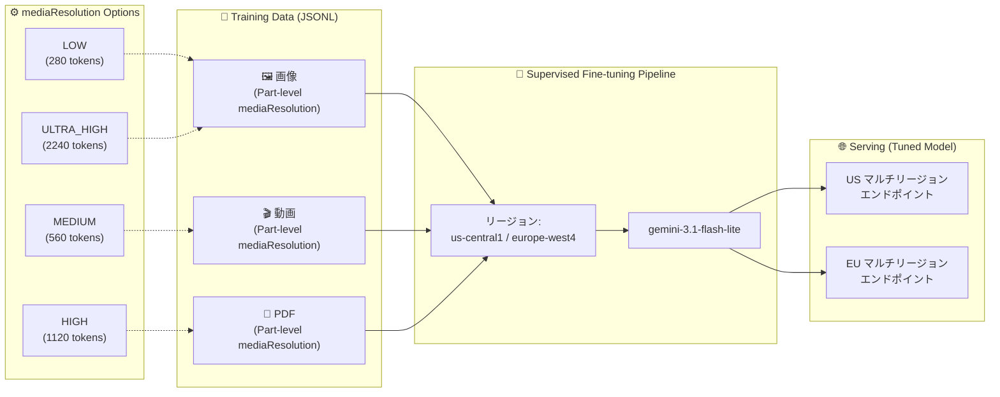

# Gemini Enterprise Agent Platform (Vertex AI): Supervised Fine-tuning - Gemini 3.1 Flash Lite 対応 & Part-level mediaResolution

**リリース日**: 2026-05-20

**サービス**: Gemini Enterprise Agent Platform (Vertex AI)

**機能**: Supervised Fine-tuning - Gemini 3.1 Flash Lite 対応および Part-level mediaResolution 宣言

**ステータス**: Preview (限定サポート)

📊 [このアップデートのインフォグラフィックを見る](https://takech9203.github.io/google-cloud-news-summary/20260520-gemini-agent-platform-fine-tuning-media-resolution.html)

## 概要

Gemini Enterprise Agent Platform の Supervised Fine-tuning に 2 つの重要なアップデートが追加された。第一に、Gemini 3.1 Flash Lite モデルに対する Supervised Fine-tuning が Preview として利用可能になった。第二に、ファインチューニングデータセットにおいて Part-level での mediaResolution 宣言がサポートされ、MEDIA_RESOLUTION_ULTRA_HIGH レベルを含む細粒度の解像度制御が可能になった。

Gemini 3.1 Flash Lite は 2026 年 3 月にリリースされた最もコスト効率の高い Gemini モデルであり、今回のアップデートにより低レイテンシかつ低コストなモデルに対してドメイン固有のカスタマイズが可能になった。また、Part-level mediaResolution により、従来はデータセット全体で統一する必要があったメディア解像度を、個々の Part (画像、動画、PDF) ごとに柔軟に設定できるようになった。

これらのアップデートは、マルチモーダルなファインチューニングのユースケースを大幅に拡張し、コスト最適化とモデル品質の両立を実現するものである。

**アップデート前の課題**

- Gemini 3.1 Flash Lite に対して Supervised Fine-tuning を実行できなかった
- ファインチューニングデータセット内のメディア解像度はデータセット全体で統一する必要があり、個々のメディアファイルに応じた最適化ができなかった
- MEDIA_RESOLUTION_ULTRA_HIGH (2240 トークン) レベルはファインチューニングでは利用できなかった
- 高解像度が必要な画像と低解像度で十分な画像が混在するデータセットでは、全体を高解像度に合わせるためトークンコストが増大していた

**アップデート後の改善**

- Gemini 3.1 Flash Lite に対する Supervised Fine-tuning が us-central1 および europe-west4 リージョンで実行可能になった
- チューニング済みモデルの推論は us および eu マルチリージョンエンドポイントで提供される
- Part-level で mediaResolution を宣言でき、同一データセット内で画像ごとに異なる解像度を設定可能になった
- MEDIA_RESOLUTION_ULTRA_HIGH レベルが Part-level 宣言でサポートされ、非常に細かいディテールの分析が必要なタスクに対応した

## アーキテクチャ図



Supervised Fine-tuning パイプラインのデータフローを示す。トレーニングデータの各 Part に個別の mediaResolution を設定し、us-central1 または europe-west4 でチューニングを実行後、us/eu マルチリージョンエンドポイントでチューニング済みモデルを提供する。

## サービスアップデートの詳細

### 主要機能

1. **Gemini 3.1 Flash Lite の Supervised Fine-tuning (Preview)**
   - Gemini 3.1 Flash Lite (`gemini-3.1-flash-lite`) に対する Supervised Fine-tuning が限定サポートとして利用可能
   - モデルチューニングは `us-central1` および `europe-west4` リージョンに制限
   - チューニング済みモデルの推論は `us` および `eu` マルチリージョンエンドポイントに制限
   - テキスト、画像、音声、動画、ドキュメントのマルチモーダルデータに対応

2. **Part-level mediaResolution 宣言**
   - Supervised Fine-tuning のデータセットで、個々の Part ごとに mediaResolution を設定可能
   - 対象メディアタイプ: 画像、動画、PDF
   - 従来のデータセット全体での統一設定 (`generationConfig.mediaResolution`) に加え、Part 単位での細粒度制御が可能に
   - `MEDIA_RESOLUTION_ULTRA_HIGH` レベルが Part-level 宣言で利用可能

3. **MEDIA_RESOLUTION_ULTRA_HIGH サポート**
   - 画像に対して最大 2240 トークンを割り当て可能
   - スクリーン録画の静止画や高解像度写真など、非常に細かいディテールの分析が必要なタスクに最適
   - Part-level 宣言でのみ使用可能 (グローバル設定では不可)

## 技術仕様

### mediaResolution トークン数 (Gemini 3 モデル)

| MediaResolution | 画像 (トークン) | 動画 (トークン/フレーム) | PDF (トークン) |
|------|------|------|------|
| MEDIA_RESOLUTION_LOW | 280 | 70 | 280 + テキスト |
| MEDIA_RESOLUTION_MEDIUM | 560 | 70 | 560 + テキスト |
| MEDIA_RESOLUTION_HIGH | 1120 | 280 | 1120 + テキスト |
| MEDIA_RESOLUTION_ULTRA_HIGH | 2240 | N/A | N/A |

### Gemini 3.1 Flash Lite Fine-tuning 制限事項

| 項目 | 詳細 |
|------|------|
| 最大入出力トークン (トレーニング例) | 131,072 |
| 最大推論トークン | ベース Gemini モデルと同一 |
| 最大バリデーションデータセットサイズ | 5,000 例 または トレーニング例の 30% |
| 最大トレーニングデータセットファイルサイズ | 1GB (JSONL) |
| 最大トレーニングデータセットサイズ | 10M テキストのみ例 または 300K マルチモーダル例 |
| アダプターサイズ | 1, 2, 4, 8, 16 |

### Part-level mediaResolution の設定例

```json
{
  "contents": [
    {
      "role": "user",
      "parts": [
        {
          "fileData": {
            "mimeType": "image/jpeg",
            "fileUri": "gs://my-bucket/high-detail-image.jpeg"
          },
          "mediaResolution": {
            "level": "MEDIA_RESOLUTION_ULTRA_HIGH"
          }
        },
        {
          "fileData": {
            "mimeType": "image/jpeg",
            "fileUri": "gs://my-bucket/context-image.jpeg"
          },
          "mediaResolution": {
            "level": "MEDIA_RESOLUTION_LOW"
          }
        },
        {
          "text": "Compare the details in these two images."
        }
      ]
    },
    {
      "role": "model",
      "parts": [
        {
          "text": "The first image shows..."
        }
      ]
    }
  ]
}
```

## 設定方法

### 前提条件

1. Google Cloud プロジェクトで Vertex AI API (Gemini Enterprise Agent Platform) が有効化されていること
2. トレーニングデータセットが JSONL 形式で Cloud Storage に配置されていること
3. 適切な IAM 権限 (`roles/aiplatform.user` 以上) が付与されていること

### 手順

#### ステップ 1: SDK の初期化とリージョン設定

```python
import vertexai

# us-central1 または europe-west4 を指定
vertexai.init(project='my-project', location='us-central1')
```

#### ステップ 2: Part-level mediaResolution を含むデータセットの準備

```json
{"contents": [{"role": "user", "parts": [{"fileData": {"mimeType": "image/jpeg", "fileUri": "gs://bucket/img1.jpg"}, "mediaResolution": {"level": "MEDIA_RESOLUTION_ULTRA_HIGH"}}, {"text": "Describe fine details."}]}, {"role": "model", "parts": [{"text": "The image shows..."}]}]}
{"contents": [{"role": "user", "parts": [{"fileData": {"mimeType": "video/mp4", "fileUri": "gs://bucket/video1.mp4"}, "mediaResolution": {"level": "MEDIA_RESOLUTION_MEDIUM"}}, {"text": "Summarize this video."}]}, {"role": "model", "parts": [{"text": "The video depicts..."}]}]}
```

#### ステップ 3: チューニングジョブの作成 (REST API)

```bash
curl -X POST \
  "https://us-central1-aiplatform.googleapis.com/v1/projects/PROJECT_ID/locations/us-central1/tuningJobs" \
  -H "Authorization: Bearer $(gcloud auth print-access-token)" \
  -H "Content-Type: application/json" \
  -d '{
    "baseModel": "gemini-3.1-flash-lite",
    "supervisedTuningSpec": {
      "trainingDatasetUri": "gs://my-bucket/train.jsonl",
      "validationDatasetUri": "gs://my-bucket/validation.jsonl"
    },
    "tunedModelDisplayName": "my-tuned-flash-lite"
  }'
```

チューニングジョブが完了すると、チューニング済みモデルは us または eu マルチリージョンエンドポイントから推論に利用可能になる。

## メリット

### ビジネス面

- **コスト最適化**: Gemini 3.1 Flash Lite は最もコスト効率の高いモデルであり、ファインチューニングにより高価なモデルに匹敵する特化性能を低コストで実現可能
- **柔軟なトークンコスト管理**: Part-level mediaResolution により、重要な画像のみ高解像度を割り当て、全体のトレーニングトークンコストを最適化可能
- **EU データレジデンシ対応**: europe-west4 でのチューニングと eu エンドポイントでの推論により、EU のデータレジデンシ要件を満たしつつカスタムモデルを運用可能

### 技術面

- **細粒度の解像度制御**: 同一データセット内で異なるメディアに異なる解像度を設定でき、モデル品質とコストのトレードオフを最適化可能
- **ULTRA_HIGH 解像度**: 2240 トークンの最高解像度により、OCR や細かいディテール認識など高精度が求められるタスクのチューニング品質が向上
- **低レイテンシ推論**: Flash Lite ベースのチューニング済みモデルは推論時も高速で、リアルタイムアプリケーションに適している

## デメリット・制約事項

### 制限事項

- Preview (限定サポート) であり、SLA の対象外
- チューニングリージョンは us-central1 と europe-west4 のみに制限
- チューニング済みモデルの推論は us と eu マルチリージョンエンドポイントのみ
- MEDIA_RESOLUTION_ULTRA_HIGH は画像の Part-level 宣言でのみ利用可能 (動画・PDF は非対応)
- 動画チューニングの最大ファイルサイズは 100MB
- 動画の最大長は MEDIA_RESOLUTION_MEDIUM で 5 分、MEDIA_RESOLUTION_LOW で 20 分

### 考慮すべき点

- Preview 期間中は機能の変更や制限の追加が行われる可能性がある
- アジア太平洋リージョンでのチューニングおよびサービングは現時点で非対応
- controlled generation (構造化出力) との組み合わせでは、チューニング時とのデータ不整合により品質低下が生じる場合がある
- チューニング済みモデルでは thinking 予算をオフまたは最低値に設定することが推奨される

## ユースケース

### ユースケース 1: 高精度ドキュメント分析モデルの構築

**シナリオ**: 金融機関が契約書や報告書のスキャン画像から重要情報を抽出するモデルを構築する場合。細かい文字やロゴの認識が必要な画像は ULTRA_HIGH、全体レイアウト確認のみの画像は LOW を設定する。

**実装例**:
```json
{"contents": [{"role": "user", "parts": [{"fileData": {"mimeType": "image/jpeg", "fileUri": "gs://bucket/contract-clause.jpg"}, "mediaResolution": {"level": "MEDIA_RESOLUTION_ULTRA_HIGH"}}, {"text": "Extract all text and key terms from this contract section."}]}, {"role": "model", "parts": [{"text": "Section 3.1: Indemnification..."}]}]}
```

**効果**: トークンコストを抑えつつ、重要な部分のみ最高解像度で学習させることで、コスト効率と精度を両立した専用モデルを構築可能。

### ユースケース 2: コスト効率の高いカスタマーサポート自動化

**シナリオ**: EC サイトが商品画像と顧客問い合わせに基づいて自動回答するチャットボットを、Gemini 3.1 Flash Lite ベースで構築する。高コストなモデルの代わりに Flash Lite をファインチューニングすることで、大量のリクエストを低コストで処理する。

**効果**: 推論コストが大幅に削減されつつ、ドメイン固有の知識 (商品カタログ、返品ポリシーなど) を学習した高品質な応答が可能。

## 料金

Gemini Supervised Fine-tuning の料金はトレーニングトークン数に基づいて計算される。トレーニングトークン数は、データセット内のトークン数にエポック数を乗じた値となる。

チューニング後の推論 (予測リクエスト) コストは、各安定版 Gemini モデルと同一の料金が適用される。

詳細は [Gemini Enterprise Agent Platform の料金ページ](https://docs.cloud.google.com/gemini-enterprise-agent-platform/pricing) を参照。

## 利用可能リージョン

| 用途 | 利用可能リージョン |
|------|------|
| モデルチューニング | us-central1, europe-west4 |
| チューニング済みモデル推論 | us マルチリージョン, eu マルチリージョン |

## 関連サービス・機能

- **Gemini 3.1 Flash Lite**: 今回ファインチューニング対応したベースモデル。2026 年 3 月リリースの最もコスト効率の高い Gemini モデル
- **Gemini Enterprise Agent Platform**: Vertex AI 上の Gemini モデル管理・デプロイ基盤
- **Cloud Storage**: トレーニングデータセット (JSONL) の保存先
- **Gen AI Evaluation Service**: チューニングジョブと統合した自動評価機能 (Preview)
- **Media Resolution API**: 推論時にも Part-level で mediaResolution を制御し、トークンコストを最適化可能

## 参考リンク

- 📊 [インフォグラフィック](https://takech9203.github.io/google-cloud-news-summary/20260520-gemini-agent-platform-fine-tuning-media-resolution.html)
- [公式リリースノート](https://cloud.google.com/release-notes#May_20_2026)
- [Supervised Fine-tuning ドキュメント](https://docs.cloud.google.com/gemini-enterprise-agent-platform/models/gemini-supervised-tuning)
- [Image Tuning ガイド](https://docs.cloud.google.com/gemini-enterprise-agent-platform/models/tune_gemini/image_tune)
- [Video Tuning ガイド](https://docs.cloud.google.com/gemini-enterprise-agent-platform/models/tune_gemini/video_tune)
- [Document Tuning ガイド](https://docs.cloud.google.com/gemini-enterprise-agent-platform/models/tune_gemini/doc_tune)
- [Media Resolution ドキュメント](https://ai.google.dev/gemini-api/docs/media-resolution)
- [料金ページ](https://docs.cloud.google.com/gemini-enterprise-agent-platform/pricing)

## まとめ

今回のアップデートにより、最もコスト効率の高い Gemini 3.1 Flash Lite モデルのファインチューニングが可能になり、大規模展開を見据えたカスタムモデル構築の選択肢が大きく広がった。Part-level mediaResolution の導入は、マルチモーダルデータセットにおけるトークンコスト最適化の柔軟性を飛躍的に向上させるものであり、特に画像・ドキュメント処理の品質とコストのバランスが重要なエンタープライズユースケースでの活用が推奨される。

---

**タグ**: #GeminiEnterpriseAgentPlatform #VertexAI #SupervisedFineTuning #Gemini3.1FlashLite #mediaResolution #マルチモーダル #MachineLearning #Preview
