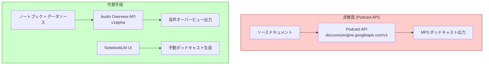

# Gemini Enterprise (NotebookLM Enterprise): Podcast API の非推奨化

**リリース日**: 2026-05-20

**サービス**: Gemini Enterprise (NotebookLM Enterprise)

**機能**: Podcast API の非推奨化 (Deprecated)

**ステータス**: Deprecated

[このアップデートのインフォグラフィックを見る](https://takech9203.github.io/google-cloud-news-summary/20260520-gemini-enterprise-notebooklm-podcast-deprecated.html)

## 概要

Google Cloud は、NotebookLM Enterprise の Podcast API を非推奨 (Deprecated) としました。今後、新規顧客へのアローリスト追加は行われません。この機能は、アローリスト付きの GA (一般提供) として提供されていましたが、今回の決定により新たな利用開始は不可能となりました。

Podcast API は、ソースドキュメントに基づいてポッドキャスト形式の音声コンテンツを自動生成する API でした。NotebookLM のエンドユーザーがノートブック内で生成できるポッドキャストと非常に類似した出力を、API 経由でバッチ処理として大量に生成できることが特徴でした。数十から数百の書籍、記事、コースに対して一括でポッドキャストを生成するようなユースケースに適していました。

この非推奨化は、既存のアローリスト顧客にも将来的な影響を与える可能性があるため、早期の移行計画の策定が推奨されます。

**アップデート前の状況**

- Podcast API を使用して、NotebookLM Enterprise のノートブック、Gemini Enterprise ライセンス、データストアなしでポッドキャストを生成可能だった
- テキスト、画像、音声、動画を入力として MP3 形式のポッドキャストを出力できた
- バッチ処理での大量コンテンツのポッドキャスト化が可能だった

**アップデート後の影響**

- 新規顧客はアローリストに追加されないため、Podcast API の新規利用が不可能に
- 既存顧客も将来的な API 廃止に備えた移行計画が必要
- 代替手段として Audio Overview API (v1alpha) またはエンドユーザー向け NotebookLM UI の利用を検討する必要あり

## アーキテクチャ図



上図は、非推奨となった Podcast API と、代替として利用可能な Audio Overview API および NotebookLM UI の関係を示しています。

## サービスアップデートの詳細

### 非推奨化の内容

1. **新規アローリスト追加の停止**
   - Google は新規顧客をアローリストに追加しない方針を決定
   - 既存のアローリスト顧客への即時的な影響は現時点では未発表

2. **Podcast API の特徴 (非推奨前)**
   - スタンドアロン API として動作し、NotebookLM Enterprise ノートブック、Gemini Enterprise ライセンス、データストアが不要
   - Discovery Engine API の有効化と Podcast API User ロール (`roles/discoveryengine.podcastApiUser`) のみが必要
   - テキスト、画像、音声、動画を含むマルチモーダル入力に対応
   - 入力コンテンツの合計は 100,000 トークン未満が条件

3. **出力仕様**
   - MP3 形式でのポッドキャスト出力
   - SHORT (4-5分) または STANDARD (約10分) の長さ指定が可能
   - BCP47 言語コードによる多言語対応

## 技術仕様

### Podcast API と Audio Overview API の比較

| 項目 | Podcast API (非推奨) | Audio Overview API (代替) |
|------|---------------------|--------------------------|
| API バージョン | v1 | v1alpha (Preview) |
| ステータス | Deprecated | Preview |
| ノートブック必須 | 不要 | 必要 |
| Gemini Enterprise ライセンス | 不要 | 必要 |
| データストア | 不要 | 必要 |
| 入力形式 | テキスト、画像、音声、動画 | ノートブック内ソース |
| 出力形式 | MP3 | WAV / MP4 |
| エンドポイント | `discoveryengine.googleapis.com/v1/.../podcasts` | `discoveryengine.googleapis.com/v1alpha/.../audioOverviews` |
| 日次制限 | 不明 | ユーザーあたり20回/日 |

### 既存の Podcast API 呼び出し例 (非推奨)

```bash
# 今後利用不可となる API 呼び出し
curl -X POST \
  -H "Authorization: Bearer $(gcloud auth print-access-token)" \
  -H "Content-Type: application/json" \
  "https://discoveryengine.googleapis.com/v1/projects/PROJECT_ID/locations/global/podcasts" \
  -d '{
    "podcastConfig": {
      "focus": "FOCUS_TOPIC",
      "length": "SHORT",
      "languageCode": "ja"
    },
    "contexts": [
      { "text": "TEXT_CONTENT" }
    ],
    "title": "PODCAST_TITLE",
    "description": "PODCAST_DESCRIPTION"
  }'
```

## 移行ガイダンス

### 代替手段 1: Audio Overview API (v1alpha)

Audio Overview API は、ノートブックに関連付けられた音声オーバービューを生成する API です。Podcast API とは異なり、ノートブックとデータソースの事前準備が必要ですが、類似した音声コンテンツ生成機能を提供します。

```bash
# Audio Overview API の呼び出し例
curl -X POST \
  -H "Authorization: Bearer $(gcloud auth print-access-token)" \
  "https://ENDPOINT_LOCATION-discoveryengine.googleapis.com/v1alpha/projects/PROJECT_NUMBER/locations/LOCATION/notebooks/NOTEBOOK_ID/audioOverviews" \
  -d '{
    "sourceIds": [{ "id": "SOURCE_ID" }],
    "episodeFocus": "EPISODE_FOCUS",
    "languageCode": "ja"
  }'
```

**注意**: Audio Overview API は現在 Preview ステータスであり、Pre-GA Offerings Terms が適用されます。

### 代替手段 2: NotebookLM Enterprise UI

エンドユーザー向けの NotebookLM Enterprise UI からは、引き続きポッドキャスト/音声オーバービューの手動生成が可能です。バッチ処理には不向きですが、少量のコンテンツ生成には有効です。

### 移行時の考慮事項

1. Audio Overview API はノートブックごとに1つの音声オーバービューのみ保持可能
2. Audio Overview API は v1alpha であり、今後の仕様変更の可能性あり
3. バッチ処理のワークフローの再設計が必要

## デメリット・制約事項

### 影響を受けるユースケース

- 大量の書籍・記事に対するバッチポッドキャスト生成
- ノートブック不要のスタンドアロンでのポッドキャスト生成
- Gemini Enterprise ライセンスなしでの音声コンテンツ生成

### 考慮すべき点

- 既存の Podcast API ベースのワークフローは将来的に完全に停止する可能性がある
- Audio Overview API は Preview であり、SLA の保証がない
- Audio Overview API への移行には、ノートブックとデータソースの管理が追加で必要
- バッチ処理の自動化にはノートブック作成・ソース追加・音声生成・削除という追加ステップが必要

## ユースケース

### ユースケース 1: 教育コンテンツのバッチ生成 (影響あり)

**シナリオ**: 教育機関が数百のコース教材からポッドキャストを自動生成していた

**影響**: Podcast API の非推奨化により、この自動化パイプラインは新規構築不可。既存利用者も将来的に移行が必要。

**代替アプローチ**: Audio Overview API を使用する場合、各コース教材ごとにノートブックを作成し、ソースを追加した上で音声オーバービューを生成する必要があり、ワークフローが複雑化する。

### ユースケース 2: メディア企業の記事音声化 (影響あり)

**シナリオ**: メディア企業が記事をポッドキャスト形式に変換してリスナーに配信していた

**影響**: スタンドアロンで利用できた Podcast API が使えなくなり、NotebookLM Enterprise のフル構成が必要に

**代替アプローチ**: NotebookLM Enterprise ライセンスの取得、ノートブック管理の実装、Audio Overview API の活用を組み合わせた新しいパイプラインの構築が必要。

## 関連サービス・機能

- **NotebookLM Enterprise Audio Overview API**: Podcast API の代替として利用可能な音声オーバービュー生成 API (v1alpha/Preview)
- **NotebookLM Enterprise UI**: エンドユーザーが手動でポッドキャスト/音声オーバービューを生成可能なインターフェース
- **Gemini Enterprise**: NotebookLM Enterprise を含む親プロダクト
- **Discovery Engine API**: Podcast API および Audio Overview API の基盤となる API サービス

## 参考リンク

- [インフォグラフィック](https://takech9203.github.io/google-cloud-news-summary/20260520-gemini-enterprise-notebooklm-podcast-deprecated.html)
- [公式リリースノート](https://cloud.google.com/release-notes#May_20_2026)
- [Podcast API ドキュメント](https://cloud.google.com/gemini/enterprise/notebooklm-enterprise/docs/podcast-api)
- [Audio Overview API ドキュメント](https://cloud.google.com/gemini/enterprise/notebooklm-enterprise/docs/api-audio-overview)
- [NotebookLM Enterprise 概要](https://cloud.google.com/gemini/enterprise/notebooklm-enterprise/docs/overview)

## まとめ

NotebookLM Enterprise の Podcast API が非推奨化されたことで、スタンドアロンでのバッチポッドキャスト生成という便利な機能が新規利用不可となりました。既存ユーザーは Audio Overview API (v1alpha) への移行を検討すべきですが、ノートブック管理が追加で必要になる点や Preview ステータスである点に注意が必要です。早期の移行計画策定と、代替ワークフローの設計・テストを推奨します。

---

**タグ**: #GeminiEnterprise #NotebookLMEnterprise #PodcastAPI #Deprecated #AudioOverview #非推奨化 #移行ガイド
