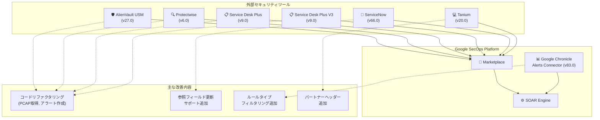

# Google SecOps Marketplace: コネクタ・インテグレーション一括アップデート (2026年5月)

**リリース日**: 2026-05-20

**サービス**: Google SecOps Marketplace

**機能**: 複数コネクタ・インテグレーションのバージョンアップ (7件)

**ステータス**: 変更 (Change)

📊 [このアップデートのインフォグラフィックを見る](https://takech9203.github.io/google-cloud-news-summary/20260520-google-secops-marketplace-connector-updates-may.html)

## 概要

Google SecOps (旧 Chronicle SOAR) の Marketplace において、7 つのコネクタおよびインテグレーションがアップデートされた。今回のアップデートは、コードのリファクタリング、機能追加、API リクエストの改善など、セキュリティオーケストレーション基盤の安定性と機能性を向上させる内容となっている。

特に注目すべきは、ServiceNow インテグレーション (Version 66.0) における参照フィールドの更新サポート追加と、Google Chronicle コネクタ (Version 83.0) におけるルールタイプによるアラートフィルタリング機能の追加である。これらは、SOC (Security Operations Center) チームの日常的なインシデント対応ワークフローに直接的な改善をもたらす。

**アップデート前の課題**

- ServiceNow の Update Incident アクションで参照フィールド (reference fields) を直接更新できなかった
- Google Chronicle Alerts Connector でルールタイプによるアラートのフィルタリングができず、不要なアラートも取り込まれていた
- 一部のコネクタ (AlienVault USM Appliance、Protectwise、Service Desk Plus) で旧式のコード構造が残っており、保守性やパフォーマンスに課題があった
- Tanium インテグレーションの API リクエストにパートナーヘッダーが含まれておらず、API 管理やトラッキングが困難だった

**アップデート後の改善**

- ServiceNow の Update Incident アクションで参照フィールドを直接更新可能になり、関連レコードへのリンクを自動化ワークフロー内で設定できるようになった
- Google Chronicle Alerts Connector でルールタイプによるフィルタリングが可能になり、取り込むアラートをより精密に制御できるようになった
- リファクタリングにより、複数コネクタの安定性と保守性が向上した
- Tanium の API リクエストにパートナーヘッダーが追加され、API コール管理が改善された

## アーキテクチャ図



Google SecOps Marketplace を中心とした各コネクタ・インテグレーションの関係と、今回のアップデート内容を示す図。

## サービスアップデートの詳細

### 主要機能

1. **ServiceNow インテグレーション (Version 66.0) - 参照フィールド更新サポート**
   - Update Incident アクションに参照フィールド (reference fields) の更新サポートが追加された
   - ServiceNow の参照フィールドとは、他のテーブルのレコードへのリンク (例: assigned_to, caller_id, cmdb_ci) を指す
   - これにより、プレイブック内でインシデントの担当者変更、CI アイテムの関連付け、グループ割り当てなどをより柔軟に自動化できる
   - Custom Fields パラメータと組み合わせることで、高度なインシデント管理ワークフローが構築可能

2. **Google Chronicle コネクタ (Version 83.0) - ルールタイプフィルタリング**
   - Chronicle Alerts Connector にルールタイプ (rule type) によるアラートフィルタリング機能が追加された
   - ルールタイプの例: SINGLE_EVENT、MULTI_EVENT など
   - 既存のフィルタキー (Rule.severity、Rule.ruleName、Rule.ruleID、Rule.ruleLabels) に加え、ルールタイプによる絞り込みが可能になった
   - 大量のアラートを処理する環境で、特定のルールタイプのみを SOAR に取り込む運用が容易になる

3. **Tanium インテグレーション (Version 20.0) - パートナーヘッダー追加**
   - すべての API リクエストにパートナーヘッダーが追加された
   - これにより、Tanium 側で Google SecOps からのリクエストを識別・追跡できるようになった
   - API 利用状況のモニタリングやトラブルシューティングが容易になる

4. **AlienVault USM Appliance (Version 27.0) - コードリファクタリング**
   - Get PCAP Files For Events アクションのコードがリファクタリングされた
   - PCAP ファイル取得の安定性とパフォーマンスが向上

5. **Protectwise (Version 6.0) - コードリファクタリング**
   - Get Pcap アクションのコードがリファクタリングされた
   - パケットキャプチャ取得処理の改善

6. **Service Desk Plus / Service Desk Plus V3 (Version 9.0) - コードリファクタリング**
   - Create Alert Request アクションのコードが両バージョンでリファクタリングされた
   - アラートリクエスト作成処理の安定性向上

## 技術仕様

### アップデート対象コネクタ一覧

| コネクタ/インテグレーション | バージョン | 対象アクション | 変更内容 |
|------|------|------|------|
| AlienVault USM Appliance | 27.0 | Get PCAP Files For Events | コードリファクタリング |
| Protectwise | 6.0 | Get Pcap | コードリファクタリング |
| Service Desk Plus | 9.0 | Create Alert Request | コードリファクタリング |
| Service Desk Plus V3 | 9.0 | Create Alert Request | コードリファクタリング |
| ServiceNow | 66.0 | Update Incident | 参照フィールド更新サポート追加 |
| Google Chronicle | 83.0 | Chronicle Alerts Connector | ルールタイプフィルタリング追加 |
| Tanium | 20.0 | 全 API リクエスト | パートナーヘッダー追加 |

### ServiceNow 参照フィールドの例

ServiceNow における主要な参照フィールド:

| フィールド名 | 参照先テーブル | 説明 |
|------|------|------|
| assigned_to | sys_user | インシデント担当者 |
| caller_id | sys_user | 報告者 |
| assignment_group | sys_user_group | 担当グループ |
| cmdb_ci | cmdb_ci | 構成アイテム |
| resolved_by | sys_user | 解決者 |
| opened_by | sys_user | 起票者 |

### Chronicle Alerts Connector フィルタキー

| フィルタキー | レスポンスキー | 演算子 | 値の例 |
|------|------|------|------|
| Rule.severity | detection/ruleLabels/severity | =, !=, >, <, >=, <= | Info, Low, Medium, High, Critical |
| Rule.ruleName | detection/ruleName | =, != | ユーザー定義 |
| Rule.ruleID | detection/ruleId | =, != | ユーザー定義 |
| Rule.ruleLabels.{key} | detection/ruleLabels | =, != | ユーザー定義 |
| Rule.ruleType (新規) | detection/ruleType | =, != | SINGLE_EVENT, MULTI_EVENT |

## メリット

### ビジネス面

- **SOC 運用効率の向上**: ServiceNow の参照フィールド更新により、インシデント管理の自動化範囲が拡大し、手動作業が削減される
- **アラートノイズの削減**: Chronicle Alerts Connector のルールタイプフィルタリングにより、SOC アナリストが対応すべきアラートを精選できる
- **API 利用可視性の向上**: Tanium のパートナーヘッダー追加により、セキュリティツール間の連携状況をより正確に把握できる

### 技術面

- **コードの保守性向上**: 4 つのコネクタでリファクタリングが実施され、将来のバグ修正や機能追加が容易になった
- **プレイブックの柔軟性向上**: ServiceNow の参照フィールドサポートにより、より複雑な自動化シナリオを実装可能
- **コネクタのパフォーマンス改善**: リファクタリングによる処理効率の向上

## ユースケース

### ユースケース 1: ServiceNow インシデントの自動エスカレーション

**シナリオ**: Google SecOps で高重要度のアラートが検出された場合、ServiceNow のインシデントを自動的に作成し、適切な担当者 (参照フィールド) を設定する

**実装例**:
```json
{
  "action": "Update Incident",
  "parameters": {
    "Incident Number": "INC0012345",
    "Custom Fields": "{\"assigned_to\": \"sys_id_of_security_analyst\", \"assignment_group\": \"sys_id_of_soc_team\", \"cmdb_ci\": \"sys_id_of_affected_server\"}"
  }
}
```

**効果**: 参照フィールドの自動設定により、エスカレーション時の手動操作が不要になり、MTTR (平均修復時間) の短縮に貢献する

### ユースケース 2: ルールタイプによるアラートの選択的取り込み

**シナリオ**: 大量の SINGLE_EVENT ルールアラートが生成される環境で、MULTI_EVENT ルールのアラートのみを SOAR プレイブックで処理したい

**効果**: ルールタイプフィルタリングにより、真に相関分析が必要なアラートのみを SOAR に取り込み、自動化ワークフローのリソースを効率的に活用できる

## 関連サービス・機能

- **Google SecOps (Chronicle SIEM)**: アラート検出エンジン。Chronicle Alerts Connector の直接のデータソース
- **Google SecOps SOAR**: セキュリティオーケストレーション・自動化プラットフォーム。Marketplace コネクタを通じて外部ツールと連携
- **ServiceNow ITSM**: IT サービスマネジメントプラットフォーム。インシデント管理の自動化に利用
- **Tanium**: エンドポイント管理・セキュリティプラットフォーム。エンティティエンリッチメントやファイルダウンロードに活用
- **Cloud Logging / Cloud Monitoring**: Google SecOps のインフラストラクチャ監視に利用可能

## 参考リンク

- 📊 [インフォグラフィック](https://takech9203.github.io/google-cloud-news-summary/20260520-google-secops-marketplace-connector-updates-may.html)
- [公式リリースノート](https://docs.cloud.google.com/release-notes#May_20_2026)
- [Google SecOps Marketplace - ServiceNow ドキュメント](https://docs.cloud.google.com/chronicle/docs/soar/marketplace-integrations/servicenow)
- [Google SecOps Marketplace - Google Chronicle ドキュメント](https://docs.cloud.google.com/chronicle/docs/soar/marketplace-integrations/google-chronicle)
- [Google SecOps Marketplace - Tanium ドキュメント](https://docs.cloud.google.com/chronicle/docs/soar/marketplace-integrations/tanium)
- [Google SecOps コネクタ設定ガイド](https://docs.cloud.google.com/chronicle/docs/soar/ingest/connectors/ingest-your-data-connectors)

## まとめ

今回の Google SecOps Marketplace アップデートは、SOC チームの日常運用に直接的な改善をもたらす。特に ServiceNow の参照フィールドサポートと Chronicle Alerts Connector のルールタイプフィルタリングは、インシデント対応の自動化精度を高める重要な機能追加である。既存のプレイブックを見直し、新機能を活用したワークフローの最適化を検討されたい。

---

**タグ**: #GoogleSecOps #Chronicle #SOAR #Marketplace #ServiceNow #Tanium #SecurityOperations #ConnectorUpdate
