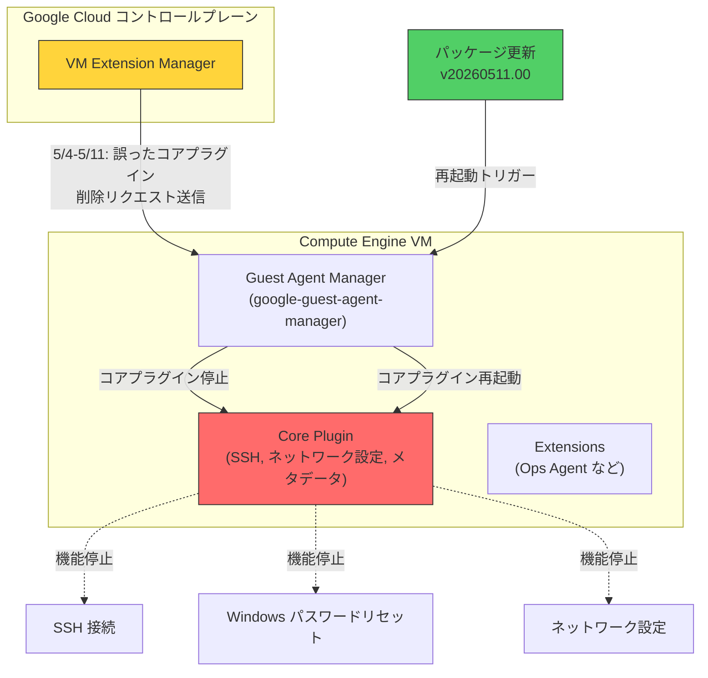

# Guest Environment: ゲストエージェント再起動によるコアプラグイン障害の修正

**リリース日**: 2026-05-20

**サービス**: Compute Engine Guest Environment

**機能**: ゲストエージェント v20260511.00 リリース (コアプラグイン削除障害の修正)

**ステータス**: Fixed

📊 [このアップデートのインフォグラフィックを見る](https://takech9203.github.io/google-cloud-news-summary/20260520-guest-environment-agent-restart-fix.html)

## 概要

Compute Engine のゲストエージェント バージョン 20260511.00 が、すべてのサポート対象 OS 向けにリリースされた。このリリースは 2026 年 4 月 27 日に発表されたバージョン 20260423.01 のリビルドであり、追加の変更は含まれていない。リリースの目的は、ゲストエージェントの再起動をトリガーすることにある。

2026 年 5 月 4 日から 5 月 11 日の間に、コントロールプレーンが誤ってコアプラグインを削除するリクエストを送信する障害が発生した。これにより、ゲストエージェントが機能を停止し、SSH 接続や Windows パスワードリセットなど、ゲストエージェントに依存する機能が利用できなくなった。今回のパッケージ更新により、ゲストエージェントが自動的に再起動され、正常な動作が回復する。

**アップデート前の課題**

- 2026 年 5 月 4 日〜5 月 11 日の間に、コントロールプレーンからコアプラグインを削除する誤ったリクエストが送信された
- コアプラグインが削除されたことで、ゲストエージェントが停止した
- SSH 接続ができなくなり、リモートからの VM 操作が困難になった
- Windows VM ではパスワードリセットが機能しなくなった
- ネットワーク設定やメタデータ認証情報のブートストラップなど、コアプラグインが担う基本機能すべてが影響を受けた

**アップデート後の改善**

- パッケージ更新によりゲストエージェントが自動的に再起動される
- コアプラグインが正常に復元され、SSH 接続が回復する
- Windows パスワードリセット機能が復旧する
- ネットワーク設定、メタデータアクセスなどの基本機能が正常に動作する

## アーキテクチャ図



この図は、コントロールプレーンからの誤ったリクエストによりコアプラグインが停止した障害の流れと、パッケージ更新による復旧の仕組みを示している。

## サービスアップデートの詳細

### 主要機能

1. **ゲストエージェントの自動再起動**
   - バージョン 20260511.00 のパッケージインストールにより、ゲストエージェントが自動的に再起動される
   - 手動での介入は不要で、パッケージマネージャーによる更新で自動復旧する

2. **コアプラグインの復元**
   - コアプラグインはゲストエージェントの中核コンポーネントであり、無効化できない設計になっている
   - 再起動により、コアプラグインが正常な状態で再ロードされる
   - SSH アクセス管理、ネットワーク設定、メタデータアクセスが復旧する

3. **既存バージョンのリビルド**
   - 20260423.01 と同一の内容であり、新たな機能変更は含まれない
   - パッケージ更新による再起動のみを目的としたリリース

## 技術仕様

### ゲストエージェント コアプラグインの機能

| 機能 | 説明 |
|------|------|
| ネットワーク設定 | プライマリネットワークインターフェースの設定 |
| SSH アクセス | ユーザー SSH キーの管理による安全な接続 |
| メタデータアクセス | インスタンスおよびプロジェクトメタデータへのアクセス |
| MDS 認証情報ブートストラップ | セキュアなメタデータサーバー認証情報の管理 |
| ホストキー設定 | 初期インスタンスセットアップ時のホストキー生成 |

### ゲストエージェントのアーキテクチャ (プラグインベース)

| コンポーネント | Linux サービス名 | Windows サービス名 |
|--------------|-----------------|-------------------|
| Guest Agent Manager | google-guest-agent-manager.service | GCEAgentManager |
| Core Plugin | (Manager が管理) | (Manager が管理) |
| Compatibility Manager | google-guest-compat-manager.service | GCEWindowsCompatManager |

### 障害タイムライン

| 日付 | イベント |
|------|---------|
| 2026-04-27 | バージョン 20260423.01 リリース |
| 2026-05-04 | コントロールプレーンが誤ったコアプラグイン削除リクエストの送信を開始 |
| 2026-05-11 | 誤ったリクエストの送信が停止 |
| 2026-05-20 | バージョン 20260511.00 リリース (再起動トリガー) |

## 設定方法

### 前提条件

1. 影響を受けた VM が稼働中であること
2. VM がパッケージリポジトリにアクセス可能であること

### 手順

#### ステップ 1: 自動更新の確認

通常、パッケージ更新は自動的に適用される。手動で確認する場合:

```bash
# Linux: ゲストエージェントのバージョン確認
dpkg -l google-guest-agent 2>/dev/null || rpm -q google-guest-agent
```

```powershell
# Windows: GooGet でバージョン確認
googet installed google-compute-engine-windows
```

#### ステップ 2: 手動でのエージェント再起動 (必要な場合)

```bash
# Linux (プラグインベースアーキテクチャ: v20250901.00 以降)
ggactl_plugin coreplugin restart

# Linux (レガシー)
systemctl restart google-guest-agent
```

```powershell
# Windows (プラグインベースアーキテクチャ: v20250901.00 以降)
ggactl_plugin coreplugin restart

# Windows (レガシー)
Restart-Service GCEAgent
```

#### ステップ 3: 動作確認

```bash
# SSH 接続テスト
gcloud compute ssh INSTANCE_NAME --zone=ZONE

# エージェントのステータス確認 (Linux)
systemctl status google-guest-agent-manager.service
```

## メリット

### ビジネス面

- **サービス復旧の自動化**: パッケージ更新のみで復旧でき、手動介入が不要
- **ダウンタイムの最小化**: 自動更新が有効な環境では、ユーザーの操作なしで復旧する

### 技術面

- **非破壊的な修正**: リビルドによる再起動のみで、追加の変更を含まないため副作用のリスクが低い
- **全 OS 対応**: サポート対象のすべてのオペレーティングシステムで利用可能

## デメリット・制約事項

### 制限事項

- 自動更新が無効化されている VM では手動でのパッケージ更新が必要
- パッケージリポジトリにアクセスできないネットワーク環境では自動復旧されない

### 考慮すべき点

- 2026 年 5 月 4 日〜5 月 11 日の間にコアプラグインが削除された VM が対象
- この期間中に作成された VM も影響を受けている可能性がある
- 再起動後も問題が続く場合は、サポートへの問い合わせが推奨される

## ユースケース

### ユースケース 1: SSH 接続が不能になった Linux VM の復旧

**シナリオ**: 5 月 4 日以降、SSH で接続できなくなった VM がある。シリアルコンソールからはアクセス可能。

**実装例**:
```bash
# シリアルコンソールからパッケージ更新を実行
sudo apt-get update && sudo apt-get install -y google-guest-agent
# または
sudo yum update google-guest-agent
```

**効果**: パッケージ更新によりゲストエージェントが再起動され、SSH 接続が復旧する。

### ユースケース 2: Windows VM のパスワードリセット不能からの復旧

**シナリオ**: Windows VM で `gcloud compute reset-windows-password` が機能しない。

**実装例**:
```powershell
# GooGet でパッケージ更新
googet -noconfirm update google-compute-engine-windows
```

**効果**: ゲストエージェントが再起動され、パスワードリセット機能が復旧する。

## 関連サービス・機能

- **Compute Engine**: ゲストエージェントが動作する VM のホスト環境
- **OS Login**: SSH キー管理にゲストエージェントのコアプラグインを使用
- **VM Extension Manager**: ゲストエージェントのプラグインライフサイクルを管理するサービス (今回の障害元)
- **Cloud Monitoring (Ops Agent)**: ゲストエージェントの Extension として動作するモニタリングエージェント
- **メタデータサーバー**: ゲストエージェントが通信するインスタンスごとの HTTP サーバー

## 参考リンク

- 📊 [インフォグラフィック](https://takech9203.github.io/google-cloud-news-summary/20260520-guest-environment-agent-restart-fix.html)
- [公式リリースノート](https://docs.cloud.google.com/release-notes#May_20_2026)
- [Guest Environment ドキュメント](https://docs.cloud.google.com/compute/docs/images/guest-environment)
- [Guest Agent アーキテクチャ](https://docs.cloud.google.com/compute/docs/images/guest-agent)
- [Guest Agent 管理ガイド](https://docs.cloud.google.com/compute/docs/images/manage-guest-agent)
- [Guest Agent GitHub リポジトリ](https://github.com/GoogleCloudPlatform/guest-agent)

## まとめ

今回のリリースは、2026 年 5 月 4 日〜11 日にコントロールプレーンの障害でコアプラグインが削除された VM を復旧させるための重要なパッケージ更新である。SSH や Windows パスワードリセットが機能しなくなった VM を運用している場合は、パッケージが最新であることを確認し、自動更新が無効な環境では速やかに手動更新を実施することを推奨する。

---

**タグ**: #ComputeEngine #GuestEnvironment #GuestAgent #CorePlugin #SSH #SecurityFix #IncidentRecovery
