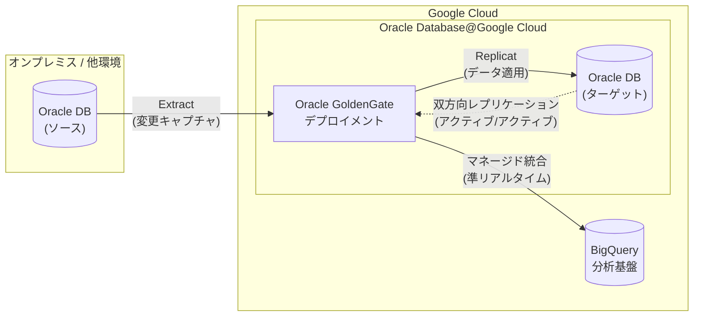

# Oracle Database@Google Cloud: OCI GoldenGate サポート

**リリース日**: 2026-05-20

**サービス**: Oracle Database@Google Cloud

**機能**: Oracle Cloud Infrastructure GoldenGate

**ステータス**: GA (Generally Available)

[このアップデートのインフォグラフィックを見る](https://takech9203.github.io/google-cloud-news-summary/20260520-oracle-database-google-cloud-goldengate.html)

## 概要

Oracle Database@Google Cloud において、Oracle Cloud Infrastructure (OCI) GoldenGate のサポートが一般提供 (GA) となった。これにより、Google Cloud コンソール、gcloud CLI、または Oracle Database@Google Cloud API を通じて、GoldenGate デプロイメントとコネクションを作成・管理し、システム間でデータのレプリケーションおよび変換を実行できるようになった。

GoldenGate は Oracle が提供する論理レプリケーションツールであり、ソースデータベースのオンライン REDO ログから変更をキャプチャし、ターゲットシステムに準リアルタイムでデータを配信する。今回の GA により、Oracle Database@Google Cloud のサービスポートフォリオ (Exadata Database Service、Autonomous AI Database Service、Base Database Service、Exadata Database Service on Exascale Infrastructure) に加え、GoldenGate がネイティブに統合された 5 番目のサービスとして利用可能になった。

特に注目すべきは、GoldenGate と Google BigQuery のマネージド統合により、Oracle の運用データベースから BigQuery へ準リアルタイムでデータを移動し、分析基盤との連携が容易になる点である。

**アップデート前の課題**

- Oracle Database@Google Cloud 環境内でデータレプリケーションを行うには、別途 OCI コンソールや外部ツールを使用する必要があった
- オンプレミスの Oracle データベースから Oracle Database@Google Cloud への移行時に、準リアルタイムの低影響データ移動を実現する統合的な手段が限られていた
- Oracle データベースから Google BigQuery への準リアルタイムデータ連携には、追加の ETL パイプライン構築が必要だった

**アップデート後の改善**

- Google Cloud コンソール、CLI、API から直接 GoldenGate デプロイメントとコネクションを作成・管理可能になった
- オンプレミスから Oracle Database@Google Cloud への移行において、準リアルタイム・低影響のデータレプリケーションが統合環境で実現できるようになった
- GoldenGate と BigQuery のマネージド統合により、Oracle 運用データベースから BigQuery への準リアルタイム分析データ連携が容易になった
- アクティブ/アクティブ構成による双方向レプリケーションが可能になり、高可用性アーキテクチャの選択肢が広がった

## アーキテクチャ図

Oracle GoldenGate は Extract プロセスでソースの変更をキャプチャし、Trail ファイルを経由して Replicat プロセスがターゲットにデータを適用する。BigQuery へのマネージド統合により、分析ワークロードへのデータ供給も同一基盤で実現する。

## サービスアップデートの詳細

### 主要機能

1. **GoldenGate デプロイメント管理**
   - Google Cloud コンソール、gcloud CLI、API からデプロイメントの作成・削除・起動・停止が可能
   - デプロイメント環境、タイプ、バージョンの選択に対応
   - ODB Subnet との統合によるネットワーク接続

2. **GoldenGate コネクション管理**
   - ソースおよびターゲットシステムへのコネクションを作成・管理
   - コネクションタイプの選択に対応
   - コネクションアサインメントによるデプロイメントとコネクションの関連付け

3. **データレプリケーションと変換**
   - 論理レプリケーションによるシステム間データ移動
   - データ変換機能によるスキーマ変換・データフィルタリング
   - 双方向レプリケーションによるアクティブ/アクティブ構成のサポート

4. **BigQuery マネージド統合**
   - Oracle 運用データベースから BigQuery への準リアルタイムデータ連携
   - Google Marketplace 経由での利用も可能

## 技術仕様

### IAM ロール

GoldenGate リソースの管理には、以下の事前定義 IAM ロールが用意されている。

| ロール | 説明 |
|------|------|
| `roles/oracledatabase.goldenGateDeploymentAdmin` | デプロイメントの完全管理 (作成・削除・起動・停止) |
| `roles/oracledatabase.goldenGateDeploymentViewer` | デプロイメントの読み取り専用アクセス |
| `roles/oracledatabase.goldenGateDeploymentsUser` | デプロイメントの使用アクセス |
| `roles/oracledatabase.goldenGateConnectionAdmin` | コネクションの完全管理 (作成・削除) |
| `roles/oracledatabase.goldenGateConnectionViewer` | コネクションの読み取り専用アクセス |
| `roles/oracledatabase.goldenGateConnectionsUser` | コネクションの使用アクセス |
| `roles/oracledatabase.goldenGateConnectionAssignmentAdmin` | コネクションアサインメントの完全管理 |

### レプリケーション特性

| 項目 | 詳細 |
|------|------|
| レプリケーション方式 | 論理レプリケーション (SQL ベース) |
| レプリケーション方向 | 単方向 / 双方向 (アクティブ/アクティブ) |
| RPO | 秒〜分単位 (非同期レプリケーションのため、ゼロ RPO は保証不可) |
| データ変換 | レプリケーション時のデータ変換・フィルタリング対応 |
| プラットフォーム間移動 | 異なるハードウェア・データベースプラットフォーム間のデータ移動に対応 |

## 設定方法

### 前提条件

1. Oracle Database@Google Cloud 環境のセットアップが完了していること
2. ODB Network および ODB Subnet が作成済みであること
3. 適切な IAM ロール (`roles/oracledatabase.goldenGateDeploymentAdmin` など) が付与されていること
4. Oracle Database@Google Cloud API が有効化されていること

### 手順

#### ステップ 1: GoldenGate デプロイメントの作成

Google Cloud コンソール、gcloud CLI、または API を使用して GoldenGate デプロイメントを作成する。デプロイメント作成時には、デプロイメント環境、タイプ、バージョン、および接続先の ODB Subnet を指定する。

#### ステップ 2: GoldenGate コネクションの作成

レプリケーション対象のソースおよびターゲットデータベースへのコネクションを作成する。コネクションタイプを選択し、接続情報を設定する。

#### ステップ 3: コネクションアサインメントの設定

作成したデプロイメントとコネクションを関連付けるコネクションアサインメントを作成し、テスト接続で疎通を確認する。

## メリット

### ビジネス面

- **統合管理の実現**: Google Cloud コンソールから Oracle データレプリケーションを一元管理でき、運用の簡素化とコスト削減に寄与
- **移行の加速**: オンプレミスから Oracle Database@Google Cloud への移行時に、準リアルタイム・低影響のデータ移動により、ダウンタイムを最小化
- **分析基盤との連携**: BigQuery との統合により、Oracle の運用データを活用した分析・AI ワークロードへの投資を迅速に回収可能

### 技術面

- **柔軟なレプリケーション**: 単方向・双方向レプリケーション、データ変換、フィルタリングなど多様なデータ移動パターンに対応
- **高可用性構成**: アクティブ/アクティブ構成による RTO ゼロのディザスタリカバリが可能 (Data Guard との組み合わせで RPO ゼロも実現可能)
- **IAM 統合**: Google Cloud の IAM による細粒度のアクセス制御で、セキュリティポリシーの一貫性を維持

## デメリット・制約事項

### 制限事項

- 論理レプリケーションのため、同期レプリケーションには対応しておらず、RPO ゼロの保証は GoldenGate 単体では不可 (Data Guard との併用が必要)
- アクティブ/アクティブ構成では競合検出・解決の設計が必須であり、事前の十分な検証が必要
- GoldenGate は Data Guard と異なり、追加ソフトウェアのインストールとメンテナンスが必要
- 多くのパッケージアプリケーションはアクティブ/アクティブアーキテクチャをサポートしていない

### 考慮すべき点

- アクティブ/アクティブデプロイメントには、高度なスキーマ設計とアプリケーション設計が必要
- GoldenGate のみに依存するデプロイメントでは、非同期論理レプリケーションの特性上、データロスのリスクがゼロにならない点を考慮する必要がある
- ローカルスタンバイとして Data Guard を併用することで、同期レプリケーションによる RPO ゼロを補完可能

## ユースケース

### ユースケース 1: オンプレミス Oracle から Oracle Database@Google Cloud への移行

**シナリオ**: 既存のオンプレミス Oracle データベースを Oracle Database@Google Cloud に移行する際、ダウンタイムを最小限に抑えたい。

**効果**: GoldenGate による準リアルタイムレプリケーションにより、移行期間中もオンプレミスシステムを稼働させたまま、データを継続的に同期。カットオーバー時のダウンタイムを分単位に短縮可能。

### ユースケース 2: Oracle 運用データの BigQuery リアルタイム分析

**シナリオ**: 基幹システムの Oracle データベースに蓄積される取引データを、BigQuery で準リアルタイムに分析し、ビジネスインサイトを迅速に得たい。

**効果**: GoldenGate と BigQuery のマネージド統合により、ETL パイプラインの構築・運用コストを削減しつつ、データ鮮度の高い分析環境を実現。

### ユースケース 3: マルチリージョン高可用性構成

**シナリオ**: ミッションクリティカルな Oracle ワークロードについて、リージョン障害に対する耐障害性を確保したい。

**効果**: GoldenGate の双方向レプリケーションとアクティブ/アクティブ構成により、複数リージョンでの読み書き処理が可能。Data Guard との併用で RPO ゼロ・RTO ゼロのディザスタリカバリを実現。

## 料金

Oracle Database@Google Cloud の料金は Oracle との契約に基づく。GoldenGate の利用料金の詳細については、Oracle Database@Google Cloud の購入・請求ページを参照。Google Cloud との統合請求 (一括請求) に対応している。

詳細: [Oracle Database@Google Cloud 購入・請求](https://docs.cloud.google.com/oracle/database/docs/overview#place-an-order)

## 利用可能リージョン

Oracle Database@Google Cloud は以下のリージョンで利用可能。GoldenGate の利用可能リージョンの詳細は公式ドキュメントを参照。

| リージョン | 地域 |
|-----------|------|
| asia-northeast1 | 東京 |
| asia-northeast2 | 大阪 |
| asia-south1 | ムンバイ |
| asia-south2 | デリー |
| australia-southeast1 | シドニー |
| australia-southeast2 | メルボルン |
| us-central1 | アイオワ |
| us-east4 | 北バージニア |
| us-west3 | ソルトレイクシティ |
| northamerica-northeast1 | モントリオール |
| northamerica-northeast2 | トロント |
| europe-west2 | ロンドン |
| europe-west3 | フランクフルト |
| europe-west8 | ミラノ |
| southamerica-east1 | サンパウロ |

## 関連サービス・機能

- **Oracle Data Guard**: ブロックレベルの同期/非同期レプリケーションによるディザスタリカバリ。GoldenGate と併用して RPO ゼロを実現
- **BigQuery**: GoldenGate のマネージド統合により、Oracle データの準リアルタイム分析が可能
- **Oracle Data Safe**: Oracle Database@Google Cloud 上のデータセキュリティ管理サービス
- **Oracle Zero Data Loss Autonomous Recovery Service**: バックアップとリカバリのマネージドサービス
- **Cloud Data Fusion**: Datastream を活用した Oracle から BigQuery へのレプリケーション (GoldenGate の代替手段)
- **Database Migration Service**: Oracle から AlloyDB/Cloud SQL への異種データベース移行サービス

## 参考リンク

- [インフォグラフィック](https://takech9203.github.io/google-cloud-news-summary/20260520-oracle-database-google-cloud-goldengate.html)
- [公式リリースノート](https://docs.cloud.google.com/release-notes#May_20_2026)
- [Oracle Database@Google Cloud 概要](https://docs.cloud.google.com/oracle/database/docs/overview)
- [Oracle Database@Google Cloud IAM ロール](https://docs.cloud.google.com/oracle/database/docs/iam-overview)
- [Oracle Database@Google Cloud リージョン](https://docs.cloud.google.com/oracle/database/docs/regions-and-zones)
- [Oracle on Google Cloud ソリューション](https://cloud.google.com/solutions/oracle)

## まとめ

Oracle Database@Google Cloud における OCI GoldenGate の GA は、エンタープライズ環境でのデータレプリケーションと移行ワークフローを Google Cloud コンソールから一元的に管理可能にする重要なアップデートである。特に BigQuery とのマネージド統合は、Oracle ワークロードを運用する企業がデータ分析・AI 基盤を構築する際の大きな推進力となる。Oracle Database@Google Cloud を利用中または検討中の企業は、移行戦略やデータ統合アーキテクチャにおいて GoldenGate の活用を検討すべきである。

---

**タグ**: #OracleDatabase #GoogleCloud #GoldenGate #DataReplication #GA #MultiCloud #BigQuery #DataIntegration
