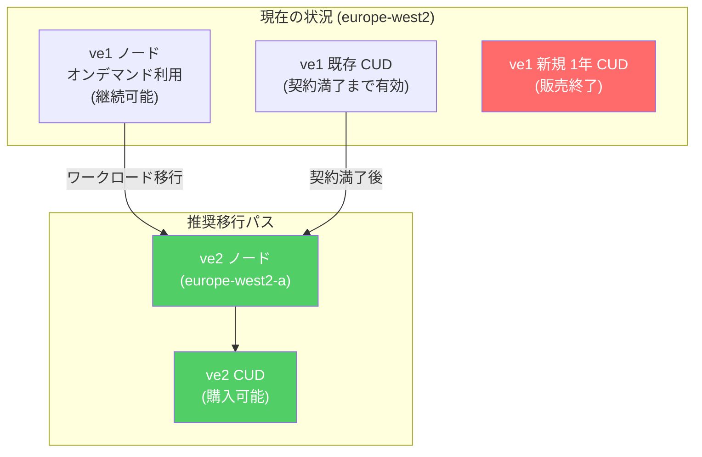

# Google Cloud VMware Engine: ve1 SKU の 1 年間 CUD が europe-west2 リージョンで販売終了

**リリース日**: 2026-05-20

**サービス**: Google Cloud VMware Engine

**機能**: ve1 SKU 1 年間 Committed Use Discounts (CUD) の販売終了 (europe-west2)

**ステータス**: Announcement (End-of-Sale)

[このアップデートのインフォグラフィックを見る](https://takech9203.github.io/google-cloud-news-summary/20260520-vmware-engine-ve1-cuds-end-of-sale-europe-west2.html)

## 概要

Google Cloud VMware Engine の第 1 世代ノードタイプである ve1 SKU に対する 1 年間の Committed Use Discounts (CUD) が、europe-west2 (London, UK) リージョンにおいて販売終了 (End-of-Sale) となりました。これは、ve1 ハードウェアのライフサイクル終了に向けた段階的な移行施策の一環です。

この変更により、europe-west2 リージョンで新規の ve1 向け 1 年間 CUD を購入することはできなくなりますが、既存の CUD 契約には影響がありません。また、ve1 ノード自体はオンデマンド価格で引き続き利用可能です。Google は代替として、より高性能な ve2 ノードタイプへの移行を推奨しており、ve2 ノード向けの CUD は引き続き購入できます。

この発表は、2025 年 9 月に全リージョンで ve1 の 3 年間 CUD が販売終了となった流れを受けたもので、ve1 から ve2 への移行を促進する Google の戦略の一部です。europe-west2 リージョンでは 2025 年 8 月に ve2 ノードが利用可能となっており、移行先の環境が整っています。

**アップデート前の課題**

- ve1 ノードは第 1 世代のハードウェアであり、1 ノードあたり最大 72 vCPU、768 GiB メモリ、19.2 TB ストレージという制約があった
- ve1 ハードウェアがライフサイクル終了に近づいており、長期的な利用にリスクがあった
- 1 年間 CUD を購入してしまうと、ハードウェア EoL 時に柔軟な移行が困難になる可能性があった

**アップデート後の改善**

- 新規の 1 年間 CUD 購入が停止されることで、顧客がレガシーハードウェアに長期間ロックインされるリスクが軽減される
- ve2 ノードへの移行が事実上の推奨パスとして明確化された
- ve2 ノードは最大 128 vCPU、2048 GiB メモリ、51.2 TB ストレージを提供し、大幅な性能向上が得られる

## アーキテクチャ図



この図は、europe-west2 リージョンにおける ve1 から ve2 への移行パスを示しています。ve1 の新規 1 年間 CUD は販売終了 (赤) となり、ve2 ノードおよび ve2 CUD (緑) が推奨される移行先です。

## サービスアップデートの詳細

### 主要機能

1. **販売終了対象の SKU**
   - Google Cloud VMware Engine VE1 Standard 72 Node - Commitment 1 year dollar based Unlicensed BYOL (SKU ID: D13D-E972-9357)
   - Google Cloud VMware Engine VE1 Standard 72 Node - Prepay Commitment 1 year dollar based Unlicensed BYOL (SKU ID: 85C5-6A47-5974)
   - Google Cloud VMware Engine VE1 Standard Storage Only Node - Commitment 1 year dollar based Unlicensed BYOL (SKU ID: 0219-A3C9-5C9A)
   - Google Cloud VMware Engine VE1 Standard Storage Only Node - Prepay Commitment 1 year dollar based Unlicensed BYOL (SKU ID: 4CEE-C7F0-5FCB)

2. **継続利用可能なオプション**
   - ve1 ノードのオンデマンド利用 (CUD なし)
   - 既存の CUD 契約 (契約期間終了まで有効)
   - ve2 ノードの利用 (オンデマンドおよび CUD)

3. **ve2 ノードの利点**
   - 最大 128 vCPU (ve1 の 72 vCPU から大幅増加)
   - 最大 2048 GiB メモリ (ve1 の 768 GiB から約 2.7 倍)
   - 最大 51.2 TB ストレージ (ve1 の 19.2 TB から約 2.7 倍)
   - 柔軟な vCPU 構成 (64, 80, 96, 112, 128 vCPU から選択可能)

## 技術仕様

### ve1 と ve2 のノードタイプ比較

| 項目 | ve1-standard-72 | ve2-standard-96 | ve2-large-128 | ve2-mega-128 |
|------|----------------|-----------------|---------------|--------------|
| vCPU/ノード | 72 | 96 | 128 | 128 |
| メモリ/ノード (GiB) | 768 | 2048 | 2048 | 2048 |
| ストレージ/ノード (TB) | 19.2 | 25.5 | 38.4 | 51.2 |

### ve2 ストレージバリエーション

| ノードタイプ | ストレージ/ノード (TB) | 用途 |
|-------------|----------------------|------|
| ve2-small | 12.8 | コンピュート中心のワークロード |
| ve2-standard | 25.5 | バランス型ワークロード |
| ve2-large | 38.4 | ストレージ重視のワークロード |
| ve2-mega | 51.2 | 大規模ストレージ要件 |

### CUD 確認コマンド

```bash
# 現在のプロジェクトに関連する全 CUD を確認
curl -H "Authorization: Bearer $(gcloud auth print-access-token)" \
  -H "Content-Type: application/json" \
  https://enterprisepurchasing.googleapis.com/v1alpha/projects/$GOOGLE_CLOUD_PROJECT/locations/global/gcveCuds
```

## 設定方法

### 前提条件

1. Google Cloud プロジェクトに VMware Engine API が有効化されていること
2. europe-west2 リージョンで ve2 ノードのクオータが確保されていること
3. Portable License commitment モデルを使用する場合、Broadcom から VCF サブスクリプションを取得していること

### 手順

#### ステップ 1: 現在の CUD 状況を確認

```bash
# Cloud Shell で現在の CUD を一覧表示
curl -H "Authorization: Bearer $(gcloud auth print-access-token)" \
  -H "Content-Type: application/json" \
  https://enterprisepurchasing.googleapis.com/v1alpha/projects/$GOOGLE_CLOUD_PROJECT/locations/global/gcveCuds
```

現在の CUD の契約期間と満了日を確認し、移行計画を策定します。

#### ステップ 2: ve2 ノードのクオータを申請

```bash
# ve2 ノードのクオータ状況を確認
gcloud vmware node-types list --location=europe-west2
```

必要に応じて、Google Cloud コンソールからクオータの増加をリクエストします。

#### ステップ 3: ve2 CUD の購入 (オプション)

Google Cloud コンソールの「Committed use discounts」ページから、europe-west2 リージョンの ve2 ノード向け CUD を購入できます。

#### ステップ 4: ワークロードの移行

ve1 ハードウェアの EoL 通知を受け取った場合は、[ve1 ハードウェア移行ガイド](https://cloud.google.com/vmware-engine/docs/howto-migrate-ve1-hardware) を参照してワークロードを移行します。

## メリット

### ビジネス面

- **コスト最適化**: ve2 ノードは性能あたりのコスト効率が向上しており、より少ないノード数で同等のワークロードを処理できる可能性がある
- **将来性の確保**: 次世代ハードウェアへの早期移行により、突然の EoL 対応による計画外のダウンタイムを回避できる
- **柔軟な構成**: ve2 では vCPU とストレージの組み合わせが豊富で、ワークロードに最適な構成を選択可能

### 技術面

- **大幅な性能向上**: ve2 は vCPU 数が最大 128 まで拡張され、メモリも 2048 GiB と大幅に増加
- **ストレージの柔軟性**: small/standard/large/mega の 4 つのストレージティアから選択可能
- **最新のセキュリティ**: 新しいハードウェアによる最新のセキュリティ機能とパッチの適用

## デメリット・制約事項

### 制限事項

- europe-west2 リージョンでの ve1 向け 1 年間 CUD の新規購入は不可
- ve2 ノードは一部のリージョンでのみ利用可能 (ただし europe-west2 は 2025 年 8 月より対応済み)
- Portable License commitment モデルでは、別途 Broadcom から VCF サブスクリプションの購入が必要

### 考慮すべき点

- 既存の ve1 CUD は契約期間満了まで有効だが、満了後の更新はできない
- ve1 から ve2 への移行にはワークロードの再配置が必要となる場合がある
- ve2 のノード単価は ve1 より高い可能性があるが、性能あたりのコストは改善されている
- 移行作業中のメンテナンスウィンドウの確保が必要

## ユースケース

### ユースケース 1: 既存 ve1 CUD 満了後の ve2 移行

**シナリオ**: europe-west2 リージョンで ve1 の 1 年間 CUD を利用中の企業が、CUD 満了後に ve2 へ移行する場合

**実装例**:
```bash
# 1. 現在の CUD 満了日を確認
curl -H "Authorization: Bearer $(gcloud auth print-access-token)" \
  -H "Content-Type: application/json" \
  https://enterprisepurchasing.googleapis.com/v1alpha/projects/$GOOGLE_CLOUD_PROJECT/locations/global/gcveCuds

# 2. ve2 ノードのプロビジョニング
# Google Cloud コンソールから europe-west2 で ve2 クラスタを作成

# 3. HCX を使用したワークロード移行
# vMotion または Bulk Migration でVMを移行
```

**効果**: CUD 満了のタイミングで計画的に移行することで、ダウンタイムを最小化しつつコスト効率を改善

### ユースケース 2: オンデマンド ve1 からの即時移行

**シナリオ**: CUD なしでオンデマンドの ve1 ノードを利用しており、性能向上とコスト削減を目的に ve2 + CUD に移行する場合

**効果**: ve2 CUD の割引価格と性能向上により、TCO (Total Cost of Ownership) の大幅な改善が期待できる

## 料金

ve1 ノードは引き続きオンデマンド価格で利用可能です。CUD による割引を得るためには、ve2 ノードへの移行が必要です。

### CUD タイプと割引

| CUD タイプ | 期間 | 支払い方法 | 備考 |
|-----------|------|-----------|------|
| ve2 Portable License (月払い) | 1 年 / 3 年 | 月額 | 新規購入可能 |
| ve2 Portable License (前払い) | 1 年 / 3 年 | 一括前払い | 新規購入可能 |
| ve1 全 CUD | - | - | europe-west2 では販売終了 |

具体的な料金については [VMware Engine pricing](https://cloud.google.com/vmware-engine/pricing) を参照してください。

## 利用可能リージョン

今回の変更は **europe-west2 (London, UK)** リージョンのみに適用されます。

なお、ve1 の 3 年間 CUD は 2025 年 9 月 24 日に全リージョンで既に販売終了となっています。他のリージョンでの 1 年間 CUD の販売状況については、Google Cloud の営業担当にお問い合わせください。

### europe-west2 における VMware Engine タイムライン

| 日付 | イベント |
|------|---------|
| 2020 年 8 月 | VMware Engine (ve1) が europe-west2 で利用可能に |
| 2025 年 8 月 28 日 | ve2 ノードが europe-west2-a で利用可能に |
| 2025 年 9 月 24 日 | ve1 の 3 年間 CUD が全リージョンで販売終了 |
| 2026 年 5 月 20 日 | ve1 の 1 年間 CUD が europe-west2 で販売終了 (今回) |

## 関連サービス・機能

- **VMware Engine ve2 ノードタイプ**: ve1 の後継となる次世代ノード。より高い性能と柔軟な構成オプションを提供
- **VMware Engine CUD**: Committed Use Discounts により、長期利用の場合にオンデマンド価格から割引を受けられる仕組み
- **VMware HCX**: ve1 から ve2 へのワークロード移行に使用できる VMware のマイグレーションツール
- **Privileged Access Manager (PAM)**: プライベートクラウドおよびクラスタの管理操作を制御するアクセス管理機能

## 参考リンク

- [インフォグラフィック](https://takech9203.github.io/google-cloud-news-summary/20260520-vmware-engine-ve1-cuds-end-of-sale-europe-west2.html)
- [公式リリースノート](https://cloud.google.com/release-notes#May_20_2026)
- [VMware Engine サービスアナウンスメント](https://cloud.google.com/vmware-engine/docs/service-announcements)
- [VMware Engine CUD ドキュメント](https://cloud.google.com/vmware-engine/docs/cud)
- [VMware Engine ノードタイプ](https://cloud.google.com/vmware-engine/docs/concepts-node-types)
- [VMware Engine 料金ページ](https://cloud.google.com/vmware-engine/pricing)
- [ve1 ハードウェア移行ガイド](https://cloud.google.com/vmware-engine/docs/howto-migrate-ve1-hardware)

## まとめ

Google Cloud VMware Engine の ve1 SKU に対する 1 年間 CUD が europe-west2 リージョンで販売終了となりました。これは ve1 ハードウェアのライフサイクル終了に向けた段階的な移行施策の一環であり、顧客に対して早期の ve2 移行計画の策定を促すものです。europe-west2 リージョンを利用中の顧客は、既存 CUD の満了タイミングを確認し、ve2 ノードへの移行計画を速やかに策定することを推奨します。ve2 ノードは性能面で大幅に向上しており、移行は技術的にもビジネス的にもメリットのある選択です。

---

**タグ**: #GoogleCloud #VMwareEngine #CUD #CommittedUseDiscount #EndOfSale #europe-west2 #ve1 #ve2 #Migration #Pricing
