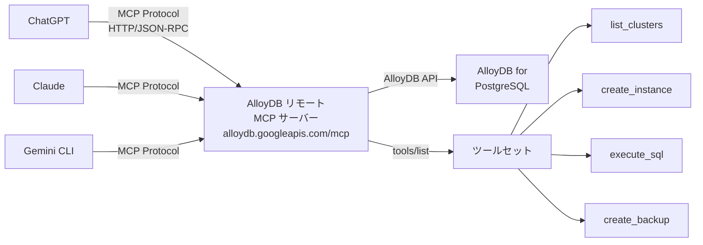

# AlloyDB for PostgreSQL: リモート MCP サーバーの ChatGPT 互換性修正

**リリース日**: 2026-05-21

**サービス**: AlloyDB for PostgreSQL

**機能**: リモート MCP サーバーの ChatGPT ツールセット一覧表示と利用の修正

**ステータス**: Fixed

[このアップデートのインフォグラフィックを見る](https://takech9203.github.io/google-cloud-news-summary/20260521-alloydb-mcp-server-chatgpt-fix.html)

## 概要

AlloyDB for PostgreSQL のリモート MCP (Model Context Protocol) サーバーにおいて、ChatGPT ユーザーが AlloyDB ツールセットの一覧表示および利用ができなかった問題が修正されました。この修正により、ChatGPT から AlloyDB リモート MCP サーバーが提供するツール群（クラスタ管理、インスタンス操作、SQL 実行など）を正常に利用できるようになりました。

AlloyDB リモート MCP サーバーは、Gemini CLI、Claude、ChatGPT などの AI アプリケーションから AlloyDB クラスタやインスタンスを管理するためのマネージド HTTP エンドポイント（`https://alloydb.googleapis.com/mcp`）を提供しています。今回の修正は、ChatGPT の MCP クライアント実装との互換性に関する問題を解決するものです。

この修正の対象ユーザーは、ChatGPT を AI エージェントプラットフォームとして利用し、AlloyDB for PostgreSQL のデータベース管理を自然言語で行いたいと考えている開発者やデータベース管理者です。

**アップデート前の課題**

- ChatGPT から AlloyDB リモート MCP サーバーに接続した際、`tools/list` メソッドでツール一覧が正常に返却されなかった
- ChatGPT ユーザーは AlloyDB MCP ツールセット（クラスタ作成、インスタンス管理、SQL 実行など）を利用できなかった
- Gemini CLI や Claude では正常に動作していたが、ChatGPT 固有の MCP クライアント実装との互換性問題が存在していた

**アップデート後の改善**

- ChatGPT ユーザーが AlloyDB リモート MCP サーバーのツール一覧を正常に取得できるようになった
- ChatGPT から AlloyDB のすべての MCP ツール（list_clusters、create_cluster、execute_sql など）を利用可能になった
- AlloyDB リモート MCP サーバーが Gemini CLI、Claude、ChatGPT の主要 3 プラットフォームすべてで統一的に動作するようになった

## アーキテクチャ図



ChatGPT、Claude、Gemini CLI などの AI アプリケーションが MCP プロトコル（HTTP トランスポート上の JSON-RPC）を通じて AlloyDB リモート MCP サーバーに接続し、AlloyDB for PostgreSQL のリソースを管理するアーキテクチャです。今回の修正により、ChatGPT からのツール一覧取得とツール実行が正常に動作するようになりました。

## サービスアップデートの詳細

### 主要機能

1. **ツール一覧の正常取得（tools/list）**
   - ChatGPT の MCP クライアントから `tools/list` JSON-RPC リクエストを送信した際に、利用可能なツールの完全な一覧が正しく返却されるようになった
   - ツールの説明文やパラメータスキーマも正確に取得可能

2. **ツール実行の互換性確保**
   - ChatGPT から AlloyDB MCP ツールの呼び出し（`tools/call`）が正常に動作するようになった
   - OAuth 2.0 認証フローが ChatGPT のクライアント実装と正しく連携

3. **マルチプラットフォーム対応の統一**
   - Gemini CLI、Claude、ChatGPT のすべてで統一的な MCP エクスペリエンスを提供
   - プラットフォーム固有の互換性問題を解消

## 技術仕様

### AlloyDB リモート MCP サーバー仕様

| 項目 | 詳細 |
|------|------|
| エンドポイント | `https://alloydb.googleapis.com/mcp` |
| プロトコル | MCP (Model Context Protocol) over HTTP |
| メッセージ形式 | JSON-RPC 2.0 |
| 認証 | OAuth 2.0 + IAM |
| スコープ | `https://www.googleapis.com/auth/alloydb` |
| ステータス | グローバルエンドポイント: GA / リージョナルエンドポイント: Preview |

### 利用可能な MCP ツール一覧

| ツール名 | 機能 |
|----------|------|
| `list_clusters` | プロジェクト内のすべてのクラスタを一覧表示 |
| `create_cluster` | 新しいクラスタを作成 |
| `get_cluster` | クラスタの詳細を取得 |
| `list_instances` | クラスタ内のすべてのインスタンスを一覧表示 |
| `create_instance` | 新しいインスタンスを作成 |
| `create_backup` | クラスタのバックアップを作成 |
| `restore_cluster` | バックアップまたはタイムスタンプからクラスタを復元 |
| `execute_sql` | SQL 文を実行 |

### ツール一覧リクエスト例

```json
{
  "id": "my-request-id",
  "jsonrpc": "2.0",
  "method": "tools/list"
}
```

## 設定方法

### 前提条件

1. Google Cloud プロジェクトで AlloyDB for PostgreSQL API が有効化されていること
2. 適切な IAM ロール（`roles/alloydb.admin` または `roles/alloydb.viewer`）が付与されていること
3. OAuth 2.0 の認証情報が設定されていること

### 手順

#### ステップ 1: ChatGPT で MCP サーバーを設定

ChatGPT の MCP クライアント設定で以下の情報を入力します:

- **Server name**: AlloyDB for PostgreSQL MCP server
- **Server URL**: `https://alloydb.googleapis.com/mcp`
- **Transport**: HTTP
- **OAuth scope**: `https://www.googleapis.com/auth/alloydb`

#### ステップ 2: IAM 権限の確認

```bash
# 必要なロールの付与を確認
gcloud projects get-iam-policy PROJECT_ID \
  --flatten="bindings[].members" \
  --filter="bindings.role:roles/alloydb.admin"
```

AlloyDB MCP ツールを利用するには、操作内容に応じた IAM ロールが必要です。

#### ステップ 3: ツール一覧の確認

```bash
# MCP サーバーに直接 tools/list リクエストを送信して確認
curl -X POST https://alloydb.googleapis.com/mcp \
  -H "Content-Type: application/json" \
  -d '{
    "id": "test-1",
    "jsonrpc": "2.0",
    "method": "tools/list"
  }'
```

`tools/list` メソッドは認証不要で実行できるため、接続確認に利用できます。

## メリット

### ビジネス面

- **AI プラットフォーム選択の自由度向上**: ChatGPT ユーザーも AlloyDB の管理を AI エージェント経由で行えるようになり、組織が利用する AI ツールに依存せずデータベース管理が可能に
- **運用効率の改善**: データベース管理者が自然言語でクラスタ管理やクエリ実行を行えるため、日常的な管理タスクの効率が向上

### 技術面

- **マルチプラットフォーム互換性**: 単一のリモート MCP エンドポイントで Gemini CLI、Claude、ChatGPT すべてに対応
- **標準プロトコル準拠**: MCP 標準に準拠した実装により、今後の新しい AI クライアントとの互換性も期待できる

## デメリット・制約事項

### 制限事項

- AlloyDB リモート MCP サーバーの利用には OAuth 2.0 認証が必須（API キーは不可）
- リージョナルエンドポイントは Preview ステータスのため、本番環境での利用には注意が必要
- Data API アクセスを有効にすると、プライベート IP インスタンスでもインターネット経由のトラフィックが発生する

### 考慮すべき点

- MCP 経由の SQL 実行は、IAM データベース認証ユーザーの権限に依存するため、最小権限の原則に基づいたロール設計が重要
- ChatGPT からの利用時はネットワークセキュリティとデータガバナンスの観点から、Model Armor の有効化を検討すべき
- MCP ツールの呼び出しには `mcp.tools.call` 権限が必要

## ユースケース

### ユースケース 1: ChatGPT を用いたデータベース状態の確認

**シナリオ**: データベース管理者が ChatGPT に「AlloyDB クラスタの一覧を表示して」と指示し、現在のクラスタ状態を自然言語で確認する。

**実装例**:
```
ChatGPT プロンプト: "プロジェクト my-project のすべての AlloyDB クラスタを一覧表示してください"

→ MCP tools/call: list_clusters(project_id="my-project")
→ 結果: クラスタ名、状態、リージョンなどの情報を自然言語で応答
```

**効果**: gcloud コマンドや Cloud Console を開くことなく、会話形式でデータベースの状態を即座に把握できる。

### ユースケース 2: ChatGPT からのアドホック SQL 実行

**シナリオ**: 開発者が ChatGPT を通じて AlloyDB インスタンスに対してクエリを実行し、データの確認や軽微な変更を行う。

**効果**: 開発ワークフローを中断することなく、AI アシスタント経由でデータベース操作を完了できる。開発者の生産性が向上し、コンテキストスイッチのコストを削減できる。

## 料金

AlloyDB リモート MCP サーバーの利用自体に追加料金は発生しません。料金は AlloyDB for PostgreSQL の通常の利用料金に基づきます。

### 料金例

| 使用量 | 月額料金 (概算) |
|--------|-----------------|
| AlloyDB プライマリインスタンス (2 vCPU) | 約 $200/月 |
| AlloyDB リモート MCP サーバー利用 | 追加料金なし |

※ 実際の料金はインスタンスサイズ、ストレージ使用量、ネットワーク転送量により異なります。

## 利用可能リージョン

AlloyDB リモート MCP サーバーのグローバルエンドポイント（`alloydb.googleapis.com/mcp`）は GA として全リージョンで利用可能です。リージョナルエンドポイントは Preview ステータスで提供されています。AlloyDB for PostgreSQL 自体がサポートするすべてのリージョンで MCP サーバーを利用できます。

## 関連サービス・機能

- **Model Context Protocol (MCP)**: AI アプリケーションと外部データソースを接続する標準プロトコル。AlloyDB リモート MCP サーバーの基盤技術
- **AlloyDB for PostgreSQL Data API**: MCP サーバー経由の SQL 実行に必要なデータアクセスレイヤー
- **Model Armor**: MCP ツール利用時のプロンプトおよびレスポンスのセキュリティスクリーニング
- **Database Insights MCP サーバー**: AlloyDB のパフォーマンス分析やメトリクス照会のための補完的な MCP サーバー
- **MCP Toolbox for Databases**: ローカル環境で利用可能なオープンソースの MCP サーバー代替

## 参考リンク

- [インフォグラフィック](https://takech9203.github.io/google-cloud-news-summary/20260521-alloydb-mcp-server-chatgpt-fix.html)
- [公式リリースノート](https://cloud.google.com/release-notes#May_21_2026)
- [AlloyDB リモート MCP サーバー ドキュメント](https://cloud.google.com/alloydb/docs/ai/use-alloydb-mcp)
- [AlloyDB MCP リファレンス](https://cloud.google.com/alloydb/docs/reference/mcp/alloydb/mcp)
- [Google Cloud MCP サーバー概要](https://cloud.google.com/mcp/overview)
- [MCP 認証ガイド](https://cloud.google.com/mcp/authenticate-mcp)
- [AlloyDB 料金ページ](https://cloud.google.com/alloydb/pricing)

## まとめ

今回の修正により、AlloyDB for PostgreSQL リモート MCP サーバーが ChatGPT との完全な互換性を達成し、主要な AI プラットフォーム（Gemini CLI、Claude、ChatGPT）すべてからの統一的なデータベース管理が可能になりました。ChatGPT を利用している組織やチームは、追加設定なしでこの修正の恩恵を受けられます。AlloyDB を AI エージェント経由で管理する運用フローを検討している場合は、OAuth 2.0 認証の設定と適切な IAM ロールの付与を行い、早期に検証を開始することを推奨します。

---

**タグ**: #AlloyDB #PostgreSQL #MCP #ModelContextProtocol #ChatGPT #AI #データベース管理 #バグ修正 #リモートMCP
