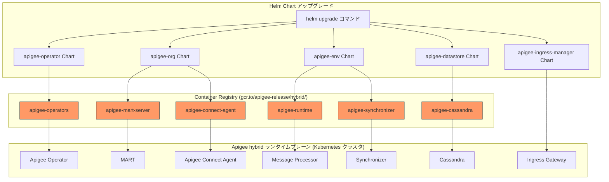

# Apigee hybrid: v1.16.4 パッチリリース - コンテナイメージ欠落の修正

**リリース日**: 2026-05-21

**サービス**: Apigee hybrid

**機能**: v1.16.4 パッチリリース (コンテナイメージリポジトリの修正)

**ステータス**: Announcement + Fixed

:bar_chart: [このアップデートのインフォグラフィックを見る](https://takech9203.github.io/google-cloud-news-summary/20260521-apigee-hybrid-v1-16-4.html)

## 概要

2026年5月21日、Google Cloud は Apigee hybrid ソフトウェアの更新バージョン v1.16.4 をリリースしました。これはパッチリリースであり、`gcr.io/apigee-release/hybrid/` リポジトリにおけるコンテナイメージの欠落問題 (Bug ID: 515424331) を修正しています。

Apigee hybrid は、Google Cloud が管理するマネジメントプレーンと、ユーザーが自身の Kubernetes クラスタ上で管理するランタイムプレーンで構成されるハイブリッド API 管理プラットフォームです。ランタイムプレーンのコンポーネントは、Google Container Registry (gcr.io) からコンテナイメージとしてデプロイされるため、リポジトリ内のイメージが欠落すると、アップグレードや新規デプロイメントに重大な影響を及ぼします。

今回の v1.16.4 パッチリリースは、この問題を修正し、Apigee hybrid のデプロイメントとアップグレード操作の信頼性を回復するものです。v1.16.x を利用している全てのユーザーに対して、速やかなアップグレードが推奨されます。

**アップデート前の課題**

v1.16.4 リリース以前に存在していた問題:

- `gcr.io/apigee-release/hybrid/` リポジトリに一部のコンテナイメージが欠落しており、Helm Chart によるデプロイやアップグレードが失敗する可能性があった
- イメージの欠落により、新規クラスタのセットアップや既存クラスタのスケールアウト操作が正常に完了しない場合があった
- ローリングアップデート時にイメージ Pull に失敗し、Pod が CrashLoopBackOff や ImagePullBackOff 状態に陥る可能性があった

**アップデート後の改善**

v1.16.4 パッチリリースにより:

- `gcr.io/apigee-release/hybrid/` リポジトリのコンテナイメージが完全に修復され、全てのコンポーネントが正常にデプロイ可能になった
- Helm Chart によるアップグレード操作が安定して実行可能になった
- 新規インストールおよびスケーリング操作の信頼性が回復した

## アーキテクチャ図



この図は、Helm Chart のアップグレード操作が gcr.io のコンテナレジストリからイメージを取得し、Kubernetes クラスタ上の Apigee hybrid コンポーネントとしてデプロイされる流れを示しています。今回の修正は、中央の Container Registry レイヤーにおけるイメージ欠落の問題を解決したものです。

## サービスアップデートの詳細

### 主要修正内容

1. **コンテナイメージの欠落修正 (Bug ID: 515424331)**
   - `gcr.io/apigee-release/hybrid/` リポジトリに不足していたコンテナイメージを修復
   - 影響を受けていたコンポーネントのイメージが正しくタグ付けされ、利用可能な状態に復旧
   - Helm Chart からのイメージ Pull 操作が正常に完了するようになった

2. **v1.16 シリーズの継続的パッチ**
   - v1.16.0 (初期リリース) -> v1.16.0-hotfix.1 -> v1.16.3 -> v1.16.4 (今回) と継続的にパッチが提供されている
   - v1.16.3 からのマイナーアップグレードで適用可能
   - v1.15.x からのメジャーアップグレードにも対応

3. **リポジトリの信頼性向上**
   - 全ての Apigee hybrid コンポーネントのコンテナイメージが `gcr.io/apigee-release/hybrid/` に正しく格納されていることを確認
   - イメージタグ `1.16.4` で全コンポーネントが一貫してリリース

## 技術仕様

### 影響を受けるコンポーネント

| Helm Chart | コンポーネント | イメージパス |
|------|------|------|
| apigee-operator | Apigee Operator | `gcr.io/apigee-release/hybrid/apigee-operators` |
| apigee-org | MART, Watcher, Connect Agent | `gcr.io/apigee-release/hybrid/apigee-mart-server` |
| apigee-env | Runtime, Synchronizer | `gcr.io/apigee-release/hybrid/apigee-runtime` |
| apigee-datastore | Cassandra | `gcr.io/apigee-release/hybrid/apigee-cassandra` |
| apigee-redis | Redis | `gcr.io/apigee-release/hybrid/apigee-redis` |
| apigee-telemetry | Logger, Metrics | `gcr.io/apigee-release/hybrid/apigee-telemetry` |
| apigee-ingress-manager | Ingress Gateway | `gcr.io/apigee-release/hybrid/apigee-ingress-gateway` |

### overrides.yaml でのバージョン指定例

```yaml
# overrides.yaml でイメージバージョンを指定する場合
ao:
  image:
    url: "gcr.io/apigee-release/hybrid/apigee-operators"
    tag: "1.16.4"

mart:
  image:
    url: "gcr.io/apigee-release/hybrid/apigee-mart-server"
    tag: "1.16.4"

runtime:
  image:
    url: "gcr.io/apigee-release/hybrid/apigee-runtime"
    tag: "1.16.4"

synchronizer:
  image:
    url: "gcr.io/apigee-release/hybrid/apigee-synchronizer"
    tag: "1.16.4"
```

## 設定方法

### 前提条件

1. Apigee hybrid v1.15.x 以上が稼働していること (v1.14 以前からは直接アップグレード不可)
2. Helm v3.14.2 以上がインストールされていること
3. kubectl がサポートされるバージョンであること
4. cert-manager がサポートされるバージョン (1.16 - 1.19) であること

### 手順

#### ステップ 1: Helm チャートのダウンロード

```bash
# Apigee hybrid v1.16.4 の Helm チャートをダウンロード
export CHART_VERSION=1.16.4

# チャートリポジトリの更新
helm repo update

# チャートの取得
helm pull apigee-hybrid/apigee-operator --version ${CHART_VERSION}
helm pull apigee-hybrid/apigee-org --version ${CHART_VERSION}
helm pull apigee-hybrid/apigee-env --version ${CHART_VERSION}
helm pull apigee-hybrid/apigee-datastore --version ${CHART_VERSION}
helm pull apigee-hybrid/apigee-ingress-manager --version ${CHART_VERSION}
helm pull apigee-hybrid/apigee-redis --version ${CHART_VERSION}
helm pull apigee-hybrid/apigee-telemetry --version ${CHART_VERSION}
```

#### ステップ 2: Apigee Operator のアップグレード

```bash
# ドライラン
helm upgrade operator apigee-operator/ \
  --install \
  --namespace APIGEE_NAMESPACE \
  --atomic \
  -f overrides.yaml \
  --dry-run=server

# ドライランが成功したら実行
helm upgrade operator apigee-operator/ \
  --install \
  --namespace APIGEE_NAMESPACE \
  --atomic \
  -f overrides.yaml
```

#### ステップ 3: 各コンポーネントのアップグレード

```bash
# Organization チャートのアップグレード
helm upgrade $ORG_NAME apigee-org/ \
  --install \
  --namespace APIGEE_NAMESPACE \
  --atomic \
  -f overrides.yaml

# Environment チャートのアップグレード (環境ごとに実行)
helm upgrade $ENV_RELEASE_NAME apigee-env/ \
  --install \
  --namespace APIGEE_NAMESPACE \
  --atomic \
  --set env=$ENV_NAME \
  -f overrides.yaml

# 状態の確認
kubectl -n APIGEE_NAMESPACE get apigeeorg
kubectl -n APIGEE_NAMESPACE get apigeeenv
```

## メリット

### ビジネス面

- **運用の安定性回復**: コンテナイメージの欠落によるデプロイ失敗リスクが解消され、API ゲートウェイの運用が安定化する
- **ダウンタイムの最小化**: パッチリリースであるため、ローリングアップデートによる最小限のダウンタイムで適用可能

### 技術面

- **デプロイメントの信頼性**: gcr.io リポジトリ内の全コンテナイメージが正しく配置され、Helm によるデプロイ操作が確実に成功する
- **一貫性のあるバージョン管理**: 全コンポーネントが v1.16.4 タグで統一され、バージョンの不整合リスクが解消される

## デメリット・制約事項

### 制限事項

- v1.14 以前のバージョンからは直接 v1.16.4 にアップグレードできない (v1.15 を経由する必要がある)
- v1.16 へのアップグレード時にはダウンタイムが発生する可能性がある (ローリングリスタートが必要)
- cert-manager 1.18 以上を使用する場合は、事前に rotationPolicy の設定変更が必要

### 考慮すべき点

- 本番環境では、複数クラスタ構成でトラフィックを分散させた上でアップグレードすることが推奨される
- アップグレード開始後は、全クラスタを可能な限り早急にアップグレードすること (Cassandra のバックアップ/リストアがバージョン混在では動作しない)
- apigee-guardrails サービスアカウントが v1.16 から必須になっているため、初回アップグレード時は事前設定が必要

## ユースケース

### ユースケース 1: 既存 v1.16.3 環境のパッチ適用

**シナリオ**: Apigee hybrid v1.16.3 を運用中に、一部の Pod が ImagePullBackOff になる問題が発生している環境

**実装例**:
```bash
# 現在のイメージ Pull 状態を確認
kubectl -n apigee get pods | grep -E "ImagePull|ErrImage"

# v1.16.4 にアップグレード
helm upgrade operator apigee-operator/ \
  --install \
  --namespace apigee \
  --atomic \
  -f overrides.yaml

# Pod の状態が正常に戻ることを確認
kubectl -n apigee get pods -w
```

**効果**: 欠落していたコンテナイメージが利用可能になり、全 Pod が正常に起動する

### ユースケース 2: 新規クラスタへの Apigee hybrid 展開

**シナリオ**: 新しい Kubernetes クラスタに Apigee hybrid をデプロイしたいが、v1.16.3 ではイメージ Pull に失敗していた

**効果**: v1.16.4 では全てのコンテナイメージが gcr.io リポジトリに正しく格納されているため、新規インストールが問題なく完了する

## 料金

Apigee hybrid の利用料金はこのパッチリリースによる変更はありません。

### 料金例

| プラン | 内容 |
|--------|------|
| Standard | API コール数に基づく従量課金 |
| Enterprise | カスタム契約、SLA 付き |

詳細は [Apigee 料金ページ](https://cloud.google.com/apigee/pricing) を参照してください。

## 利用可能リージョン

Apigee hybrid はユーザーが管理する Kubernetes クラスタ上で動作するため、以下のサポートされるプラットフォーム上であれば任意のリージョンで利用可能です:

- Google Kubernetes Engine (GKE)
- Amazon Elastic Kubernetes Service (EKS)
- Azure Kubernetes Service (AKS)
- その他のサポートされる Kubernetes プラットフォーム

マネジメントプレーンは Google Cloud 上でホストされます。

## 関連サービス・機能

- **Apigee (クラウド版)**: フルマネージドの API 管理プラットフォーム。hybrid はオンプレミスやマルチクラウド環境で Apigee の機能を利用したい場合に選択
- **Google Kubernetes Engine (GKE)**: Apigee hybrid ランタイムプレーンの推奨実行環境
- **Google Container Registry (gcr.io)**: Apigee hybrid コンポーネントのコンテナイメージが格納されるレジストリ
- **Cloud Pub/Sub**: v1.16 以降、アナリティクス・トレース・デプロイメントステータスデータの送信に使用されるデータパイプライン
- **cert-manager**: Apigee hybrid の証明書管理に必要な外部コンポーネント

## 参考リンク

- :bar_chart: [インフォグラフィック](https://takech9203.github.io/google-cloud-news-summary/20260521-apigee-hybrid-v1-16-4.html)
- [公式リリースノート](https://cloud.google.com/release-notes#May_21_2026)
- [Apigee hybrid アップグレードガイド (v1.16)](https://cloud.google.com/apigee/docs/hybrid/v1.16/upgrade)
- [Apigee hybrid リリースノート](https://cloud.google.com/apigee/docs/hybrid/release-notes)
- [Apigee hybrid とは](https://cloud.google.com/apigee/docs/hybrid/v1.16/what-is-hybrid)
- [料金ページ](https://cloud.google.com/apigee/pricing)

## まとめ

Apigee hybrid v1.16.4 は、`gcr.io/apigee-release/hybrid/` リポジトリにおけるコンテナイメージの欠落問題を修正するパッチリリースです。この問題により影響を受けていたデプロイメントやアップグレード操作が正常に実行できるようになります。v1.16.x を利用中の全てのユーザーは、Helm Chart を通じた標準的なアップグレード手順で速やかに v1.16.4 を適用することが推奨されます。

---

**タグ**: #ApigeeHybrid #PatchRelease #v1.16.4 #ContainerRegistry #BugFix #Kubernetes #APIManagement
