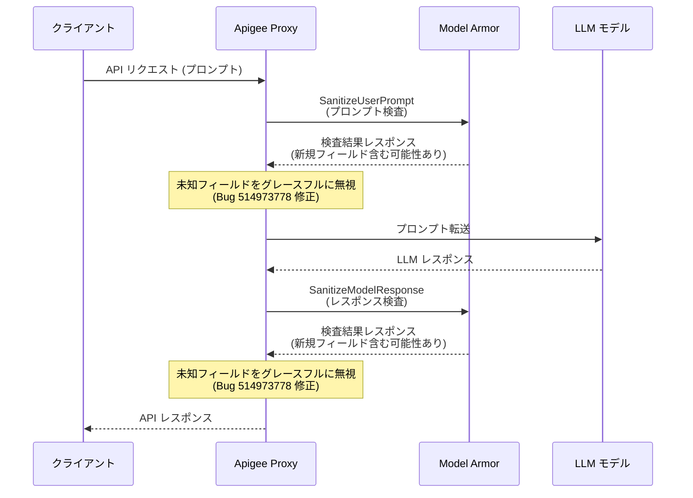

# Apigee X: Model Armor レスポンスパース修正 (1-17-0-apigee-8)

**リリース日**: 2026-05-21

**サービス**: Apigee X

**機能**: Model Armor レスポンスパースの不明フィールド対応修正

**ステータス**: バグ修正 (Announcement)

[このアップデートのインフォグラフィックを見る](https://takech9203.github.io/google-cloud-news-summary/20260521-apigee-x-model-armor-fix-1-17-0-apigee-8.html)

## 概要

2026年5月21日、Google Cloud は Apigee の更新バージョン (1-17-0-apigee-8) をリリースしました。本リリースでは、Model Armor ポリシーのレスポンスパース処理における重要なバグ修正が含まれています。ロールアウトは本日開始され、全ての Google Cloud ゾーンへの展開には4営業日以上かかる場合があります。

修正されたバグ (Bug ID: 514973778) は、Model Armor のレスポンス解析において未知のフィールドを適切に処理できない問題に対応しています。この修正により、Model Armor サービス側で将来的に新しいフィールドが追加された場合でも、Apigee の SanitizeUserPrompt および SanitizeModelResponse ポリシーが障害を起こすことなく動作を継続できるようになりました。

この修正は、Apigee と Model Armor を組み合わせて AI アプリケーションのセキュリティを実装しているすべてのユーザーに影響します。特に、Model Armor サービスの進化に伴い新しいフィールドがレスポンスに追加される際の前方互換性が確保されたことで、運用の安定性が大幅に向上します。

**アップデート前の課題**

- Model Armor のレスポンスに未知のフィールドが含まれると、Apigee のパース処理が失敗しポリシーエラー (`SanitizationResponseParsingFailed`) が発生していた
- Model Armor サービス側のアップデートにより新しいフィールドが追加されるたびに、Apigee 側でも対応が必要となる可能性があった
- 予期しないポリシー障害により API トラフィックが中断されるリスクがあった

**アップデート後の改善**

- 未知のフィールドを無視して処理を継続する「グレースフルハンドリング」が実装された
- Model Armor サービスの将来のフィールド追加によるポリシー障害が発生しなくなった
- Apigee と Model Armor 間の前方互換性が確保され、運用安定性が向上した

## アーキテクチャ図



この図は、Apigee が Model Armor と連携して LLM のプロンプトとレスポンスを検査するフローを示しています。修正後は、Model Armor からのレスポンスに未知のフィールドが含まれていても、パース処理が正常に継続されます。

## サービスアップデートの詳細

### 主要機能

1. **未知フィールドのグレースフルハンドリング**
   - Model Armor レスポンス内の未知のフィールドを検出した場合、エラーを発生させずに無視する処理を実装
   - JSON パース時に厳密なスキーマ検証からより柔軟な解析に変更

2. **前方互換性の確保**
   - Model Armor サービスが新しいフィルター結果フィールドやメタデータを追加しても、既存の Apigee ポリシーが正常に動作
   - サービス間の独立したデプロイとバージョンアップが可能に

3. **ポリシー障害の防止**
   - `steps.sanitize.user.prompt.SanitizationResponseParsingFailed` エラーの発生を防止
   - `steps.sanitize.model.response.SanitizationResponseParsingFailed` エラーの発生を防止

## 技術仕様

### 影響を受けるポリシー

| ポリシー | 説明 | 修正内容 |
|---------|------|---------|
| SanitizeUserPrompt | ユーザープロンプトの検査 | レスポンスパースの柔軟性向上 |
| SanitizeModelResponse | LLM レスポンスの検査 | レスポンスパースの柔軟性向上 |

### 関連するエラーコード

| エラーコード | HTTP Status | 修正前の発生条件 |
|-------------|-------------|-----------------|
| `steps.sanitize.user.prompt.SanitizationResponseParsingFailed` | 500 | Model Armor レスポンスに未知フィールドが含まれる場合 |
| `steps.sanitize.model.response.SanitizationResponseParsingFailed` | 500 | Model Armor レスポンスに未知フィールドが含まれる場合 |

### Model Armor ポリシー設定例

```xml
<SanitizeUserPrompt async="false" continueOnError="false" enabled="true"
    name="sanitize-user-prompt">
  <IgnoreUnresolvedVariables>true</IgnoreUnresolvedVariables>
  <DisplayName>Sanitize-User-Prompt</DisplayName>
  <ModelArmor>
    <TemplateName>projects/$PROJECT/locations/$LOCATION/templates/$TEMPLATE_NAME</TemplateName>
  </ModelArmor>
  <UserPromptSource>{jsonPath('$.contents[-1].parts[-1].text',request.content,true)}</UserPromptSource>
</SanitizeUserPrompt>
```

## 設定方法

### 前提条件

1. Apigee X 環境が既にプロビジョニングされていること
2. Model Armor テンプレートが作成済みであること
3. API プロキシに SanitizeUserPrompt または SanitizeModelResponse ポリシーが設定されていること

### 手順

#### ステップ 1: ロールアウト状況の確認

```bash
# Apigee インスタンスのバージョンを確認
curl -H "Authorization: Bearer $(gcloud auth print-access-token)" \
  "https://apigee.googleapis.com/v1/organizations/$ORG/instances"
```

ロールアウトは自動的に行われるため、ユーザー側での手動アップデート作業は不要です。4営業日以上かけて全ゾーンに展開されます。

#### ステップ 2: 修正の適用確認

```bash
# Model Armor ポリシーを含むプロキシのデバッグセッションを実行して確認
curl -X POST "https://$RUNTIME_HOSTNAME/$API_PROXY_NAME" \
  -H "Content-Type: application/json" \
  -d '{
    "contents": [
      {
        "role": "user",
        "parts": [{"text": "テストプロンプト"}]
      }
    ]
  }'
```

修正が適用されると、Model Armor レスポンスに新しいフィールドが含まれていても `SanitizationResponseParsingFailed` エラーが発生しなくなります。

## メリット

### ビジネス面

- **運用安定性の向上**: Model Armor サービスの更新による予期しないダウンタイムが削減され、API の可用性が維持される
- **メンテナンスコストの削減**: Model Armor のアップデートに合わせた Apigee 側の緊急対応が不要になる

### 技術面

- **前方互換性の確保**: サービス間のバージョン差異を吸収する柔軟なパース処理により、独立したデプロイサイクルが可能
- **障害の局所化**: 未知フィールドによるカスケード障害を防止し、ポリシーチェーン全体の耐障害性が向上

## デメリット・制約事項

### 制限事項

- ロールアウトには4営業日以上かかるため、即座に全ゾーンで修正が適用されるわけではない
- ロールアウト完了まで、一部のインスタンスでは引き続き旧バージョンの動作となる

### 考慮すべき点

- 既に `continueOnError="true"` を設定してワークアラウンドしていた場合、修正適用後にポリシー設定の見直しを推奨
- ロールアウト期間中は、異なるゾーン間で動作の不一致が生じる可能性がある

## ユースケース

### ユースケース 1: 生成 AI チャットボットの保護

**シナリオ**: Apigee で管理されている API プロキシを通じて、Vertex AI の Gemini モデルにアクセスするチャットボットアプリケーション。Model Armor でプロンプトインジェクションやハラスメントコンテンツをフィルタリングしている。

**実装例**:
```xml
<SanitizeModelResponse async="false" continueOnError="false" enabled="true"
    name="sanitize-response">
  <IgnoreUnresolvedVariables>true</IgnoreUnresolvedVariables>
  <DisplayName>Sanitize-Response</DisplayName>
  <ModelArmor>
    <TemplateName>projects/my-project/locations/us-central1/templates/chatbot-safety</TemplateName>
  </ModelArmor>
  <UserPromptSource>{jsonPath('$.contents[-1].parts[-1].text',request.content,true)}</UserPromptSource>
  <LLMResponseSource>{jsonPath('$.candidates[-1].content.parts[-1].text',response.content,true)}</LLMResponseSource>
</SanitizeModelResponse>
```

**効果**: Model Armor が新しいフィルターカテゴリ (例: 将来的な著作権侵害検出) を追加した場合でも、レスポンスに新しいフィールドが含まれてもポリシーが正常に動作し続ける。

### ユースケース 2: マルチリージョン AI API ゲートウェイ

**シナリオ**: 複数のリージョンに展開された Apigee インスタンスが、リージョナルな Model Armor テンプレートを使用して AI トラフィックを保護している環境。

**効果**: リージョン間で Model Armor サービスのバージョンが異なる場合でも (ロールアウトのタイミング差)、すべてのリージョンの Apigee インスタンスが安定して動作する。

## 料金

本バグ修正自体に追加料金は発生しません。Apigee X および Model Armor の既存料金体系が適用されます。

### Apigee X 参考料金

| プランタイプ | 月額料金 (概算) |
|-------------|-----------------|
| Base 環境 | $365/月/リージョン |
| Intermediate 環境 | $1,460/月/リージョン |
| Comprehensive 環境 | $3,431/月/リージョン |
| Standard API Proxy コール | $20/100万コール (最初の5,000万まで) |
| Extensible API Proxy コール | $100/100万コール (最初の5,000万まで) |

## 利用可能リージョン

本修正は全ての Google Cloud ゾーンに対してロールアウトされます。2026年5月21日にロールアウトが開始され、4営業日以上かけて全ゾーンへの展開が完了します。

## 関連サービス・機能

- **Model Armor**: Google Cloud の AI セキュリティサービス。プロンプトとレスポンスのフィルタリングを提供し、有害コンテンツ、プロンプトインジェクション、機密データ漏洩を防止
- **Vertex AI**: Google Cloud のフルマネージド AI プラットフォーム。Apigee と Model Armor を組み合わせて、Vertex AI モデルへのアクセスを安全に管理
- **Apigee SanitizeUserPrompt ポリシー**: ユーザープロンプトを Model Armor テンプレートに基づいて検査するポリシー
- **Apigee SanitizeModelResponse ポリシー**: LLM レスポンスを Model Armor テンプレートに基づいて検査するポリシー

## 参考リンク

- [インフォグラフィック](https://takech9203.github.io/google-cloud-news-summary/20260521-apigee-x-model-armor-fix-1-17-0-apigee-8.html)
- [公式リリースノート](https://cloud.google.com/release-notes#May_21_2026)
- [Apigee リリースノート](https://cloud.google.com/apigee/docs/release-notes)
- [Model Armor 概要ドキュメント](https://cloud.google.com/model-armor/overview)
- [Apigee Model Armor ポリシーの使用](https://cloud.google.com/apigee/docs/api-platform/tutorials/using-model-armor-policies)
- [SanitizeModelResponse ポリシーリファレンス](https://cloud.google.com/apigee/docs/api-platform/reference/policies/sanitize-llm-response-policy)
- [Apigee 料金ページ](https://cloud.google.com/apigee/pricing)

## まとめ

Apigee バージョン 1-17-0-apigee-8 では、Model Armor レスポンスパースにおける未知フィールドのグレースフルハンドリングが実装されました。この修正により、Model Armor サービスの将来的なフィールド追加による Apigee ポリシー障害が防止され、AI セキュリティ基盤の前方互換性と運用安定性が大幅に向上します。Apigee で Model Armor ポリシーを利用しているユーザーは、ロールアウト完了後に自動的に修正の恩恵を受けることができます。

---

**タグ**: #Apigee #ModelArmor #BugFix #AIセキュリティ #前方互換性 #LLMセキュリティ #APIマネジメント
