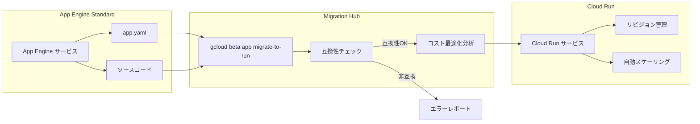

# App Engine standard environment: Migration Hub で Cloud Run への移行とコスト最適化を実現

**リリース日**: 2026-05-21

**サービス**: App Engine standard environment

**機能**: App Engine Migration Hub - Cloud Run への移行とコスト削減レコメンデーション

**ステータス**: Preview

📊 [このアップデートのインフォグラフィックを見る](https://takech9203.github.io/google-cloud-news-summary/20260521-app-engine-migration-hub-cloud-run.html)

## 概要

Google Cloud は App Engine Migration Hub に新機能を追加し、App Engine standard environment で稼働しているサービスを Cloud Run へ直接移行できるようになりました。この機能は Go、Java、Node.js、PHP、Python、Ruby の第二世代ランタイムをサポートしており、`gcloud beta app migrate-to-run` コマンドを使用して既存の App Engine アプリケーションを Cloud Run にデプロイできます。

さらに、Migration Hub はコスト削減レコメンデーション機能も提供しており、移行先の Cloud Run でのリソース最適化提案を行います。Cloud Run は App Engine standard environment と多くのインフラストラクチャを共有しているため、類似点が多く、移行のハードルが低い点が特徴です。

この機能は現在 Preview ステータスであり、本番環境への適用前に十分なテストを実施することが推奨されます。App Engine から Cloud Run への移行を検討している全てのユーザーにとって、手動でのコンテナ化作業を大幅に削減する重要なアップデートです。

**アップデート前の課題**

- App Engine から Cloud Run への移行には、手動でのコンテナ化（Dockerfile やビルドパックの設定）が必要だった
- app.yaml の設定を Cloud Run の設定に手動で変換する作業が煩雑だった
- 移行後のコスト最適化について、ユーザー自身で分析・判断する必要があった
- 移行の互換性チェックを事前に自動で行う手段がなかった

**アップデート後の改善**

- `gcloud beta app migrate-to-run` コマンド一つで App Engine アプリを Cloud Run にデプロイ可能に
- 既存の app.yaml ファイルから自動的に Cloud Run サービスの設定を生成
- コスト削減レコメンデーションにより、移行後の最適な設定を提案
- 互換性のない機能がある場合は移行プロセスが自動的に停止し、問題点を一覧表示

## アーキテクチャ図



Migration Hub が既存の App Engine アプリケーション設定とソースコードを解析し、互換性チェックとコスト最適化分析を行った上で、Cloud Run サービスとしてデプロイする流れを示しています。

## サービスアップデートの詳細

### 主要機能

1. **app.yaml ベースの移行**
   - 既存の app.yaml ファイルを Cloud Run サービスの設定に自動変換
   - `gcloud beta app migrate-to-run --appyaml=PATH --entrypoint=ENTRYPOINT` コマンドで実行
   - プロジェクトディレクトリ内で実行する場合、PATH と ENTRYPOINT の引数はオプショナル

2. **既存デプロイ済みアプリケーションの直接移行**
   - 稼働中の App Engine サービスを Cloud Run に直接デプロイ
   - `gcloud beta app migrate-to-run --service=SERVICE --version=VERSION` コマンドで実行
   - ソースコードのディレクトリパスを指定するプロンプトが表示される

3. **コスト削減レコメンデーション**
   - 移行後の Cloud Run 環境でのリソース最適化提案
   - CPU、メモリ、スケーリング設定の最適化推奨
   - インスタンスベース課金とリクエストベース課金の選択支援

4. **互換性チェック機能**
   - 移行前に非互換な設定を自動検出
   - 問題がある場合は移行を停止し、非互換性の一覧を表示
   - 修正が必要な箇所を明確に提示

## 技術仕様

### サポートランタイム

| ランタイム | サポート状況 | 備考 |
|------|------|------|
| Go | 対応 | 第二世代ランタイムのみ |
| Java | 対応 | 第二世代ランタイムのみ |
| Node.js | 対応 | 第二世代ランタイムのみ |
| PHP | 対応 | 第二世代ランタイムのみ |
| Python | 対応 | 第二世代ランタイムのみ |
| Ruby | 対応 | 第二世代ランタイムのみ |

### 非互換機能（移行前に除去が必要）

| 機能 | 設定例 | 対応方法 |
|------|------|------|
| Inbound services | `inbound_services: - warmup` | 削除（Cloud Run は自動ウォームアップ） |
| カスタムエラーページ | `error_handlers: - file: default_error.html` | Cloud Run 側で別途実装 |
| バンドルサービス（第二世代） | `app_engine_apis: true` | Cloud Client Libraries に移行 |
| ビルド環境変数 | `build_env_variables: Foo: Bar` | Cloud Build 設定で対応 |
| 第一世代ランタイム | `runtime: python27` | 第二世代にアップグレード後に移行 |

### App Engine と Cloud Run の主要な差異

| 項目 | App Engine | Cloud Run |
|------|------|------|
| 用語（バージョン） | Version | Revision |
| デフォルトアクセス | パブリック | プライベート（認証必要） |
| URL ドメイン | appspot.com | run.app |
| スケール・トゥ・ゼロ | 対応 | 対応 |
| GPU サポート | 非対応 | 対応 |
| 最大 vCPU | 2 vCPU（B8） | 8 vCPU |
| 最大メモリ | 3 GB | 32 GB |

## 設定方法

### 前提条件

1. App Engine ソースコードへのアクセスがあり、アプリケーションがエラーなく動作していること
2. Cloud Run Admin API と Artifact Registry API が有効化されていること
3. gcloud CLI が最新バージョンに更新されていること

### 手順

#### ステップ 1: プロジェクトとリージョンの設定

```bash
gcloud auth login
gcloud config set project PROJECT_ID
gcloud config set run/region REGION
gcloud components update
```

PROJECT_ID をプロジェクト ID に、REGION を使用するリージョンに置き換えてください。

#### ステップ 2: app.yaml を使用した移行

```bash
# app.yaml ファイルから Cloud Run サービスを作成
gcloud beta app migrate-to-run --appyaml=./app.yaml --entrypoint="python main.py"
```

プロジェクトディレクトリ内で実行する場合、引数の省略が可能です。

#### ステップ 3: 既存デプロイ済みアプリの移行（代替方法）

```bash
# デプロイ済みの App Engine サービスを直接 Cloud Run に移行
gcloud beta app migrate-to-run --service=my-service --version=v1
```

コマンド実行後、ソースコードのディレクトリパスを指定するプロンプトが表示されます。

#### ステップ 4: 移行後の確認

```bash
# Cloud Run サービスの確認
gcloud run services list

# サービスの詳細を確認
gcloud run services describe SERVICE_NAME --region=REGION
```

## メリット

### ビジネス面

- **移行コストの削減**: 手動でのコンテナ化作業が不要になり、移行にかかる人的リソースと時間を大幅に削減
- **コスト最適化**: レコメンデーション機能により、Cloud Run 環境での最適な設定を自動提案し、ランニングコストを最小化
- **リスク低減**: 互換性チェックにより、移行時の予期せぬ問題を事前に検出

### 技術面

- **シンプルな移行パス**: 単一コマンドでの移行により、DevOps の負担を軽減
- **より柔軟なリソース管理**: Cloud Run の高い vCPU/メモリ上限や GPU サポートへのアクセス
- **モダンなプラットフォーム機能**: サイドカーコンテナ、ボリュームマウント、カスタムヘルスチェックなどの高度な機能を活用可能
- **改善されたスケーリング**: Cloud Run の高速スケーリングとスケール・トゥ・ゼロ機能による効率的なリソース利用

## デメリット・制約事項

### 制限事項

- Preview ステータスのため、本番環境での使用には注意が必要（「Pre-GA Offerings Terms」が適用）
- 第一世代ランタイム（Python 2.7、Java 8、Go 1.11、PHP 5.5）からの直接移行は不可（先に第二世代にアップグレードが必要）
- App Engine レガシーバンドルサービスを使用しているアプリケーションは事前に Cloud Client Libraries への移行が必要
- 一部の app.yaml 設定（inbound_services、error_handlers、build_env_variables）は非互換

### 考慮すべき点

- Cloud Run サービスはデフォルトでプライベートのため、パブリックアクセスが必要な場合は明示的な設定が必要
- App Engine の「Version」は Cloud Run では「Revision」に対応し、管理方法が異なる
- カスタムドメインの移行には別途 Cloud Load Balancing の設定が必要な場合がある
- 移行後のモニタリングとアラート設定の見直しが推奨される

## ユースケース

### ユースケース 1: レガシー Web アプリケーションのモダナイゼーション

**シナリオ**: 数年前に App Engine standard environment にデプロイした Python Web アプリケーションを、Cloud Run の最新機能（GPU サポート、サイドカーコンテナ）を活用するために移行したい。

**実装例**:
```bash
# 既存の App Engine サービスを Cloud Run に移行
gcloud beta app migrate-to-run \
  --service=my-web-app \
  --version=production-v3
```

**効果**: 手動でのコンテナ化作業なしに Cloud Run への移行が完了し、GPU を活用した ML 推論機能の追加や、サイドカーコンテナによるログ収集の実装が可能に。

### ユースケース 2: マルチサービス環境の段階的移行

**シナリオ**: 複数の App Engine サービスで構成されたマイクロサービスアーキテクチャを、サービス単位で段階的に Cloud Run に移行し、コスト削減を実現したい。

**実装例**:
```bash
# サービスごとに段階的に移行
gcloud beta app migrate-to-run --appyaml=./service-a/app.yaml
gcloud beta app migrate-to-run --appyaml=./service-b/app.yaml
```

**効果**: Migration Hub のコスト削減レコメンデーションに従い、各サービスに最適な課金モデル（リクエストベース/インスタンスベース）を選択することで、全体のランニングコストを最適化。

## 料金

Migration Hub 自体の使用は無料です。移行後は Cloud Run の料金体系が適用されます。

### Cloud Run 料金体系

| 課金モデル | vCPU 単価（Tier 1） | メモリ単価（Tier 1） | 備考 |
|--------|-----------------|-----------------|------|
| リクエストベース | リクエスト処理中のみ課金（高単価） | リクエスト処理中のみ課金 | バースト性トラフィック向け |
| インスタンスベース | $0.0648/vCPU/時 | $0.0072/GiB/時 | 安定トラフィック向け |

### App Engine との料金比較（参考）

| 項目 | App Engine (F4/B4) | Cloud Run (インスタンスベース) |
|--------|-----------------|-----------------|
| vCPU 単価 | $0.2/インスタンス/時 | $0.0526/vCPU/時 |
| メモリ単価 | (含む) | $0.0071/GiB/時 |
| スケール・トゥ・ゼロ | 対応 | 対応 |
| CUD 割引 | 非対応 | 対応 |

## 利用可能リージョン

App Engine standard environment がサポートされている全リージョンで利用可能です。Cloud Run は App Engine よりも多くのリージョンで利用可能であり、移行後はより広いリージョン選択が可能になります。Tier 1 リージョンを選択することで、より低コストでの運用が実現できます。

## 関連サービス・機能

- **Cloud Run**: 移行先のサーバーレスコンテナプラットフォーム。GPU、サイドカーコンテナ、ボリュームマウントなどの高度な機能を提供
- **Artifact Registry**: コンテナイメージの保存・管理に使用。移行時に自動的にイメージが登録される
- **Cloud Build**: ソースコードからコンテナイメージをビルドする際に使用
- **App Engine Migration Center**: 本機能を含む、App Engine からの移行を支援する包括的なリソースセンター
- **Cloud Load Balancing**: カスタムドメインの移行に必要な場合がある

## 参考リンク

- 📊 [インフォグラフィック](https://takech9203.github.io/google-cloud-news-summary/20260521-app-engine-migration-hub-cloud-run.html)
- [公式リリースノート](https://cloud.google.com/release-notes#May_21_2026)
- [ドキュメント: Deploy an App Engine app in the standard environment to Cloud Run](https://docs.cloud.google.com/appengine/migration-center/run/migrate-app-engine-standard-to-run)
- [App Engine Migration Center](https://docs.cloud.google.com/appengine/migration-center)
- [App Engine と Cloud Run の比較ガイド](https://docs.cloud.google.com/appengine/migration-center/run/compare-gae-with-run)
- [Cloud Run 料金ページ](https://cloud.google.com/run/pricing)

## まとめ

App Engine Migration Hub の Cloud Run 移行機能は、App Engine standard environment のユーザーにとって、手動作業を最小限に抑えながらモダンなサーバーレスプラットフォームへ移行するための重要なツールです。コスト削減レコメンデーション機能と組み合わせることで、移行後のランニングコスト最適化まで一貫して支援します。現在 Preview ステータスですが、第二世代ランタイムを使用している場合は、早期にテスト環境での検証を開始し、移行計画を策定することを推奨します。

---

**タグ**: #AppEngine #CloudRun #Migration #ServerlessMigration #CostOptimization #Preview
