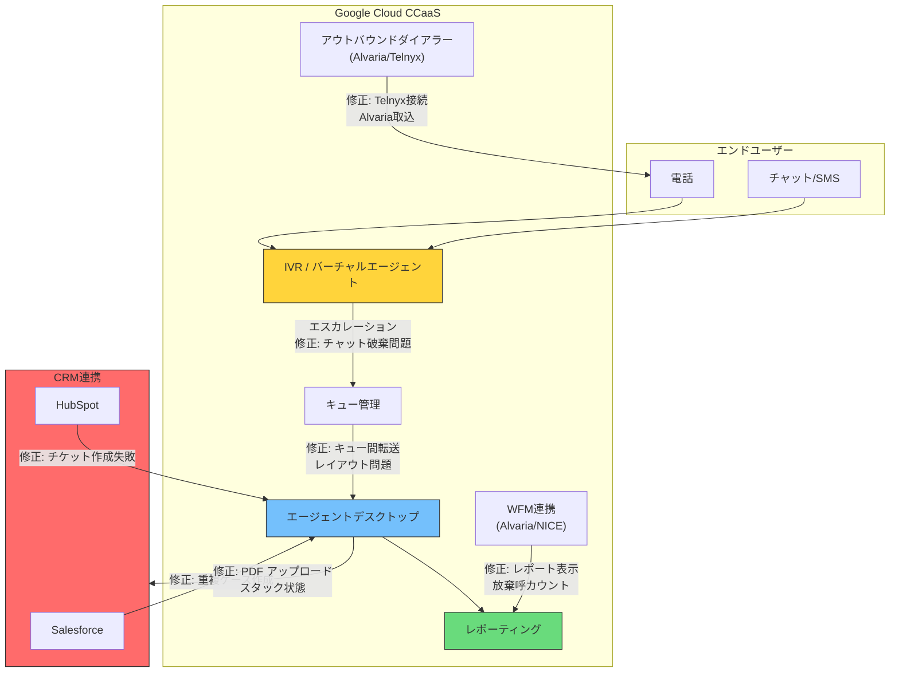

# Google Cloud CCaaS: 2026年5月バグ修正リリース

**リリース日**: 2026-05-21

**サービス**: Google Cloud Contact Center as a Service (CCaaS)

**機能**: 複数のバグ修正 (エージェントデスクトップ、CRM連携、通話処理、バーチャルエージェント、レポーティング)

**ステータス**: Fixed

📊 [このアップデートのインフォグラフィックを見る](https://takech9203.github.io/google-cloud-news-summary/20260521-ccaas-bug-fixes-may-21.html)

## 概要

Google Cloud Contact Center as a Service (CCaaS) の2026年5月21日リリースにおいて、21件のバグ修正が実施された。修正内容はエージェントデスクトップの操作性、CRM連携 (Salesforce、HubSpot)、通話処理、バーチャルエージェント連携、レポーティングなど多岐にわたる。

本リリースはコンタクトセンター運用における日常的な業務フローに影響を与えるバグを幅広く修正しており、エージェントの生産性向上と顧客体験の改善に直結するものである。特に、エージェントがスタック状態になる問題や、CRM連携での重複レコード作成、バーチャルエージェントからのエスカレーション失敗など、運用に重大な影響を与える問題が解消されている。

**アップデート前の課題**

- Microsoft Word からコピーした URL が SMS チャットで不正なフォーマットになっていた
- エージェントが In-call ステータスから抜け出せなくなるケースがあった
- チャットセッションで PDF ファイルのアップロードができなかった
- バーチャルエージェントから人間のエージェントにエスカレーションされたチャットが破棄されていた
- Salesforce で1つのインバウンドコールに対して2つのケースが作成されていた
- HubSpot チケット作成が特定の設定条件下で失敗していた
- キュー間の通話転送後にデスクトップレイアウトが正しく表示されなかった

**アップデート後の改善**

- エージェントデスクトップの安定性が向上し、スタック状態やステータス表示異常が解消された
- CRM連携の信頼性が改善され、重複レコード作成やチケット作成失敗が解消された
- 通話処理フローが正常化し、転送やキュー管理が正しく動作するようになった
- バーチャルエージェントとのハンドオフが正常に機能するようになった
- レポーティングデータの正確性が向上した

## アーキテクチャ図

この図は CCaaS のコンポーネント間連携と、今回のバグ修正が影響する各箇所を示している。

## サービスアップデートの詳細

### CRM 連携の修正

1. **Salesforce 重複ケース作成の修正**
   - 単一のインバウンドコールに対して Salesforce に2つのケースが作成される問題を修正
   - レコードの一貫性が保たれるようになった

2. **HubSpot チケット作成の修正**
   - 「Skip CRM Account Creation」と「Skip Account Lookup」の両方が有効な場合にチケット作成が失敗する問題を修正
   - 設定の組み合わせに関わらずチケットが正常に作成される

3. **Ticket URL カラムの修正**
   - Individual Call History CSV で Ticket URL カラムが空白になる問題を修正

### エージェントデスクトップの修正

4. **エージェントの In-call スタック状態の修正**
   - エージェントが In-call ステータスから抜け出せなくなる問題を修正
   - エージェントの可用性が正常に管理されるようになった

5. **PDF ファイルアップロードの修正**
   - チャットセッションでエージェントが PDF ファイルをアップロードできない問題を修正

6. **エージェントダッシュボードのステータス表示修正**
   - エージェントダッシュボードに無効な「-10」というエージェントステータスが表示される問題を修正

7. **Previous Interactions パネルの修正**
   - エージェントデスクトップの Previous Interactions パネルに Agent Assist サマリーが表示されない問題を修正

8. **キュー間転送後のレイアウト表示修正**
   - キュー間で通話を転送した後、受信側エージェントのデスクトップに転送元キューのレイアウトが表示される問題を修正

9. **チーム並べ替えの修正**
   - 新規作成したチームの並べ替えができない問題を修正

10. **デフォルト挨拶メッセージ削除の修正**
    - 言語のデフォルト挨拶メッセージを削除しても永続化されない問題を修正

### 通話処理の修正

11. **SMS での URL フォーマット修正**
    - Microsoft Word からコピーした URL が SMS チャットセッションで不正にフォーマットされる問題を修正

12. **Alvaria キャンペーンダイアラーの国コード修正**
    - Alvaria キャンペーンダイアラーが @COUNTRYCODE フィールドの国コードを正しく使用しない問題を修正

13. **アウトバウンド Telnyx 通話の接続修正**
    - Agent Voice Detection が有効な場合にアウトバウンド Telnyx 通話が「Connecting」状態でスタックする問題を修正

14. **Alvaria Advanced Outreach バッチファイル取込修正**
    - Alvaria Advanced Outreach キャンペーンのバッチファイルが取り込まれない問題を修正

15. **コール履歴アクセスの修正**
    - 通話終了直後にエンドユーザーがコール履歴にアクセスするとエラーが発生する問題を修正

16. **スケジュールコールのキュー表示修正**
    - あるキューでコールをスケジュールすると、別のキューの Reschedule Call 画面が表示される問題を修正

### バーチャルエージェント連携の修正

17. **IVR 決済カード収集後の文字起こし再開修正**
    - IVR 決済カード収集中にエージェントがリダクションを有効/無効にした後、ライブ文字起こしが再開しない問題を修正

18. **決済バーチャルタスクアシスタントの文字起こし修正**
    - 転送後に決済バーチャルタスクアシスタントの文字起こし/センチメント分析が再開しない問題を修正

19. **バーチャルエージェントからのエスカレーション修正**
    - バーチャルエージェントから人間のエージェントにエスカレーションされたチャットが破棄される問題を修正

20. **大量メッセージチャットの会話履歴表示修正**
    - 大量のメッセージがあるチャットがエスカレーションされた場合に会話履歴が正しく表示されない問題を修正

### レポーティングの修正

21. **Alvaria WFM エージェントパフォーマンスレポートの修正**
    - Alvaria WFM Agent Performance レポートにエージェントアクティビティが表示されない問題を修正

22. **NICE WFM エクスポーターの放棄呼カウント修正**
    - NICE WFM エクスポーターが放棄呼のカウントを実際より多く報告する問題を修正

## 技術仕様

### 修正カテゴリ別影響範囲

| カテゴリ | 修正件数 | 影響コンポーネント |
|---------|---------|-----------------|
| CRM 連携 | 3件 | Salesforce, HubSpot, CSV エクスポート |
| エージェントデスクトップ | 7件 | UI, ステータス管理, ファイル操作 |
| 通話処理 | 6件 | ダイアラー, キュー管理, SMS |
| バーチャルエージェント | 4件 | IVR, 文字起こし, エスカレーション |
| レポーティング | 2件 | WFM (Alvaria, NICE) |

### 影響を受けるインテグレーション

| インテグレーション | 修正内容 |
|------------------|---------|
| Salesforce | 単一コールでの重複ケース作成を修正 |
| HubSpot | 特定設定条件下でのチケット作成失敗を修正 |
| Alvaria (ダイアラー) | 国コード使用とバッチファイル取込を修正 |
| Alvaria (WFM) | エージェントパフォーマンスレポートを修正 |
| NICE (WFM) | 放棄呼カウントの精度を修正 |
| Telnyx | Agent Voice Detection 有効時の接続問題を修正 |

## メリット

### ビジネス面

- **エージェント生産性の向上**: スタック状態やデスクトップ表示異常の修正により、エージェントが中断なく業務を遂行できる
- **CRM データの正確性向上**: 重複レコード作成の防止により、顧客データの一貫性が維持される
- **WFM レポートの信頼性向上**: 放棄呼カウントやエージェントアクティビティの正確な報告により、適切な人員配置計画が可能になる
- **顧客体験の改善**: バーチャルエージェントからのエスカレーション失敗が解消され、シームレスな顧客対応が実現する

### 技術面

- **システム安定性の向上**: エージェントステータス管理の異常やキュー間転送の問題が解消された
- **インテグレーション信頼性の強化**: 外部システム (Salesforce, HubSpot, Alvaria, NICE, Telnyx) との連携が安定化
- **文字起こし/センチメント分析の継続性**: 決済処理やリダクション操作後もリアルタイム分析が中断しなくなった

## デメリット・制約事項

### 制限事項

- バグ修正のリリースタイミングはデプロイメントスケジュールに依存する
- 一部の修正は特定のインテグレーション (Alvaria, Telnyx, NICE) を使用している場合のみ該当する

### 考慮すべき点

- デプロイメントスケジュールにより、修正が適用されるタイミングはインスタンスによって異なる
- Alvaria や NICE WFM 連携を使用している場合、修正後にレポートの整合性を確認することを推奨
- Salesforce 連携で重複ケースが作成されていた場合、既存の重複データのクリーンアップが別途必要になる可能性がある

## ユースケース

### ユースケース 1: Salesforce 連携でのケース管理改善

**シナリオ**: コンタクトセンターで Salesforce をCRM として使用しており、1つのインバウンドコールに対して2つのケースが作成されていたため、エージェントが重複データの整理に時間を取られていた。

**効果**: 本修正により、インバウンドコールごとに正確に1つのケースが作成されるようになり、エージェントの事務作業負荷が軽減され、顧客データの正確性も向上する。

### ユースケース 2: バーチャルエージェントからのシームレスなエスカレーション

**シナリオ**: チャットボット (バーチャルエージェント) で対応しきれない問い合わせを人間のエージェントにエスカレーションしたが、チャットが破棄されてしまい、顧客が最初から問い合わせをやり直す必要があった。

**効果**: エスカレーション時にチャットが正常に引き継がれるようになり、顧客は同じ内容を再度説明する必要がなくなる。これにより顧客満足度と初回解決率が向上する。

### ユースケース 3: WFM レポートによる正確な人員配置

**シナリオ**: NICE WFM エクスポーターが放棄呼を実際よりも多く報告していたため、不必要な人員増加やシフト調整が行われていた。

**効果**: 正確な放棄呼カウントにより、適切な人員配置計画が可能となり、運用コストの最適化につながる。

## 関連サービス・機能

- **Google Cloud CCaaS (CCAI Platform)**: 本リリースの対象サービス。クラウドベースのコンタクトセンターソリューション
- **Dialogflow CX**: バーチャルエージェント機能の基盤。エスカレーション修正に関連
- **Agent Assist**: エージェント支援機能。Previous Interactions パネルのサマリー表示に関連
- **Cloud Logging**: CCaaS のログ記録に使用。問題の診断やトラブルシューティングに活用可能
- **Salesforce Service Cloud**: CRM 連携パートナー。ケース作成の重複問題修正に関連
- **HubSpot**: CRM 連携パートナー。チケット作成修正に関連

## 参考リンク

- 📊 [インフォグラフィック](https://takech9203.github.io/google-cloud-news-summary/20260521-ccaas-bug-fixes-may-21.html)
- [公式リリースノート](https://cloud.google.com/release-notes#May_21_2026)
- [CCaaS ドキュメント](https://docs.cloud.google.com/contact-center/ccai-platform/docs)
- [デプロイメントスケジュール](https://cloud.google.com/contact-center/ccai-platform/docs/deployment-schedules)
- [CCaaS リリースノート一覧](https://docs.cloud.google.com/contact-center/ccai-platform/docs/release-notes)

## まとめ

本リリースは Google Cloud CCaaS の安定性と信頼性を大幅に向上させる重要なバグ修正リリースである。特に CRM 連携の重複データ問題、エージェントのスタック状態、バーチャルエージェントからのエスカレーション失敗など、運用に直接影響する問題が広範囲にわたって修正されている。CCaaS を利用しているすべての組織は、デプロイメントスケジュールに従って本リリースが適用されたことを確認し、関連するインテグレーションの動作を検証することを推奨する。

---

**タグ**: #CCaaS #ContactCenter #BugFix #Salesforce #HubSpot #Alvaria #NICE #WFM #VirtualAgent #AgentDesktop #CRM
