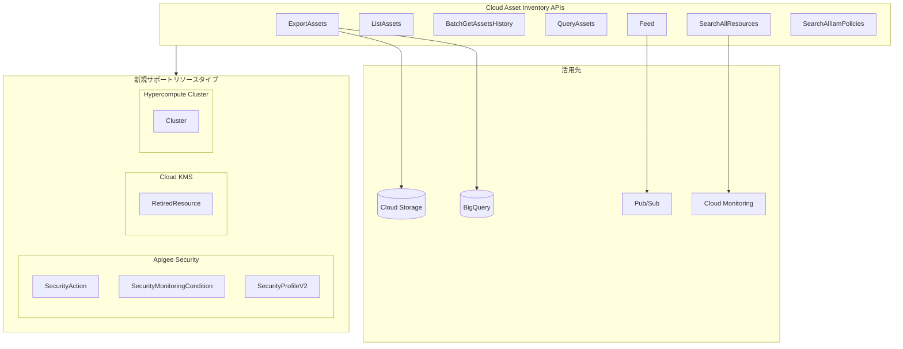

# Cloud Asset Inventory: 新規リソースタイプのサポート追加 (Apigee Security, Cloud KMS, Hypercompute Cluster)

**リリース日**: 2026-05-21

**サービス**: Cloud Asset Inventory

**機能**: 新規リソースタイプのパブリック公開

**ステータス**: GA (一般提供)

📊 [このアップデートのインフォグラフィックを見る](https://takech9203.github.io/google-cloud-news-summary/20260521-cloud-asset-inventory-resource-types-may.html)

## 概要

Cloud Asset Inventory において、新たに 5 つのリソースタイプが ExportAssets、ListAssets、BatchGetAssetsHistory、QueryAssets、Feed、SearchAllResources、SearchAllIamPolicies の各 API を通じてパブリックに利用可能になった。今回追加されたリソースタイプは、Apigee のセキュリティ関連リソース (SecurityAction、SecurityMonitoringCondition、SecurityProfileV2)、Cloud Key Management Service の RetiredResource、および Hypercompute Cluster の Cluster の 3 カテゴリにまたがる。

このアップデートにより、組織全体のセキュリティポリシー管理、暗号鍵のライフサイクル追跡、および AI/HPC インフラストラクチャの資産管理がより包括的に実現できるようになった。Cloud Asset Inventory を活用したガバナンス、コンプライアンス監査、セキュリティ態勢管理のカバレッジが拡大し、特にマルチサービス環境でのアセット可視化が強化される。

対象ユーザーは、クラウドインフラストラクチャの資産管理を行うプラットフォームチーム、セキュリティチーム、および AI/ML インフラストラクチャを運用するチームである。

**アップデート前の課題**

- Apigee の SecurityAction、SecurityMonitoringCondition、SecurityProfileV2 リソースを Cloud Asset Inventory 経由で一括エクスポートや検索ができなかった
- Cloud KMS で削除された鍵 (RetiredResource) の情報を Cloud Asset Inventory の統一的なインターフェースで追跡・監査できなかった
- Hypercompute Cluster のクラスタリソースが Cloud Asset Inventory の対象外であり、AI/HPC インフラの資産を組織横断で可視化することが困難だった

**アップデート後の改善**

- Apigee のセキュリティリソースを SearchAllResources API で組織横断検索でき、セキュリティポリシーの一元管理が可能になった
- Cloud KMS の RetiredResource を BatchGetAssetsHistory で時系列追跡でき、鍵削除の監査証跡を Cloud Asset Inventory に統合できるようになった
- Hypercompute Cluster を Feed で監視し、AI/HPC クラスタの構成変更をリアルタイムに Pub/Sub で通知できるようになった

## アーキテクチャ図



Cloud Asset Inventory の各 API から新規リソースタイプへのアクセスが可能になり、BigQuery へのエクスポートや Pub/Sub を介したリアルタイム変更通知など、既存のワークフローに統合できる。

## サービスアップデートの詳細

### 主要機能

1. **Apigee セキュリティリソースの追加**
   - `apigee.googleapis.com/SecurityAction`: API トラフィックに対する許可・拒否・フラグ付けアクションの定義を管理するリソース。Abuse Detection と連携し、不正アクセスからの API 保護ポリシーを追跡可能
   - `apigee.googleapis.com/SecurityMonitoringCondition`: セキュリティプロファイルに基づく API デプロイメントの監視条件を定義するリソース。Cloud Monitoring へのスコアメトリクス公開を管理
   - `apigee.googleapis.com/SecurityProfileV2`: API セキュリティ評価のためのプロファイル定義 (v2)。リスクアセスメントの基準を管理

2. **Cloud KMS RetiredResource の追加**
   - `cloudkms.googleapis.com/RetiredResource`: 削除された CryptoKey のリソース名を追跡するリソース。削除された鍵の名前は再利用不可であり、このリソースにより監査が容易になる
   - `gcloud kms retired-resources list` コマンドや REST API (`retiredResources.list`) で確認可能な情報を Cloud Asset Inventory 経由でも一括取得可能

3. **Hypercompute Cluster の追加**
   - `hypercomputecluster.googleapis.com/Cluster`: AI Hypercomputer 基盤上のクラスタリソースを管理するリソース。GPU/TPU を含む高性能コンピューティングクラスタの資産追跡が可能
   - Cluster Director や GKE と連携して構築される AI/ML ワークロード向けクラスタの可視化に対応

## 技術仕様

### 対応 API と機能マッピング

| API | 機能 | 用途 |
|-----|------|------|
| ExportAssets | BigQuery/Cloud Storage へのエクスポート | 大規模な資産データのバッチ分析 |
| ListAssets | ページネーション付きリスト取得 | 特定プロジェクト内のリソース一覧取得 |
| BatchGetAssetsHistory | 時系列での変更履歴取得 | 監査・コンプライアンス (過去 35 日間) |
| QueryAssets | BigQuery SQL 互換クエリ | 複雑な条件でのアセット検索 |
| Feed | Pub/Sub への変更通知 | リアルタイムモニタリング |
| SearchAllResources | 組織横断リソース検索 | ガバナンス・セキュリティ態勢管理 |
| SearchAllIamPolicies | IAM ポリシー検索 | アクセス権限の監査 |

### 新規リソースタイプ一覧

| サービス | リソースタイプ | 説明 |
|----------|--------------|------|
| Apigee | `apigee.googleapis.com/SecurityAction` | API セキュリティアクション (許可/拒否/フラグ) |
| Apigee | `apigee.googleapis.com/SecurityMonitoringCondition` | セキュリティ監視条件 |
| Apigee | `apigee.googleapis.com/SecurityProfileV2` | セキュリティプロファイル v2 |
| Cloud KMS | `cloudkms.googleapis.com/RetiredResource` | 削除された鍵リソース |
| Hypercompute Cluster | `hypercomputecluster.googleapis.com/Cluster` | Hypercompute クラスタ |

### 利用例: SearchAllResources での検索

```bash
# 組織内の全 Apigee SecurityAction を検索
gcloud asset search-all-resources \
  --scope="organizations/ORGANIZATION_ID" \
  --asset-types="apigee.googleapis.com/SecurityAction"

# プロジェクト内の Hypercompute Cluster を検索
gcloud asset search-all-resources \
  --scope="projects/PROJECT_ID" \
  --asset-types="hypercomputecluster.googleapis.com/Cluster"

# Cloud KMS の RetiredResource を検索
gcloud asset search-all-resources \
  --scope="projects/PROJECT_ID" \
  --asset-types="cloudkms.googleapis.com/RetiredResource"
```

## 設定方法

### 前提条件

1. Cloud Asset API (`cloudasset.googleapis.com`) が有効化されていること
2. 適切な IAM ロール (`roles/cloudasset.viewer` または `roles/cloudasset.owner`) が付与されていること
3. 対象リソースへの読み取り権限があること

### 手順

#### ステップ 1: Cloud Asset API の有効化

```bash
gcloud services enable cloudasset.googleapis.com --project=PROJECT_ID
```

#### ステップ 2: 新規リソースタイプを指定したエクスポート

```bash
# BigQuery へのエクスポート例
gcloud asset export \
  --project=PROJECT_ID \
  --content-type=resource \
  --asset-types="apigee.googleapis.com/SecurityAction,cloudkms.googleapis.com/RetiredResource,hypercomputecluster.googleapis.com/Cluster" \
  --bigquery-table=projects/PROJECT_ID/datasets/DATASET_ID/tables/TABLE_NAME \
  --output-bigquery-force
```

#### ステップ 3: Feed の設定 (リアルタイム変更通知)

```bash
# Hypercompute Cluster の変更を Pub/Sub で通知する Feed を作成
gcloud asset feeds create my-hypercompute-feed \
  --project=PROJECT_ID \
  --content-type=resource \
  --asset-types="hypercomputecluster.googleapis.com/Cluster" \
  --pubsub-topic="projects/PROJECT_ID/topics/asset-changes"
```

## メリット

### ビジネス面

- **コンプライアンス強化**: Apigee セキュリティリソースと Cloud KMS の削除済み鍵を Cloud Asset Inventory で統一管理することで、監査対応が効率化される
- **リスク可視化**: 組織横断で API セキュリティポリシーの適用状況を把握でき、セキュリティギャップの早期発見に貢献する

### 技術面

- **統一的な資産管理**: 3 つの異なるサービスのリソースを単一の API セットで管理でき、カスタムスクリプトやサービス個別の API 呼び出しが不要になる
- **自動化対応**: Feed と Pub/Sub を組み合わせることで、AI クラスタの構成変更やセキュリティポリシーの変更を自動検知し、アラートやワークフローをトリガーできる
- **BigQuery 連携**: エクスポートデータを BigQuery で SQL 分析することで、リソースの傾向分析やコスト最適化の基盤として活用可能

## デメリット・制約事項

### 制限事項

- Cloud Asset Inventory は最終的な整合性 (eventual consistency) を提供するため、リソース更新がリアルタイムに反映されない場合がある (通常は数分以内)
- BatchGetAssetsHistory の履歴データは過去 35 日間に限定される
- 一部のリソースタイプは analysis API では利用できない場合がある (リリースノートで個別確認が必要)

### 考慮すべき点

- 大規模組織では ExportAssets の実行に時間がかかる可能性がある (非同期オペレーションとして実行される)
- Feed で大量の変更通知を受信する場合は、Pub/Sub のスループットとサブスクリプション設計を適切に計画する必要がある
- Hypercompute Cluster は比較的新しいサービスであり、ドキュメントや事例が限定的な場合がある

## ユースケース

### ユースケース 1: API セキュリティガバナンスの一元管理

**シナリオ**: 大規模組織で複数の Apigee 環境を運用しており、各環境のセキュリティアクション設定を統一的に監査したい

**実装例**:
```bash
# 組織全体の SecurityAction と SecurityProfileV2 をエクスポート
gcloud asset export \
  --organization=ORG_ID \
  --content-type=resource \
  --asset-types="apigee.googleapis.com/SecurityAction,apigee.googleapis.com/SecurityProfileV2" \
  --bigquery-table=projects/audit-project/datasets/security/tables/apigee_security_assets \
  --output-bigquery-force
```

**効果**: 全環境のセキュリティポリシーを BigQuery で横断分析し、設定の不整合や未適用のポリシーを特定できる

### ユースケース 2: 暗号鍵ライフサイクルの完全追跡

**シナリオ**: 規制要件により、Cloud KMS で削除された鍵のリストと削除時期を定期的に報告する必要がある

**実装例**:
```bash
# RetiredResource の変更履歴を時系列で取得
gcloud asset get-history \
  --project=PROJECT_ID \
  --content-type=resource \
  --asset-names="//cloudkms.googleapis.com/projects/PROJECT_ID/locations/LOCATION/retiredResources/RESOURCE_ID" \
  --start-time="2026-04-21T00:00:00Z" \
  --end-time="2026-05-21T00:00:00Z"
```

**効果**: 鍵削除のタイムラインを自動追跡し、コンプライアンスレポートの生成を自動化できる

### ユースケース 3: AI インフラストラクチャの変更検知

**シナリオ**: AI/ML チームが Hypercompute Cluster を複数プロジェクトで運用しており、クラスタ構成の変更を即座に検知したい

**実装例**:
```bash
# Hypercompute Cluster の変更を即座に通知する Feed
gcloud asset feeds create hypercompute-monitor \
  --project=PROJECT_ID \
  --content-type=resource \
  --asset-types="hypercomputecluster.googleapis.com/Cluster" \
  --pubsub-topic="projects/PROJECT_ID/topics/hypercompute-changes" \
  --condition-expression="temporal_asset.deleted == true || temporal_asset.asset.resource.data.state != temporal_asset.prior_asset.resource.data.state"
```

**効果**: クラスタの削除やステータス変更をリアルタイムに検知し、意図しない変更への対応を迅速化できる

## 料金

Cloud Asset Inventory の料金は API 呼び出し数に基づく従量課金制である。

### 料金例

| API 操作 | 料金 |
|----------|------|
| SearchAllResources / SearchAllIamPolicies | 無料 (月間 500 リクエストまで) |
| ExportAssets | エクスポートされたリソース数に基づく |
| ListAssets / BatchGetAssetsHistory | リクエスト数に基づく |
| Feed (Pub/Sub) | Pub/Sub の標準料金が適用 |

詳細な料金は [Cloud Asset Inventory の料金ページ](https://cloud.google.com/asset-inventory/pricing) を参照。

## 関連サービス・機能

- **Cloud Asset Inventory**: Google Cloud リソースの履歴とインベントリを管理するメタデータサービス。今回のアップデートの基盤
- **Apigee Advanced API Security**: API セキュリティの脅威検出・防御機能。SecurityAction や SecurityProfile はこの機能の構成要素
- **Cloud Key Management Service (Cloud KMS)**: 暗号鍵のライフサイクル管理サービス。RetiredResource は削除された鍵の追跡に使用
- **AI Hypercomputer**: GPU/TPU を活用した AI/ML ワークロード向けスーパーコンピューティング基盤。Cluster Director による管理が可能
- **Security Command Center**: セキュリティ態勢管理プラットフォーム。Cloud Asset Inventory のデータと連携してリスク評価を実施
- **Cloud Monitoring / Pub/Sub**: Feed からの変更通知を受信し、アラートやワークフローをトリガーする連携先

## 参考リンク

- 📊 [インフォグラフィック](https://takech9203.github.io/google-cloud-news-summary/20260521-cloud-asset-inventory-resource-types-may.html)
- [公式リリースノート](https://cloud.google.com/release-notes#May_21_2026)
- [Cloud Asset Inventory サポート対象リソースタイプ](https://cloud.google.com/asset-inventory/docs/asset-types)
- [Cloud Asset Inventory ドキュメント](https://cloud.google.com/asset-inventory/docs/overview)
- [Apigee Security Actions ドキュメント](https://cloud.google.com/apigee/docs/api-security/security-actions)
- [Cloud KMS リソースの削除](https://cloud.google.com/kms/docs/delete-kms-resources)
- [AI Hypercomputer 概要](https://cloud.google.com/ai-hypercomputer/docs/overview)
- [Cloud Asset Inventory 料金](https://cloud.google.com/asset-inventory/pricing)

## まとめ

今回のアップデートにより、Cloud Asset Inventory が Apigee セキュリティ、Cloud KMS 削除済みリソース、Hypercompute Cluster の 3 カテゴリ 5 リソースタイプをサポートし、組織のアセット可視化範囲が大幅に拡大した。特に API セキュリティガバナンス、暗号鍵コンプライアンス、AI インフラ管理の各領域で統一的な資産管理が実現できるようになった点が重要である。Cloud Asset Inventory を既に利用している組織は、これらの新規リソースタイプを既存のエクスポートや Feed に追加し、ガバナンスカバレッジを拡大することを推奨する。

---

**タグ**: #CloudAssetInventory #Apigee #CloudKMS #HypercomputeCluster #Security #AssetManagement #Governance #AIInfrastructure
