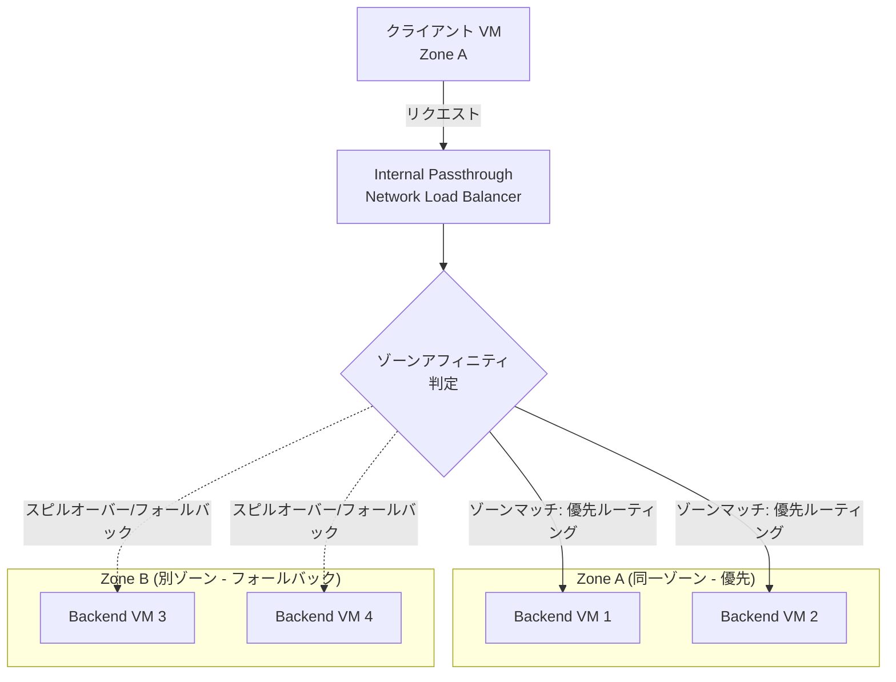

# Cloud Load Balancing: 内部パススルー ネットワーク ロードバランサのゾーンアフィニティが GA

**リリース日**: 2026-05-21

**サービス**: Cloud Load Balancing

**機能**: Internal Passthrough Network Load Balancer - Zonal Affinity (GA)

**ステータス**: GA (一般提供)

📊 [このアップデートのインフォグラフィックを見る](https://takech9203.github.io/google-cloud-news-summary/20260521-cloud-load-balancing-zonal-affinity-ga.html)

## 概要

Google Cloud は、内部パススルー ネットワーク ロードバランサ (Internal Passthrough Network Load Balancer) のゾーンアフィニティ機能を一般提供 (GA) としてリリースしました。この機能は以前 Preview として提供されていましたが、本番環境での利用が正式にサポートされるようになりました。

ゾーンアフィニティは、ロードバランサのバックエンドサービスに設定することで、クロスゾーントラフィックを制限し、レイテンシを削減し、パフォーマンスを向上させる機能です。マルチゾーンアーキテクチャの利点を維持しながら、クライアントと同じゾーンにあるバックエンドへの接続を優先的にルーティングします。

この機能は、レイテンシに敏感なワークロードを実行している組織や、ゾーン間トラフィックのコストを最適化したい組織に特に有効です。内部パススルー ネットワーク ロードバランサを使用してマイクロサービス間の通信を管理しているすべてのユーザーが対象となります。

**アップデート前の課題**

- 内部パススルー ネットワーク ロードバランサでは、新しい接続がすべてのゾーンの正常なバックエンドに均等に分散され、同一ゾーン内のバックエンドを優先する方法がなかった
- クロスゾーントラフィックによる追加のネットワークレイテンシが発生し、レイテンシに敏感なアプリケーションのパフォーマンスに影響があった
- ゾーン間データ転送コストを制御する手段が限られていた
- Preview 版ではSLA の対象外であり、本番環境での利用にリスクがあった

**アップデート後の改善**

- GA としてリリースされたことで、SLA に基づく本番環境での安定利用が可能になった
- 同一ゾーンのバックエンドへのトラフィックルーティングを優先することで、ネットワークレイテンシを削減可能になった
- スピルオーバー比率の設定により、ゾーン内トラフィック維持とクロスゾーンフォールバックの柔軟な制御が可能になった
- `gcloud` コマンドで `beta` フラグなしでゾーンアフィニティを設定可能になった

## アーキテクチャ図



ゾーンアフィニティが有効な場合、ロードバランサはクライアントと同じゾーンにあるバックエンドを優先的に選択します。同一ゾーンのバックエンドが不十分な場合、設定されたスピルオーバー比率に基づいて他のゾーンのバックエンドにフォールバックします。

## サービスアップデートの詳細

### 主要機能

1. **ZONAL_AFFINITY_STAY_WITHIN_ZONE**
   - ゾーンマッチが発生した場合、トラフィックをクライアントのゾーン内に維持する
   - 同一ゾーン内のバックエンドが正常でない場合でも、ゾーン内のバックエンドを使用する
   - レイテンシ最適化を最優先するユースケースに適している

2. **ZONAL_AFFINITY_SPILL_CROSS_ZONE**
   - ゾーンマッチが発生した場合、スピルオーバー比率に基づいてトラフィックを制御する
   - スピルオーバー比率を 0.0 から 1.0 の範囲で設定可能
   - 同一ゾーン内の正常なバックエンドが一定比率を下回ると、他のゾーンへのスピルオーバーを許可する

3. **ZONAL_AFFINITY_DISABLED (デフォルト)**
   - ゾーンアフィニティが無効な状態 (従来の動作)
   - ロードバランサはすべての正常なバックエンドから均等に選択する
   - 既存のロードバランサの動作は変更されない

## 技術仕様

### ゾーンアフィニティオプション比較

| オプション | 動作 | スピルオーバー比率 | 推奨ユースケース |
|------|------|------|------|
| ZONAL_AFFINITY_DISABLED | ゾーン制限なし | N/A | デフォルト動作、均等分散が必要な場合 |
| ZONAL_AFFINITY_STAY_WITHIN_ZONE | 同一ゾーン強制 | N/A | レイテンシ最小化が最優先 |
| ZONAL_AFFINITY_SPILL_CROSS_ZONE | 比率ベースで制御 | 0.0 - 1.0 | 可用性とレイテンシのバランスが必要 |

### 互換性マトリックス

| 機能 | ゾーンアフィニティとの互換性 |
|------|------|
| Next hops (静的ルート) | サポート |
| Next hops (ポリシーベースルート) | サポート |
| フェイルオーバー | サポート |
| Private Service Connect | サポート |
| Backend subsetting | 非互換 |
| Packet Mirroring コレクター | 非互換 |
| Network Security Integration | 非互換 (パケットドロップの原因) |

### スピルオーバー比率の設定

```json
{
  "name": "backend-service-example",
  "loadBalancingScheme": "INTERNAL",
  "protocol": "TCP",
  "zonalAffinity": {
    "zonalAffinitySpillover": "ZONAL_AFFINITY_SPILL_CROSS_ZONE",
    "zonalAffinitySpilloverRatio": 0.8
  }
}
```

## 設定方法

### 前提条件

1. Google Cloud プロジェクトが作成されていること
2. 内部パススルー ネットワーク ロードバランサが既に構成されていること
3. バックエンドが複数のゾーンにデプロイされていること
4. Backend subsetting が無効であること

### 手順

#### ステップ 1: ZONAL_AFFINITY_STAY_WITHIN_ZONE の設定

```bash
gcloud compute backend-services update BACKEND_SERVICE_NAME \
    --zonal-affinity-spillover=ZONAL_AFFINITY_STAY_WITHIN_ZONE \
    --region=REGION
```

同一ゾーン内のバックエンドのみにトラフィックをルーティングする厳格なゾーンアフィニティを設定します。

#### ステップ 2: ZONAL_AFFINITY_SPILL_CROSS_ZONE の設定 (スピルオーバー比率付き)

```bash
gcloud compute backend-services update BACKEND_SERVICE_NAME \
    --zonal-affinity-spillover=ZONAL_AFFINITY_SPILL_CROSS_ZONE \
    --zonal-affinity-spillover-ratio=0.8 \
    --region=REGION
```

スピルオーバー比率 0.8 の場合、同一ゾーン内の正常なバックエンドがゾーンマッチバックエンド全体の 80% 以上であれば、トラフィックはゾーン内に維持されます。80% を下回ると、すべてのオリジナル正常バックエンドにトラフィックがスピルオーバーします。

#### ステップ 3: ゾーンアフィニティの無効化

```bash
gcloud compute backend-services update BACKEND_SERVICE_NAME \
    --zonal-affinity-spillover=ZONAL_AFFINITY_DISABLED \
    --region=REGION
```

デフォルトの動作 (ゾーン制限なし) に戻します。

## メリット

### ビジネス面

- **ネットワークコスト削減**: クロスゾーントラフィックを制限することで、ゾーン間のデータ転送コストを削減
- **パフォーマンス向上**: レイテンシの低減により、エンドユーザー体験が向上し、SLA 達成率が改善
- **運用の簡素化**: ロードバランサの設定変更のみで実現でき、アプリケーションコードの変更は不要

### 技術面

- **レイテンシ削減**: 同一ゾーン内通信によりネットワークホップが削減され、ラウンドトリップタイムが短縮
- **柔軟な制御**: スピルオーバー比率により、可用性とローカリティのトレードオフを細かく制御可能
- **既存接続への影響なし**: コネクション追跡テーブルに既に存在する接続は、ゾーンアフィニティ設定変更の影響を受けない
- **フェイルオーバーとの併用**: フェイルオーバー機能と組み合わせて、高可用性を維持しながらゾーンアフィニティを活用可能

## デメリット・制約事項

### 制限事項

- Backend subsetting との併用は不可
- Packet Mirroring のコレクター宛先との併用は不可
- Network Security Integration (インバンド/アウトバンド) との併用はパケットドロップの原因となる
- Cloud VPN トンネルまたは Cloud Interconnect VLAN アタッチメント経由のクライアントではゾーンアフィニティは動作しない
- クライアント VM がロードバランサと異なるリージョンにある場合はゾーンアフィニティは無効

### 考慮すべき点

- ZONAL_AFFINITY_STAY_WITHIN_ZONE を使用する場合、同一ゾーン内のバックエンドが不健全でもそのゾーン内に留まるため、可用性リスクがある
- ステートフルアーキテクチャ (ファイアウォールの並列構成など) でネクストホップとして使用する場合は推奨されない
- スピルオーバー比率の設定は、ワークロードの特性に応じたチューニングが必要
- ゾーン間のバックエンド数が不均等な場合、特定のゾーンに負荷が集中する可能性がある

## ユースケース

### ユースケース 1: レイテンシに敏感なマイクロサービス通信

**シナリオ**: 金融取引システムにおいて、注文管理サービスから約定処理サービスへのリクエストを最小レイテンシで処理する必要がある。両サービスは複数ゾーンにデプロイされているが、同一ゾーン内での通信を優先したい。

**実装例**:
```bash
gcloud compute backend-services update order-execution-backend \
    --zonal-affinity-spillover=ZONAL_AFFINITY_SPILL_CROSS_ZONE \
    --zonal-affinity-spillover-ratio=0.5 \
    --region=asia-northeast1
```

**効果**: 通常時は同一ゾーン内で低レイテンシ通信を実現しつつ、ゾーン内のバックエンドが 50% 以下になった場合はクロスゾーンにフォールバックして可用性を確保。

### ユースケース 2: データ転送コストの最適化

**シナリオ**: 大量のデータを処理するバッチ処理システムで、ワーカーノードがデータストア (内部ロードバランサ経由) にアクセスする際のゾーン間データ転送コストを削減したい。

**実装例**:
```bash
gcloud compute backend-services update data-store-backend \
    --zonal-affinity-spillover=ZONAL_AFFINITY_STAY_WITHIN_ZONE \
    --region=us-central1
```

**効果**: ワーカーノードと同一ゾーンのデータストアバックエンドにのみ接続されるため、ゾーン間データ転送料金が発生せず、大幅なコスト削減を実現。

### ユースケース 3: Private Service Connect と組み合わせたサービス提供

**シナリオ**: SaaS プロバイダーが Private Service Connect を使用してサービスを公開しており、エンドポイント経由のトラフィックを効率的に処理したい。

**効果**: Private Service Connect エンドポイントからのトラフィックが、プロデューサー側の同一ゾーンのバックエンドに優先的にルーティングされ、サービス提供のレイテンシが改善。

## 料金

ゾーンアフィニティ機能自体には追加料金は発生しません。通常の Cloud Load Balancing の料金体系が適用されます。

### 料金例

| 項目 | 月額料金 (概算) |
|--------|-----------------|
| 転送ルール (最初の 5 個) | 各 $0.025/時間 (約 $18/月) |
| 追加の転送ルール | 各 $0.010/時間 (約 $7.2/月) |
| インバウンドデータ処理 | $0.008 - $0.012/GB (リージョンによる) |
| アウトバウンドデータ処理 | $0.008 - $0.012/GB (リージョンによる) |

ゾーンアフィニティを有効にすることで、クロスゾーントラフィックが減少し、ゾーン間のエグレス料金を間接的に削減できる可能性があります。

## 利用可能リージョン

ゾーンアフィニティは、内部パススルー ネットワーク ロードバランサが利用可能なすべてのリージョンで GA として利用可能です。ただし、ゾーンアフィニティの効果を得るためには、ロードバランサと同じリージョン内の複数ゾーンにバックエンドがデプロイされている必要があります。

## 関連サービス・機能

- **Internal Passthrough Network Load Balancer**: ゾーンアフィニティが設定される対象のロードバランサ
- **Private Service Connect**: ゾーンアフィニティと互換性があり、パブリッシュされたサービスのプロデューサーとして使用可能
- **Cloud VPN / Cloud Interconnect**: これらを経由するクライアントはゾーンアフィニティの対象外
- **Connection Tracking Policy**: ゾーンアフィニティと併用して接続管理を最適化可能
- **Backend Subsetting**: ゾーンアフィニティとは非互換のため、どちらか一方を選択する必要がある

## 参考リンク

- 📊 [インフォグラフィック](https://takech9203.github.io/google-cloud-news-summary/20260521-cloud-load-balancing-zonal-affinity-ga.html)
- [公式リリースノート](https://cloud.google.com/release-notes#May_21_2026)
- [ゾーンアフィニティ ドキュメント](https://cloud.google.com/load-balancing/docs/internal/zonal-affinity)
- [内部パススルー ネットワーク ロードバランサの設定](https://cloud.google.com/load-balancing/docs/internal/setting-up-internal)
- [料金ページ](https://cloud.google.com/vpc/network-pricing#lb)

## まとめ

内部パススルー ネットワーク ロードバランサのゾーンアフィニティが GA になったことで、マルチゾーン環境におけるトラフィック制御の選択肢が大幅に広がりました。レイテンシ削減、コスト最適化、パフォーマンス向上を実現しつつ、マルチゾーンの高可用性を維持できます。内部ロードバランサを使用している組織は、ワークロードの特性に応じてゾーンアフィニティの導入を検討することを推奨します。

---

**タグ**: #CloudLoadBalancing #InternalPassthroughNetworkLoadBalancer #ZonalAffinity #GA #ネットワーキング #レイテンシ最適化 #コスト最適化
