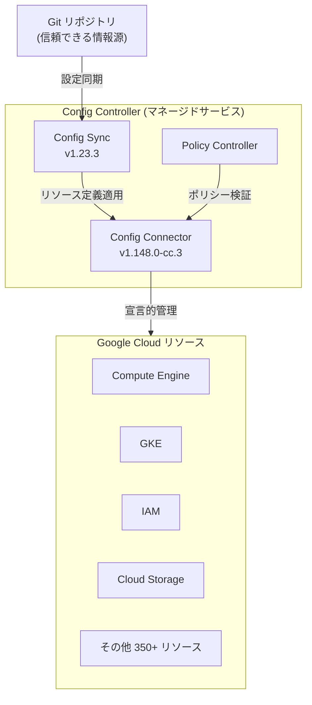

# Config Controller: 含有プロダクトのバージョンアップデート

**リリース日**: 2026-05-21

**サービス**: Config Controller

**機能**: Config Connector v1.148.0-cc.3 および Config Sync v1.23.3 へのバージョン更新

**ステータス**: Change (変更)

📊 [このアップデートのインフォグラフィックを見る](https://takech9203.github.io/google-cloud-news-summary/20260521-config-controller-version-update.html)

## 概要

Config Controller に含まれる Config Connector と Config Sync のバージョンが更新されました。Config Connector は v1.148.0-cc.3 に、Config Sync は v1.23.3 にそれぞれアップグレードされています。Config Controller はマネージドサービスであるため、Google が自動的にアップグレードを実施します。

Config Controller は、Kubernetes の宣言的モデルを使用して Google Cloud リソースを作成・管理するためのホスティングされたサービスです。Config Connector によるリソース管理、Config Sync による Git リポジトリとの同期、Policy Controller によるポリシー適用を統合的に提供しています。

今回のアップデートにより、Config Connector の新機能（MCP サーバー統合、Parameter Manager サポートなど）や Config Sync のセキュリティ修正（CVE 対応、依存関係更新）が Config Controller ユーザーに自動的に提供されます。

**アップデート前の課題**

- Config Connector の以前のバージョンでは Parameter Manager パラメータバージョンのリソース管理ができなかった
- SQLInstance リソースで dataCacheConfig の不正な差分検出によりリコンサイルループが発生する場合があった
- Config Sync の Open Telemetry イメージに脆弱性が存在していた
- Helm のバンドルバージョンが古く、セキュリティ修正が適用されていなかった

**アップデート後の改善**

- Config Connector v1.148.0 の新機能（ParameterManagerParameterVersion リソース、MCP サーバー、MultiClusterLeaseSpec 改善）が利用可能に
- SQLInstance の差分検出バグが修正され、不要なリコンサイルが解消
- Config Sync v1.23.3 で Open Telemetry が v0.133.0 に更新され、脆弱性が修正
- Helm が v3.20.0 にアップグレードされ、セキュリティが強化

## アーキテクチャ図



Config Controller が Config Connector v1.148.0-cc.3 と Config Sync v1.23.3 を統合し、Git リポジトリからの宣言的リソース管理を実現するアーキテクチャを示しています。

## サービスアップデートの詳細

### 主要機能

1. **Config Connector v1.148.0-cc.3 の新機能**
   - ParameterManagerParameterVersion リソースの新規サポート（Alpha、Direct Reconciler）
   - MultiClusterLeaseSpec が KRM オブジェクトの Syncer 統合をサポートし、サービス生成 ID を持つリソースの所有権管理が改善
   - kompanion ツールに Model Context Protocol (MCP) サーバーが追加され、AI IDE やアシスタントが Config Connector リソースと対話可能に
   - --skip-name-validation フラグの追加により、統合テストやマルチマネージャーシナリオが容易に

2. **Config Connector v1.148.0-cc.3 のバグ修正**
   - SQLInstance: dataCacheConfig の不正な差分検出を修正
   - SQLInstance: nil 値と空オブジェクトの比較を修正し、不要なリコンサイルループを解消
   - TagKey/TagValue: ALREADY_EXISTS エラーの適切なハンドリング
   - BigQueryAnalyticsHubDataExchange: 構造化レポーティング差分の追加
   - CloudBuildTrigger: CRD の説明欠落を修正

3. **Config Sync v1.23.3 の変更点**
   - Open Telemetry イメージを v0.127.0 から v0.133.0 にアップグレード（脆弱性修正）
   - pkg.translator.prometheus.NormalizeName フィーチャーゲートが Stable に昇格
   - Helm バンドルバージョンを v3.18.6 から v3.20.0 にアップグレード（脆弱性修正）
   - 複数の CVE に対応するための依存関係更新

## 技術仕様

### バージョン情報

| コンポーネント | 前回バージョン | 今回のバージョン |
|------|------|------|
| Config Connector | v1.134.4 (2026年3月6日時点) | v1.148.0-cc.3 |
| Config Sync | v1.21.3 (2025年8月14日時点) | v1.23.3 |
| Open Telemetry (Config Sync) | v0.127.0 | v0.133.0 |
| Helm (Config Sync) | v3.18.6 | v3.20.0 |

### Config Connector 新規対応リソース (v1.148.0)

```yaml
apiVersion: parametermanager.cnrm.cloud.google.com/v1alpha1
kind: ParameterManagerParameterVersion
metadata:
  name: example-parameter-version
spec:
  parameterRef:
    name: my-parameter
  parameterVersionData:
    plainText: "my-parameter-value"
```

## 設定方法

### 前提条件

1. Config Controller インスタンスが既にプロビジョニングされていること
2. gcloud CLI が最新バージョンにインストールされていること

### 手順

#### ステップ 1: バージョンの確認

```bash
# Config Controller インスタンスのバージョンを確認
gcloud anthos config controller list --location=LOCATION
```

Config Controller はマネージドサービスのため、Google が自動的にアップグレードを実施します。ユーザー側での手動アップグレード操作は不要です。

#### ステップ 2: Config Connector バージョンの確認

```bash
# クラスター内の Config Connector バージョンを確認
kubectl get ns cnrm-system -o jsonpath='{.metadata.annotations.cnrm\.cloud\.google\.com/version}'
```

#### ステップ 3: Config Sync バージョンの確認

```bash
# Config Sync のステータスを確認
kubectl get rootsync -n config-management-system
```

## メリット

### ビジネス面

- **運用負荷の削減**: マネージドサービスによる自動アップグレードにより、手動でのバージョン管理作業が不要
- **セキュリティリスクの低減**: CVE 修正が自動適用されるため、脆弱性への対応が迅速化
- **AI ツール連携**: kompanion MCP サーバーにより、AI アシスタントを活用したインフラ管理が可能に

### 技術面

- **リコンサイル安定性の向上**: SQLInstance の差分検出修正により、不要なリコンサイルループが解消
- **Parameter Manager 統合**: リージョナルパラメータの宣言的管理が新たに可能に
- **マルチクラスター管理改善**: MultiClusterLeaseSpec の Syncer 統合により、サービス生成 ID を持つリソースの管理が改善
- **Helm 最新版対応**: Helm v3.20.0 により最新のチャート機能とセキュリティ修正を利用可能

## デメリット・制約事項

### 制限事項

- Config Controller のアップグレードタイミングはユーザーが制御できない（Google による自動実施）
- ParameterManagerParameterVersion は Alpha リリースのため、本番環境での使用は推奨されない
- Config Sync v1.23.3 の Open Telemetry アップグレードにより pkg.translator.prometheus.NormalizeName が Stable に昇格したため、メトリクス名の正規化動作が変更される可能性がある

### 考慮すべき点

- Open Telemetry v0.133.0 へのアップグレードに伴い、カスタムメトリクスソリューションへの影響を確認する必要がある
- Helm v3.20.0 のチェンジログを確認し、既存チャートとの互換性を検証することを推奨
- Config Connector の大幅なバージョンジャンプ（v1.134.4 から v1.148.0）のため、リリースノートの変更点を網羅的に確認することが望ましい

## ユースケース

### ユースケース 1: Parameter Manager による機密設定の宣言的管理

**シナリオ**: アプリケーションの設定パラメータをリージョナルに管理したい場合、Config Connector の新しい ParameterManagerParameterVersion リソースを使用して Git リポジトリから宣言的に管理できます。

**実装例**:
```yaml
apiVersion: parametermanager.cnrm.cloud.google.com/v1alpha1
kind: ParameterManagerParameterVersion
metadata:
  name: app-config-v1
  namespace: config-control
spec:
  parameterRef:
    name: my-app-config
  parameterVersionData:
    plainText: "database_host=10.0.0.1"
```

**効果**: Secret Manager と連携した Parameter Manager のリソースを GitOps ワークフローで管理でき、インフラのコード化が促進されます。

### ユースケース 2: AI アシスタントによるインフラ管理

**シナリオ**: kompanion の MCP サーバー機能を使用して、AI IDE（Cursor、VS Code + Copilot 等）から Config Connector リソースの状態を確認し、トラブルシューティングを行います。

**効果**: インフラ管理の効率化と、問題発生時の迅速な原因特定が可能になります。

## 料金

Config Controller の料金体系は以下の通りです。

### 料金例

| 項目 | 月額料金 (概算) |
|--------|-----------------|
| Config Controller クラスター (管理費) | $0.10/時間 (約 $73/月) |
| 基盤となる GKE ノード | ノードタイプに依存 |
| Config Connector / Config Sync | Config Controller に含まれる (追加料金なし) |

※ 今回のバージョンアップデート自体に追加料金は発生しません。

## 利用可能リージョン

Config Controller は以下のリージョンで利用可能です（一部抜粋）:

- us-central1, us-east1, us-west1, us-central2, us-east7
- europe-west1, europe-west4, europe-west8
- asia-east1, asia-northeast1, asia-southeast1
- australia-southeast1

※ 最新のリージョン対応状況は公式ドキュメントを参照してください。

## 関連サービス・機能

- **Config Connector**: Kubernetes CRD を通じて Google Cloud リソースを宣言的に管理するツール
- **Config Sync**: Git リポジトリや OCI レジストリから Kubernetes クラスターへ設定を同期するツール
- **Policy Controller**: OPA Gatekeeper ベースのポリシーエンジンでリソースのコンプライアンスを強制
- **GKE (Google Kubernetes Engine)**: Config Controller の基盤となるコンテナオーケストレーションサービス
- **Parameter Manager**: リージョナルパラメータを管理する Secret Manager の機能拡張

## 参考リンク

- 📊 [インフォグラフィック](https://takech9203.github.io/google-cloud-news-summary/20260521-config-controller-version-update.html)
- [公式リリースノート](https://cloud.google.com/release-notes#May_21_2026)
- [Config Controller ドキュメント](https://cloud.google.com/kubernetes-engine/config-controller/docs/overview)
- [Config Connector リリースノート](https://cloud.google.com/config-connector/docs/release-notes)
- [Config Sync リリースノート](https://cloud.google.com/kubernetes-engine/config-sync/docs/release-notes)
- [Config Controller セットアップ](https://cloud.google.com/kubernetes-engine/config-controller/docs/setup)

## まとめ

今回の Config Controller アップデートは、Config Connector v1.148.0-cc.3 と Config Sync v1.23.3 への更新により、新リソースサポート（ParameterManagerParameterVersion）、AI ツール統合（MCP サーバー）、安定性向上（SQLInstance 修正）、セキュリティ強化（CVE 対応・依存関係更新）を包括的に提供するものです。マネージドサービスとして自動適用されるため、ユーザーは特別な対応なく最新の改善を享受できます。既存の Config Controller ユーザーは、リソースの動作に変更がないか確認し、新機能の活用を検討することを推奨します。

---

**タグ**: #ConfigController #ConfigConnector #ConfigSync #GKE #Kubernetes #GitOps #InfrastructureAsCode #IaC #ParameterManager #MCP
