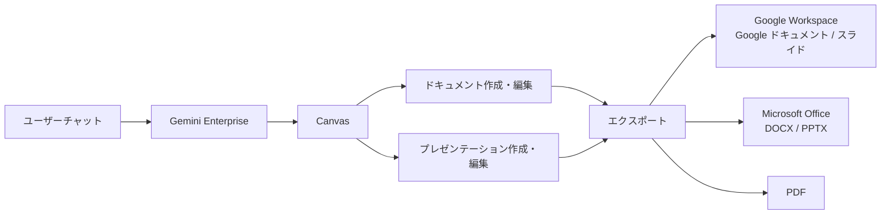

# Gemini Enterprise: Canvas でのドキュメント・スライド作成・編集機能 (Preview)

**リリース日**: 2026-05-21

**サービス**: Gemini Enterprise

**機能**: Canvas でのドキュメント・スライド作成・編集

**ステータス**: Public Preview

[このアップデートのインフォグラフィックを見る](https://takech9203.github.io/google-cloud-news-summary/20260521-gemini-enterprise-canvas-preview.html)

## 概要

Gemini Enterprise に新たに「Canvas」機能が Public Preview として追加されました。Canvas は、Gemini Enterprise ウェブアプリ内に統合された専用のインタラクティブツールであり、チャットから直接 AI 生成のドキュメントやプレゼンテーションを作成・編集できる革新的な機能です。

この機能により、ユーザーは Gemini との会話の中でアイデアを形にし、それをそのまま編集可能なドキュメントやスライドとして仕上げることが可能になります。作成したコンテンツは Google Workspace（Google ドキュメント、Google スライド）、Microsoft Office 形式（DOCX、PPTX）、PDF としてエクスポートできるため、既存のワークフローにシームレスに統合できます。

対象ユーザーは、Gemini Enterprise のすべてのエディション（Business、Standard、Plus）の利用者であり、特にドキュメント作成やプレゼンテーション準備に多くの時間を費やすナレッジワーカーに大きな価値を提供します。

**アップデート前の課題**

従来の Gemini Enterprise では、チャットベースのテキスト生成は可能でしたが、構造化されたドキュメントやプレゼンテーションを直接作成・編集する統合的な環境がありませんでした。

- チャットで生成したテキストを別のアプリケーション（Google ドキュメントや PowerPoint）にコピー＆ペーストして手動で整形する必要があった
- AI が生成したコンテンツをリアルタイムで編集・修正するためのインタラクティブな環境がなく、反復的なプロンプト入力が必要だった
- ドキュメントとプレゼンテーションの作成が分離されたワークフローであり、一貫した作業体験を提供できていなかった

**アップデート後の改善**

Canvas の導入により、コンテンツ作成のワークフローが大幅に改善されました。

- チャット内から直接ドキュメントやプレゼンテーションを作成・編集でき、アプリケーション間の切り替えが不要になった
- AI 生成コンテンツをリアルタイムでインタラクティブに編集・修正でき、最終成果物の品質向上が容易になった
- Google Workspace、Microsoft Office、PDF の複数形式へのエクスポートが統合され、あらゆるビジネス環境への対応が可能になった

## アーキテクチャ図



ユーザーがチャットで指示を出すと、Gemini Enterprise が Canvas 上でドキュメントまたはプレゼンテーションを生成し、ユーザーがインタラクティブに編集した後、複数の形式でエクスポートできるフローを示しています。

## サービスアップデートの詳細

### 主要機能

1. **AI ドキュメント生成**
   - チャットでの自然言語指示に基づき、構造化されたドキュメントを自動生成
   - 見出し、段落、リスト、表などの要素を含む完成度の高いドキュメントを作成
   - ビジネスレポート、提案書、議事録など多様なドキュメントタイプに対応

2. **AI プレゼンテーション生成**
   - テキストプロンプトからスライドデッキを自動生成
   - レイアウト、構成、ビジュアル要素を含むプレゼンテーションを作成
   - プレゼンテーションの構造やスライド数をカスタマイズ可能

3. **インタラクティブ編集**
   - Canvas 上でリアルタイムにコンテンツを直接編集
   - AI アシスタントとの対話を通じた段階的な改善が可能
   - テキスト修正、レイアウト変更、コンテンツ追加・削除をシームレスに実行

4. **マルチフォーマットエクスポート**
   - Google Workspace 形式（Google ドキュメント、Google スライド）への直接エクスポート
   - Microsoft Office 形式（DOCX、PPTX）でのダウンロード
   - PDF 形式での出力に対応

## 技術仕様

### 対応フォーマット

| 出力形式 | ドキュメント | プレゼンテーション |
|----------|-------------|-------------------|
| Google Workspace | Google ドキュメント | Google スライド |
| Microsoft Office | DOCX | PPTX |
| PDF | 対応 | 対応 |

### エディション別対応状況

| エディション | Canvas 利用 | 備考 |
|-------------|------------|------|
| Business | 対応 | 1-300 ユーザー |
| Standard | 対応 | 無制限シート |
| Plus | 対応 | 無制限シート、高クォータ |
| Frontline | 未確認 | 今後の情報を確認 |

## 設定方法

### 前提条件

1. Gemini Enterprise のアクティブなライセンス（Business、Standard、または Plus エディション）
2. Gemini Enterprise ウェブアプリへのアクセス権限

### 手順

#### ステップ 1: Gemini Enterprise ウェブアプリにアクセス

Gemini Enterprise ウェブアプリ（gemini.google.com/enterprise または組織のカスタム URL）にログインします。

#### ステップ 2: Canvas でドキュメントを作成

チャットボックスで自然言語を使用してドキュメントまたはプレゼンテーションの作成を指示します。

```
例: 「来月のプロジェクト進捗報告書を作成してください。
目標達成率、主要な成果、課題と対策の3セクションを含めてください。」
```

#### ステップ 3: Canvas 上で編集

生成されたコンテンツが Canvas に表示されます。直接テキストを編集するか、チャットで追加の指示を出して修正を行います。

```
例: 「2ページ目の課題セクションにリスク評価の表を追加してください。」
```

#### ステップ 4: エクスポート

完成したドキュメントを任意の形式でエクスポートします。エクスポートボタンから Google ドキュメント、DOCX、または PDF を選択できます。

## メリット

### ビジネス面

- **生産性の大幅向上**: ドキュメント作成時間を短縮し、アイデアから完成品までのリードタイムを削減
- **ツール統合による効率化**: 複数アプリケーション間の切り替えが不要になり、シームレスなワークフローを実現
- **フォーマット互換性**: Google Workspace と Microsoft Office の両方に対応し、組織間のコラボレーションを促進

### 技術面

- **AI ネイティブな編集体験**: 従来のテンプレートベースではなく、コンテキストを理解した AI による動的なコンテンツ生成
- **マルチモーダル出力**: テキストドキュメントとビジュアルプレゼンテーションの両方を単一のインターフェースから生成
- **反復的改善**: チャットベースの対話で段階的にコンテンツを洗練できるインタラクティブなワークフロー

## デメリット・制約事項

### 制限事項

- 現時点では Public Preview であり、GA（一般提供）までに機能が変更される可能性がある
- Preview 期間中は SLA（サービスレベル契約）の対象外
- 生成されるドキュメントの複雑さや精度は、プロンプトの品質に依存する

### 考慮すべき点

- 機密性の高いドキュメントを AI で生成する場合、組織のデータガバナンスポリシーとの整合性を確認する必要がある
- 大規模なドキュメントや複雑なレイアウトのプレゼンテーションでは、手動での微調整が必要になる場合がある
- エクスポート時のフォーマット変換で、一部のレイアウトや書式が完全に保持されない可能性がある

## ユースケース

### ユースケース 1: 経営会議向けプレゼンテーション作成

**シナリオ**: 経営企画部のマネージャーが、四半期の業績レビューと次期戦略のプレゼンテーションを短時間で作成する必要がある。

**実装例**:
```
プロンプト: 「Q2 の業績レビュープレゼンテーションを10スライドで作成してください。
構成: エグゼクティブサマリー、売上実績、KPI 達成状況、
市場動向分析、競合比較、課題と対策、次期戦略、アクションプラン」
```

**効果**: 従来 3-4 時間かかっていたプレゼンテーション作成が 30 分程度に短縮。Canvas 上での直接編集で、具体的な数値やグラフの追加指示も自然言語で対応可能。

### ユースケース 2: 提案書・企画書のドラフト作成

**シナリオ**: セールスチームが顧客向けのカスタム提案書を迅速に作成し、DOCX 形式で顧客に送付する必要がある。

**効果**: AI が顧客の業界やニーズに合わせた提案書の初稿を生成し、Canvas 上で修正後、Microsoft Office 形式でエクスポートすることで、顧客への提出までのリードタイムを大幅に短縮。

### ユースケース 3: 社内ドキュメントの標準化

**シナリオ**: HR 部門が社内ポリシードキュメントを作成し、Google ドキュメントとして社内共有する。

**効果**: 一貫したフォーマットと品質のドキュメントを効率的に生成し、Google Workspace に直接エクスポートすることで、社内のドキュメント管理が効率化。

## 料金

Canvas 機能は Gemini Enterprise のサブスクリプションに含まれており、追加料金なしで利用できます（Preview 期間中）。

### Gemini Enterprise エディション料金

| エディション | 月額料金（1ユーザーあたり） |
|-------------|--------------------------|
| Business | $21 USD〜 |
| Standard | $30 USD〜 |
| Plus | $30 USD〜（上位機能を含む） |

※ GA 後の料金体系については、今後のアナウンスを確認してください。

## 利用可能リージョン

Gemini Enterprise が利用可能なすべてのリージョン（Global、US、EU）で Canvas 機能が利用可能です。Preview 期間中のリージョン制限については、公式ドキュメントで最新情報を確認してください。

## 関連サービス・機能

- **NotebookLM Enterprise**: AI を活用したリサーチ・ノートブックツール。Canvas と組み合わせることで、リサーチ結果を直接ドキュメントやプレゼンテーションに変換可能
- **Google Workspace**: Canvas で作成したコンテンツのエクスポート先として統合。Google ドキュメントやスライドでの共同編集に移行可能
- **Agent Designer**: Gemini Enterprise のノーコードエージェント構築ツール。ドキュメント作成を自動化するカスタムエージェントの構築にも活用可能
- **Gemini Enterprise アシスタントチャット**: Canvas はチャットインターフェースから起動される機能であり、既存の会話体験を拡張するもの

## 参考リンク

- [インフォグラフィック](https://takech9203.github.io/google-cloud-news-summary/20260521-gemini-enterprise-canvas-preview.html)
- [公式リリースノート](https://cloud.google.com/release-notes#May_21_2026)
- [Gemini Enterprise ドキュメント](https://docs.cloud.google.com/gemini/enterprise/docs/assistant-chat)
- [Gemini Enterprise エディション比較](https://docs.cloud.google.com/gemini/enterprise/docs/editions)
- [料金ページ](https://cloud.google.com/gemini-enterprise)

## まとめ

Gemini Enterprise の Canvas 機能は、AI による生産性向上を次のレベルに引き上げる重要なアップデートです。チャットからドキュメントやプレゼンテーションを直接作成・編集し、複数形式でエクスポートできるこの機能は、ナレッジワーカーの日常業務を大幅に効率化します。現在 Public Preview のため、本番環境での利用には注意が必要ですが、GA に向けて早期に機能を評価し、組織内での活用シナリオを検討することを推奨します。

---

**タグ**: #GeminiEnterprise #Canvas #ドキュメント生成 #プレゼンテーション #AI生産性 #PublicPreview #GoogleWorkspace #MicrosoftOffice #PDF
