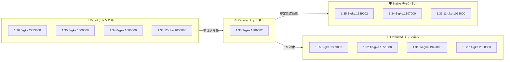

# Google Kubernetes Engine: 2026-R20 バージョンアップデート + セキュリティ修正

**リリース日**: 2026-05-21

**サービス**: Google Kubernetes Engine (GKE)

**機能**: クラスタバージョン更新 (2026-R20) + Container-Optimized OS セキュリティ修正

**ステータス**: Change + Security

📊 [このアップデートのインフォグラフィックを見る](https://takech9203.github.io/google-cloud-news-summary/20260521-gke-2026-r20-version-security-updates.html)

## 概要

GKE クラスタバージョンが 2026-R20 として更新され、全リリースチャンネル (Rapid、Regular、Stable、Extended) で新しいバージョンが利用可能になった。今回のアップデートでは、最新の Kubernetes パッチバージョンの提供に加え、Container-Optimized OS (cos) イメージの累積セキュリティ修正が含まれている。

特に注目すべきは、Rapid チャンネルで GKE 1.36.0-gke.2253000 が利用可能になった点である。このバージョンは cos-beta-129-19506-120-52 イメージを使用しており、最新の Kubernetes 1.36 系列を早期に検証したいユーザー向けに提供されている。Extended チャンネルでは 1.30 から 1.35 までの幅広いマイナーバージョンがサポートされ、長期運用が必要なワークロードにも対応している。

本アップデートは、全 GKE ユーザー (特に本番環境でセキュリティパッチの迅速な適用が求められる Solutions Architect やプラットフォームエンジニア) に影響する。

**アップデート前の課題**

- 以前のバージョンの Container-Optimized OS イメージには、累積的なセキュリティ脆弱性が未修正のまま残っていた
- Rapid チャンネルで Kubernetes 1.36 系列が利用できなかった
- 各チャンネルのパッチバージョンが古く、既知のバグやセキュリティ問題を含んでいた

**アップデート後の改善**

- Container-Optimized OS イメージが累積セキュリティ修正で更新され、ノードのセキュリティポスチャが強化された
- Rapid チャンネルで Kubernetes 1.36.0 (cos-beta-129-19506-120-52 使用) が早期検証可能になった
- 全チャンネルで最新のパッチバージョンが利用可能になり、既知の脆弱性に対する修正が適用された

## アーキテクチャ図



GKE リリースチャンネルのバージョン伝播フロー。新バージョンは Rapid で最初に公開され、検証を経て Regular、Stable、Extended へ段階的に昇格する。Extended チャンネルでは最大 24 か月のサポートが提供される。

## サービスアップデートの詳細

### 主要機能

1. **Rapid チャンネル: 4 バージョン更新**
   - 1.36.0-gke.2253000: 最新の Kubernetes 1.36 系列 (cos-beta-129-19506-120-52 使用)
   - 1.35.5-gke.1000000: Kubernetes 1.35 最新パッチ
   - 1.34.8-gke.1000000: Kubernetes 1.34 最新パッチ
   - 1.33.12-gke.1000000: Kubernetes 1.33 最新パッチ

2. **Regular チャンネル: 1 バージョン更新**
   - 1.35.3-gke.1389002: 安定性が検証された Kubernetes 1.35 パッチ
   - Rapid チャンネルでの検証を経て昇格したバージョン

3. **Stable チャンネル: 3 バージョン更新**
   - 1.35.3-gke.1389002: Kubernetes 1.35 安定版パッチ
   - 1.34.6-gke.1307000: Kubernetes 1.34 安定版パッチ
   - 1.33.11-gke.1013000: Kubernetes 1.33 安定版パッチ

4. **Extended チャンネル: 4 バージョン更新**
   - 1.35.3-gke.1389002: Kubernetes 1.35 LTS パッチ
   - 1.32.13-gke.1551000: Kubernetes 1.32 LTS パッチ
   - 1.31.14-gke.1942000: Kubernetes 1.31 LTS パッチ
   - 1.30.14-gke.2530000: Kubernetes 1.30 LTS パッチ

5. **Container-Optimized OS セキュリティ修正**
   - 累積セキュリティ修正を含む更新済み cos イメージ
   - GKE 1.36.0-gke.2253000 は cos-beta-129-19506-120-52 を使用
   - イミュータブルなルートファイルシステム、検証済みブート、セキュリティ強化カーネルを備えた OS

## 技術仕様

### チャンネル別バージョン一覧

| チャンネル | バージョン | Kubernetes マイナー | COS イメージ |
|-----------|-----------|-------------------|-------------|
| Rapid | 1.36.0-gke.2253000 | 1.36 | cos-beta-129-19506-120-52 |
| Rapid | 1.35.5-gke.1000000 | 1.35 | - |
| Rapid | 1.34.8-gke.1000000 | 1.34 | - |
| Rapid | 1.33.12-gke.1000000 | 1.33 | - |
| Regular | 1.35.3-gke.1389002 | 1.35 | - |
| Stable | 1.35.3-gke.1389002 | 1.35 | - |
| Stable | 1.34.6-gke.1307000 | 1.34 | - |
| Stable | 1.33.11-gke.1013000 | 1.33 | - |
| Extended | 1.35.3-gke.1389002 | 1.35 | - |
| Extended | 1.32.13-gke.1551000 | 1.32 | - |
| Extended | 1.31.14-gke.1942000 | 1.31 | - |
| Extended | 1.30.14-gke.2530000 | 1.30 | - |

### リリースチャンネルの特性

| チャンネル | 対象ユーザー | マイナーバージョン可用性 | 自動アップグレード開始 |
|-----------|-------------|----------------------|---------------------|
| Rapid | 早期検証・プレプロダクション | OSS GA から 1-2 週間後 | リリースから 1-2 か月後 |
| Regular (デフォルト) | バランス重視の大多数のユーザー | Rapid から約 2 か月後 | Regular リリースから約 3 か月後 |
| Stable | 安定性最優先の本番環境 | Regular から 3-4 か月後 | Stable リリースから約 2 か月後 |
| Extended | 長期サポートが必要な環境 | Regular と同期 | Regular と同期 |

### Container-Optimized OS セキュリティ機能

| 機能 | 説明 |
|------|------|
| 最小限の OS フットプリント | コンテナ実行に最適化し、攻撃面を最小化 |
| イミュータブルルートファイルシステム | 読み取り専用でマウント、永続的な改ざんを防止 |
| 検証済みブート | ビルド時にチェックサムを計算し、起動時にカーネルが検証 |
| セキュリティ強化カーネル | IMA、Audit、KPTI、Chromium OS の LSM を有効化 |
| 自動更新 | GKE ノード自動アップグレードによるセキュリティパッチの適時配信 |

## 設定方法

### 前提条件

1. GKE クラスタがリリースチャンネルに登録されていること
2. `gcloud` CLI が最新版に更新されていること
3. 適切な IAM 権限 (`container.clusters.update`) を持っていること

### 手順

#### ステップ 1: 現在のクラスタバージョンを確認

```bash
gcloud container clusters describe CLUSTER_NAME \
    --zone ZONE \
    --format="value(currentMasterVersion)"
```

現在のクラスタバージョンとリリースチャンネルを確認する。

#### ステップ 2: 利用可能なバージョンを確認

```bash
gcloud container get-server-config \
    --zone ZONE \
    --format="yaml(channels)"
```

各チャンネルで利用可能なバージョンの一覧を取得する。

#### ステップ 3: 手動アップグレード (任意)

```bash
# コントロールプレーンのアップグレード
gcloud container clusters upgrade CLUSTER_NAME \
    --zone ZONE \
    --master \
    --cluster-version 1.35.3-gke.1389002

# ノードプールのアップグレード
gcloud container clusters upgrade CLUSTER_NAME \
    --zone ZONE \
    --node-pool NODE_POOL_NAME \
    --cluster-version 1.35.3-gke.1389002
```

自動アップグレードを待たずにパッチを適用したい場合は、手動アップグレードを実行する。

#### ステップ 4: アクセラレーテッドパッチ自動アップグレードの有効化 (推奨)

```bash
gcloud container clusters update CLUSTER_NAME \
    --zone ZONE \
    --patch-update=accelerated
```

セキュリティパッチをできるだけ早く自動適用したい場合は、アクセラレーテッドパッチ自動アップグレードを有効化する。

## メリット

### ビジネス面

- **セキュリティコンプライアンスの維持**: 累積セキュリティ修正により、ノードのセキュリティポスチャが最新に保たれ、コンプライアンス要件を満たしやすくなる
- **運用コストの削減**: 自動アップグレード機能により、手動でのパッチ適用作業が不要になる
- **長期サポートによる計画的な移行**: Extended チャンネルで最大 24 か月のサポートを受けながら、計画的にバージョンアップを進められる

### 技術面

- **最新の Kubernetes 機能へのアクセス**: Rapid チャンネルで 1.36.0 が利用可能になり、最新の Kubernetes API や機能を早期に検証できる
- **段階的なリスク軽減**: チャンネル間でのバージョン伝播により、本番環境への影響を最小限に抑えながらアップデートできる
- **Container-Optimized OS のセキュリティ強化**: イミュータブルルートファイルシステム、検証済みブート、セキュリティ強化カーネルによる多層防御

## デメリット・制約事項

### 制限事項

- Rapid チャンネルのバージョンは GKE SLA の対象外であり、既知の回避策がない問題が含まれる可能性がある
- Extended チャンネルは Autopilot クラスタ、アルファクラスタ、Windows Server ノードプールでは利用できない
- Extended チャンネルの拡張サポート期間中は、セキュリティ修正のみが提供され、新機能の追加は行われない
- アクセラレーテッドパッチ自動アップグレードはリリースチャンネルに登録されたクラスタでのみ利用可能

### 考慮すべき点

- 自動アップグレード後にワークロードの互換性問題が発生する可能性があるため、メンテナンスウィンドウの設定を推奨
- Container-Optimized OS のマイルストーン更新時にノードの再起動が必要となる場合がある
- Extended チャンネルの拡張サポート期間には追加料金が発生する
- バージョンスキューポリシーにより、コントロールプレーンとノードプールのバージョン差には制限がある

## ユースケース

### ユースケース 1: セキュリティ重視の本番環境

**シナリオ**: 金融機関の本番 GKE クラスタで、セキュリティパッチを迅速に適用する必要がある

**実装例**:
```bash
# Stable チャンネルに登録 + アクセラレーテッドパッチの有効化
gcloud container clusters update prod-cluster \
    --zone asia-northeast1-a \
    --release-channel stable \
    --patch-update=accelerated

# メンテナンスウィンドウの設定 (深夜帯に限定)
gcloud container clusters update prod-cluster \
    --zone asia-northeast1-a \
    --maintenance-window-start "2026-05-22T02:00:00Z" \
    --maintenance-window-end "2026-05-22T06:00:00Z" \
    --maintenance-window-recurrence "FREQ=WEEKLY;BYDAY=SA,SU"
```

**効果**: セキュリティパッチが自動適用されつつ、ビジネスへの影響を最小限に抑えられる

### ユースケース 2: 新バージョンの早期検証

**シナリオ**: プラットフォームチームが Kubernetes 1.36 の新機能をステージング環境で検証したい

**実装例**:
```bash
# Rapid チャンネルのクラスタを 1.36 にアップグレード
gcloud container clusters upgrade staging-cluster \
    --zone us-central1-a \
    --master \
    --cluster-version 1.36.0-gke.2253000
```

**効果**: 本番環境に影響を与えずに、最新の Kubernetes 機能を検証し、移行計画を策定できる

### ユースケース 3: 長期安定運用

**シナリオ**: レガシーアプリケーションの移行期間中、特定の Kubernetes バージョンで長期運用が必要

**実装例**:
```bash
# Extended チャンネルに登録して 1.30 を長期運用
gcloud container clusters update legacy-app-cluster \
    --zone asia-northeast1-a \
    --release-channel extended

# マイナーバージョンアップグレードを防止
gcloud container clusters update legacy-app-cluster \
    --zone asia-northeast1-a \
    --add-maintenance-exclusion-name "no-minor-upgrades" \
    --add-maintenance-exclusion-start "2026-05-21T00:00:00Z" \
    --add-maintenance-exclusion-end "2026-12-31T00:00:00Z" \
    --add-maintenance-exclusion-scope "no_minor_upgrades"
```

**効果**: セキュリティパッチを受け取りながら、最大 24 か月間同じマイナーバージョンで安定運用できる

## 料金

GKE のバージョンアップデート自体に追加料金は発生しない。ただし、Extended チャンネルの拡張サポート期間を利用する場合は追加料金が必要。

### 料金例

| 項目 | 月額料金 (概算) |
|------|-----------------|
| GKE クラスタ管理料金 (Autopilot/Standard) | $0.10/時間/クラスタ ($74.40/月) |
| Extended チャンネル拡張サポート期間追加料金 | クラスタごとに追加料金が発生 |
| バージョンアップデート作業 | 追加料金なし (自動/手動とも) |

※ 最新の料金は [GKE 料金ページ](https://cloud.google.com/kubernetes-engine/pricing) を参照

## 利用可能リージョン

GKE バージョンアップデートは全リージョンで利用可能。ただし、新バージョンの展開は段階的に行われ、全リージョンで利用可能になるまで約 1 週間かかる場合がある。

## 関連サービス・機能

- **Container-Optimized OS**: GKE ノードのデフォルト OS。セキュリティ強化されたイミュータブル OS でコンテナ実行に最適化
- **Cloud Monitoring / Cloud Logging**: クラスタのアップグレード状態やノードの健全性を監視
- **Binary Authorization**: コンテナイメージのデプロイポリシーを適用し、承認済みイメージのみをクラスタにデプロイ
- **GKE Security Posture**: クラスタのセキュリティ設定を評価し、推奨事項を提示
- **Rollout Sequencing**: 複数クラスタ間で自動アップグレードの順序を制御し、段階的なロールアウトを実現

## 参考リンク

- 📊 [インフォグラフィック](https://takech9203.github.io/google-cloud-news-summary/20260521-gke-2026-r20-version-security-updates.html)
- [公式リリースノート](https://cloud.google.com/release-notes#May_21_2026)
- [GKE リリースチャンネルの概要](https://cloud.google.com/kubernetes-engine/docs/concepts/release-channels)
- [GKE リリーススケジュール](https://cloud.google.com/kubernetes-engine/docs/release-schedule)
- [Container-Optimized OS セキュリティ](https://cloud.google.com/container-optimized-os/docs/concepts/security)
- [GKE クラスタのアップグレード方法](https://cloud.google.com/kubernetes-engine/docs/how-to/upgrading-a-cluster)
- [料金ページ](https://cloud.google.com/kubernetes-engine/pricing)

## まとめ

GKE 2026-R20 バージョンアップデートは、全リリースチャンネルでの新パッチバージョン提供と Container-Optimized OS の累積セキュリティ修正を含む定期アップデートである。特に Rapid チャンネルでの Kubernetes 1.36.0 の提供開始は、次世代 Kubernetes への移行を検討しているチームにとって重要なマイルストーンとなる。セキュリティパッチの迅速な適用が求められる環境では、アクセラレーテッドパッチ自動アップグレードの有効化を推奨する。

---

**タグ**: #GKE #Kubernetes #セキュリティ #Container-Optimized-OS #リリースチャンネル #バージョンアップデート #2026-R20
