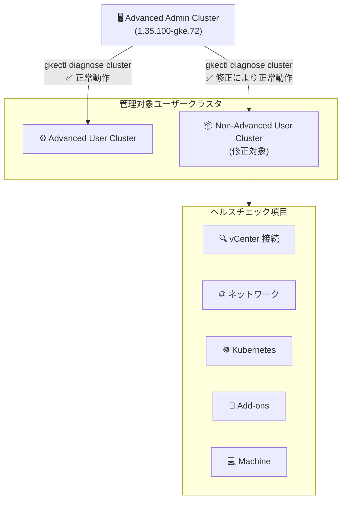

# Google Distributed Cloud (software only): バージョン 1.35.100-gke.72 リリース (VMware / Bare Metal)

**リリース日**: 2026-05-21

**サービス**: Google Distributed Cloud (software only) for VMware / Bare Metal

**機能**: バージョン 1.35.100-gke.72 パッチリリース - クラスタヘルスチェック修正およびセキュリティ脆弱性修正

**ステータス**: Announcement / Fixed

📊 [このアップデートのインフォグラフィックを見る](https://takech9203.github.io/google-cloud-news-summary/20260521-google-distributed-cloud-1-35-100.html)

## 概要

Google Distributed Cloud (software only) for VMware および Bare Metal のバージョン 1.35.100-gke.72 がダウンロード可能になった。本リリースは Kubernetes v1.35.3-gke.400 上で動作し、重要なバグ修正とセキュリティ脆弱性修正を含むパッチリリースである。

VMware 版では、Advanced Admin クラスタが管理する Non-Advanced ユーザークラスタに対して `gkectl diagnose cluster` コマンドでヘルスチェックや診断を実行できない問題が修正された。これは、Advanced クラスタと Non-Advanced クラスタが混在する環境において運用上重要な修正である。

Bare Metal 版では、脆弱性修正が含まれており、セキュリティパッチの適用が推奨される。両プラットフォームとも、リリース後約 7〜14 日で GKE On-Prem API クライアント (Google Cloud コンソール、gcloud CLI、Terraform) から利用可能になる。

**アップデート前の課題**

- Advanced Admin クラスタから管理される Non-Advanced ユーザークラスタに対して `gkectl diagnose cluster` を実行するとエラーが発生し、クラスタの健全性確認ができなかった
- 管理者はクラスタのヘルスチェックや診断情報の取得に代替手段を用いる必要があり、運用効率が低下していた
- セキュリティ脆弱性が存在し、攻撃面が残っていた

**アップデート後の改善**

- Advanced Admin クラスタから Non-Advanced ユーザークラスタへのヘルスチェック・診断が正常に動作するようになった
- `gkectl diagnose cluster` による統一的なクラスタ監視・トラブルシューティングが復旧した
- 既知のセキュリティ脆弱性が修正され、クラスタのセキュリティ態勢が強化された

## アーキテクチャ図



Advanced Admin クラスタが Non-Advanced ユーザークラスタを管理する混在環境において、`gkectl diagnose cluster` コマンドによるヘルスチェックフローが修正され、全てのユーザークラスタに対する診断が可能になった。

## サービスアップデートの詳細

### 主要機能

1. **クラスタヘルスチェック修正 (VMware)**
   - Advanced Admin クラスタから Non-Advanced ユーザークラスタへの `gkectl diagnose cluster` 実行が正常に動作するよう修正
   - クラスタの健全性確認 (vCenter、ネットワーク、Kubernetes、Add-ons、Machine) が完全に機能するよう復旧
   - `gkectl diagnose snapshot` による診断スナップショット取得も同様に修正

2. **セキュリティ脆弱性修正 (VMware / Bare Metal)**
   - Vulnerability fixes に記載された脆弱性が修正
   - セキュリティパッチの迅速な適用が推奨される

3. **Kubernetes バージョン更新**
   - 基盤となる Kubernetes バージョンが v1.35.3-gke.400 に更新
   - 前バージョン (1.35.0-gke.525) の Kubernetes v1.35.2-gke.300 からのパッチ更新

## 技術仕様

### リリースバージョン情報

| 項目 | 詳細 |
|------|------|
| Google Distributed Cloud バージョン | 1.35.100-gke.72 |
| Kubernetes バージョン | v1.35.3-gke.400 |
| 対象プラットフォーム | VMware / Bare Metal |
| 前バージョン | 1.35.0-gke.525 (Kubernetes v1.35.2-gke.300) |
| cgroup 要件 | cgroupsv2 必須 (cgroupsv1 非サポート) |
| containerd バージョン | 2.1 |

### Advanced クラスタとの関係

| バージョン | Advanced クラスタの状態 |
|-----------|----------------------|
| 1.31 | Preview (オプトイン) |
| 1.32 | GA (デフォルト有効、無効化可能) |
| 1.33 | 全新規クラスタで必須 |
| 1.34 | Non-Advanced からの自動変換 |
| 1.35 | Advanced クラスタが標準 |

### gkectl diagnose cluster の確認項目

```bash
# ユーザークラスタの診断実行
gkectl diagnose cluster \
  --kubeconfig=ADMIN_CLUSTER_KUBECONFIG \
  --cluster-name=USER_CLUSTER_NAME

# 設定ファイル指定による詳細診断
gkectl diagnose cluster \
  --kubeconfig=ADMIN_CLUSTER_KUBECONFIG \
  --config=USER_CLUSTER_CONFIG
```

## 設定方法

### 前提条件

1. 管理者ワークステーションに gkectl 1.35.100-gke.72 がインストールされていること
2. Admin クラスタの kubeconfig ファイルへのアクセスが可能であること
3. cgroupsv2 が有効な OS イメージを使用していること

### 手順

#### ステップ 1: バージョンのダウンロード

```bash
# gkectl のアップグレード (VMware)
# ダウンロードページから 1.35.100-gke.72 を取得
gsutil cp gs://gke-on-prem-release/gkectl/1.35.100-gke.72/gkectl ./
chmod +x gkectl
```

#### ステップ 2: クラスタのアップグレード (VMware)

```bash
# Admin クラスタのアップグレード
gkectl upgrade admin \
  --kubeconfig=ADMIN_CLUSTER_KUBECONFIG \
  --config=ADMIN_CLUSTER_CONFIG

# User クラスタのアップグレード
gkectl upgrade cluster \
  --kubeconfig=ADMIN_CLUSTER_KUBECONFIG \
  --config=USER_CLUSTER_CONFIG
```

#### ステップ 3: クラスタのアップグレード (Bare Metal)

```bash
# bmctl のアップグレード
# ダウンロードページから 1.35.100-gke.72 を取得

# クラスタのアップグレード
bmctl upgrade cluster \
  --cluster=CLUSTER_NAME \
  --kubeconfig=ADMIN_KUBECONFIG
```

#### ステップ 4: ヘルスチェックの実行確認

```bash
# VMware: 修正後のヘルスチェック確認
gkectl diagnose cluster \
  --kubeconfig=ADMIN_CLUSTER_KUBECONFIG \
  --cluster-name=USER_CLUSTER_NAME

# Bare Metal: ヘルスチェック確認
bmctl check cluster \
  --cluster=CLUSTER_NAME \
  --kubeconfig=ADMIN_KUBECONFIG
```

## メリット

### ビジネス面

- **運用効率の回復**: 管理者が全てのユーザークラスタに対して統一的な診断コマンドを使用可能になり、トラブルシューティングの時間が短縮される
- **セキュリティ態勢の強化**: 既知の脆弱性が修正され、コンプライアンス要件への適合が容易になる

### 技術面

- **混在環境のサポート改善**: Advanced Admin クラスタと Non-Advanced ユーザークラスタの組み合わせにおける互換性問題が解消された
- **Kubernetes パッチ適用**: v1.35.3-gke.400 への更新により、基盤レイヤーの安定性とセキュリティが向上
- **診断能力の完全復旧**: vCenter、ネットワーク、Kubernetes コンポーネント、Add-ons、Machine レベルの全チェックが Non-Advanced クラスタでも実行可能に

## デメリット・制約事項

### 制限事項

- リリース後約 7〜14 日間は GKE On-Prem API クライアント (Google Cloud コンソール、gcloud CLI、Terraform) から利用不可
- cgroupsv2 が必須であり、cgroupsv1 環境ではアップグレード不可
- サードパーティストレージベンダーを使用している場合、GDC Ready ストレージパートナーのドキュメントで互換性を確認する必要がある

### 考慮すべき点

- Non-Advanced クラスタは将来的に Advanced クラスタへの移行が必須となるため、計画的な移行を検討すべき
- Bare Metal 環境では Ansible 2.18 が使用されるため、ターゲットノードに Python 3.9 が必要 (RHEL 8.10 以降)
- Ubuntu 使用時は 24.04 へのアップグレードが含まれるため、アプリケーションの互換性を事前に確認すること

## ユースケース

### ユースケース 1: マルチテナントオンプレミス環境での診断

**シナリオ**: 企業が Advanced Admin クラスタで複数のユーザークラスタ (一部は Non-Advanced) を管理しており、定期的なヘルスチェックを自動化している環境

**実装例**:
```bash
#!/bin/bash
# 全ユーザークラスタの定期診断スクリプト
ADMIN_KUBECONFIG="/path/to/admin-kubeconfig"

for cluster in $(gkectl list clusters --kubeconfig=$ADMIN_KUBECONFIG -o name); do
  echo "Diagnosing cluster: $cluster"
  gkectl diagnose cluster \
    --kubeconfig=$ADMIN_KUBECONFIG \
    --cluster-name=$cluster
done
```

**効果**: アップグレード後、Non-Advanced ユーザークラスタを含む全クラスタの診断が正常に実行され、インシデント検知の網羅性が回復する

### ユースケース 2: セキュリティコンプライアンス対応

**シナリオ**: 金融・医療等の規制環境でオンプレミス Kubernetes クラスタを運用しており、脆弱性パッチの迅速な適用が求められる

**効果**: Vulnerability fixes に記載された脆弱性が修正され、セキュリティ監査への対応が容易になる

## 料金

Google Distributed Cloud (software only) の料金は Google Kubernetes Engine (GKE) Enterprise エディションのライセンスに含まれる。詳細は公式料金ページを参照。

- [GKE Enterprise 料金](https://cloud.google.com/kubernetes-engine/enterprise/pricing)

## 利用可能リージョン

Google Distributed Cloud (software only) はオンプレミスまたはお客様管理のインフラストラクチャ上で動作するため、リージョンの制限はない。Fleet 登録先の Google Cloud リージョンについては、Regional fleet membership のドキュメントを参照。

## 関連サービス・機能

- **GKE Enterprise**: Google Distributed Cloud の上位サービスであり、Fleet 管理、Policy Controller、Config Sync 等のマルチクラスタ管理機能を提供
- **Cloud Logging / Cloud Monitoring**: ヘルスチェックログは Cloud Logging に送信され、Logs Explorer で確認可能
- **Binary Authorization**: Advanced クラスタの Controlplane V2 で BinAuthz ポリシーを適用可能
- **Anthos Config Management**: クラスタ間の設定同期とポリシー管理に使用

## 参考リンク

- 📊 [インフォグラフィック](https://takech9203.github.io/google-cloud-news-summary/20260521-google-distributed-cloud-1-35-100.html)
- [公式リリースノート](https://cloud.google.com/release-notes#May_21_2026)
- [VMware アップグレードガイド](https://docs.cloud.google.com/kubernetes-engine/distributed-cloud/vmware/docs/how-to/upgrading)
- [Bare Metal アップグレードガイド](https://docs.cloud.google.com/kubernetes-engine/distributed-cloud/bare-metal/docs/how-to/upgrade)
- [VMware クラスタ診断](https://docs.cloud.google.com/kubernetes-engine/distributed-cloud/vmware/docs/troubleshooting/diagnose)
- [Bare Metal ヘルスチェック](https://docs.cloud.google.com/kubernetes-engine/distributed-cloud/bare-metal/docs/troubleshooting/healthchecks)
- [Advanced クラスタの概要](https://docs.cloud.google.com/kubernetes-engine/distributed-cloud/vmware/docs/concepts/advanced-clusters)
- [VMware 脆弱性修正](https://docs.cloud.google.com/kubernetes-engine/distributed-cloud/vmware/docs/vulnerabilities)
- [Bare Metal 脆弱性修正](https://docs.cloud.google.com/kubernetes-engine/distributed-cloud/bare-metal/docs/vulnerabilities)
- [GKE Enterprise 料金](https://cloud.google.com/kubernetes-engine/enterprise/pricing)

## まとめ

Google Distributed Cloud (software only) 1.35.100-gke.72 は、Advanced Admin クラスタと Non-Advanced ユーザークラスタが混在する VMware 環境での診断コマンドの重要なバグ修正を含むパッチリリースである。特にマルチクラスタ環境を運用している管理者は、運用監視能力の完全復旧とセキュリティ脆弱性修正のために、計画的なアップグレードを推奨する。

---

**タグ**: #GoogleDistributedCloud #GDC #VMware #BareMetal #Kubernetes #gkectl #HealthCheck #SecurityPatch #OnPremise #GKEEnterprise
