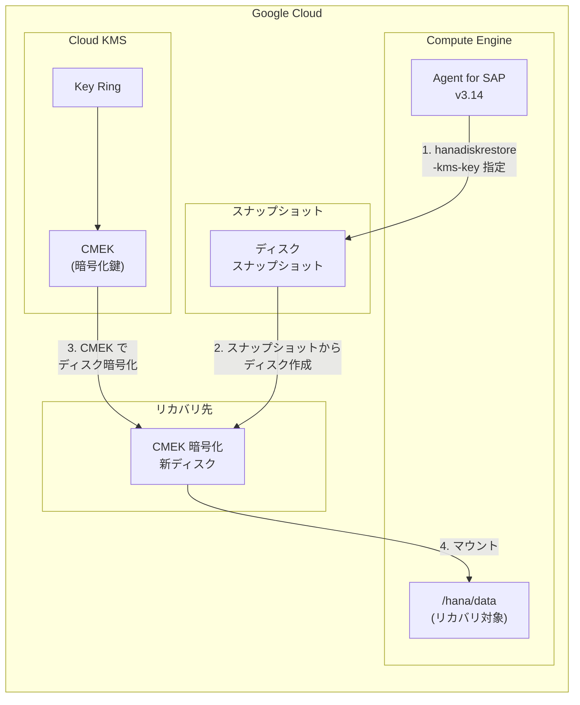

# SAP on Google Cloud: Agent for SAP バージョン 3.14 GA - CMEK によるディスクスナップショットリカバリ暗号化サポート

**リリース日**: 2026-05-21

**サービス**: SAP on Google Cloud

**機能**: Google Cloud's Agent for SAP バージョン 3.14 - CMEK ディスク暗号化サポート

**ステータス**: GA (一般提供)

📊 [このアップデートのインフォグラフィックを見る](https://takech9203.github.io/google-cloud-news-summary/20260521-sap-agent-v3-14-cmek.html)

## 概要

Google Cloud's Agent for SAP のバージョン 3.14 が一般提供 (GA) となりました。本バージョンの最大の新機能は、ディスクスナップショットベースの SAP HANA リカバリ時に、顧客管理暗号化鍵 (CMEK: Customer-Managed Encryption Key) を使用してリカバリ先ディスクを暗号化する機能です。これにより、SAP HANA データベースのバックアップ・リカバリ運用において、より厳格なデータセキュリティとコンプライアンス要件を満たすことが可能になります。

加えて、本バージョンではロギングおよび安定性の向上、軽微なバグ修正も含まれています。SAP ワークロードを Google Cloud 上で運用する企業、特に金融機関や医療機関など厳格なデータ暗号化ポリシーが求められる組織にとって重要なアップデートです。

Cloud KMS と統合された CMEK サポートにより、リカバリ時に作成される新しいディスクを自組織で管理する暗号化鍵で保護でき、鍵のライフサイクル管理 (ローテーション、無効化、削除) を完全にコントロールできるようになります。

**アップデート前の課題**

- ディスクスナップショットベースの SAP HANA リカバリ時、リカバリ先ディスクの暗号化は Google デフォルト暗号化または CSEK (顧客提供暗号化鍵) に限られており、Cloud KMS 統合の CMEK を直接指定する手段がなかった
- コンプライアンス要件で CMEK を必須とする環境では、リカバリ後に別途ディスクの暗号化鍵を変更する追加作業が必要だった
- リカバリワークフロー全体で暗号化ポリシーを一貫して適用することが困難だった

**アップデート後の改善**

- `hanadiskrestore` コマンドで CMEK を指定可能になり、リカバリ時に作成される新しいディスクを直接 Cloud KMS 鍵で暗号化できるようになった
- バックアップからリカバリまで一貫した CMEK ベースの暗号化ポリシーを適用可能になった
- 金融・医療などの規制産業でのコンプライアンス要件をリカバリ運用においても自動的に満たせるようになった

## アーキテクチャ図



本図は、Agent for SAP v3.14 が `hanadiskrestore` コマンド実行時に Cloud KMS の CMEK を使用してリカバリ先ディスクを暗号化するフローを示しています。スナップショットから新しいディスクが作成される際に、指定された CMEK で暗号化が適用されます。

## サービスアップデートの詳細

### 主要機能

1. **CMEK によるディスクスナップショットリカバリの暗号化**
   - ディスクスナップショットベースの SAP HANA リカバリ時に、Cloud KMS の顧客管理暗号化鍵 (CMEK) を指定してリカバリ先ディスクを暗号化可能
   - `hanadiskrestore` コマンドに新しい引数が追加され、Cloud KMS 鍵リソース名を指定できる
   - スケールアップおよびスケールアウト構成の両方で利用可能

2. **ロギングの向上**
   - バックアップ・リカバリ操作に関するログメッセージの改善
   - デバッグおよびトラブルシューティング時の情報が充実
   - `/var/log/google-cloud-sap-agent/` 配下のログファイルの出力精度が向上

3. **安定性の強化と軽微なバグ修正**
   - エージェント操作全般の安定性向上
   - 以前のバージョンで報告された軽微な問題の修正

## 技術仕様

### CMEK 暗号化パラメータ

| 項目 | 詳細 |
|------|------|
| 対象コマンド | `hanadiskrestore` |
| 暗号化方式 | Cloud KMS CMEK (AES-256) |
| 鍵リソース形式 | `projects/{PROJECT}/locations/{LOCATION}/keyRings/{KEY_RING}/cryptoKeys/{KEY}` |
| 対応ディスクタイプ | SSD Persistent Disk、Hyperdisk |
| サポートバージョン | v3.14 以降 |
| 既存の暗号化オプション | CSEK (`-csek-key-file` 引数、v3.2 以降) |

### Cloud KMS 鍵の要件

| 項目 | 詳細 |
|------|------|
| 鍵の目的 | ENCRYPT_DECRYPT |
| 鍵の保護レベル | SOFTWARE または HSM |
| 必要な IAM ロール | `roles/cloudkms.cryptoKeyEncrypterDecrypter` |
| ロールの付与先 | Compute Engine サービスエージェント |

### 必要な IAM 権限

```json
{
  "requiredPermissions": [
    "compute.disks.create",
    "compute.disks.delete",
    "compute.snapshots.useReadOnly",
    "compute.instances.attachDisk",
    "compute.instances.detachDisk",
    "cloudkms.cryptoKeyVersions.useToEncrypt",
    "cloudkms.cryptoKeyVersions.useToDecrypt"
  ]
}
```

## 設定方法

### 前提条件

1. Google Cloud's Agent for SAP バージョン 3.14 がインストールされていること
2. Cloud KMS に暗号化鍵 (CMEK) が作成済みであること
3. Compute Engine サービスエージェントに Cloud KMS の暗号化/復号権限が付与されていること
4. ディスクスナップショットベースのバックアップが取得済みであること

### 手順

#### ステップ 1: Cloud KMS 鍵の作成

```bash
# キーリングの作成
gcloud kms keyrings create sap-hana-keyring \
  --location=asia-northeast1

# 暗号化鍵の作成
gcloud kms keys create sap-hana-recovery-key \
  --location=asia-northeast1 \
  --keyring=sap-hana-keyring \
  --purpose=encryption
```

SAP HANA が稼働するリージョンと同じロケーションに鍵を作成することを推奨します。

#### ステップ 2: サービスエージェントへの権限付与

```bash
# Compute Engine サービスエージェントに Cloud KMS 暗号化/復号権限を付与
gcloud kms keys add-iam-policy-binding sap-hana-recovery-key \
  --location=asia-northeast1 \
  --keyring=sap-hana-keyring \
  --member="serviceAccount:service-PROJECT_NUMBER@compute-system.iam.gserviceaccount.com" \
  --role="roles/cloudkms.cryptoKeyEncrypterDecrypter"
```

Compute Engine サービスエージェントが CMEK を使用してディスクを暗号化できるようにします。

#### ステップ 3: CMEK を指定したリカバリの実行

```bash
# CMEK を指定してディスクスナップショットからリカバリを実行
sudo /usr/bin/google_cloud_sap_agent hanadiskrestore \
  -sid=HDB \
  -source-snapshot=hana-hdb-snapshot-20260521 \
  -new-disk-name=hana-data-recovered \
  -kms-key=projects/my-project/locations/asia-northeast1/keyRings/sap-hana-keyring/cryptoKeys/sap-hana-recovery-key
```

リカバリ先ディスクが指定した CMEK で暗号化されて作成されます。

## メリット

### ビジネス面

- **コンプライアンス対応の強化**: 金融規制 (FISC)、医療規制 (HIPAA) などで要求される暗号化鍵の自己管理要件をリカバリ運用でも自動的に満たせる
- **運用効率の向上**: リカバリ後の追加暗号化作業が不要になり、RTO (目標復旧時間) の短縮に貢献
- **監査対応の簡素化**: Cloud KMS の監査ログにより暗号化鍵の使用履歴を一元管理でき、監査証跡の確保が容易

### 技術面

- **エンドツーエンドの暗号化一貫性**: バックアップ取得からリカバリまで、CMEK による暗号化ポリシーを自動的かつ一貫して適用可能
- **鍵ライフサイクル管理**: Cloud KMS による鍵のローテーション、無効化、バージョン管理を活用し、暗号化鍵の安全な運用が可能
- **統合ワークフロー**: 既存の `hanadiskrestore` コマンドに引数を追加するだけで利用でき、運用スクリプトへの組み込みが容易

## デメリット・制約事項

### 制限事項

- CMEK で暗号化されたスナップショットからのリカバリでは、元のスナップショット作成時と同じ鍵、または新しい CMEK を指定する必要がある
- Cloud KMS の鍵が無効化・削除された場合、対象ディスクへのアクセスが不可能になるため、鍵のライフサイクル管理に十分な注意が必要
- IaC (Terraform 等) でデプロイされた SAP HANA システムでは、エージェントによる直接リカバリに制限がある (状態管理の競合が発生する可能性)
- SAP HANA スケールアウトのホスト自動フェイルオーバー構成では、ディスクスナップショット機能自体がサポートされない

### 考慮すべき点

- Cloud KMS の利用に伴う追加コスト (鍵の管理費用、暗号化/復号操作の API コール費用)
- CMEK の鍵ローテーション実施時は、新規リカバリ時に最新の鍵バージョンが使用される点に留意
- クロスリージョンリカバリを行う場合、リカバリ先リージョンで利用可能な Cloud KMS 鍵を別途準備する必要がある

## ユースケース

### ユースケース 1: 金融機関における SAP HANA 災害復旧

**シナリオ**: 金融機関が SAP S/4HANA を Google Cloud 上で運用しており、FISC 安全対策基準に基づき、保存データの暗号化鍵を自社管理する必要がある。定期的なディスクスナップショットバックアップを取得し、DR サイトへのリカバリ時にも同一の暗号化ポリシーを適用したい。

**実装例**:
```bash
# バックアップ取得 (プライマリサイト)
sudo /usr/bin/google_cloud_sap_agent hanadiskbackup \
  -sid=PRD \
  -hana-db-user=SYSTEM \
  -password-secret=sap-hana-password \
  -labels="env=production,backup-type=scheduled"

# リカバリ実行 (CMEK 暗号化指定)
sudo /usr/bin/google_cloud_sap_agent hanadiskrestore \
  -sid=PRD \
  -source-snapshot=hana-prd-snapshot-20260521 \
  -new-disk-name=hana-data-dr-recovery \
  -kms-key=projects/my-project/locations/asia-northeast1/keyRings/sap-prod-keyring/cryptoKeys/sap-hana-cmek
```

**効果**: DR リカバリ時にも自動的に CMEK 暗号化が適用され、FISC 安全対策基準への準拠を維持したまま迅速な復旧が可能

### ユースケース 2: マルチテナント環境でのテナント分離

**シナリオ**: マネージドサービスプロバイダーが複数のテナント向けに SAP HANA を運用しており、テナントごとに異なる暗号化鍵を使用してデータを分離管理する必要がある。リカバリ時にもテナント固有の CMEK を適用し、データの論理的分離を保証したい。

**効果**: テナントごとの Cloud KMS 鍵を `hanadiskrestore` コマンドで指定することで、リカバリ後もテナント間のデータ分離が暗号化レベルで維持される

## 料金

Agent for SAP 自体の利用は無料です。CMEK の使用に関連する費用は Cloud KMS の料金に基づきます。

### 料金例

| 項目 | 月額料金 (概算) |
|------|-----------------|
| Cloud KMS 鍵 (ソフトウェア保護) | $0.06/鍵バージョン/月 |
| Cloud KMS 鍵 (HSM 保護) | $1.00/鍵バージョン/月 |
| 暗号化/復号操作 | $0.03/10,000 操作 |
| ディスクスナップショット保存 | 使用量に応じた Compute Engine ストレージ料金 |

## 関連サービス・機能

- **Cloud KMS**: 顧客管理暗号化鍵のライフサイクル管理、鍵のローテーション・監査を担当
- **Compute Engine ディスクスナップショット**: SAP HANA データボリュームのバックアップ・リカバリの基盤
- **Cloud Storage Backint**: Agent for SAP のもう一つのバックアップ方式 (Cloud Storage への直接バックアップ)
- **Workload Manager**: SAP ワークロードのベストプラクティス評価と監視
- **Cloud Monitoring**: バックアップ・リカバリ操作のメトリクス収集と監視

## 参考リンク

- 📊 [インフォグラフィック](https://takech9203.github.io/google-cloud-news-summary/20260521-sap-agent-v3-14-cmek.html)
- [公式リリースノート](https://cloud.google.com/release-notes#May_21_2026)
- [Agent for SAP - What's New](https://cloud.google.com/sap/docs/agent-for-sap/whats-new)
- [ディスクスナップショットによるバックアップとリカバリ](https://cloud.google.com/sap/docs/agent-for-sap/latest/disk-snapshot-backup-recovery)
- [Cloud KMS - 顧客管理暗号化鍵](https://cloud.google.com/kms/docs/cmek)
- [Compute Engine ディスクの CMEK 暗号化](https://cloud.google.com/compute/docs/disks/customer-managed-encryption)

## まとめ

Google Cloud's Agent for SAP バージョン 3.14 は、ディスクスナップショットリカバリにおける CMEK サポートを追加し、SAP HANA のバックアップ・リカバリ運用全体で一貫した暗号化ポリシーの適用を実現しました。SAP ワークロードを Google Cloud 上で運用する企業は、早期にバージョン 3.14 へのアップグレードを検討し、特にコンプライアンス要件が厳格な環境では CMEK を活用したリカバリワークフローの導入を推奨します。

---

**タグ**: #SAP #GoogleCloud #AgentForSAP #CMEK #CloudKMS #暗号化 #ディスクスナップショット #SAPHANA #リカバリ #セキュリティ #GA
