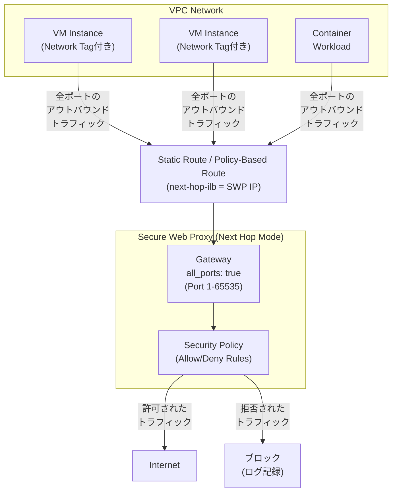

# Secure Web Proxy: ネクストホップモードでの全ポートリスニング機能

**リリース日**: 2026-05-21

**サービス**: Secure Web Proxy

**機能**: ネクストホップデプロイ時の全ポート (1-65535) リスニング

**ステータス**: Preview

📊 [このアップデートのインフォグラフィックを見る](https://takech9203.github.io/google-cloud-news-summary/20260521-secure-web-proxy-all-ports-next-hop.html)

## 概要

Google Cloud の Secure Web Proxy に、ネクストホップモードでデプロイする際にゲートウェイを全ポート (1 から 65535) でリスニングさせる新機能が Preview として追加されました。この機能により、プロキシがすべてのアウトバウンドトラフィックを自動的にインターセプトし、セキュリティポリシーとルールを適用できるようになります。

従来の Secure Web Proxy のネクストホップモードでは、リスニング対象のポートを個別に指定する必要がありましたが、本機能により `all_ports: true` を設定するだけで全ポートのトラフィックを一括してインターセプトできます。これは動的な環境や複数のポートを使用するサービスに特に有効であり、ポートリストの管理負荷を大幅に軽減します。

本機能の対象ユーザーは、Secure Web Proxy をネクストホップモードで利用しているネットワークセキュリティ管理者やクラウドインフラストラクチャチームです。特に、多数のポートを使用するマイクロサービスアーキテクチャや、ポート番号が動的に変化するワークロードを運用している組織に大きなメリットがあります。

**アップデート前の課題**

- ネクストホップモードで Secure Web Proxy を利用する際、リスニング対象のポートを `ports` フィールドに個別に列挙する必要があった
- 動的にポートを使用するサービスでは、新しいポートが追加されるたびに設定を更新する必要があった
- ポートリストの管理が煩雑になり、設定漏れによるセキュリティギャップが発生するリスクがあった

**アップデート後の改善**

- `all_ports: true` を設定するだけで、ポート 1 から 65535 までの全ポートを自動的にインターセプト可能になった
- ポートリストの個別管理が不要になり、運用負荷が大幅に軽減された
- すべてのアウトバウンドトラフィックに対してセキュリティポリシーを漏れなく適用できるようになった

## アーキテクチャ図



Secure Web Proxy がネクストホップとして機能し、VPC 内のすべてのワークロードからのアウトバウンドトラフィックを全ポートでインターセプトする構成を示しています。ルーティング設定により、トラフィックは自動的に Secure Web Proxy に転送され、セキュリティポリシーに基づいて許可またはブロックされます。

## サービスアップデートの詳細

### 主要機能

1. **全ポートリスニング (`all_ports: true`)**
   - ゲートウェイ設定で `all_ports: true` を指定することで、ポート 1 から 65535 までの全ポートを一括でリスニング
   - `ports` フィールドとの同時指定は不可 (排他的な設定)
   - `routingMode: NEXT_HOP_ROUTING_MODE` との組み合わせでのみ使用可能

2. **透過的トラフィックインターセプト**
   - ワークロード側での設定変更が不要
   - ネットワークルーティングにより自動的にトラフィックを Secure Web Proxy に転送
   - HTTP(S) および TCP プロキシトラフィックをサポート

3. **セキュリティポリシーの一括適用**
   - すべてのアウトバウンドトラフィックに対してセキュリティルールを適用
   - ソース (Secure Tag、サービスアカウント、IP アドレス) に基づくアクセス制御
   - 宛先 (ホスト名、URL) に基づくフィルタリング

## 技術仕様

### ゲートウェイ設定パラメータ

| 項目 | 詳細 |
|------|------|
| 設定フィールド | `all_ports: true` |
| 対応ポート範囲 | 1 - 65535 |
| 必須条件 | `routingMode: NEXT_HOP_ROUTING_MODE` |
| ゲートウェイタイプ | `SECURE_WEB_GATEWAY` のみ |
| サポートプロトコル | HTTP(S)、TCP プロキシ |
| ステータス | Preview |

### ゲートウェイ設定例

```yaml
name: projects/PROJECT_ID/locations/REGION/gateways/swp1
type: SECURE_WEB_GATEWAY
addresses: ["IP_ADDRESS"]
all_ports: true
gatewaySecurityPolicy: projects/PROJECT_ID/locations/REGION/gatewaySecurityPolicies/policy1
network: projects/PROJECT_ID/global/networks/NETWORK
subnetwork: projects/PROJECT_ID/regions/REGION/subnetworks/SUBNETWORK
routingMode: NEXT_HOP_ROUTING_MODE
```

## 設定方法

### 前提条件

1. Google Cloud プロジェクトで Network Services API が有効化されていること
2. 適切な IAM 権限 (Network Admin ロールなど) を持つアカウントでログインしていること
3. Secure Web Proxy のセキュリティポリシーとルールが作成済みであること
4. デプロイ先の VPC ネットワークとサブネットワークが準備されていること

### 手順

#### ステップ 1: ゲートウェイ設定ファイルの作成

```yaml
# gateway.yaml
name: projects/PROJECT_ID/locations/REGION/gateways/swp1
type: SECURE_WEB_GATEWAY
addresses: ["10.0.0.100"]
all_ports: true
gatewaySecurityPolicy: projects/PROJECT_ID/locations/REGION/gatewaySecurityPolicies/policy1
network: projects/PROJECT_ID/global/networks/my-network
subnetwork: projects/PROJECT_ID/regions/REGION/subnetworks/my-subnet
routingMode: NEXT_HOP_ROUTING_MODE
```

`all_ports: true` を指定し、`ports` フィールドは記載しないでください。両方を同時に指定することはできません。

#### ステップ 2: Secure Web Proxy インスタンスのデプロイ

```bash
gcloud network-services gateways import swp1 \
  --source=gateway.yaml \
  --location=REGION
```

デプロイには数分かかる場合があります。

#### ステップ 3: ルーティングの設定 (静的ルート)

```bash
gcloud compute routes create swp-route \
  --network=my-network \
  --next-hop-ilb=10.0.0.100 \
  --destination-range=0.0.0.0/0 \
  --priority=900 \
  --tags=use-swp \
  --project=PROJECT_ID
```

#### ステップ 4: ワークロード VM へのネットワークタグの付与

```bash
gcloud compute instances create workload-vm \
  --subnet=my-subnet \
  --zone=ZONE \
  --image-project=debian-cloud \
  --image-family=debian-12 \
  --tags=use-swp
```

## メリット

### ビジネス面

- **運用コストの削減**: ポートリストの継続的な管理・更新が不要になり、ネットワーク管理者の運用負荷が大幅に軽減される
- **セキュリティガバナンスの強化**: すべてのアウトバウンドトラフィックを漏れなく検査することで、コンプライアンス要件への対応が容易になる
- **迅速なサービス展開**: 新しいサービスやポートの追加時にプロキシ設定を変更する必要がなく、アプリケーションのデプロイ速度が向上する

### 技術面

- **設定のシンプル化**: `all_ports: true` の一行で全ポートのインターセプトが完了し、設定ミスのリスクが低減
- **ゼロトラストアーキテクチャの実現**: デフォルト deny-all ポリシーと組み合わせることで、すべてのアウトバウンド通信を制御可能
- **動的環境への対応**: マイクロサービスやコンテナワークロードなど、使用ポートが動的に変化する環境に最適

## デメリット・制約事項

### 制限事項

- Preview ステータスであるため、本番環境での使用は SLA の対象外
- `all_ports: true` と `ports` フィールドの同時指定は不可
- 同一ネットワーク・リージョン内で、`all_ports: true` のインスタンスと他のモードのインスタンスを同時にデプロイできない
- ネクストホップモードでは HTTP(S) および TCP プロキシトラフィックのみサポート (その他のトラフィックは通知なくドロップされる)
- 1 つの VPC ネットワークの 1 リージョンにつき、ネクストホップモードの Secure Web Proxy インスタンスは 1 つのみデプロイ可能
- IPv6 はサポートされていない (IPv4 のみ)

### 考慮すべき点

- VM のバックグラウンドトラフィック (OS アップデートなど) もルーティング対象となるため、適切なポリシールールの設定が必要
- クロスリージョントラフィックはドロップされるため、Secure Web Proxy インスタンスと同じリージョンにクライアントを配置する必要がある
- 全ポートをインターセプトするため、トラフィック量に応じてデータ処理課金が増加する可能性がある

## ユースケース

### ユースケース 1: マイクロサービス環境のエグレスセキュリティ

**シナリオ**: GKE 上で稼働する多数のマイクロサービスが、外部 API やサードパーティサービスに対して様々なポートでアウトバウンド通信を行っている。サービスごとに使用ポートが異なり、新しいサービスの追加も頻繁に発生する。

**実装例**:
```yaml
# gateway.yaml - 全ポートインターセプト設定
name: projects/my-project/locations/us-central1/gateways/swp-microservices
type: SECURE_WEB_GATEWAY
addresses: ["10.128.0.50"]
all_ports: true
gatewaySecurityPolicy: projects/my-project/locations/us-central1/gatewaySecurityPolicies/microservices-policy
network: projects/my-project/global/networks/production-vpc
subnetwork: projects/my-project/regions/us-central1/subnetworks/gke-subnet
routingMode: NEXT_HOP_ROUTING_MODE
```

**効果**: ポートリストの管理が不要になり、新しいマイクロサービスの追加時もプロキシ設定の変更なしにセキュリティポリシーが自動適用される。

### ユースケース 2: コンプライアンス要件への対応

**シナリオ**: 金融機関のクラウド環境において、規制要件により全てのアウトバウンドトラフィックの監査ログを取得し、未承認の外部通信を検知・ブロックする必要がある。

**効果**: 全ポートでのトラフィックインターセプトにより、ポートの設定漏れによるセキュリティギャップを排除し、監査対象外の通信が発生しないことを保証できる。Cloud Audit Logs との統合により、すべてのアウトバウンドアクセスの完全な監査証跡が自動的に記録される。

## 料金

Secure Web Proxy の課金は以下の 2 つのメトリクスに基づきます。

| 課金項目 | 単位 | 説明 |
|----------|------|------|
| データ処理量 | GB あたり | Secure Web Proxy が処理したデータ量に基づく従量課金 |
| インスタンス稼働時間 | 時間あたり | 作成・稼働中の Secure Web Proxy インスタンスごとの時間課金 |

**注意**: `all_ports: true` を使用すると、従来個別ポート指定時にはインターセプトされなかったトラフィックも処理対象となるため、データ処理量に基づく課金が増加する可能性があります。詳細な料金については [Secure Web Proxy の料金ページ](https://cloud.google.com/secure-web-proxy/pricing) を参照してください。

## 利用可能リージョン

Secure Web Proxy はリージョナルサービスです。`all_ports` 機能は、Secure Web Proxy のネクストホップモードが利用可能なすべてのリージョンで Preview として利用できます。具体的な対応リージョンについては、[公式ドキュメント](https://cloud.google.com/secure-web-proxy/docs/overview) を参照してください。

## 関連サービス・機能

- **Cloud NAT**: Secure Web Proxy で許可されたトラフィックのインターネットへの送信に使用
- **VPC ルーティング (静的ルート / ポリシーベースルート)**: トラフィックを Secure Web Proxy ネクストホップに転送するためのルーティング設定
- **Cloud Audit Logs**: Secure Web Proxy を通過するすべてのトラフィックの監査ログを記録
- **Certificate Authority Service (CAS)**: TLS インスペクション機能で使用される証明書の生成・管理
- **Cloud Armor**: Secure Web Proxy と併用してインバウンド/アウトバウンド双方のセキュリティを強化

## 参考リンク

- 📊 [インフォグラフィック](https://takech9203.github.io/google-cloud-news-summary/20260521-secure-web-proxy-all-ports-next-hop.html)
- [公式リリースノート](https://cloud.google.com/release-notes#May_21_2026)
- [Secure Web Proxy ドキュメント - ネクストホップデプロイ](https://cloud.google.com/secure-web-proxy/docs/deploy-next-hop)
- [Secure Web Proxy 概要](https://cloud.google.com/secure-web-proxy/docs/overview)
- [料金ページ](https://cloud.google.com/secure-web-proxy/pricing)

## まとめ

Secure Web Proxy のネクストホップモードにおける全ポートリスニング機能は、アウトバウンドトラフィックのセキュリティ管理を大幅にシンプル化する重要なアップデートです。特に動的なポート使用が発生するマイクロサービス環境やコンテナワークロードにおいて、ポートリスト管理の運用負荷を排除しながら包括的なセキュリティポリシーの適用を実現します。現在 Preview ステータスのため、まずは開発・検証環境で評価を開始し、GA リリース後に本番環境への適用を計画することを推奨します。

---

**タグ**: #SecureWebProxy #NetworkSecurity #Egress #NextHop #AllPorts #Preview #ZeroTrust #VPC
