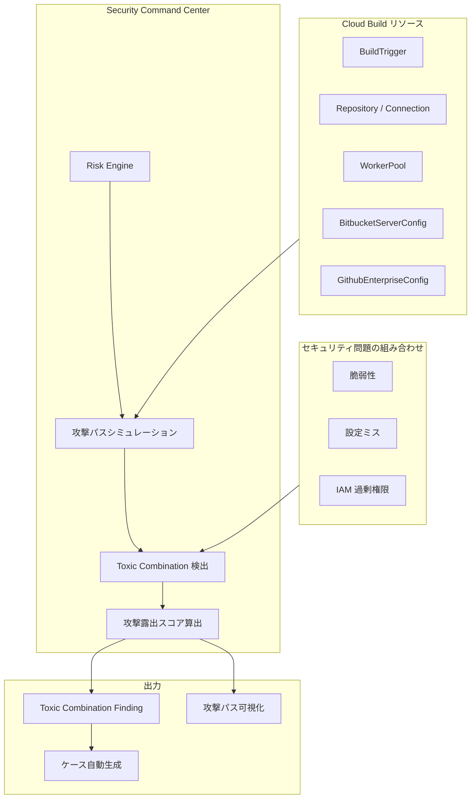

# Security Command Center: Risk Engine が Cloud Build リソースに関連する Toxic Combination を検出

**リリース日**: 2026-05-21

**サービス**: Security Command Center

**機能**: Risk Engine による Cloud Build リソース関連の Toxic Combination 検出

**ステータス**: Change (機能変更)

[このアップデートのインフォグラフィックを見る](https://takech9203.github.io/google-cloud-news-summary/20260521-security-command-center-risk-engine-cloud-build.html)

## 概要

Security Command Center の Risk Engine が、Cloud Build リソースに関連する Toxic Combination (有害な組み合わせ) を検出できるようになりました。これにより、Cloud Build のビルドトリガー、リポジトリ接続、ワーカープールなどのリソースに対する複合的なセキュリティリスクを、攻撃パスシミュレーションを通じて自動的に特定できます。

Toxic Combination とは、個別には低リスクに見えるセキュリティ問題が特定のパターンで組み合わさることで、高価値リソースへの攻撃パスを形成する状態を指します。今回のアップデートにより、CI/CD パイプラインの中核を担う Cloud Build リソースに対しても、この高度なリスク分析が適用されるようになりました。

このアップデートは、ソフトウェアサプライチェーンセキュリティの強化を重視する DevSecOps チームやセキュリティ運用チームにとって重要な改善です。

**アップデート前の課題**

- Risk Engine は Cloud Build リソースに対する攻撃パスシミュレーションと高価値リソースセットへの登録をサポートしていたが、Toxic Combination の検出対象には含まれていなかった
- Cloud Build に関連する複合的なセキュリティリスクは、個別の脆弱性や設定ミスとしてのみ検出され、それらが組み合わさった場合の実際の攻撃リスクを評価することが困難だった
- CI/CD パイプラインへのサプライチェーン攻撃リスクを包括的に把握するには、複数の Finding を手動で相関分析する必要があった

**アップデート後の改善**

- Risk Engine が Cloud Build リソースに関連する Toxic Combination を自動検出し、複合リスクをスコア付きで可視化
- Cloud Build のビルドトリガー、リポジトリ接続、ワーカープールなどに関わる攻撃パスの全体像を一目で把握可能に
- サプライチェーン攻撃の潜在的な経路を、攻撃露出スコアに基づいて優先順位付けして対処可能に

## アーキテクチャ図



Risk Engine が Cloud Build リソースを含む環境で攻撃パスシミュレーションを実行し、複数のセキュリティ問題の組み合わせ (Toxic Combination) を検出してスコアリングする流れを示しています。

## サービスアップデートの詳細

### 主要機能

1. **Cloud Build リソースの Toxic Combination 検出**
   - Cloud Build のビルドトリガー、リポジトリ接続、ワーカープール等に関連するセキュリティ問題の組み合わせを自動検出
   - 約 6 時間ごとに実行される攻撃パスシミュレーションで継続的に評価

2. **攻撃露出スコアによるリスク定量化**
   - 検出された Toxic Combination に対して攻撃露出スコア (Toxic Combination スコア) を算出
   - スコアが 10 以上の場合は Critical、10 未満の場合は High の重大度が割り当て

3. **攻撃パスの可視化**
   - Cloud Build リソースを含む攻撃パスを視覚的に表示
   - Toxic Combination に寄与するリソースは黄色の枠線でハイライト
   - Chokepoint (複数の攻撃パスが収束するポイント) は赤色の枠線で表示

## 技術仕様

### 対象となる Cloud Build リソースタイプ

| リソースタイプ | 説明 |
|------|------|
| `cloudbuild.googleapis.com/BitbucketServerConfig` | Bitbucket Server 接続設定 |
| `cloudbuild.googleapis.com/BuildTrigger` | ビルドトリガー |
| `cloudbuild.googleapis.com/Connection` | リポジトリ接続 |
| `cloudbuild.googleapis.com/GithubEnterpriseConfig` | GitHub Enterprise 接続設定 |
| `cloudbuild.googleapis.com/Repository` | リポジトリ |
| `cloudbuild.googleapis.com/WorkerPool` | ワーカープール |

### Toxic Combination の検出条件

Toxic Combination は、以下のようなセキュリティ問題が組み合わさった場合に検出されます:

- Cloud Build サービスアカウントへの過剰な IAM 権限付与
- ビルドトリガーの不適切なアクセス制御
- ワーカープールのネットワーク分離の不備
- リポジトリ接続の認証設定の脆弱性
- VPC Service Controls の未適用

### 必要な IAM ロール

```json
{
  "roles": [
    "roles/securitycenter.attackPathsViewer",
    "roles/securitycenter.findingsViewer",
    "roles/securitycenter.assetsViewer",
    "roles/securitycenter.valuedResourcesViewer"
  ]
}
```

## 設定方法

### 前提条件

1. Security Command Center Premium または Enterprise ティアが組織レベルで有効化されていること
2. Cloud Build API が有効化されていること
3. Risk Engine の攻撃パスシミュレーションが動作していること (デフォルトで有効)

### 手順

#### ステップ 1: 高価値リソースセットに Cloud Build リソースを追加

Cloud Build リソースを高価値リソースセットに含めることで、Toxic Combination の検出精度が向上します。

```bash
# gcloud CLI を使用してリソース値設定を作成
gcloud scc resource-value-configs create \
  --organization=ORGANIZATION_ID \
  --resource-type="cloudbuild.googleapis.com/BuildTrigger" \
  --resource-value=HIGH \
  --description="本番環境のビルドトリガーを高価値リソースとして設定"
```

#### ステップ 2: Toxic Combination の Finding を確認

```bash
# Toxic Combination の Finding を一覧表示
gcloud scc findings list ORGANIZATION_ID \
  --source="-" \
  --filter='findingClass="TOXIC_COMBINATION" AND resourceName:"cloudbuild"'
```

Google Cloud コンソールでは、Security Command Center > Findings ページで「Finding class: Toxic combination」でフィルタリングして確認できます。

#### ステップ 3: 攻撃パスの確認と修復

1. Google Cloud コンソールで Security Command Center を開く
2. Premium ティア: Issues ページ / Enterprise ティア: Risk > Issues ページに移動
3. Cloud Build 関連の Toxic Combination を選択
4. 攻撃パスを確認し、「How to fix」の指示に従って修復

## メリット

### ビジネス面

- **サプライチェーン攻撃リスクの低減**: CI/CD パイプラインを狙った攻撃の潜在的経路を事前に検出し、セキュリティインシデントを未然に防止
- **セキュリティ対応の効率化**: 複合リスクの自動検出により、セキュリティチームの手動分析工数を大幅に削減

### 技術面

- **リスクの定量化**: 攻撃露出スコアにより、Cloud Build 環境の複合的なセキュリティリスクを数値で把握可能
- **優先順位付けの自動化**: Critical / High の重大度分類により、最も危険な Toxic Combination から優先的に対処可能
- **継続的な監視**: 約 6 時間ごとのシミュレーションにより、環境変更に伴う新たな Toxic Combination を自動検出

## デメリット・制約事項

### 制限事項

- 組織レベルでの Security Command Center 有効化が必須 (プロジェクトレベルのアクティベーションでは攻撃パスシミュレーション非対応)
- Premium または Enterprise ティアが必要 (Standard ティアでは利用不可)
- シミュレーションは約 6 時間間隔で実行されるため、リアルタイム検出ではない

### 考慮すべき点

- 高価値リソースセットをカスタマイズしていない場合、デフォルトのヒューリスティクスに基づく検出となり、組織のセキュリティ優先度と一致しない可能性がある
- Toxic Combination の修復には、構成する個別のセキュリティ問題それぞれへの対応が必要
- Pub/Sub への通知では攻撃露出スコアの変更をトリガーとして使用できない

## ユースケース

### ユースケース 1: 本番デプロイパイプラインの保護

**シナリオ**: 本番環境へのデプロイを行う Cloud Build トリガーに対して、過剰な IAM 権限が付与されており、かつ VPC Service Controls が適用されていない状態で、ビルドトリガーのソースリポジトリに外部からの書き込みアクセスが可能な場合。

**効果**: これらの問題が個別ではなく Toxic Combination として検出され、攻撃者がリポジトリ改ざんからビルドパイプライン経由で本番環境に侵入可能な経路を可視化。優先度の高い修復対象として通知される。

### ユースケース 2: マルチクラウド CI/CD 環境のリスク管理

**シナリオ**: GitHub Enterprise や Bitbucket Server との接続設定を持つ Cloud Build 環境で、接続認証情報の管理が不十分かつ、ワーカープールのネットワーク分離が不完全な場合。

**効果**: 外部リポジトリ接続を起点とした攻撃パスが Toxic Combination として特定され、ソフトウェアサプライチェーン全体のリスクを一元的に管理・改善可能に。

## 料金

Toxic Combination の検出は、Security Command Center Premium および Enterprise ティアの機能として提供されます。追加料金は発生しません。

| ティア | Toxic Combination 検出 | 月額料金 |
|--------|-----------------|---------|
| Standard | 非対応 | 無料 |
| Premium | 対応 | Security Command Center Premium の料金に含む |
| Enterprise | 対応 (ケース自動生成含む) | Security Command Center Enterprise の料金に含む |

## 利用可能リージョン

Risk Engine の攻撃パスシミュレーションはグローバルに動作し、Cloud Build リソースが存在するすべてのリージョンに対して Toxic Combination の検出が行われます。組織レベルの有効化が必要です。

## 関連サービス・機能

- **Cloud Build**: Google Cloud のフルマネージド CI/CD プラットフォーム。SLSA Level 3 ビルドをサポートし、ビルドの来歴 (Provenance) を生成
- **Binary Authorization**: コンテナイメージのデプロイポリシーを強制し、信頼できないソースからのデプロイをブロック
- **Artifact Registry**: コンテナイメージやパッケージの安全な保管・管理を提供
- **VPC Service Controls**: Cloud Build ワーカーからのデータ流出を防止するネットワーク境界制御
- **Security Command Center Chokepoints**: 複数の攻撃パスが収束するポイントを特定し、一箇所の修復で複数の Toxic Combination を解消

## 参考リンク

- [インフォグラフィック](https://takech9203.github.io/google-cloud-news-summary/20260521-security-command-center-risk-engine-cloud-build.html)
- [公式リリースノート](https://cloud.google.com/release-notes#May_21_2026)
- [Toxic Combination 概要ドキュメント](https://cloud.google.com/security-command-center/docs/toxic-combinations-overview)
- [Risk Engine サポート対象リソース](https://cloud.google.com/security-command-center/docs/attack-exposure-supported-features)
- [高価値リソースセットの定義と管理](https://cloud.google.com/security-command-center/docs/attack-exposure-define-high-value-resource-set)
- [ソフトウェアサプライチェーンセキュリティ](https://cloud.google.com/software-supply-chain-security/docs/overview)

## まとめ

今回のアップデートにより、Security Command Center の Risk Engine が Cloud Build リソースに関連する Toxic Combination を検出できるようになり、CI/CD パイプラインを狙ったサプライチェーン攻撃の潜在リスクを複合的に評価・可視化できるようになりました。Cloud Build を本番環境のデプロイに使用している組織は、高価値リソースセットに Cloud Build リソースを追加し、検出された Toxic Combination を優先的に修復することを推奨します。

---

**タグ**: #SecurityCommandCenter #RiskEngine #ToxicCombination #CloudBuild #サプライチェーンセキュリティ #攻撃パスシミュレーション #DevSecOps
