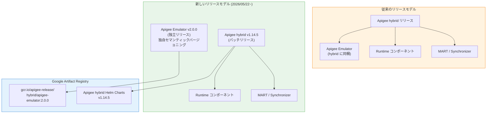

# Apigee X / Apigee hybrid: Apigee Emulator v2.0.0 独立リリース + Apigee hybrid v1.14.5 セキュリティパッチ

**リリース日**: 2026-05-22

**サービス**: Apigee X / Apigee hybrid

**機能**: Apigee Emulator v2.0.0 独立リリース + Apigee hybrid v1.14.5 セキュリティパッチ

**ステータス**: GA

📊 [このアップデートのインフォグラフィックを見る](https://takech9203.github.io/google-cloud-news-summary/20260522-apigee-emulator-v2-hybrid-v1-14-5.html)

## 概要

2026年5月22日、Google Cloud は Apigee Emulator v2.0.0 の独立リリースと Apigee hybrid v1.14.5 のセキュリティパッチをリリースしました。今回の最大の変更点は、Apigee Emulator が Apigee hybrid から切り離され、独自のセマンティックバージョニングで独立してリリースされるようになったことです。

Apigee Emulator は API プロキシのローカル開発・テスト環境を提供するコンポーネントで、VS Code の Cloud Code 拡張機能と連携して動作します。これまで Emulator のアップデートは hybrid のリリースサイクルに依存していましたが、今回の変更によりセキュリティパッチや機能改善がより迅速に提供できるようになりました。初回の独立リリースとなる v2.0.0 では、78件のセキュリティ脆弱性が修正されています。

併せてリリースされた Apigee hybrid v1.14.5 はパッチリリースであり、各種セキュリティ修正と CVE 対応が含まれています。Helm チャートを通じたアップグレードでコンテナイメージが自動更新されるため、手動でのイメージ変更は不要です。

**アップデート前の課題**

- Apigee Emulator のセキュリティパッチ提供が Apigee hybrid のリリースサイクルに依存しており、修正の提供に時間がかかっていた
- Emulator 単独の軽微なバグ修正や改善であっても hybrid 全体のリリースを待つ必要があった
- Emulator のバージョン番号が hybrid に紐づいており、独立した変更履歴の追跡が困難だった

**アップデート後の改善**

- Apigee Emulator が独自のセマンティックバージョニング (MAJOR.MINOR.PATCH) を採用し、迅速なセキュリティパッチ配信が可能になった
- Emulator のアップデートが hybrid のリリースサイクルに依存しなくなり、開発者はより頻繁にセキュリティ修正を受け取れる
- ベース Cassandra イメージが 4.0.19 に、Java ランタイムが Eclipse Temurin JRE 11.0.31 に更新された
- 78件のセキュリティ脆弱性が一度に修正された

## アーキテクチャ図



この図は、Apigee Emulator が従来の hybrid 同梱モデルから独立リリースモデルに移行したことを示しています。新モデルでは Emulator と hybrid がそれぞれ独自のリリースサイクルで更新され、Google Artifact Registry を通じて配布されます。

## サービスアップデートの詳細

### 主要機能

1. **Apigee Emulator の独立バージョニング**
   - セマンティックバージョニング (MAJOR.MINOR.PATCH) を採用
   - Apigee hybrid のバージョン体系から完全に分離
   - 今後の Emulator リリースノートは Apigee のリリースノートページで個別に公開

2. **ベースイメージとランタイムの更新 (Emulator v2.0.0)**
   - Cassandra ベースイメージを 4.0.19 にアップデート
   - Java ランタイムを Eclipse Temurin JRE 11.0.31 に更新
   - Go 標準ライブラリおよび Python パッケージの更新

3. **大規模セキュリティ修正 (Emulator v2.0.0)**
   - 78件のセキュリティ脆弱性を修正
   - Cassandra ベースイメージ、Go 標準ライブラリ、Java 依存関係、Python パッケージにまたがる修正
   - Jackson Databind、SnakeYAML、Google Guava、Logback 等の重要な依存関係の脆弱性に対応

4. **Apigee hybrid v1.14.5 パッチリリース**
   - Helm チャートに統合されたコンテナイメージによる自動更新
   - 各種セキュリティおよび CVE 修正

## 技術仕様

### 修正された主要 CVE 一覧 (Emulator v2.0.0)

| CVE ID | 対象コンポーネント | 説明 |
|--------|-------------------|------|
| CVE-2022-42003 | Jackson Databind | デシリアライゼーションの脆弱性 |
| CVE-2022-42004 | Jackson Databind | デシリアライゼーションの脆弱性 |
| CVE-2022-38749 | SnakeYAML | YAML パースの脆弱性 |
| CVE-2022-38750 | SnakeYAML | YAML パースの脆弱性 |
| CVE-2023-2976 | Google Guava | ファイルアクセスの脆弱性 |
| CVE-2020-8908 | Google Guava | 一時ディレクトリの脆弱性 |
| CVE-2024-12798 | Logback | ログ処理の脆弱性 |
| CVE-2025-22866 | Go stdlib | Go 標準ライブラリの脆弱性 |
| CVE-2025-22870 | Go stdlib | Go 標準ライブラリの脆弱性 |
| CVE-2022-40897 | Python setuptools | パッケージインストールの脆弱性 |

上記に加え、68件の追加 CVE が修正されています。

### コンポーネントバージョン

| コンポーネント | バージョン |
|---------------|-----------|
| Apigee Emulator | 2.0.0 (独立リリース) |
| Apigee hybrid | 1.14.5 |
| Cassandra ベースイメージ | 4.0.19 |
| Java ランタイム | Eclipse Temurin JRE 11.0.31 |

## 設定方法

### Apigee Emulator v2.0.0 の適用

#### 前提条件

1. VS Code がインストール済みであること
2. Cloud Code 拡張機能がインストール済みであること
3. Docker がインストールされ実行中であること

#### ステップ 1: Emulator バージョンの更新

VS Code の設定で Emulator バージョンを更新します。

1. VS Code で **Settings** を開く
2. `apigee emulators` を検索
3. **Add item** をクリック
4. バージョン `2.0.0` を入力 (または完全なイメージパス `gcr.io/apigee-release/hybrid/apigee-emulator:2.0.0`)
5. **OK** をクリック

#### ステップ 2: Emulator のインストール

1. ワークスペースの **emulators** フォルダを展開
2. インストールする Apigee Emulator バージョン (2.0.0) にカーソルを合わせる
3. インストールアイコンをクリック
4. コンテナの追加手順に従う

### Apigee hybrid v1.14.5 へのアップグレード

#### ステップ 1: Helm チャートのダウンロード

```bash
export CHART_REPO=oci://us-docker.pkg.dev/apigee-release/apigee-hybrid-helm-charts
export CHART_VERSION=1.14.5

helm pull $CHART_REPO/apigee-operator --version $CHART_VERSION --untar
helm pull $CHART_REPO/apigee-datastore --version $CHART_VERSION --untar
helm pull $CHART_REPO/apigee-env --version $CHART_VERSION --untar
helm pull $CHART_REPO/apigee-ingress-manager --version $CHART_VERSION --untar
helm pull $CHART_REPO/apigee-org --version $CHART_VERSION --untar
helm pull $CHART_REPO/apigee-redis --version $CHART_VERSION --untar
helm pull $CHART_REPO/apigee-telemetry --version $CHART_VERSION --untar
helm pull $CHART_REPO/apigee-virtualhost --version $CHART_VERSION --untar
```

#### ステップ 2: Helm アップグレードの実行

```bash
# オペレーターのアップグレード (ドライラン)
helm upgrade operator apigee-operator/ \
  --install \
  --namespace APIGEE_NAMESPACE \
  --atomic \
  -f overrides.yaml \
  --dry-run=server

# ドライラン成功後、実際のアップグレード
helm upgrade operator apigee-operator/ \
  --install \
  --namespace APIGEE_NAMESPACE \
  --atomic \
  -f overrides.yaml
```

パッチリリースのため、Helm チャートを通じてアップグレードすることでコンテナイメージが自動的に更新されます。

## メリット

### ビジネス面

- **セキュリティリスクの早期軽減**: Emulator のセキュリティパッチが hybrid リリースを待たずに提供されるため、ローカル開発環境の脆弱性を迅速に解消できる
- **開発生産性の向上**: Emulator の改善が迅速に反映されることで、API 開発チームの開発サイクルが改善される

### 技術面

- **独立したリリースサイクル**: Emulator と hybrid のリリースが分離されたことで、それぞれのコンポーネントに最適なタイミングで更新を適用可能
- **大規模な CVE 修正**: 78件のセキュリティ脆弱性が一度に修正され、ローカル開発環境のセキュリティ態勢が大幅に向上
- **最新ランタイム**: Cassandra 4.0.19 と Eclipse Temurin JRE 11.0.31 により、パフォーマンスと安定性が向上

## デメリット・制約事項

### 考慮すべき点

- Emulator のバージョンが hybrid から独立したため、互換性マトリクスの確認が必要になる場合がある
- VS Code の Cloud Code 設定で Emulator バージョンを手動で更新する必要がある
- 今後は Emulator と hybrid のリリースノートを別々に確認する必要がある

## ユースケース

### ユースケース 1: ローカル開発環境のセキュリティ強化

**シナリオ**: セキュリティチームから依存関係の脆弱性スキャン結果を受け、Apigee Emulator のコンテナイメージに含まれる脆弱性への対応が求められた。

**実装例**:
```
# VS Code Settings で Emulator バージョンを 2.0.0 に更新
# Cloud Code > Apigee > Emulators から新しいバージョンをインストール
```

**効果**: hybrid 全体のアップグレードを待たずに、78件の CVE 修正を含む Emulator v2.0.0 を即座に適用できる。

### ユースケース 2: hybrid 環境のセキュリティパッチ適用

**シナリオ**: 本番環境で Apigee hybrid v1.14.x を運用しており、定期的なセキュリティパッチの適用が必要。

**実装例**:
```bash
# Helm チャートを v1.14.5 にアップグレード
export CHART_VERSION=1.14.5
helm pull $CHART_REPO/apigee-operator --version $CHART_VERSION --untar
helm upgrade operator apigee-operator/ \
  --install --namespace apigee --atomic -f overrides.yaml
```

**効果**: パッチリリースのため、コンテナイメージの手動更新なしに Helm チャート経由で自動的にセキュリティ修正が適用される。

## 関連サービス・機能

- **Cloud Code for VS Code**: Apigee Emulator の管理 UI を提供する VS Code 拡張機能
- **Google Artifact Registry**: Emulator イメージおよび hybrid Helm チャートのホスティング
- **Apigee API hub**: ローカル開発環境と連携した API 設計・管理機能

## 参考リンク

- 📊 [インフォグラフィック](https://takech9203.github.io/google-cloud-news-summary/20260522-apigee-emulator-v2-hybrid-v1-14-5.html)
- [公式リリースノート](https://cloud.google.com/release-notes#May_22_2026)
- [Apigee hybrid リリースノート](https://cloud.google.com/apigee/docs/hybrid/release-notes)
- [Apigee Emulator 管理ドキュメント](https://cloud.google.com/apigee/docs/api-platform/local-development/vscode/manage-apigee-emulator)
- [Apigee ローカル開発セットアップ](https://cloud.google.com/apigee/docs/api-platform/local-development/setup)
- [Apigee hybrid v1.14 アップグレードガイド](https://cloud.google.com/apigee/docs/hybrid/v1.14/upgrade)

## まとめ

今回のリリースにより、Apigee Emulator は hybrid から独立したリリースサイクルを持つようになり、セキュリティパッチや改善がより迅速にローカル開発環境に届けられるようになりました。Apigee Emulator を使用している開発チームは、VS Code の Cloud Code 設定でバージョンを 2.0.0 に更新することを推奨します。また、Apigee hybrid v1.14.x を運用している組織は、v1.14.5 へのパッチ適用によりセキュリティ態勢を強化できます。

---

**タグ**: #Apigee #ApigeeHybrid #ApigeeEmulator #Security #CVE #PatchRelease #LocalDevelopment #CloudCode #VSCode
